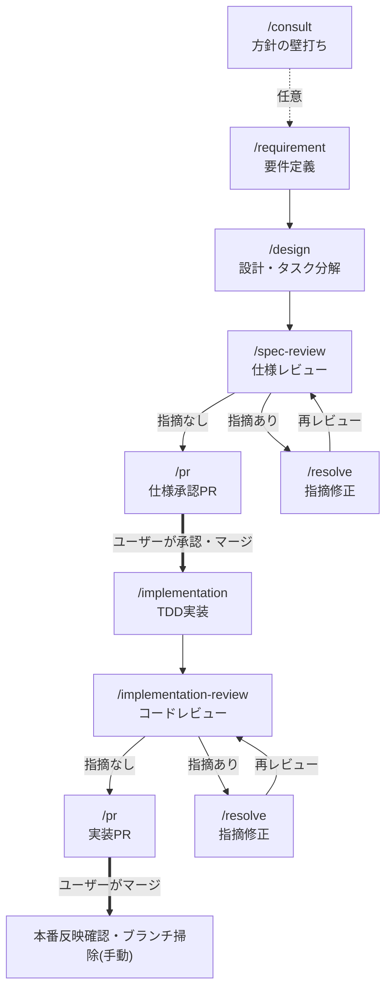
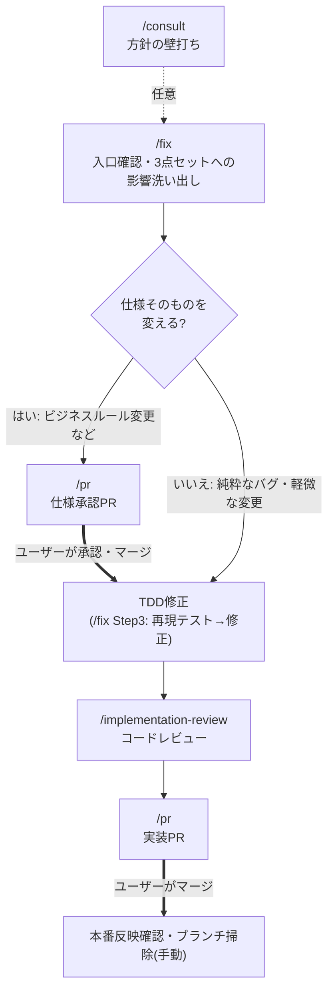

# Skill一覧と遷移図

このプロジェクトの開発工程は**全プロジェクト共通のグローバルSkill**(`~/.claude/skills/`。/autopilot・/retrospective・/scan-sandbox-sessionsを含む)で行い、このリポジトリの `.claude/skills/` には**study固有の差分Skillだけ**を置く([parallel-work](parallel-work/SKILL.md)。git worktreeの基本手順は全プロジェクト共通の`~/.claude/skills/parallel-work/SKILL.md`を参照し、このファイルにはstudy固有の重複検出手順のみを書く)。study固有の差分(specの置き場所・仕様承認PR方式)は [CLAUDE.md](../../CLAUDE.md) の「開発ワークフロー」に定義があり、グローバルSkillが「spec配置の例外リポジトリ」として参照する。

各工程Skillは冒頭に「ワークフロー上の位置」(前工程の成果物が必要なものは「前提条件」も)を持ち、完了時に次のステップを案内する。

## ワークフローへの合流

Skillを明示的に選ばない会話も、次の2層でワークフローに合流する:

1. **途中**: 前工程の成果物を必要とする工程Skillは冒頭の「前提条件」で確認し、満たしていなければ上流の工程Skillへ誘導する(例: requirements.mdなしで/designを始めない)
2. **出口**: 各Skill末尾の「完了時の次ステップ案内」で次の工程へ誘導する

> **フックについて**: `../hooks/route-to-workflow.sh`(入口のルーティング注入)と `../hooks/check-main-freshness.sh`(main鮮度警告)は `../settings.json` に登録されているが、**組織ポリシー(`allowManagedHooksOnly`)によりユーザー定義hookは現在実行されない**(`~/.claude/sandbox-limitations.md` 参照)。入口の判定(新機能→/requirement、バグ→/fix、壁打ち→/consult)はCLAUDE.mdの文章ルールとして運用する。hookが解放されたら再び機能する。

## 自動運転モード

`/autopilot`(全プロジェクト共通のグローバルSkill)は工程を確認なしで連結する**モードSkill**で、ユーザーが明示的に起動したときだけ働く。小規模・低リスクの変更が対象で、対話は「要件ヒアリング/入口確認」と「仕様承認PRのレビュー」の2箇所に絞られる。push・PR作成・マージはこの環境では自動化できないため、コマンドを提示してユーザーの手元での実行結果を待つ引き継ぎポイントになる。

## 起動者(誰がSkillを起動できるか)

Skillの`.claude/skills/`直下はフラット構造しか使えない(`<Skill名>/SKILL.md`の1階層のみ。分類用のフォルダを挟むと発見されない)ため、分類は以下の4カテゴリと、frontmatterの起動者フラグで表す。

| カテゴリ | ユーザーが`/xxx`で起動 | Claudeが自律起動 | frontmatter |
|---|---|---|---|
| 機能開発フロー(工程Skill) | ○ | ○ | (なし) |
| モードSkill(autopilot) | ○ | ○(明示指示があったときのみ) | (なし) |
| 定期作業Skill | ○ | **×** | `disable-model-invocation: true` |
| 知識Skill | ○ | ○ | (なし) |

定期作業だけClaudeの自律起動を切っているのは、**実行タイミングを人が決める作業**であり、会話の流れでClaudeが勝手に始める理由がないため。このフラグを付けるとdescriptionもコンテキストに載らなくなるので、ユーザーが`/retrospective`のように明示的に打つ必要がある。

## まとめ表

### 機能開発フロー(工程Skill・すべて `~/.claude/skills/` のグローバルSkill)

| Skill | 役割 | 使うタイミング | 完了後の遷移先 |
|---|---|---|---|
| `/consult` | 方針の壁打ち。ファイルを変更せず論点整理と推奨案の提示に徹する | 作る前に方針・技術選定・機能の切り方を相談したいとき(任意) | /requirement または /fix |
| `/requirement` | 要件ヒアリング→requirements.md作成。spec分割・新規spec vs 既存spec更新の判断・`[n]`採番 | 新しい機能・アプリの要件定義を始めるとき | /design |
| `/design` | design.md(処理フロー中心)とtasks.md(TDDタスク分解)の作成 | requirements.md作成後 | /spec-review |
| `/spec-review` | 3点セットの一括レビュー(チェックリスト・重要度・テンプレート付き)。実施はspec-reviewerエージェント | 3点セットが揃ったとき | 指摘あり: /resolve / なし: /pr(仕様承認PR) |
| `/pr` | 仕様承認PR・実装PRの作成。承認ゲートの運用、impl-pr-reviewer・CIの確認 | レビュー通過後 | 仕様承認PR承認後: /implementation / 実装PRマージ後: 本番反映確認・ブランチ掃除(手動) |
| `/implementation` | TDD実装(Red→Green→Refactor)。テスト命名・仕様コメント・仕様との対応付け。並行開発時などはimplementerエージェントに委譲可 | 仕様承認PRのマージ後 | /implementation-review |
| `/implementation-review` | 実装のコードレビュー(仕様整合・テスト・品質のチェックリスト付き)。実施はcode-reviewerエージェント | 実装・動作確認の完了後 | 指摘あり: /resolve / なし: /pr(実装PR) |
| `/resolve` | レビュー指摘の修正。重要度順に対応し、対応結果を報告する | /spec-review・/implementation-review・PR上で指摘を受けたとき | 指摘元のレビューを再実行 → 元の工程の次ステップへ |
| `/fix` | バグ修正・既存機能の小規模改修の入口。既存spec更新の影響洗い出しと承認要否の判断 | 不具合修正・文言修正・スコープ外項目への対応など | 仕様変更あり: /pr(仕様承認PR) / 純粋なバグ: 修正後 /implementation-review |

### モードSkill(`~/.claude/skills/` のグローバルSkill)

| Skill | 役割 | 使うタイミング | 完了後の遷移先 |
|---|---|---|---|
| `/autopilot` | 上の工程Skillを確認なしで連結する自動運転モード。対話は2箇所(要件ヒアリング/入口確認・仕様承認PRレビュー)に絞る。手順は各工程Skillに委譲し、本Skillは止まる箇所だけを定める | 小規模・低リスクの変更を最後まで一気に進めたいとき(ユーザーが明示起動) | 実装PRのマージ後、本番反映確認・ブランチ掃除(手動) |

### 定期作業Skill(開発ループ外・ユーザーが`/xxx`で明示起動・`~/.claude/skills/` のグローバルSkill)

| Skill | 役割 | 頻度 | 異常時の遷移先 |
|---|---|---|---|
| `/retrospective` | ワークフローと実際の進め方のずれを振り返り、Skill側を更新する | 月1回〜四半期に1回 | /pr(Skill更新PR) |
| `/scan-sandbox-sessions` | 直近セッションのログから記録し忘れたサンドボックス制限の候補を棚卸しする | 任意(気づいたとき) | 候補あり: /record-sandbox-limitation の手順で追記 |

### 知識Skill(工程から参照される)

| Skill | 役割 | 参照元 |
|---|---|---|
| `/architecture-workflow`(グローバル) | `apps/<アプリ名>/specs/architecture.md`(アプリ全体像)の作成・更新。**設計図(Mermaid)の種類・記載先・作成条件・書き方ルールもここに集約** | /requirement、/design、/fix、/spec-review |
| [parallel-work](parallel-work/SKILL.md)(このリポジトリ固有) | git worktreeでの並行開発のうち、study固有の部分(specs/フォルダでの重複検出)。worktreeの基本手順は`~/.claude/skills/parallel-work/SKILL.md`(全プロジェクト共通)を参照 | /requirement、/fix、/implementation、/pr |

> `record-sandbox-limitation` はプロジェクト固有ではないため `~/.claude/skills/` 側(全プロジェクト共通)にある。/scan-sandbox-sessions から候補確認後もそちらを呼ぶ。

### Agent(作業者・すべて `~/.claude/agents/` のグローバルAgent)

Skill=手順・知識・テンプレート、Agent=別コンテキストで動く作業者、という役割分担。

| Agent | 役割 | 起動元 | モデル |
|---|---|---|---|
| spec-reviewer | 仕様3点セットのレビュー。書き込みツールを持たず報告に徹する | /spec-review | inherit(判断が本体) |
| code-reviewer | 実装コードのレビュー。テスト・lint等は実行するが修正はしない | /implementation-review | inherit(判断が本体) |
| impl-pr-reviewer | 実装PR作成前の横断チェック(承認ステータス・仕様とテストの対応・CI) | /pr(実装PRのみ) | haiku(機械的チェック) |
| implementer | 承認済み仕様のTDD実装。仕様との食い違い時は中断して報告 | /implementation(並行開発時などの委譲は任意) | sonnet(仕様に拘束された作業) |

## 遷移図1: 新機能開発の流れ

- 太線(=)はユーザーの承認・マージ待ち。仕様承認PRがマージされるまでコード(テスト含む)は書かない(仕様承認ゲート)
- mainへのマージは常にユーザーがGitHub UIで行う

## 遷移図2: バグ修正・既存機能改修の流れ

- レビューで指摘が出た場合の `/resolve` ループは遷移図1と同じ(省略)
- 本番で問題を見つけた場合もこの図の `/fix` から入る

## 定期作業の遷移

定期作業は独立して実行し、問題が見つかったときだけ上の2つの流れに合流する(合流先は[まとめ表](#定期作業skill開発ループ外ユーザーがxxxで明示起動claudeskills-のグローバルskill)の「異常時の遷移先」列を参照)。問題がなければユーザーへの報告のみで完了する。

## この文書の保守

- 工程Skill本体(グローバル)を変更したら、このREADMEの表・遷移図とのずれがないかを確認する(/retrospective の確認対象)
- このリポジトリ固有のSkill・Agentの追加・削除・遷移の変更をしたら、このREADMEの表と遷移図も同じPRで更新する
- ワークフローの入口(/requirement・/fix・/consultの使い分け)が変わったら、CLAUDE.mdの「開発ワークフロー」と、(hookが解放された場合は)`../hooks/route-to-workflow.sh` の指示文も同じPRで更新する
