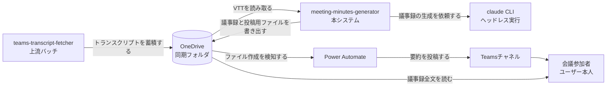
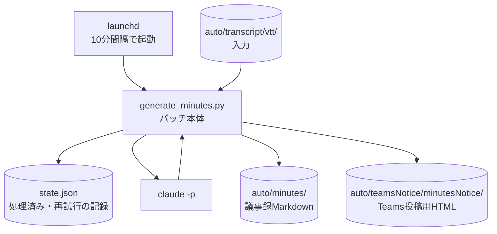

# meeting-minutes-generator アーキテクチャ

## サマリ

teams-transcript-fetcherが蓄積するTeams会議のトランスクリプト(WEBVTT)から、議事録Markdownを全自動生成してOneDriveへ書き出し、要約をTeamsチャネルに自動投稿するローカル実行バッチ。Python 3(標準ライブラリのみ)+ launchd + `claude -p`(ヘッドレス)+ Power Automate(Teams投稿)で構成する。specは1つ(minutes-auto-generation、仕様のみ・未実装)。全体像は[コンテキスト図](#コンテキスト図)・[システム構成図](#システム構成図)を参照。

## 概要

会議後の議事録作成を人手ゼロにするバッチ。上流のteams-transcript-fetcherとはOneDriveのフォルダ(`auto/transcript/vtt/`)だけで疎結合につながる。

## コンテキスト図

正となる文章は[minutes-auto-generation/requirements.md](minutes-auto-generation/requirements.md)。

## システム構成図

正となる文章は[minutes-auto-generation/design.md](minutes-auto-generation/design.md)の処理フロー。

## アーキテクチャ概要

launchdが定期起動するPythonバッチが唯一の実行主体。未処理VTTの検知は状態ファイルとの突き合わせで行い、議事録の生成だけを `claude -p` に委ね、検証・保存・投稿用ファイルの書き出しはバッチが決定的に行う。Teamsへの投稿はバッチ自身は行わず、OneDriveへのファイル書き出しを既存方式(OneDrive検知のPower Automateフロー)に検知させる。

## 採用技術

| 技術 | 用途 |
|---|---|
| Python 3(標準ライブラリのみ) | バッチ本体(teams-transcript-fetcherと同じ構成) |
| launchd | 定期実行(create-automation-batch Skillの検証済み方式) |
| claude CLI(`claude -p`) | 議事録本文の生成 |
| Power Automate | OneDriveファイル作成の検知とTeamsチャネルへの投稿 |

## 機能マップ

| spec | 機能(利用者から見て) | 役割 | 依存 | 状態 |
|---|---|---|---|---|
| minutes-auto-generation | 会議後に議事録が自動で作られ共有される | VTT検知・議事録生成・OneDrive書き出し・投稿用ファイル書き出し | teams-transcript-fetcher/transcript-auto-fetch の成果物(vtt/)を参照 | 実装中 |

## 外部サービス

| サービス | 用途 |
|---|---|
| OneDrive(組織アカウントの同期フォルダ) | 入力(vtt/)・成果物(minutes/)・投稿連携(teamsNotice/minutesNotice/)の受け渡し |
| Claude(claude CLI経由) | 議事録本文の生成 |
| Power Automate + Teams | 投稿用ファイルの検知と固定チャネルへの投稿 |

## セキュリティ

トランスクリプト・議事録(会議内容を含む)は組織のOneDrive・Teamsの中に閉じ、ログに本文を出さない。詳細は[minutes-auto-generation/design.md](minutes-auto-generation/design.md)のセキュリティを参照。

## 技術的制約

- `claude -p` はMCPを使えず、exit 0でも失敗しうる(create-automation-batch Skillで確認済み)。生成結果の検証をバッチ側で行う
- OneDrive同期フォルダのファイルは実体化待ちで読めないことがある。読み取り失敗は一時的失敗として次回実行に委ねる
- OneDriveの `auto/` 直下にはファイルを置かない(既存のTeams投稿用フローが検知するため)
