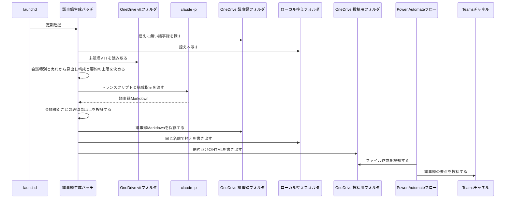
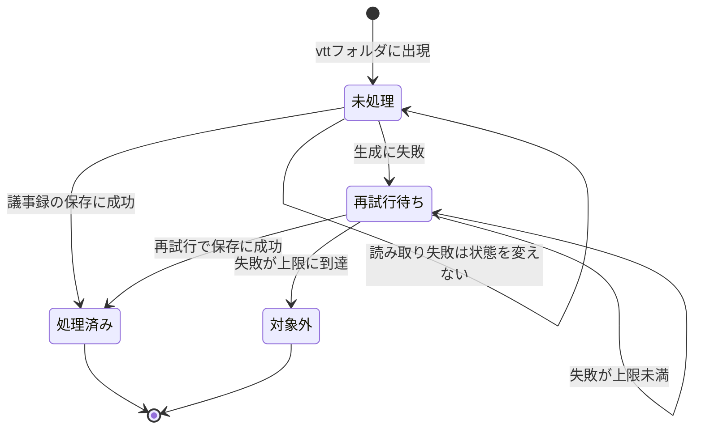

# 会議後の議事録自動生成 設計書

## サマリ

launchdの定期実行バッチが、teams-transcript-fetcherの成果物フォルダ(`auto/transcript/vtt/`)の未処理VTTを状態ファイルとの突き合わせで検知し、`claude -p`(ヘッドレス)で議事録Markdownを生成してOneDriveの議事録フォルダへ保存、要約部分をHTML化した投稿用ファイルをTeams投稿用フォルダへ書き出す。主要な設計判断は次の7点: (1) `claude -p` は exit 0 でも失敗しうるため、生成結果の必須見出しをバッチ側で検証してから成果物として扱う、(2) 「読み取れなかった」(OneDrive同期待ち)と「生成に失敗した」を区別し、前者は再試行回数を消費しない、(3) トランスクリプト・議事録の本文はログに出さない、(4) 1回の実行が起動間隔を超えうるため実行全体を二重起動防止ロックで排他する、(5) 会議の性質(デイリー系か・実尺)はバッチが決定的に判定し、そこから議事録の見出し構成・要約の分量上限・投稿する見出しをすべて導出する、(6) 議事録全文へのリンクは共有ストレージのファイルビューアで開く形式のURLを組み立てる(ファイルを直接指すURLはダウンロードになる)、(7) 議事録は同期フォルダの外のローカル控えにも同じ名前・同じ内容で書き出し、控えの失敗は議事録の保存とTeams共有を止めない(同期フォルダは許可の無いプロセスから読めないため、下流のツールは控えを読む)。処理の詳細は[シーケンス図](#議事録の生成)、VTTごとの状態の一生は[状態遷移図](#状態管理)を参照。

## 処理フロー

### 定期実行と未処理VTTの検知

- **対象**: OneDriveの `auto/transcript/vtt/` にあるVTTファイル
- **手順**:
  1. launchdが一定間隔(10分ごと)でバッチを起動する
  2. 二重起動防止ロックを取得する。取得できない場合(前回の実行がまだ動いている場合)は何もせず終了する。前回の実行が異常終了してロックが残った場合に備え、古いロック(30分経過)は回収して取得し直す(create-automation-batchの検証済みテンプレートと同じ方式。1回の実行が「claude -p のタイムアウト15分 × 複数件の直列処理」で起動間隔の10分を超えることは正常系でも起こるため、このロックが同じVTTの二重生成と状態ファイルの競合を防ぐ)
  3. 状態ファイル(処理済み・対象外・再試行回数の記録)を読み込む。状態ファイルが存在しない場合は初回実行とみなし、その時点で `vtt/` に存在する全VTTを「処理済み」として状態ファイルを作成する。この場合、以降の議事録の生成は行わないが、次の手順の控えのバックフィルは行ってから終了する
  4. 控えのバックフィル(下記)を1回だけ行う。ロックを取得できた実行でのみ行い、VTTごとの処理には入れない
  5. `vtt/` のVTT一覧と状態ファイルを突き合わせ、「処理済み」でも「対象外」でもないVTTを未処理として抽出する
  6. 未処理VTTを1件ずつ、以降の「議事録の生成」から「投稿用ファイルの書き出し」まで直列に処理する(並列にしない)。1件終えるごとに、成否によらずロックの更新時刻を今にする(未処理が溜まって1回の実行が「古いロック」の基準を超えたときに、動作中のロックを次の実行が残骸と誤判定して奪うのを防ぐ)
  7. VTTの読み取りに失敗した場合(OneDrive同期の実体化待ちを含む)は、そのVTTをスキップして次のVTTへ進む。読み取り失敗は生成失敗と区別し、再試行回数を消費しない
  8. すべての処理が終わったらロックを解放する(異常終了時は上記の古いロック回収に委ねる)
- **関連するビジネスルール**: [requirements.md#新規トランスクリプトの検知](requirements.md#新規トランスクリプトの検知)

### 議事録の生成

- **対象**: 検知した未処理VTT 1件
- **手順**:
  1. 会議の性質を決める。VTTファイル名に定期進捗確認を示す語(設定で持つ判定語。大文字小文字を区別しない部分一致)が含まれればデイリー系会議とし、トランスクリプトのタイムスタンプ(`00:12:34.000 --> 00:12:38.000` 形式の終了時刻の最大値)から会議の実尺を求める。タイムスタンプが1つも読めない場合は実尺を不明とする
  2. 会議の性質から、この会議の必須見出しと要約の上限を導く。必須見出しは通常の会議が6つ(会議メタ情報、要約、決定事項、TODO、議論の経緯、未決事項・次回議題)、デイリー系会議は要約と決定事項の間に「進捗」を挟んだ7つ。要約の上限は実尺30分以下が3〜5点/300字、30分超60分以下が最大7点/500字、60分超が最大10点/800字で、実尺が不明なら最も厳しい段(3〜5点/300字)を使う
  3. VTTの内容と議事録の構成指示を組み立てたプロンプトで `claude -p` を起動する。モデルはclaude CLIの既定モデルを使う。起動するclaudeの場所は「環境変数での明示指定 → PATH → 既知のインストール先の探索」の順で決める(定期実行の環境はログインシェルのPATHを継承しないため、名前だけでは起動できない)。構成指示には手順2で導いた見出しと要約の上限に加え、次のビジネスルールを含める: 議事録はトランスクリプトの言語によらず日本語で書くこと、要約は箇条書きで上限内に収めること、決定事項・TODO・未決事項が1件もない場合も見出しを省略せず「なし」と記載すること、デイリー系会議では担当者ごとに「作業実績」「作業予定」「課題」の3項目を`###`の小見出しの下に書き、進捗報告を決定事項・TODOに混ぜないこと
  4. 会議名・日時はVTTファイル名から分かる範囲でプロンプトに渡し、判別できない項目は「不明」と書かせる。参加者一覧・TODO担当者候補はトランスクリプトの発言者名から書かせ、担当者を推定できないTODOは「担当者未定」と書かせる
  5. `claude -p` の標準出力を生成結果として受け取る。タイムアウト(15分)を設け、超過したら生成失敗として扱う
  6. 生成結果を検証する: 手順2で導いた必須見出しがすべて存在すること。exit 0 であっても検証に通らなければ生成失敗として扱う(`claude -p` の既知の制約への対処)。要約の分量は検証しない(内容として成立している議事録を分量だけで失わないため)
  7. 生成に失敗した場合、そのVTTの再試行回数を1増やして状態ファイルに記録し、次のVTTへ進む(次回実行で再試行される)。再試行回数が上限(3回)に達したら「対象外」として記録し、以降の実行では処理しない
- **シーケンス図**:

図の正となる文章は本見出しおよび[requirements.md#議事録の生成](requirements.md#議事録の生成)。

- **関連するビジネスルール**: [requirements.md#議事録の記載内容](requirements.md#議事録の記載内容)、[requirements.md#生成手段claude--pの制約への対処](requirements.md#生成手段claude--pの制約への対処)

### 議事録の保存

- **対象**: 検証に通った議事録Markdown
- **手順**:
  1. OneDriveの議事録フォルダ `auto/minutes/`へ、元のVTTと対応が分かるファイル名(VTTファイル名の拡張子を `.md` に変えたもの)で保存する
  2. 同名ファイルが既に存在する場合は上書きせず、末尾に連番を付けて保存する
  3. 同期フォルダの外にある控えフォルダへ、OneDrive側と同じファイル名(手順2で連番が付いた場合はその名前)で同じ内容を書き出す。控えに同じ名前がある場合は上書きする(名前の対応を保つことを優先する)。ここで失敗した場合は警告として記録し、処理は続ける(控えのために議事録の保存とTeams共有を落とさない)
  4. 保存に成功したら、そのVTTを「処理済み」として状態ファイルに記録する
- **関連するビジネスルール**: [requirements.md#onedriveフォルダの使い方](requirements.md#onedriveフォルダの使い方)・[requirements.md#議事録のローカル控え](requirements.md#議事録のローカル控え)

### 控えのバックフィル

- **対象**: OneDriveの議事録フォルダにあって、控えフォルダに無い議事録
- **手順**:
  1. 実行の最初に1回だけ行う(VTTごとの処理には入れない)
  2. OneDriveの議事録フォルダを走査する。読み取れない場合は、その旨を記録して何もせずに終える(この環境ではアクセス許可が無く読めないことがあるため、失敗を通常の状態として扱う)
  3. 控えフォルダに同じ名前のファイルが無い議事録を、控えフォルダへ写す。既に同じ名前がある議事録は触らない(通常の保存で書いた控えを上書きしない)
  4. 個別の議事録が読み取れない場合は、その議事録を飛ばして次へ進む(1件の失敗で残りを止めない)
  5. 写した件数と、読み取れずに飛ばした件数を記録する
- **関連するビジネスルール**: [requirements.md#議事録のローカル控え](requirements.md#議事録のローカル控え) [4]

### 投稿用ファイルの書き出し

- **対象**: 保存に成功した議事録
- **手順**:
  1. 投稿する見出しを会議の性質から導く。「議事録の生成」で導いた必須見出しから、投稿に含めない見出し(議論の経緯、未決事項・次回議題)を除いたものとする(必須見出しを唯一の情報源にすることで、見出し構成を変えたときに投稿側の追随漏れが起きない)。デイリー系会議では進捗が自動的に投稿対象に入る
  2. 議事録Markdownから投稿する見出しのセクションを抜き出し、Teamsが解釈できるHTMLに変換する(TeamsはプレーンテキストのままではNGでHTMLとして解釈する。daily-report-to-teamsで実機確認済みの方式)。セクションの区切りは `##` の見出しだけとし、`###` の小見出し(進捗の担当者名)はセクションの内側として扱う。`##` は `<h3>`、`###` 以下は `<h4>` に変換する
  3. 末尾に議事録全文へのリンクを追加する。設定のビューアURLと議事録フォルダのサーバー相対パスから「ファイルビューアで開く形式のURL」を組み立て、議事録ファイル名を表示テキストとするリンクにする。組み立て時はビューアURLに付随するクエリを落とし、サーバー相対パスは一度デコードしてからエンコードする(エンコード済みの値を二重にエンコードしないため)。設定が欠けている場合はリンクを作らず、議事録ファイル名を文言で案内する
  4. Teams投稿用フォルダ `auto/teamsNotice/minutesNotice/`(Teams投稿系の検知フォルダを `teamsNotice/` 配下に集約する)へ、一意なファイル名(`minutes-YYYYMMDD-HHMMSS.txt` 形式)で書き出す
  5. 書き出しに失敗しても、議事録の保存が済んでいればそのVTTは「処理済み」のままとし、投稿だけを失敗としてログに残す(議事録の二重生成を防ぐことを優先する)
- **関連するビジネスルール**: [requirements.md#teamsへの共有](requirements.md#teamsへの共有)

## エラーハンドリング

- **読み取り失敗と生成失敗を区別する**: OneDrive同期の実体化待ちなどでVTT・状態ファイルを読み取れない場合は「一時的失敗」としてその実行では何も変更せず、次回実行に委ねる(teams-transcript-fetcherで実機確認済みの方針を踏襲)。`claude -p` の失敗・生成結果の検証NGは「生成失敗」として再試行回数を消費する
- **1件の失敗で全体を止めない**: VTTごとに独立して処理し、あるVTTの失敗は他のVTTの処理に影響させない。バッチ全体としては、想定外の例外が起きてもトレースバックをログに記録して終了し、次回の定期実行で自然に再開する
- **状態ファイルの破損**: 状態ファイルが読み込めない(JSONとして不正)場合は処理を中断してエラーログを残し、勝手に初期化しない(初期化すると全VTTが「初回」扱いになり既処理分を再生成してしまうため)。破損を起こしにくくするため、状態ファイルの書き込みはアトミックに行う(一時ファイルに書いてからリネーム)
- **控えの書き出し失敗は成果物を落とさない**: 控えへの書き出しに失敗した場合は警告として記録し、議事録の保存・処理済みの記録・Teamsへの共有はそのまま続ける。落ちた控えは次回実行のバックフィルで回復する
- **控えのバックフィルの失敗は通常の状態として扱う**: 議事録フォルダの一覧取得が権限で失敗した場合は、その旨を記録してバックフィルを行わずに次へ進む(この環境では許可が無く読めないことがあり、異常ではない)。個別の議事録の読み取り失敗はその1件を飛ばす。いずれの場合も議事録の生成・保存は続ける
- **二重起動の防止**: 実行全体を二重起動防止ロックで排他する。ロックが古いかどうかは「最後に処理が進んでからの経過時間」で判定し、実行にかかった総時間では判定しない(取得・更新・回収・解放の手順は「定期実行と未処理VTTの検知」を参照)

## 関連するファイル(抜粋)

構成はteams-transcript-fetcherに合わせる。

- `apps/meeting-minutes-generator/application/generate_minutes.py` — バッチのエントリポイント
- `apps/meeting-minutes-generator/application/config.py` — フォルダパス(控えフォルダを含む)・実行間隔・再試行上限・デイリー系の判定語・議事録フォルダのビューアURLなどの設定
- `apps/meeting-minutes-generator/application/meeting_profile.py` — 会議の性質(デイリー系かの判定・実尺の算出)と、そこから導く見出し構成・要約の上限
- `apps/meeting-minutes-generator/application/state.py` — 状態ファイルの読み書き
- `apps/meeting-minutes-generator/application/claude_runner.py` — `claude -p` の起動と生成結果の検証
- `apps/meeting-minutes-generator/application/writer.py` — 議事録・控え・投稿用ファイルの書き出し(ファイル名の採番・衝突回避)・控えのバックフィル
- `apps/meeting-minutes-generator/application/summary_html.py` — 要約部分の抽出とHTML変換
- `apps/meeting-minutes-generator/application/launchd/com.example.meeting-minutes-generator.plist` — launchd定義
- `apps/meeting-minutes-generator/application/tests/` — 単体テスト(unittest)
- `apps/meeting-minutes-generator/README.md` — セットアップ・運用手順(Power Automateフロー新設手順を含む)

## 状態管理

VTT 1件ごとの処理状態を状態ファイル(`~/Library/Application Support/meeting-minutes-generator/state.json`)で保持する。状態は「未処理(状態ファイルに記録なし)」「再試行待ち(生成失敗の記録があり再試行回数が上限未満)」「処理済み」「対象外(再試行回数が上限に到達)」の4つ。状態ファイルに記録されるのは後ろの3つで、再試行待ちは生成失敗時の再試行回数として記録する。

控えの書き出しに失敗しても状態は変えない(処理済みとして記録する)。控えは下流のツール向けの写しであり、VTTの処理が終わったかどうかとは別に扱う。

図の正となる文章は[処理フロー](#処理フロー)の各手順。

## セキュリティ

- **会議内容の取り扱い**: トランスクリプト・議事録には社内の会議内容(機微情報になりうる)が含まれる。本文を置く場所は、組織のOneDrive(トランスクリプト・議事録・投稿用ファイル)と、このMacのユーザー専用フォルダにある議事録の控え(状態ファイルと同じ場所の配下)に限る。会議の内容がこのMacの外へ出る経路は増えない(外部への経路はOneDriveとTeamsのみで従来どおり)
- **控えは同期フォルダの外に置く**: 控えはユーザーのホーム配下(`~/Library/Application Support/meeting-minutes-generator/`)にあり、他の利用者・他の端末には同期されない
- **ログに本文を出さない**: 実行ログにはトランスクリプト本文・議事録本文・プロンプト本文を出力しない(teams-transcript-fetcherと同じ方針。requirements.mdのビジネスルール)
- **`claude -p` への入力**: トランスクリプト本文はプロンプトとしてClaude(組織で利用が認められているclaude CLI経由)に渡る。これは本機能の前提であり、渡す内容はトランスクリプトと構成指示のみに限定する(認証情報・無関係なファイルを含めない)

## ログ

teams-transcript-fetcherと同じ方式(`~/Library/Application Support/meeting-minutes-generator/` 配下にログファイル、5世代ローテーション)。

| タイミング | 内容 | レベル |
|---|---|---|
| バッチ開始・終了 | 対象VTT件数(本文は出さない) | INFO |
| 初回実行の初期化 | 既存VTTを処理済みとして登録した件数 | INFO |
| 議事録の保存成功 | VTTファイル名・議事録ファイル名・生成にかかった時間 | INFO |
| VTT読み取りの一時的失敗 | VTTファイル名・次回に持ち越す旨 | INFO |
| 生成失敗(claude -p 失敗・検証NG) | VTTファイル名・失敗理由の分類・再試行回数 | WARNING |
| 再試行上限到達(対象外化) | VTTファイル名 | WARNING |
| 控えの書き出し失敗 | 議事録ファイル名・失敗理由の分類 | WARNING |
| 控えのバックフィル | 写した件数・飛ばした件数 | INFO |
| 控えのバックフィルで議事録フォルダを読めない | アクセス許可で読めない旨 | INFO |
| 投稿用ファイルの書き出し失敗 | 議事録ファイル名 | WARNING |
| 状態ファイル破損・想定外の例外 | トレースバック | ERROR |
