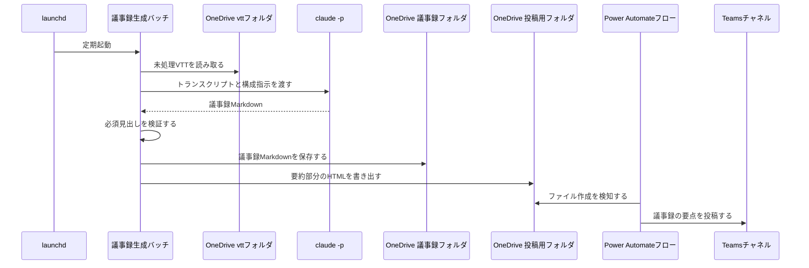
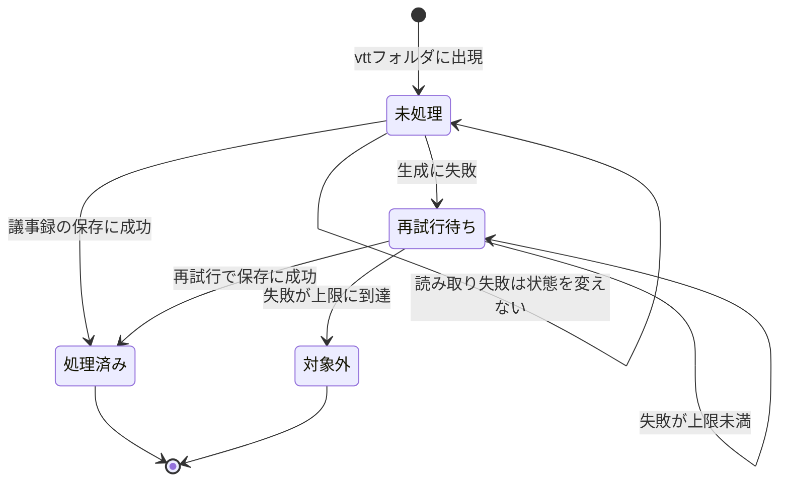

# 会議後の議事録自動生成 設計書

## サマリ

launchdの定期実行バッチが、teams-transcript-fetcherの成果物フォルダ(`auto/transcript/vtt/`)の未処理VTTを状態ファイルとの突き合わせで検知し、`claude -p`(ヘッドレス)で議事録Markdownを生成してOneDriveの議事録フォルダへ保存、要約部分をHTML化した投稿用ファイルをTeams投稿用フォルダへ書き出す。主要な設計判断は次の3点: (1) `claude -p` は exit 0 でも失敗しうるため、生成結果の必須見出しをバッチ側で検証してから成果物として扱う、(2) 「読み取れなかった」(OneDrive同期待ち)と「生成に失敗した」を区別し、前者は再試行回数を消費しない、(3) トランスクリプト・議事録の本文はログに出さない。処理の詳細は[シーケンス図](#議事録の生成)、VTTごとの状態の一生は[状態遷移図](#状態管理)を参照。

## 処理フロー

### 定期実行と未処理VTTの検知

- **対象**: OneDriveの `auto/transcript/vtt/` にあるVTTファイル
- **手順**:
  1. launchdが一定間隔(10分ごと【推測】)でバッチを起動する
  2. 状態ファイル(処理済み・対象外・再試行回数の記録)を読み込む。状態ファイルが存在しない場合は初回実行とみなし、その時点で `vtt/` に存在する全VTTを「処理済み」として状態ファイルを作成し、今回の実行では議事録を生成せずに終了する
  3. `vtt/` のVTT一覧と状態ファイルを突き合わせ、「処理済み」でも「対象外」でもないVTTを未処理として抽出する
  4. 未処理VTTを1件ずつ、以降の「議事録の生成」から「投稿用ファイルの書き出し」まで直列に処理する(並列にしない)
  5. VTTの読み取りに失敗した場合(OneDrive同期の実体化待ちを含む)は、そのVTTをスキップして次のVTTへ進む。読み取り失敗は生成失敗と区別し、再試行回数を消費しない
- **関連するビジネスルール**: [requirements.md#新規トランスクリプトの検知](requirements.md#新規トランスクリプトの検知)

### 議事録の生成

- **対象**: 検知した未処理VTT 1件
- **手順**:
  1. VTTの内容と議事録の構成指示(会議メタ情報・要約・決定事項・TODO(担当者候補付き)・議論の経緯・未決事項/次回議題)を組み立てたプロンプトで `claude -p` を起動する。モデルはclaude CLIの既定モデルを使う【推測】
  2. 会議名・日時はVTTファイル名から分かる範囲でプロンプトに渡し、判別できない項目は「不明」と書かせる。参加者一覧・TODO担当者候補はトランスクリプトの発言者名から書かせ、担当者を推定できないTODOは「担当者未定」と書かせる
  3. `claude -p` の標準出力を生成結果として受け取る。タイムアウト(15分【推測】)を設け、超過したら生成失敗として扱う
  4. 生成結果を検証する: 議事録の必須見出し(会議メタ情報・要約・決定事項・TODO・議論の経緯・未決事項)がすべて存在すること。exit 0 であっても検証に通らなければ生成失敗として扱う(`claude -p` の既知の制約への対処)
  5. 生成に失敗した場合、そのVTTの再試行回数を1増やして状態ファイルに記録し、次のVTTへ進む(次回実行で再試行される)。再試行回数が上限(3回【推測】)に達したら「対象外」として記録し、以降の実行では処理しない
- **シーケンス図**:

図の正となる文章は本見出しおよび[requirements.md#議事録の生成](requirements.md#議事録の生成)。

- **関連するビジネスルール**: [requirements.md#議事録の記載内容](requirements.md#議事録の記載内容)、[requirements.md#生成手段claude--pの制約への対処](requirements.md#生成手段claude--pの制約への対処)

### 議事録の保存

- **対象**: 検証に通った議事録Markdown
- **手順**:
  1. OneDriveの議事録フォルダ `auto/minutes/`【推測】へ、元のVTTと対応が分かるファイル名(VTTファイル名の拡張子を `.md` に変えたもの)【推測】で保存する
  2. 同名ファイルが既に存在する場合は上書きせず、末尾に連番を付けて保存する【推測】
  3. 保存に成功したら、そのVTTを「処理済み」として状態ファイルに記録する
- **関連するビジネスルール**: [requirements.md#onedriveフォルダの使い方](requirements.md#onedriveフォルダの使い方)

### 投稿用ファイルの書き出し

- **対象**: 保存に成功した議事録
- **手順**:
  1. 議事録Markdownから要約部分(会議メタ情報・要約・決定事項・TODO)の見出しを抜き出し、Teamsが解釈できるHTMLに変換する(TeamsはプレーンテキストのままではNGでHTMLとして解釈する。daily-report-to-teamsで実機確認済みの方式)
  2. 末尾に「全文はOneDriveの議事録フォルダの該当ファイルを参照」という案内文(議事録ファイル名を含む)を追加する
  3. Teams投稿用フォルダ `auto/minutesNotice/`【推測】へ、一意なファイル名(`minutes-YYYYMMDD-HHMMSS.txt` 形式)【推測】で書き出す
  4. 書き出しに失敗しても、議事録の保存が済んでいればそのVTTは「処理済み」のままとし、投稿だけを失敗としてログに残す(議事録の二重生成を防ぐことを優先する)【推測】
- **関連するビジネスルール**: [requirements.md#teamsへの共有](requirements.md#teamsへの共有)

## エラーハンドリング

- **読み取り失敗と生成失敗を区別する**: OneDrive同期の実体化待ちなどでVTT・状態ファイルを読み取れない場合は「一時的失敗」としてその実行では何も変更せず、次回実行に委ねる(teams-transcript-fetcherで実機確認済みの方針を踏襲)。`claude -p` の失敗・生成結果の検証NGは「生成失敗」として再試行回数を消費する
- **1件の失敗で全体を止めない**: VTTごとに独立して処理し、あるVTTの失敗は他のVTTの処理に影響させない。バッチ全体としては、想定外の例外が起きてもトレースバックをログに記録して終了し、次回の定期実行で自然に再開する
- **状態ファイルの破損**: 状態ファイルが読み込めない(JSONとして不正)場合は処理を中断してエラーログを残し、勝手に初期化しない(初期化すると全VTTが「初回」扱いになり既処理分を再生成してしまうため)

## 関連するファイル(抜粋)

すべて新規追加。構成はteams-transcript-fetcherに合わせる。

- `apps/meeting-minutes-generator/application/generate_minutes.py` — バッチのエントリポイント
- `apps/meeting-minutes-generator/application/config.py` — フォルダパス・実行間隔・再試行上限などの設定
- `apps/meeting-minutes-generator/application/state.py` — 状態ファイルの読み書き
- `apps/meeting-minutes-generator/application/claude_runner.py` — `claude -p` の起動と生成結果の検証
- `apps/meeting-minutes-generator/application/summary_html.py` — 要約部分の抽出とHTML変換
- `apps/meeting-minutes-generator/application/launchd/com.example.meeting-minutes-generator.plist` — launchd定義
- `apps/meeting-minutes-generator/application/tests/` — 単体テスト(unittest)
- `apps/meeting-minutes-generator/README.md` — セットアップ・運用手順(Power Automateフロー新設手順を含む)

## 状態管理

VTT 1件ごとの処理状態を状態ファイル(`~/Library/Application Support/meeting-minutes-generator/state.json`【推測】)で保持する。状態は「未処理(状態ファイルに記録なし)」「処理済み」「対象外」の3つと、生成失敗時の再試行回数を持つ。

図の正となる文章は[処理フロー](#処理フロー)の各手順。

## セキュリティ

- **会議内容の取り扱い**: トランスクリプト・議事録には社内の会議内容(機微情報になりうる)が含まれる。成果物はいずれも組織のOneDrive・Teamsの中に閉じ、それ以外の場所(ローカルの恒久ファイル・ログ)には本文を残さない
- **ログに本文を出さない**: 実行ログにはトランスクリプト本文・議事録本文・プロンプト本文を出力しない(teams-transcript-fetcherと同じ方針。requirements.mdのビジネスルール)
- **`claude -p` への入力**: トランスクリプト本文はプロンプトとしてClaude(組織で利用が認められているclaude CLI経由)に渡る。これは本機能の前提であり、渡す内容はトランスクリプトと構成指示のみに限定する(認証情報・無関係なファイルを含めない)

## ログ

teams-transcript-fetcherと同じ方式(`~/Library/Application Support/meeting-minutes-generator/` 配下にログファイル、5世代ローテーション)【推測】。

| タイミング | 内容 | レベル |
|---|---|---|
| バッチ開始・終了 | 対象VTT件数(本文は出さない) | INFO |
| 初回実行の初期化 | 既存VTTを処理済みとして登録した件数 | INFO |
| 議事録の保存成功 | VTTファイル名・議事録ファイル名・生成にかかった時間 | INFO |
| VTT読み取りの一時的失敗 | VTTファイル名・次回に持ち越す旨 | INFO |
| 生成失敗(claude -p 失敗・検証NG) | VTTファイル名・失敗理由の分類・再試行回数 | WARNING |
| 再試行上限到達(対象外化) | VTTファイル名 | WARNING |
| 投稿用ファイルの書き出し失敗 | 議事録ファイル名 | WARNING |
| 状態ファイル破損・想定外の例外 | トレースバック | ERROR |
