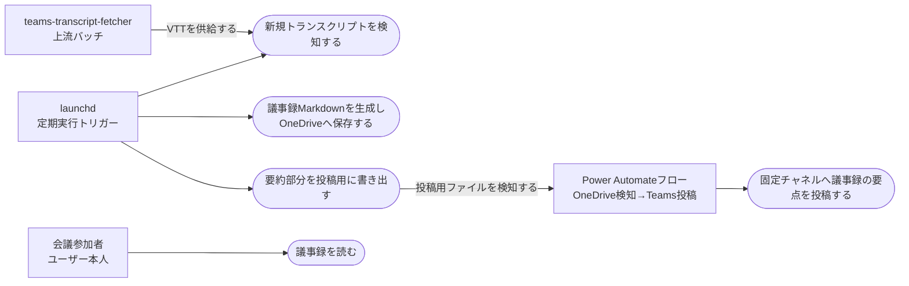

# 会議後の議事録自動生成

> ステータス: 仕様確認中(未実装)

## サマリ

会議参加者(ユーザー本人)が会議後に手作業で議事録を起こす手間をなくす。teams-transcript-fetcher が OneDrive に蓄積するトランスクリプト(WEBVTT)を定期実行バッチが検知し、`claude -p`(ヘッドレス)で議事録Markdownを全自動生成して OneDrive に書き出す。あわせて要約部分だけを固定の1つのTeamsチャネルへ自動投稿する(既存の「OneDriveファイル作成検知 → Teams投稿」フローの方式を流用)。投稿は数行で読める分量にとどめ、全文は投稿に載せたリンクから開く。デイリーMTGのような定期進捗確認の会議では、担当者ごとの進捗を独立した見出しにまとめる。TODOのJIRA自動起票と、導入前から溜まっている過去分VTTの遡及処理はスコープ外。

利用者・システムの関係は[ユースケース図](#ユースケース図)を参照。

## 概要

- **機能名**: 会議後の議事録自動生成(meeting-minutes-generator / minutes-auto-generation)
- **目的**: 取得済みトランスクリプトから要約・決定事項・TODO(担当者候補付き)を含む議事録を会議後に自動生成し、書き出し・共有まで人手ゼロで完了させる。Teams投稿は要点を数行で掴める分量にし、詳細は全文へのリンクから辿れるようにする
- **優先度**: 高

## ユーザーストーリー

会議参加者(ユーザー本人)としては、録画・文字起こしした会議が終わったら、何も操作しなくても議事録がOneDriveに作成され、要点がTeamsチャネルに共有されていてほしい。Teamsの投稿はスクロールせずに要点が掴める分量で、詳細を読みたいときは投稿のリンクから議事録全文をそのまま開きたい。会議後に議事録を手で起こす・展開する作業をなくしたい。

## ユースケース図

正となる文章は[機能要件](#機能要件)・[ビジネスルール・制約](#ビジネスルール制約)を参照。

## 機能要件

### 新規トランスクリプトの検知

- [1] teams-transcript-fetcher の成果物フォルダ(OneDriveの `auto/transcript/vtt/`)を定期実行で確認し、未処理のVTTファイルを検知すること
- [2] 処理済みのVTTを記録し、同じVTTから議事録を二重に生成しないこと
- [3] 初回実行時点で既に存在するVTTは処理済みとして扱い、議事録を生成しないこと(遡及処理はスコープ外)
- [4] OneDrive同期の実体化待ちなどでVTTを読み取れない場合は、そのVTTをエラー扱いにせず次回実行で再度対象にすること

### 議事録の生成

- [1] 検知したVTTの内容から、`claude -p`(ヘッドレス実行)で議事録を生成すること
- [2] 議事録は次の構成を含むMarkdownとすること: 会議メタ情報(会議名・日時・参加者一覧)、要約、決定事項、TODO(担当者候補付き)、議論の経緯、未決事項・次回議題。デイリー系会議(定義は[会議種別による構成の切り替え](#会議種別による構成の切り替え))では、要約と決定事項の間に「進捗」を加えた構成とすること
- [3] 生成した議事録MarkdownをOneDriveの議事録フォルダ(`auto/transcript/` と同様の `auto/` 配下の専用サブフォルダ)へ保存すること
- [4] 議事録の生成に失敗した場合、そのVTTは処理済みにせず、次回実行で再試行すること
- [5] 同一VTTへの再試行が規定回数を超えた場合は、そのVTTを対象外として記録し、以降の実行で繰り返し失敗し続けないこと

### Teamsへの共有

- [1] 議事録の生成・保存に成功したら、要約部分(会議メタ情報・要約・決定事項・TODO。デイリー系会議ではこれに進捗を加えたもの)のみを抜き出した投稿用ファイルを、Teams投稿用のOneDrive検知フォルダへ書き出すこと。議論の経緯、未決事項・次回議題は投稿に含めない
- [2] 投稿用ファイルの末尾に、議事録全文をブラウザで開けるリンクを、議事録ファイル名を表示テキストとして添えること(リンクの形式は[議事録全文へのリンク](#議事録全文へのリンク))
- [3] 投稿先は設定で指定した固定の1チャネルとすること(会議ごとの投稿先切り替えはしない)。投稿自体は既存方式(OneDriveファイル作成検知 → Teams「メッセージを投稿する」アクションのPower Automateフロー)で行い、このフローは本機能用に新設すること
- [4] 投稿用ファイルの書き出し成功をもって「投稿を依頼した」ものとし、Teamsへの実際の反映(非同期)は確認しないこと

## ビジネスルール・制約

### 議事録の記載内容

- [1] 議事録は日本語で書くこと(トランスクリプトの言語によらない)
- [2] TODOの担当者候補は、トランスクリプト中の発言者名・発言内容から推定すること。推定できない場合は「担当者未定」とすること
- [3] 会議メタ情報のうち会議名・日時はVTTのファイル名や内容から判別できる範囲で記載し、判別できない項目は「不明」とすること
- [4] 参加者一覧はトランスクリプトの発言者名から抽出すること(発言のない参加者は把握できないため対象外)
- [5] 決定事項・TODO・未決事項が1件もない場合は、その見出しに「なし」と記載すること(見出し自体は省略しない)
- [6] 「要約」は箇条書きで書き、会議の実尺に応じた上限に収めること。実尺30分以下は3〜5点かつ全体で300字以内、30分超60分以下は最大7点かつ全体で500字以内、60分超は最大10点かつ全体で800字以内とする
- [7] 会議の実尺はトランスクリプトのタイムスタンプから求めること。求められない場合は最も厳しい上限(3〜5点・全体で300字以内)を適用すること
- [8] 要約の分量はバッチが検証せず、生成の指示として守らせること(分量超過を生成失敗にすると、内容としては成立している議事録を失い再試行上限で対象外化しうるため)

### 会議種別による構成の切り替え

- [1] トランスクリプトのファイル名に定期進捗確認を示す語(既定: デイリー、daily、朝会、スタンドアップ、standup。大文字小文字を区別しない部分一致)が含まれる会議を「デイリー系会議」として扱うこと。判定に使う語は設定で変更できること
- [2] デイリー系会議の議事録には「進捗」の見出しを設け、担当者ごとに「作業実績」「作業予定」「課題」の3項目でその担当者の状況を書くこと。該当する項目がない場合は「なし」と書くこと
- [3] デイリー系会議では、対応中タスクの進捗報告は「進捗」に書き、「決定事項」「TODO」には進捗報告以外(その会議で決まったこと・新たに発生したアクションアイテム)だけを書くこと
- [4] デイリー系会議以外では「進捗」の見出しを設けないこと
- [5] 生成結果の検証(必須見出しの存在)は、会議種別ごとの構成に対して行うこと

### 議事録全文へのリンク

- [1] 共有ストレージ(OneDrive / SharePoint Online)のファイルを直接指すURLはブラウザ内で表示されずダウンロードになるため、ファイルビューアで開く形式のURLを使うこと
- [2] ビューアのURLと議事録フォルダのサーバー相対パスは設定で持つこと。設定値はブラウザのアドレスバーからコピーされることを前提に、ビューア側に付随するクエリを落とし、エンコード済みのパスを二重にエンコードしないこと
- [3] リンクの組み立てに必要な設定が欠けている場合は、リンクの代わりに議事録ファイル名を文言で案内すること(投稿そのものは成立させる)

### 生成手段(claude -p)の制約への対処

- [1] `claude -p` はMCPを使えず、exit 0 でも失敗していることがある(既知の制約)。そのため生成結果が議事録として成立しているか(必須見出しの存在など)をバッチが検証し、検証に通らない場合は生成失敗として扱うこと
- [2] トランスクリプト本文・議事録本文を実行ログに出力しないこと(teams-transcript-fetcher と同じ方針)

### OneDriveフォルダの使い方

- [1] OneDriveの `auto/` 直下にファイルを置かないこと(既存のTeams投稿用フローが検知するため。既存ルール)。議事録・投稿用ファイルはそれぞれ専用サブフォルダに置くこと
- [2] 投稿用ファイルのファイル名は毎回一意にすること(OneDriveの「ファイル作成時」トリガーは新規作成のみ検知し、上書きでは発火しないため。daily-report-to-teams で実機確認済み)

## 非機能要件・依存関係

- **依存**: teams-transcript-fetcher の成果物(`auto/transcript/vtt/` のWEBVTT)。VTTの供給側の仕様は [teams-transcript-fetcher/specs/transcript-auto-fetch/requirements.md](../../../teams-transcript-fetcher/specs/transcript-auto-fetch/requirements.md) を参照
- **実行環境**: このMacのlaunchdによる定期実行(方式は create-automation-batch Skill の検証済みテンプレートに従う)
- **セットアップ**: Teams投稿用のPower Automateフロー(OneDrive検知 → 固定チャネルへ投稿)の新設はユーザーの手作業。バッチ側はフォルダへの書き出しまでを責務とする

## スコープ外

- 抽出したTODOのJIRAチケット自動起票(バックログ別項目として別途対応)
- 導入前から `vtt/` に溜まっている過去分VTTの遡及処理
- 会議ごとの投稿先チャネルの切り替え
- Teamsへの実際の投稿反映の確認・リトライ(書き出しまでが責務)
