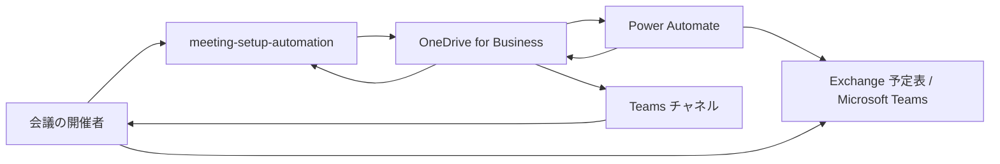
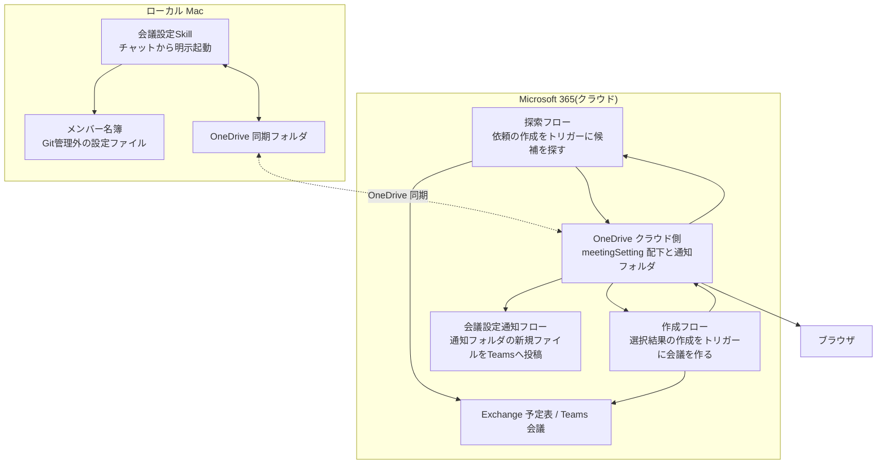

# meeting-setup-automation アーキテクチャ

## サマリ

社内会議の日程調整とTeams会議の作成・招待を自動化するアプリ。チャットから明示的に起動するSkillが起点で、参加者全員の空き時間の探索と会議の作成はテナント側のPower Automateフローが担い、両者はOneDrive上のファイルを介して連携する。M365テナントへのAPI認証(Entra IDアプリ登録・テナント管理者同意)を必要としない点は`teams-transcript-fetcher`と共通で、認証はOneDrive同期クライアントとPower Automateのコネクタに委ねる。

主要技術: Claude Code Skill / Power Automate(クラウドフロー・Office 365 Outlookコネクタ) / OneDrive同期クライアント / 静的HTML。

specは1つ。[meeting-scheduling](meeting-scheduling/requirements.md)が候補提示からTeams会議の作成・招待までを担う。外部との境界は[コンテキスト図](#コンテキスト図)、内部構成は[システム構成図](#システム構成図)を参照。

## 概要

チャットで件名・参加者・所要時間・アジェンダを伝えると、参加者全員が空いている候補枠を提示し、選んだ枠でTeams会議を作成して参加者を招待する。録画とファシリテーターの有効化は、作成完了通知に含まれる会議オプション画面の直リンクから開催者が手動で行う。

## アーキテクチャの目的

M365テナントへのAPI認証を一切必要とせず、かつ追加ライセンスなしで利用できる範囲の機能だけで、会議の日程調整と作成を自動化する。

このアプリ固有の制約として、以下がすべて使用できない前提で構成を組む必要がある。

- Microsoft Graphのオンライン会議リソース(録画の自動開始・会議オプションの設定・共同開催者ロールはここにしか存在しない。到達できるのはMicrosoft Teamsコネクタのパススルーだけで、その接続にオンライン会議を読み書きする権限が無い)
- Power Automateのプレミアムコネクタ・カスタムコネクタ・素のHTTPアクション(割り当てライセンスの対象外)
- Power AutomateのHTTP要求受信トリガー(組織のPower Platform DLPポリシーでブロックされる)
- Claude Code実行環境からの外部ネットワーク通信(サンドボックスで遮断されている)

## 設計方針

**1. 外部との通信はPower Automateに寄せ、Skillはファイルの読み書きだけを行う**

Skillが動く実行環境は外部ネットワークが遮断されているため、カレンダーの参照も会議の作成もSkillからは行えない。外部と話す役はすべてPower Automateフローに置き、Skillとフローの境界をOneDrive上のファイルに限定する。

**2. Skillは「待つ側」に立ち、常駐プロセスを持たない**

候補の提示と作成完了の通知は、依頼を出したSkillのセッション自身が台帳の到着を待って行う。監視バッチもlaunchdジョブも新設しない。想定利用が月に数回であり、常駐する仕組みを維持するコストが利便性に見合わないため。待ち時間の上限を超えた場合は待ちを打ち切り、依頼IDを指定した再起動で続きから再開する。

**3. 判断はSkill側に一本化し、フローは「頼まれたことだけをする」役に徹する**

候補が0件だったときの代替案の組み立て、参加者の名前解決、選択結果の妥当性判定はすべてSkill側に置く。フローは「渡された条件で探す」「渡された枠で作る」だけを行う。判断ロジックがフローとSkillに分かれると、片方だけ変更したときに静かに壊れるため。

**4. 自動化できない設定は「手動操作を最短にする」形で残す**

録画の自動開始とファシリテーター機能の有効化は自動化できない(理由は[技術的制約](#技術的制約)と[adr/0001](adr/0001-manual-recording-and-facilitator.md))。これを機能の不成立とはせず、会議作成の応答から会議オプション画面の直リンクを取り出して通知に載せることで、手動操作をリンク1回とトグル操作に縮める。

**5. 候補の選択画面はブラウザで開ける場所に置く**

選択画面のURLをTeams通知で受け取れるようにするため、選択画面はローカルのファイルパスではなくOneDrive上に置き、ブラウザで表示される形式のURLで開く。ローカルファイルとして開く前提にすると、ターミナルの前にいないと選択に進めない。

## コンテキスト図

本アプリと、その外側にあるものだけを描く(内部構成は[システム構成図](#システム構成図))。



- `Power Automate` は空き時間の探索と会議の作成を担う外部の実行環境で、テナント側に存在しこのリポジトリでは管理しない
- 本アプリと `Power Automate` は直接通信せず、`OneDrive` 上のファイルを介してやり取りする
- 候補選択画面もOneDrive上に置き、開催者はブラウザで開いて候補を選ぶ
- Teamsへの通知は、本アプリがOneDriveへ書き出したファイルを通知フローが投稿する形で開催者へ届く。投稿先ごとに専用フォルダと専用フローが1組必要なため、この機能用の通知フローも新設する
- 開催者から `Exchange 予定表 / Microsoft Teams` への直接の線は、会議オプション画面での録画・ファシリテーターの手動有効化を表す

## システム構成図



## アーキテクチャ概要

開催者がチャットでSkillを起動すると、Skillはメンバー名簿で参加者名をメールアドレスに解決し、探索条件を添えた**依頼**をOneDriveの依頼フォルダへ書き出す。依頼は同期を経てクラウド側に届き、それをトリガーに探索フローが参加者全員の空き時間を探索し、**候補**を候補フォルダへ書き出す。

Skillは候補の到着を待ち、届いた候補から**候補選択画面**を生成してOneDrive上に置く。同期完了後、その画面のURLを通知フォルダ経由でTeamsへ通知し、同じURLをチャットにも表示する。候補が0件だった場合は、条件を段階的に緩めるのではなく2つの代替案を同時に用意して開催者に選ばせる。仮の予定を空きとみなした候補は受け取った候補を絞り直すだけで作り、期間と時間帯を広げた候補は依頼を1件増やして取り直す(詳細は[meeting-scheduling/requirements.md#候補が0件のときの代替案の提示](meeting-scheduling/requirements.md#候補が0件のときの代替案の提示))。

開催者はブラウザで選択画面を開き、候補を1つ選んで選択結果をコピーし、チャットに貼る。Skillは貼られた内容から依頼IDと候補を特定して**選択結果**を選択結果フォルダへ書き出す。これをトリガーに作成フローが選択された枠でTeams会議を作成し、参加者を招待して、**作成結果**を作成結果フォルダへ書き出す。

Skillは作成結果の到着を待ち、会議の日時・参加者・参加URLと、会議本文から取り出した会議オプション画面の直リンクをTeamsとチャットへ知らせる。開催者はその直リンクから録画とファシリテーターを手動で有効化する。

待ち時間の上限を超えた場合、Skillは待ちを打ち切って終了する。依頼IDを指定して再度起動すると、その依頼の待ち合わせの続きから再開する(設計方針2)。

## 採用技術

| 技術 | 用途 |
|---|---|
| Claude Code Skill | 依頼の組み立て、名前解決、候補の絞り込み、候補選択画面の生成、待ち合わせ、通知内容の作成。手順は`~/.claude/skills/meeting-setup/`、処理は`application/`のPythonスクリプト |
| Power Automate(クラウドフロー) | 参加者の空き時間の探索、Teams会議の作成と招待 |
| Office 365 Outlookコネクタ | 予定表への到達手段。空き時間の探索と会議の作成に使う。**プレミアムコネクタ・カスタムコネクタは利用できない** |
| OneDrive 同期クライアント | M365への認証代行およびクラウドとローカルのファイル受け渡し |
| 静的HTML | 候補選択画面。ブラウザで開くだけで動作し、サーバーを持たない |
| teams-post Skill | 通知フォルダへの書き出しによるTeams投稿 |

## 機能一覧表(機能マップ)

| spec | 機能(利用者から見て) | 役割 | 依存 | 状態 |
|---|---|---|---|---|
| [meeting-scheduling](meeting-scheduling/requirements.md)([設計](meeting-scheduling/design.md)) | 参加者と所要時間を伝えるだけで候補が出て、選ぶだけでTeams会議が作られる | 空き時間から候補を提示し、選択された枠でTeams会議を作成して招待する | Power Automateフロー3本(探索フロー・作成フロー・会議設定通知フロー)の新設、会議設定通知の投稿先の登録、OneDrive同期クライアントの稼働 | リリース済み |

## ディレクトリ構成

CLAUDE.mdの一般規約(`infra/` + `application/`)からの逸脱がある。

```
apps/meeting-setup-automation/
├── application/     # 処理スクリプト・候補選択画面のテンプレート・テスト
└── specs/           # 仕様3点セット
```

- **`infra/` を持たない。** クラウドリソースを作らないため、Terraformの管理対象がない
- Power Automateのフロー定義はテナント側に存在し、このリポジトリでは管理しない。構築に使ったフローの設定内容と手順は `application/` 配下に記録する
- **チャット向けの手順(SKILL.md)はこのリポジトリに置かない。** `~/.claude/skills/meeting-setup/` に置き、処理はここの `application/` を絶対パスで呼ぶ(`night-batch`・`extend-teams-automation`と同じ形)
- メンバー名簿は個人情報を含むためGit管理下に置かず、`~/Library/Application Support/meeting-setup-automation/roster.json` に置く(リポジトリには記入例だけを置く)

## 外部サービス

| サービス | 用途 |
|---|---|
| Exchange 予定表 | 参加者の空き時間の参照、会議の作成先 |
| Microsoft Teams | 会議の実体(参加URL・会議オプション)と、通知の届け先チャネル |
| OneDrive for Business | 依頼・候補・選択結果・作成結果・候補選択画面の置き場。およびM365への認証代行 |
| Power Automate | 空き時間の探索と会議の作成 |

## 関連ADR

- [adr/0001-manual-recording-and-facilitator.md](adr/0001-manual-recording-and-facilitator.md) — 録画とファシリテーターを手動運用にし、会議テンプレートを使わない判断
- [0001-multi-app-monorepo-layout.md](../../../doc/adr/0001-multi-app-monorepo-layout.md) — モノレポ構成の方針

## セキュリティ

- **参加者の氏名とメールアドレスの対応表(メンバー名簿)は個人情報である。** Git管理下に置かず、`~/Library/Application Support/meeting-setup-automation/roster.json` に置く。リポジトリ内に置いて`.gitignore`で守る形にすると、書き忘れ1つで個人情報がコミットされるため
- **参加URLを知れば会議に参加できる。** 参加URLを含む作成結果ファイルと通知は、共有せず個人利用の範囲に留める
- **資格情報を一切保持しない構成である。** クライアントシークレット・証明書・アクセストークンをこのアプリはどこにも保存しない。認証はOneDrive同期クライアントとPower Automateのコネクタに委ねている
- **参加者の空き時間は他人の予定情報である。** 扱うのは空いているかどうかだけとし、予定の件名・本文・出席者は取得も保存もしない。候補が0件のときの代替案1で示すのも「誰に仮の予定があるか」までとする

## 技術的制約

- **参加者の空き時間を返すコネクタは、時間帯や勤務時間で絞り込めない。** 返るのは純粋な空き時間で、時刻はすべて世界標準時。時間帯・曜日・祝日の絞り込みと日本時間への変換はすべてSkill側で行う
- **他人の予定の件名を読めるのは、開催者のカレンダー一覧にそのカレンダーが入っている参加者に限る。** カレンダー一覧に入るのは、その参加者が共有の招待を出し開催者が承諾したカレンダーだけで、表示のために並べているだけのカレンダーは入らない。共有している相手が限られるため、この機能では予定の件名を扱わない([meeting-scheduling/requirements.md#スコープ外](meeting-scheduling/requirements.md#スコープ外))
- **Graphパススルーで通っているのは`POST /me/events`だけで、読み取りの経路は1つも通っていない。** `me/calendar/getSchedule`(関数の呼び出し)・`me/events?$select=...`(クエリ付き)・`users/<upn>/events?$select=...`・`me/events`(クエリなしのGET)は、いずれもコネクタの検証で`400`になりGraphへ届かない。予定の取得は、パススルーではなくコネクタの専用アクション(`Filter Query`・`Top Count`の入力を持つもの)で行う
- **空き時間の応答は要求した最大件数で打ち切られる。** 打ち切られた集合の外にある枠は、こちら側で絞り込みを緩めても現れない
- **出席可能率だけでは全員空きを判定できない。** 下限を100%にしても仮の予定が入った出席者を含む枠が返り、開催者の空き状況は出席者の一覧とは別の項目で返る
- **録画の自動開始・ファシリテーター機能の有効化・共同開催者ロールの付与は自動化できない。** これらはMicrosoft Graphのオンライン会議リソースにしか存在せず、このアプリが使える接続の権限では変更できない(調査の内容と再検討の条件は[adr/0001](adr/0001-manual-recording-and-facilitator.md))
- **会議テンプレートを自動作成した会議に適用できない。** テンプレートの指定はオンライン会議リソース側のプロパティで、予定として作成する経路からは渡せず、作成後の後付けもできない([adr/0001](adr/0001-manual-recording-and-facilitator.md))
- **Power Automateのフォルダ監視トリガーには検知の待ちがある。** OneDrive同期のラグと合わせて、依頼から候補の到着までに45〜50秒、選択結果から作成結果の到着までに70秒かかる前提で設計する。**この検知間隔は短時間に連続して依頼を出すと絞られ、往復が10分以上に伸びることがある**(実測: 7分間隔での連続実行で670秒)。連続して依頼を出す処理は、待ちが打ち切られても壊れない作りにする
- **OneDriveへ書き出した候補選択画面は、同期が完了するまでURLで開けない。** URLを通知する前に同期の完了を確認する必要がある
- Power AutomateとSkillはOneDrive上の同一ファイルに双方から書き込まない(一方が書くファイルを他方は読み取りにのみ使う)
- **Skillの実行環境から外部ネットワークへ通信できない。** カレンダーの参照・会議の作成をSkillから直接行う構成は取れない

## 用語集

| 用語 | 意味 |
|---|---|
| 依頼 | Skillが書き出す、1件の会議設定の依頼を表すファイル。件名・参加者・所要時間・アジェンダ・探索条件を持つ |
| 依頼ID | 依頼1件を一意に指す値。依頼・候補・選択結果・作成結果のファイル名に共通して使う唯一の共有点 |
| 候補 | 探索フローが書き出す、参加者全員が空いている枠の一覧を表すファイル |
| 候補選択画面 | 候補から生成する静的HTML。開催者がブラウザで開き、候補を1つ選んで選択結果をコピーする |
| 選択結果 | 開催者が選んだ候補を表すファイル。Skillが書き出し、作成フローのトリガーになる |
| 作成結果 | 作成フローが書き出す、作成した会議の情報を表すファイル。参加URLと会議本文を含む |
| 代替案1 | 候補が0件のとき、仮の予定を空きとみなして出す候補。受け取った候補を絞り直すだけで作る |
| 代替案2 | 候補が0件のとき、期間を3週間・時間帯を9時30分から18時30分に広げて出す候補。依頼を1件増やして取り直す |
| 会議オプション画面の直リンク | 会議本文に含まれる、その会議の会議オプション画面を開くURL。録画とファシリテーターの手動有効化に使う |
| メンバー名簿 | 参加者の名前とメールアドレスの対応表。Git管理外のローカル設定ファイル |
| 探索フロー | 依頼の作成をトリガーに、参加者全員の空き時間を探して候補を書き出すPower Automateフロー |
| 作成フロー | 選択結果の作成をトリガーに、Teams会議を作成して作成結果を書き出すPower Automateフロー |
| 会議設定通知フロー | 通知フォルダの新しいファイルをTeamsの自分専用チャネルへ投稿するPower Automateフロー |
