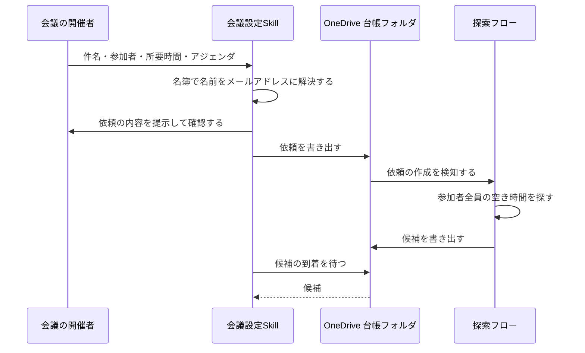
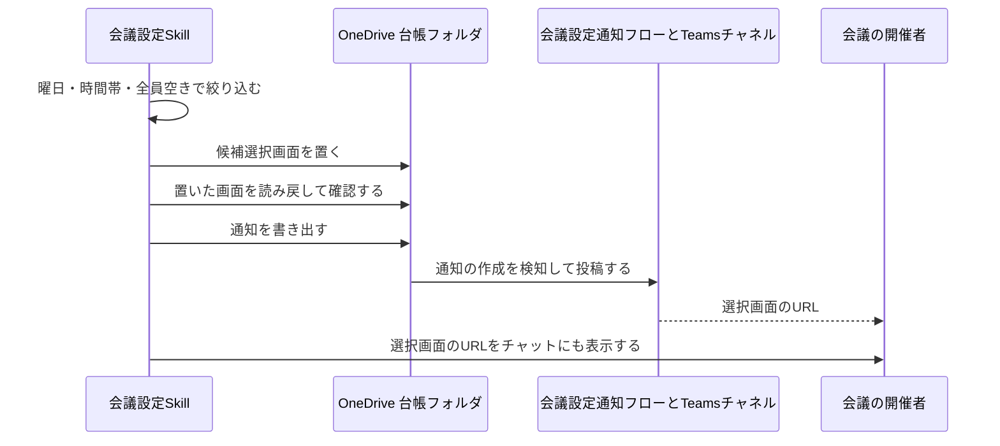
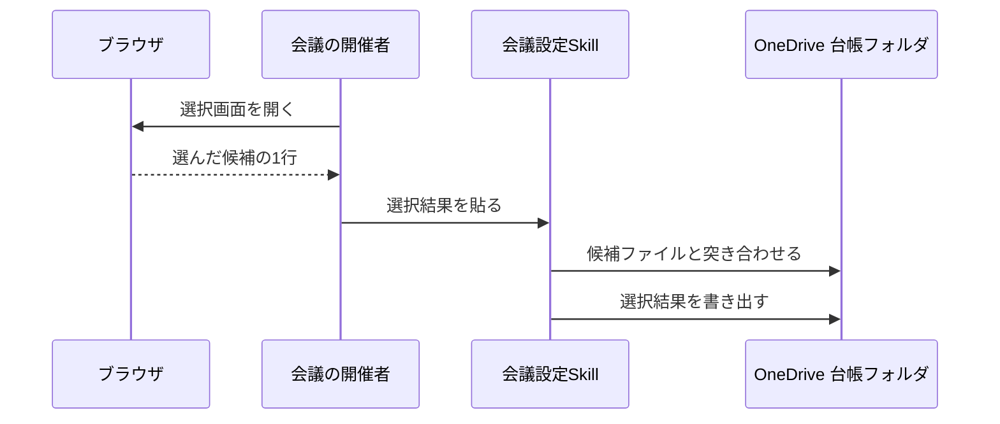
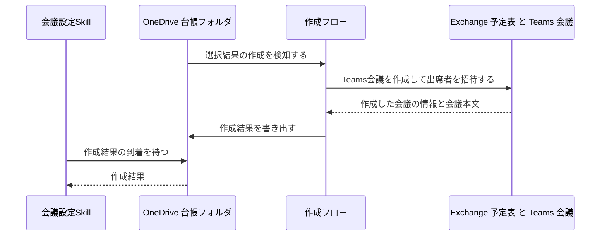
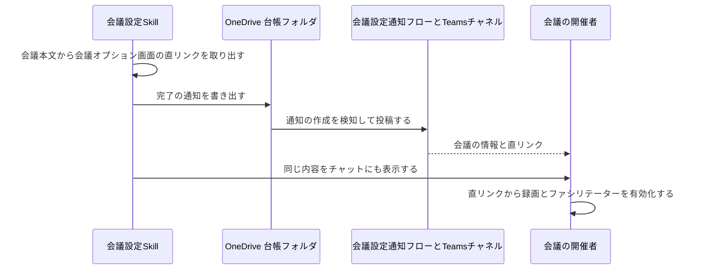
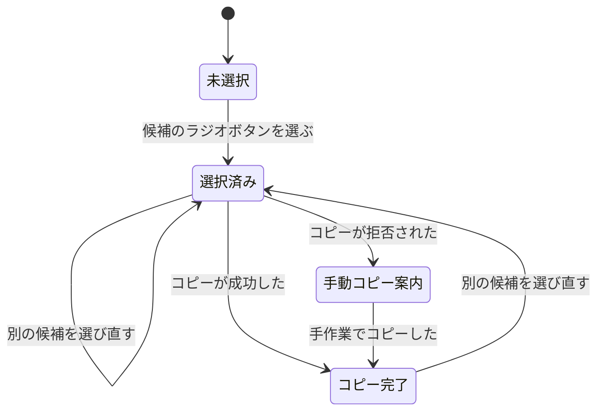
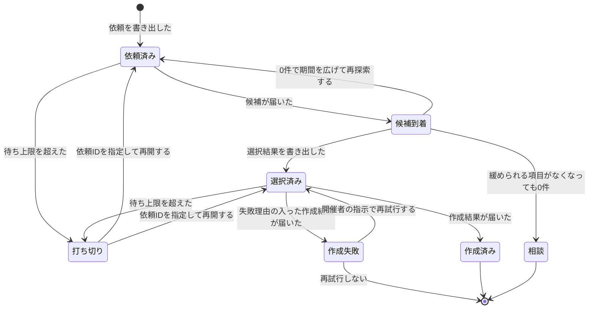

# 空き時間からの会議候補提示とTeams会議の自動作成 設計書

## サマリ

チャットから起動したSkillが、参加者名をメンバー名簿でメールアドレスに解決し、探索条件を添えた**依頼**をOneDriveの依頼フォルダへ書き出す。探索フローが参加者全員の空き時間を探して**候補**を書き出し、Skillはそれを待って絞り込み、**候補選択画面**(静的HTML)をOneDriveへ置いてビューア形式URLをTeamsとチャットへ知らせる。開催者が画面で選んだ結果をチャットに貼ると、Skillが**選択結果**を書き出し、作成フローがTeams会議を作成して**作成結果**を書き出す。Skillは作成結果から参加URLと会議オプション画面の直リンクを取り出して完了を通知する。

主要な設計判断は次の8点。

1. **依頼の進行状態は台帳ファイルの存在から導き、状態ファイルを持たない。** ファイル名に依頼IDを含めるため、どこまで進んだかは「どのファイルがあるか」で一意に決まる。依頼のファイルにはアジェンダと絞り込みの条件まで持たせ、待ちを打ち切った後に別のセッションで再開しても依頼時の情報が失われないようにする([データ設計台帳ファイル](#データ設計台帳ファイル)・[状態管理](#状態管理))
2. **探索条件の判断はすべてSkillに置き、フローには「渡された条件で探す」だけをさせる。** 候補探索のコネクタは1つの期間しか受け取れないため、曜日・祝日・時間帯の絞り込みはSkill側で行う。フローには多めの件数(既定50件)を返させ、Skillが絞って上限件数に落とす。応答は要求した件数で打ち切られるため、緩めた時間帯の枠が打ち切られた集合の外にあることがある([候補の絞り込みと選択画面の用意](#候補の絞り込みと選択画面の用意))
3. **フローは失敗しても必ず結果ファイルを書く。** 書かない設計だとSkillは待ち上限まで待つしかなく、失敗の理由も伝わらない。候補・作成結果のどちらも失敗理由を入れる区分を持つ([エラーハンドリング](#エラーハンドリング))
4. **選択結果ファイルは単体で会議を作れる内容にする。** 作成フローが依頼ファイルを読みに行かなくて済むため、フローが「渡された枠で作る」だけの役に徹せる([データ設計台帳ファイル](#データ設計台帳ファイル))
5. **選択画面の同期完了はローカルの読み戻しと猶予時間で扱う。** クラウド側で存在を確かめる専用フローは立てず、書き戻せてサイズが安定したことを確認してから猶予を置いて通知し、開けなかった場合の再読込を通知文に添える(往復とフローの本数を増やさないため)
6. **祝日は標準ライブラリだけの固定テーブルで判定する。** 新しいOSSは追加せず、`retro-check`の祝日テーブルと同じ方式のモジュールをこのアプリに持つ
7. **会議の作成の失敗は完了と区別し、開催者の指示があったときだけやり直す。** 作成結果に失敗理由があれば「作成失敗」として扱い、再試行番号を増やした選択結果を書き出して作成フローを改めて発火させる。自動では再試行しない([会議の作成が失敗したときの再試行](#会議の作成が失敗したときの再試行))
8. **チャットでのやり取りはSKILL.mdが、ファイルの読み書きと判定は`main.py`が担う。** どちらでもできる手順の担い手を先に決めることで、同期の猶予待ちやチャットへの提示が実装から抜け落ちるのを防ぐ([手順の担い手](#手順の担い手))

処理の詳細は[候補提示までのシーケンス図](#会議設定の依頼を組み立てて書き出す)と[会議作成までのシーケンス図](#選択結果の受け取りと会議の作成)、依頼の一生は[状態遷移図](#状態管理)、選択画面の表示の切り替わりは[画面遷移図](#画面設計)を参照。

## 処理フロー

### 会議設定の依頼を組み立てて書き出す

- **対象**: チャットで受け取った1件の会議設定の依頼
- **手順**:
  1. 件名・参加者・所要時間・アジェンダを受け取る。探索の期間・時間帯・候補件数の指定があれば受け取り、指定のない項目には既定値(当日から2週間、9時30分から17時30分、対象は月曜から金曜、最大5件)を使う
  2. 参加者の名前をメンバー名簿でメールアドレスに解決する。名簿に登録がない名前、名簿の中で同じ名前が複数ある名前が1つでもある場合は、依頼を書き出さずに、解決できなかった名前を挙げて聞き返して終了する(部分的に解決できた分だけで先に進まない)
  3. 依頼IDを作る。起動時刻と乱数から作り、同じ時刻に複数の依頼が立っても重ならない値にする
  4. 依頼の内容(件名・参加者・所要時間・探索条件)をチャットに提示し、開催者の確認を得る。誤りがあればここで作り直す
  5. 依頼を依頼フォルダへ書き出す。アジェンダの原文と絞り込みの条件も依頼に含める(再開時に復元するため)。ファイル名には依頼IDと試行番号を含める。試行番号は初回が1で、期間を広げた再探索ごとに1増える(時間帯の緩和では増えない)
  6. 書き出しに失敗した場合(同期フォルダへ書けない場合)は、以降へ進まず失敗を伝えて終了する
- **シーケンス図**:

図の正となる文章は本見出し。候補が届いた後の絞り込みと通知は[候補の絞り込みと選択画面の用意](#候補の絞り込みと選択画面の用意)のシーケンス図を参照。

- **関連するビジネスルール**: [requirements.md#候補探索の既定条件](requirements.md#候補探索の既定条件)、[requirements.md#参加者の解決](requirements.md#参加者の解決)、[requirements.md#台帳ファイルの扱い](requirements.md#台帳ファイルの扱い)

### 候補の絞り込みと選択画面の用意

- **対象**: 探索フローが書き出した候補ファイル1件
- **手順**:
  1. 依頼IDと試行番号から決まる候補ファイルの到着を待つ(待ち方は[往復の待ち合わせと打ち切り](#往復の待ち合わせと打ち切り))
  2. 候補ファイルに失敗理由が入っている場合は、候補の絞り込みへ進まずその理由を伝えて終了する
  3. 受け取った枠の開始・終了を日本時間に変換する。枠は世界標準時で届くため、この変換より前に日付・曜日・時間帯の判定を行わない
  4. 全員空きの判定は、出席者ごとの空き状況のすべてと開催者の空き状況の両方が「空き」であることとする。出席可能率では判定しない(下限を100%にしても、仮の予定が入った出席者や開催者を含む枠が返る)。仮の予定は空きとみなさない
  5. 受け取った枠を、この依頼の条件で絞り込む。祝日にかかる枠を除く。対象とする曜日の指定がある場合はその曜日以外の枠を除き、指定がない場合は土曜・日曜の枠を除く。枠の開始から終了までが指定の時間帯に収まらないものを除く。全員空きでない枠を除く(依頼時に一部不在の枠も含めるよう指示された場合はこの除外を行わない)。開始時刻の早い順に並べ、既に採用した枠と時間の重なる枠を除く
  6. 絞り込んだ結果から先頭を上限件数まで採用する。同じ日に複数の枠が残ってもそのまま採用する
  7. 採用した枠が0件の場合は[候補が0件のときの条件の緩和](#候補が0件のときの条件の緩和)へ進む
  8. 採用した枠から候補選択画面(静的HTML)を組み立て、HTMLフォルダへ置く。ファイル名には依頼IDを含める。同じ依頼IDの画面が既にある場合は上書きする(再探索で候補が入れ替わったときに古い画面を残さない)
  9. 置いたHTMLを読み戻し、書いた内容と一致すること、続けて読んだときにサイズが変わらないことを確認する
  10. 同期の猶予時間(既定30秒)だけ待つ
  11. HTMLのビューア形式URLを組み立てる。ビューアのURLに付随するクエリは落とし、サーバー相対パスは一度デコードしてからエンコードする(エンコード済みの値を二重にエンコードしないため)
  12. 選択画面のURLと件名・候補件数を通知として通知フォルダへ書き出し、同じ内容をチャットにも表示する。自動で条件を緩めた場合は緩めた後の条件も添える。通知文には、開けない場合は数十秒待って再読込する旨を添える
  13. 通知の書き出しに失敗しても、チャットへのURL表示は行って選択の受け取りへ進む(通知だけの失敗で機能全体を止めない)
- **シーケンス図**:

図の正となる文章は本見出し。

- **関連するビジネスルール**: [requirements.md#候補の提示](requirements.md#候補の提示)、[requirements.md#候補探索の既定条件](requirements.md#候補探索の既定条件)、[requirements.md#通知](requirements.md#通知)

### 候補が0件のときの条件の緩和

- **対象**: 絞り込みの結果が0件だった依頼
- **手順**:
  1. まだ緩められる項目があるかを依頼ファイルから調べる。時間帯を緩められるのは「開催者が時間帯を指定しておらず、依頼ファイルの時間帯が既定値と同じ」とき、期間を緩められるのは「開催者が探索期間を指定しておらず、試行番号が1」のとき
  2. 時間帯が開催者の指定でなく、まだ緩めていない場合は、時間帯を9時30分から18時30分に広げた条件で、いま手元にある同じ候補ファイルを[候補の絞り込みと選択画面の用意](#候補の絞り込みと選択画面の用意)の手順5から絞り直す。対象とする曜日は変えない。**探索の依頼は出し直さない**(時間帯の絞り込みはこちら側だけで行い、探索の指示に時間帯は含まれないため、出し直しても同じ枠が返るだけで往復が1回増える)
  3. そうでなく、期間を緩められる場合は、期間を当日から3週間に広げた依頼を次の試行番号で書き出し、候補の到着待ちからやり直す。時間帯と対象とする曜日は前段の値(時間帯を緩めていれば緩めた後の値)のままにする
  4. 緩められる項目が残っていない場合は、候補が見つからないことと、試した条件と緩めなかった項目(開催者が指定したため緩めなかったこと)を挙げて、参加者・期間・所要時間のどれを緩めるかを開催者に相談して終了する
  5. 期間を広げた再探索の待ちは新しい待ちとして扱い、待ちごとに待ち上限を適用する
  6. 期間を広げた再探索は前の依頼から間を置かずに続くため、フォルダ監視トリガーの検知間隔が絞られて往復が伸び、待ち上限を超えて打ち切られることがある。これを異常として扱わず、打ち切りとして伝えて依頼IDでの再開に委ねる
  7. 時間帯を緩めても候補が0件で、受け取った枠の件数が依頼で要求した最大件数と同数だった場合は、応答が件数で打ち切られている可能性も併せて伝える。探索の依頼を出し直しても同じ枠が返るため、緩和では回復できない
  8. どこまで緩めたかを別に記録しない。手順1のとおり依頼ファイルと試行番号から導けるため、打ち切った後に別のセッションで再開しても同じ判定になる
- **関連するビジネスルール**: [requirements.md#候補が0件のときの探索条件の拡張](requirements.md#候補が0件のときの探索条件の拡張)

### 選択結果の受け取りと会議の作成

- **対象**: 開催者がチャットに貼った選択結果の1行
- **手順**:
  1. 貼られた内容から、目印の語・依頼ID・試行番号・候補番号・開始時刻・終了時刻を読み取る。読み取れない場合は選択結果を書き出さず、選択画面のコピー内容をそのまま貼ってほしい旨を伝えて聞き返す
  2. 読み取った依頼IDと試行番号の候補ファイルを開き、貼られた開始時刻・終了時刻と一致する枠がその中に1つ存在することを確認する。存在しない場合は書き出さずに聞き返す(古い画面や別の依頼の内容を貼った場合に取り違えないため)。候補番号は選択画面上の並び順を表す表示用の番号なので突き合わせには使わない。これにより、絞り込みを再現しなくても貼られた内容を検証できる
  3. その依頼IDの選択結果ファイルが既にある場合は、新しく書き出さない。作成に成功した作成結果が既にあれば作成済みの内容をそのまま伝え、失敗した作成結果があれば[会議の作成が失敗したときの再試行](#会議の作成が失敗したときの再試行)へ進み、作成結果がまだ無ければ作成結果の待ちへ進む
  4. 依頼ファイルからアジェンダの原文を読み、見出しと箇条書きのHTMLに整形する(打ち切り後に別のセッションで再開した場合も、ここで依頼時のアジェンダを復元できる)
  5. 選択結果ファイルを選択結果フォルダへ書き出す。件名・開始終了時刻・必須出席者・整形したアジェンダ本文・オンライン会議として作ることの指定を含め、これ単体で会議を作れる内容にする。物理会議室(リソース)は含めない
  6. 作成フローが書き出す作成結果ファイルの到着を待つ
  7. 作成結果に失敗理由が入っている場合は、[会議の作成が失敗したときの再試行](#会議の作成が失敗したときの再試行)へ進む(完了として報告しない)
  8. 作成結果から、会議の日時・出席者・参加URLを取り出す。会議本文から会議オプション画面の直リンクを取り出す
  9. 会議の日時・出席者・参加URL・会議オプション画面の直リンクと、録画とファシリテーターは直リンクから開催者が手動で有効化する必要がある旨を通知として書き出し、同じ内容をチャットにも表示する
- **シーケンス図**:

候補の選択から選択結果の書き出しまで:

図の正となる文章は本見出しの手順1から5。

会議の作成:

図の正となる文章は本見出しの手順6と7、および[会議の作成が失敗したときの再試行](#会議の作成が失敗したときの再試行)。

完了の通知:

図の正となる文章は本見出しの手順8と9。

- **関連するビジネスルール**: [requirements.md#候補の選択](requirements.md#候補の選択)、[requirements.md#会議の作成](requirements.md#会議の作成)、[requirements.md#会議の作成内容](requirements.md#会議の作成内容)、[requirements.md#録画とファシリテーターの設定](requirements.md#録画とファシリテーターの設定)、[requirements.md#完了の通知](requirements.md#完了の通知)

### 会議の作成が失敗したときの再試行

- **対象**: 失敗理由が入った作成結果がある依頼
- **手順**:
  1. 失敗理由と、選んだ枠の開始・終了をそのまま伝える。完了としては報告しない
  2. 作成の途中で失敗した場合は会議が実際には作られていることがあるため、Teamsのカレンダーでその枠に会議が無いことを確かめてから再試行するよう案内する【推測】
  3. 開催者が再試行を指示した場合に限り、再試行番号を1つ増やした選択結果を書き出す。内容は前回と同じにする。ファイル名に再試行番号を含めるため、作成フローのトリガー(新しいファイルの作成)が改めて発火する【推測】
  4. 再試行番号を含む作成結果の到着を待ち、以降は[選択結果の受け取りと会議の作成](#選択結果の受け取りと会議の作成)の手順8以降と同じに進む
  5. 再試行は自動では行わない。何度失敗しても、そのたびに開催者の指示を待つ【推測】
- **関連するビジネスルール**: [requirements.md#会議の作成](requirements.md#会議の作成)、[requirements.md#候補の選択](requirements.md#候補の選択)

### 往復の待ち合わせと打ち切り

- **対象**: 候補ファイルの到着待ち、作成結果ファイルの到着待ち
- **手順**:
  1. 待つ相手のファイルは依頼IDから名前が決まるため、フォルダの一覧は取らず、その名前のファイルがあるかどうかだけを繰り返し確かめる(同期フォルダは一覧の取得が許可されないことがあるため)
  2. 一定間隔(既定5秒)で確認し、待っている対象と経過時間を進捗として出す
  3. 現れたファイルは、内容が読めて完全に書かれていること(想定の形式として読み取れること)まで確認する。読み取れない場合は書き込み中とみなして待ち続ける
  4. その待ちの上限(候補の待ちと作成結果の待ちで別々に持ち、いずれも既定5分)を超えたら待ちを打ち切る。打ち切ったことと、依頼IDを指定して再度起動すれば続きから再開できること、フロー側の異常のほかにOneDrive同期が止まっている可能性も切り分け先になることを伝えて終了する
  5. 依頼IDを指定して起動された場合は、その依頼IDの台帳ファイルの有無から進行状態を判定し、その続きから再開する(判定は[状態管理](#状態管理))
- **関連するビジネスルール**: [requirements.md#往復の待ち合わせ](requirements.md#往復の待ち合わせ)、[requirements.md#往復の待ち時間の上限](requirements.md#往復の待ち時間の上限)

## バリデーション

- **参加者**: 名簿で一意に解決できること。解決できない名前が1つでもあれば依頼を書き出さない
- **所要時間**: 5分以上、かつ1日の時間帯の長さに収まること
- **探索期間**: 開始日が終了日以前であること。開始日は当日以降であること。終了日は当日から3週間以内であること
- **時間帯**: 開始時刻が終了時刻より前で、その差が所要時間以上あること
- **候補件数**: 1件以上であること
- **参加者の人数**: 開催者を含めて20名以内であること
- **アジェンダ**: 指定は任意。指定が無くても不正としない
- **貼られた選択結果**: 目印の語・依頼ID・試行番号・候補番号・開始終了時刻がすべて読み取れ、候補ファイルの内容と一致すること

いずれもNGの場合は台帳ファイルを書き出さず、何がNGだったかを伝えて聞き返す。境界の値とその根拠は[requirements.md#依頼内容の受け付け条件](requirements.md#依頼内容の受け付け条件)が正。

## エラーハンドリング

- **フローは失敗しても結果ファイルを書く。** 探索フロー・作成フローは、コネクタの呼び出しが失敗した場合も失敗理由を入れた候補ファイル・作成結果ファイルを書き出す。Skillは結果ファイルに失敗理由があればその時点で理由を伝えて終了する(待ち上限まで待たされない)
- **同期フォルダへの書き込み失敗はそこで止める。** 依頼・選択結果・通知・HTMLのいずれも、書き出しに失敗したら次の手順へ進まない。ただし通知の書き出し失敗だけは例外とし、チャットへの表示を行って処理を続ける(通知はOneDrive同期とフローに依存するため、そこが止まっても機能全体を使えなくしない)
- **同期フォルダの読み取り失敗は「まだ来ていない」として扱う。** 台帳ファイルが読めない・途中まで書かれている場合は失敗とせず待ちを続け、待ち上限で打ち切る
- **会議オプション画面の直リンクが取り出せない場合。** 作成結果の会議本文にそれらしいURLが見つからない場合は、通知に「直リンクを取り出せなかったこと」と「Teamsのカレンダーから会議を開いて会議オプションを開く手順」を書く。会議自体は作成できているため、失敗としては扱わない
- **作成の失敗を完了と区別する。** 作成結果に失敗理由が入っている場合は「作成失敗」として扱い、完了として報告しない。失敗理由を伝えたうえで、開催者の指示があったときだけ再試行する([会議の作成が失敗したときの再試行](#会議の作成が失敗したときの再試行))
- **二重の会議作成を防ぐ。** 選択結果ファイルは1つの再試行番号につき1回しか書き出さない。作成に成功した作成結果ファイルがある依頼IDについては選択結果を書き出さず、作成済みの内容を伝える。再試行番号を増やして書き出すのは、失敗した作成結果があり、かつ開催者が再試行を指示した場合だけにする
- **打ち切りは失敗ではない。** 待ち上限を超えた場合、台帳ファイルは削除も書き換えもせず残し、依頼IDを指定した再起動で続きから再開できる状態にしておく
- **想定外の例外**は経過をそのまま出して終了する。台帳ファイルは残るため、同じ依頼IDでの再開が可能な状態を壊さない

## 関連するファイル(抜粋)

チャット向けの手順(SKILL.md)は`~/.claude/skills/`に置き、処理・テンプレート・テストはstudyリポジトリのアプリ配下に置いて絶対パスで呼び出す(`night-batch`・`extend-teams-automation`と同じ形)。

- `~/.claude/skills/meeting-setup/SKILL.md` — チャットから起動する手順(新規。studyリポジトリ外)
- `apps/meeting-setup-automation/application/main.py` — コマンドの入口。依頼の書き出し・再開・選択結果の受け取り・作成の再試行をサブコマンドとして持つ
- `apps/meeting-setup-automation/application/config.py` — 台帳フォルダ・通知フォルダ・HTMLフォルダのパス、ビューアURL、待ち上限・確認間隔・同期猶予、既定の探索条件
- `apps/meeting-setup-automation/application/roster.py` — メンバー名簿の読み込みと名前の解決
- `apps/meeting-setup-automation/application/holidays_jp.py` — 日本の祝日の固定テーブル(`retro-check`と同じ方式。標準ライブラリのみ)
- `apps/meeting-setup-automation/application/request.py` — 依頼IDの生成、依頼の組み立てと書き出し、候補が0件のときの条件の緩和
- `apps/meeting-setup-automation/application/wait_for.py` — 台帳ファイルの到着待ちと進捗の出力
- `apps/meeting-setup-automation/application/candidates.py` — 候補の絞り込み(曜日・祝日・時間帯・全員空き・重複除外)
- `apps/meeting-setup-automation/application/select_html.py` — 候補選択画面の組み立てとビューアURLの組み立て
- `apps/meeting-setup-automation/application/selection.py` — 貼られた選択結果の読み取り・突き合わせ・選択結果ファイルの書き出し
- `apps/meeting-setup-automation/application/result.py` — 作成結果の読み取りと会議オプション画面の直リンクの取り出し
- `apps/meeting-setup-automation/application/notify.py` — 通知文の組み立てと通知フォルダへの書き出し
- `apps/meeting-setup-automation/application/progress.py` — 依頼IDから進行状態を判定する
- `apps/meeting-setup-automation/application/templates/select.html` — 候補選択画面のテンプレート
- `apps/meeting-setup-automation/application/power-automate/README.md` — 探索フロー・作成フローの構築手順、設定内容、構築でつまずく点
- `apps/meeting-setup-automation/application/roster.example.json` — メンバー名簿の記入例(実体はGit管理外)
- `apps/meeting-setup-automation/application/tests/` — 単体テスト(unittest)
- `apps/meeting-setup-automation/README.md` — セットアップ・運用手順

既存で使うもの:

- `~/.claude/skills/teams-post/scripts/run.py` — 通知の投稿(投稿先を表示名で指定して呼ぶ)
- `~/.claude/config/project-profiles.json` — 投稿先「会議設定通知」の登録先
- `~/Library/Application Support/meeting-setup-automation/roster.json` — メンバー名簿の実体(Git管理外)

### 手順の担い手

チャットでのやり取りはSKILL.mdの手順が担い、ファイルの読み書きと判定は`main.py`のサブコマンドが担う。どちらが担うかを決めておかないと、同期の猶予待ちやチャットへの提示のような「どちらでもできる手順」が実装から抜け落ちる。

| 手順 | 担い手 |
|---|---|
| 件名・参加者・所要時間・アジェンダの聞き取り、依頼内容の提示と確認、選択結果の貼り付けの受け取り、再試行の確認、コマンドの出力のチャットへの表示 | SKILL.md(チャットの手順) |
| 名前の解決・入力値の確認・依頼の書き出し | `main.py submit`(`--dry-run`で書き出さずに依頼の内容だけを返す) |
| 候補の待ち・絞り込み・条件の緩和・選択画面の書き出し・同期の猶予待ち・ビューアURLの組み立て・通知の書き出し。および選択済みの依頼を再開したときの作成結果の待ちと完了の通知、作成失敗を検知したときの失敗理由の提示 | `main.py resume` |
| 貼られた選択結果の突き合わせ・選択結果の書き出し・作成結果の待ち・直リンクの取り出し・完了の通知 | `main.py select` |
| 失敗した作成の再試行(再試行番号を増やした選択結果の書き出し以降) | `main.py retry-create` |

`main.py resume`は依頼IDだけを受け取り、[状態管理](#状態管理)の判定に従ってその依頼の続きを進める。打ち切った後の再開も、依頼の直後の待ちも同じサブコマンドで行う。判定が「作成失敗」だった場合は、完了として報告せず失敗理由と再試行の案内を出して終わり、再試行そのものは`retry-create`に委ねる。

## データ設計(台帳ファイル)

DBは使わず、OneDrive上のファイルを台帳とする。用途ごとにフォルダを分け、同じファイルをSkillとPower Automateの双方から書かない。

| 種類 | 置き場所 | 書く側 | 読む側 | ファイル名 |
|---|---|---|---|---|
| 依頼 | `auto/meetingSetting/request/` | Skill | 探索フロー | `request-<依頼ID>-a<試行番号>.json` |
| 候補 | `auto/meetingSetting/candidates/` | 探索フロー | Skill | `candidates-<依頼ID>-a<試行番号>.json` |
| 選択結果 | `auto/meetingSetting/selection/` | Skill | 作成フロー | `selection-<依頼ID>.json`(再試行は `selection-<依頼ID>-r<再試行番号>.json`) |
| 作成結果 | `auto/meetingSetting/result/` | 作成フロー | Skill | `result-<依頼ID>.json`(再試行は `result-<依頼ID>-r<再試行番号>.json`) |
| 候補選択画面 | `auto/meetingSetting/html/` | Skill | ブラウザ | `select-<依頼ID>.html` |
| 通知 | `auto/teamsNotice/meetingSetting/` | Skill | 会議設定通知フロー | `meeting-<書き出し時刻>.txt` |

- 依頼IDは「起動時刻(年月日と時分秒)+乱数4文字」の形にする。試行番号は初回が1で、期間を広げた再探索ごとに1増える。再試行番号は初回の作成が0で、会議の作成をやり直すたびに1増える
- **フローが書き出すファイルの名前は、読んだファイルの名前の先頭を置き換えて決める。** 探索フローは `request-` を `candidates-` に、作成フローは `selection-` を `result-` に置き換える。フローは番号を解釈せず、名前を組み立てる判断はSkill側だけが持つ(設計判断2)
- 選択結果のファイル名を決めるのはSkillで、再試行番号が0のときは接尾辞を付けず、1以上のときだけ `-r<再試行番号>` を付ける
- 日時はISO 8601形式で日本時間のオフセット付きで書く
- 作成結果まで到達した依頼のファイルは削除しない

### 依頼ファイルの区分

- **依頼の識別** — 依頼IDと試行番号
- **会議の内容** — 件名・所要時間・必須出席者のメールアドレス・アジェンダの原文
- **探索の指示(フローが読む)** — 探索期間の開始と終了、出席可能率の下限、返してほしい枠の最大件数
- **絞り込みの条件(Skillだけが読む)** — 時間帯の開始と終了、対象とする曜日(既定は月曜から金曜)、全員空きを求めるかどうか、最終的に提示する候補の上限件数。祝日は常に除くため項目として持たない
- **開催者が指定した項目(Skillだけが読む)** — 期間・時間帯・候補件数・曜日・全員空きのうち、開催者が明示的に指定したものの一覧

「開催者が指定した項目」を持つのは、候補が0件のときの自動の緩和を開催者の指定に作用させないため([候補が0件のときの条件の緩和](#候補が0件のときの条件の緩和))。既定値と同じ値を開催者が明示的に指定した場合も指定として扱うため、値の比較では区別できない。

どこまで緩めたかは別に持たない。時間帯を緩めたかどうかは「開催者が時間帯を指定しておらず、依頼ファイルの時間帯が既定値と違う」ことから、期間を緩めたかどうかは試行番号が2以上であることから導ける。

**全員空きを求めるかどうかは、探索の指示と絞り込みの条件の両方に反映する。** 出席可能率の下限を100%のままにすると一部不在の枠はフローから返ってこないため、全員空きを求めない指示を受けた場合は下限を下げて依頼に書く(既定は100%)。絞り込み側だけを緩めても候補は増えない。

探索のコネクタは1つの期間しか受け取れないため、フローには上限件数より多めの枠を返させ、絞り込みの条件はSkillが持つ。絞り込みの条件とアジェンダの原文を依頼ファイルに書いておくことで、待ちを打ち切った後に別のセッションで再開しても、同じ条件で絞り込み、依頼時のアジェンダを会議本文に入れられる(別の状態ファイルを持たない)。探索フローはアジェンダを読まない。

### 候補ファイルの区分

- **依頼の識別** — 依頼IDと試行番号
- **枠の一覧** — 枠ごとの開始・終了、出席可能率、出席者ごとの空き状況、開催者の空き状況
- **枠が無かった理由** — コネクタが枠を返さなかった場合にその理由
- **失敗理由** — フローの処理が失敗した場合にその内容(正常時は空)

枠の開始・終了は世界標準時で届く。開催者の空き状況は出席者ごとの空き状況には含まれず、別の項目として届く。時刻の変換と全員空きの判定はどちらもSkill側で行う([候補の絞り込みと選択画面の用意](#候補の絞り込みと選択画面の用意))。

### 選択結果ファイルの区分

- **依頼の識別** — 依頼IDと再試行番号(初回の作成では0)
- **会議の内容** — 件名・開始・終了・必須出席者のメールアドレス・会議本文(整形したアジェンダ)・オンライン会議として作る指定

作成フローがこのファイルだけで会議を作れるようにする(依頼ファイルを読みに行かせない)。

### 作成結果ファイルの区分

- **依頼の識別** — 依頼IDと再試行番号(選択結果から引き継ぐ)
- **作成した会議** — 会議の識別子・件名・開始・終了・出席者・参加URL・会議本文・会議を開くリンク
- **失敗理由** — フローの処理が失敗した場合にその内容(正常時は空)

会議オプション画面の直リンクはフローでは取り出さず、会議本文をそのまま渡してSkillが取り出す(判断をSkillに一本化する方針)。

### Power Automateフローの役割

| フロー | トリガー | 行うこと |
|---|---|---|
| 探索フロー | 依頼フォルダにファイルが作成されたとき | 依頼の探索の指示を「会議の時間を検索 (V2)」へ渡し、返った枠と失敗理由を候補ファイルとして書き出す。候補のファイル名は、読んだ依頼のファイル名の `request-` を `candidates-` に置き換えて決める |
| 作成フロー | 選択結果フォルダにファイルが作成されたとき | 選択結果の内容で`POST /me/events`を呼んでオンライン会議を作成し、応答と失敗理由を作成結果ファイルとして書き出す。作成結果のファイル名は、読んだ選択結果のファイル名の `selection-` を `result-` に置き換えて決める |
| 会議設定通知フロー | 通知フォルダにファイルが作成されたとき | ファイルの内容を自分専用チャネルへ投稿する。投稿先ごとに専用フォルダと専用フローが1組必要なため、この機能用に新設する(`extend-teams-automation`の手順で既存の投稿フローを複製する) |

`POST /me/events`はOffice 365 Outlookコネクタのパススルー経由で呼ぶ。会議オプション画面の直リンクは応答の会議本文から取り出す必要があり、本文を返す経路を選ぶ。

## 画面設計

候補選択画面(静的HTML)は1枚。表示項目と操作は次のとおり。

- ヘッダー: 件名・所要時間・参加者の人数・絞り込みに使った条件の要約(自動で緩めた場合は緩めた後の値と、緩めたことが分かる表示)
- 候補カード(1候補につき1枚、縦に並べる): 候補番号・日付・曜日・開始と終了の時刻・参加者の空き状況。ラジオボタンで1つだけ選べる。候補番号は画面に並べた順の1からの連番で、開催者が口頭で候補を指すための表示用の番号
- 参加者の空き状況は「全員空き」または空いていない人数だけを示す。予定の件名・内容は表示しない
- 「選択結果をコピー」ボタン: 選んだ候補の1行を組み立ててクリップボードへ入れる
- コピー用の入力欄: 選んだ候補の1行を常に表示する。コピーできなかった場合はここを選択状態にして手作業でコピーできる
- 案内文: コピーした1行をチャットに貼ると会議が作られること

クリップボードへ入れる1行は、目印の語・依頼ID・試行番号・候補番号・開始時刻・終了時刻を並べたものにする。目印の語を先頭に置くことで、貼られた内容が選択結果かどうかを取り違えずに判定できる。

コピーは3段構えにする。押した瞬間に同期のまま古い方式のコピーを試し、駄目ならクリップボードの機能の有無を確かめてから呼び、どちらも駄目なら入力欄を選択状態にして手作業でのコピーを案内する(共有ストレージ上のビューアで開いた場合とローカルで開いた場合で、使える方式が変わるため)。

- **画面遷移図**:

図の正となる文章は本見出し。

- **関連するビジネスルール**: [requirements.md#候補の提示](requirements.md#候補の提示)、[requirements.md#候補の選択](requirements.md#候補の選択)

## 状態管理

依頼1件の進行状態は、その依頼IDを含む台帳ファイルの有無から導く。専用の状態ファイルは持たない。

| 状態 | 判定 | 次にすること |
|---|---|---|
| 依頼済み | 依頼はあるが、その試行番号の候補が無い | 候補の到着を待つ |
| 候補到着 | その試行番号の候補があり、選択結果が無い | 絞り込み・選択画面の用意・選択の受け取り |
| 選択済み | 最後の再試行番号の選択結果があり、その作成結果が無い | 作成結果の到着を待つ |
| 作成失敗 | 最後の再試行番号の作成結果があり、失敗理由が入っている | 失敗理由を伝え、開催者の指示があれば再試行する |
| 作成済み | 作成結果があり、失敗理由が入っていない | 完了内容を伝える |

試行番号は、その依頼IDの依頼ファイルのうち最も大きい番号を今の試行とする。再試行番号も同じく、その依頼IDの選択結果ファイルのうち最も大きい番号を今の再試行とする。

下の図の「打ち切り」と「相談」は、上の表の状態ではなく、待ちをやめて終了した位置を表す。台帳ファイルから導けるのは表の5状態だけで、打ち切って終了した依頼も台帳の上では直前の状態のまま残る。

図の正となる文章は本見出しおよび[往復の待ち合わせと打ち切り](#往復の待ち合わせと打ち切り)。

- **関連するビジネスルール**: [requirements.md#往復の待ち合わせ](requirements.md#往復の待ち合わせ)、[requirements.md#台帳ファイルの扱い](requirements.md#台帳ファイルの扱い)

## セキュリティ

- **メンバー名簿は個人情報である。** 氏名とメールアドレスの対応表は`~/Library/Application Support/meeting-setup-automation/roster.json`に置き、Gitリポジトリの外に出す。リポジトリには記入例だけを置く。この場所を選ぶのは、リポジトリ内に置いて`.gitignore`で守る形にすると、書き忘れ1つで個人情報がコミットされるため
- **他人の予定の内容を持ち込まない。** 候補選択画面には空いているかどうかだけを表示し、予定の件名・場所・参加者などは表示しない。探索フローも空き状況以上のものを候補ファイルに書かない
- **参加URLを知れば会議に参加できる。** 参加URLを含む作成結果ファイルと通知は、個人のOneDriveと自分専用のTeamsチャネルの範囲に留める。共有フォルダ・共有チャネルには置かない
- **選択画面のURLは会議の候補と参加者数を含む。** 置き場所は個人のOneDriveのままとし、共有リンクの発行はしない(URLを知っているだけでは開けない状態を保つ)
- **ログに個人情報と会議内容を出さない。** メールアドレス・アジェンダ本文・参加URL・会議本文はログに出さず、依頼IDと件数・状態だけを残す
- **資格情報を持たない。** クライアントシークレット・証明書・アクセストークンをこの機能はどこにも保存しない(認証はOneDrive同期クライアントとPower Automateのコネクタに委ねる)
- **貼られた内容をそのまま信じない。** 選択結果は候補ファイルと突き合わせて一致を確認してから会議の作成に進む
- **HTMLへの埋め込みは全てエスケープする。** 件名・参加者名は開催者が入力した値であり、候補選択画面へ埋め込む際にHTMLとして解釈されないようにする

## ログ

チャットから起動するため、進捗と結果は標準出力に出して開催者がその場で読めるようにし、あわせて`~/Library/Application Support/meeting-setup-automation/meeting-setup.log`へ追記する(5世代でローテーションする)。

| タイミング | 内容 | レベル |
|---|---|---|
| 依頼の書き出し | 依頼ID・試行番号・参加者の人数・探索条件 | INFO |
| 名前の解決に失敗 | 解決できなかった名前の件数 | WARNING |
| 待ちの開始・進捗 | 依頼ID・待っている対象・経過時間 | INFO |
| 候補の絞り込み | 依頼ID・受け取った枠の件数・採用した件数・除外の内訳 | INFO |
| 条件の緩和 | 依頼ID・緩めた項目・緩めた後の条件・依頼を出し直したかどうか | INFO |
| 緩められる項目がなくなって0件 | 依頼ID・試した条件 | WARNING |
| 選択画面の書き出し | 依頼ID・候補件数 | INFO |
| 選択結果の読み取りに失敗 | 依頼ID(読み取れた場合)・失敗の種類 | WARNING |
| 選択結果の書き出し | 依頼ID・候補番号 | INFO |
| 会議の作成完了 | 依頼ID・会議の識別子 | INFO |
| 直リンクを取り出せない | 依頼ID | WARNING |
| フローからの失敗理由 | 依頼ID・失敗理由 | ERROR |
| 待ち上限で打ち切り | 依頼ID・待っていた対象・経過時間 | WARNING |
| 台帳ファイルの書き出し失敗 | 依頼ID・種類 | ERROR |
| 想定外の例外 | トレースバック | ERROR |

## テスト戦略

E2Eの自動化は行わない。画面は静的HTML1枚で、継続的な改修によるデグレのリスクが繰り返し発生する性質のものではなく、外部依存(Power Automate・OneDrive同期・Teams)を自動テストから動かす手段もないため。Power Automateとブラウザに依存する項目は手動確認とし、その内容は[tasks.md](tasks.md)の確認チェックリストに残す。

| 仕様項目 | テストレベル | 備考 |
|---|---|---|
| 会議設定の依頼-1 | 手動 | チャットからの起動 |
| 会議設定の依頼-2 | 単体 | 既定値の適用と指定値の優先 |
| 会議設定の依頼-3 | 単体 | 名簿での名前の解決 |
| 会議設定の依頼-4 | 単体 | 解決できない名前があれば書き出さない |
| 会議設定の依頼-5 | 単体 | 依頼IDの生成とファイル名 |
| 会議設定の依頼-6 | 手動 | 提示内容の確認 |
| 候補の提示-1 | 単体 | 世界標準時で届いた枠を日本時間に変換すること。探索フローそのものは手動確認 |
| 候補の提示-2 | 単体 | HTMLの生成と置き場所 |
| 候補の提示-3 | 単体 | 表示項目 |
| 候補の提示-4 | 単体 | カード1枚とラジオボタン |
| 候補の提示-5 | 結合 | 通知の書き出しとチャット表示 |
| 候補の提示-6 | 単体 | ビューアURLの組み立て。実機で開くことは手動確認 |
| 候補の提示-7 | 単体 | 0件のときの条件の緩和への分岐 |
| 候補の提示-8 | 単体 | 緩めた後の条件が選択画面と通知に入ること |
| 候補の選択-1 | 単体 | 生成物にコピーの3段構えが含まれること。動作は手動確認 |
| 候補の選択-2 | 単体 | 入力欄の自動選択が含まれること。動作は手動確認 |
| 候補の選択-3 | 単体 | 貼られた1行の読み取りと選択結果の書き出し |
| 候補の選択-4 | 単体 | 読み取れない場合・開始終了が候補ファイルの枠と一致しない場合は書き出さない |
| 候補の選択-5 | 単体 | 選択結果は1回だけ書き出す。再試行のときだけ再試行番号を付けて書き出す |
| 会議の作成-1 | 手動 | 作成フローの実機確認 |
| 会議の作成-2 | 単体 | アジェンダの整形 |
| 会議の作成-3 | 単体 | 作成結果の読み取りと直リンクの取り出し |
| 会議の作成-4 | 単体 | 作成に成功した作成結果がある依頼IDでは選択結果を書き出さない |
| 会議の作成-5 | 単体 | 失敗した作成結果の判定と、指示を受けたときだけ再試行番号付きの選択結果を書き出すこと |
| 会議の作成-6 | 単体 | 再試行を促す出力に、その枠に会議が無いことを確かめる案内が含まれること |
| 完了の通知-1 | 結合 | 通知の書き出しとチャット表示 |
| 完了の通知-2 | 単体 | 手動有効化の注意書きが通知文に含まれること |
| 往復の待ち合わせ-1 | 単体 | 到着待ち |
| 往復の待ち合わせ-2 | 単体 | 打ち切りと案内 |
| 往復の待ち合わせ-3 | 結合 | 台帳ファイルの有無から進行状態を判定して再開する |
| 往復の待ち合わせ-4 | 単体 | 待っている対象と経過時間の出力 |
| 依頼内容の受け付け条件-1 | 単体 | 所要時間の下限と時間帯への収まり |
| 依頼内容の受け付け条件-2 | 単体 | 探索期間の前後関係と当日以降 |
| 依頼内容の受け付け条件-3 | 単体 | 探索期間の終了日の上限 |
| 依頼内容の受け付け条件-4 | 単体 | 時間帯の前後関係と所要時間との比較 |
| 依頼内容の受け付け条件-5 | 単体 | 候補件数の下限 |
| 依頼内容の受け付け条件-6 | 単体 | 参加者数の上限 |
| 依頼内容の受け付け条件-7 | 単体 | アジェンダ未指定でも受け付け、無いことが分かる本文にする |
| 依頼内容の受け付け条件-8 | 単体 | 満たさない場合に依頼を書き出さず聞き返す |
| 候補探索の既定条件-1 | 単体 | 期間・時間帯・件数の既定値 |
| 候補探索の既定条件-2 | 単体 | 祝日の除外。曜日の指定がないときの土日の除外と、指定があるときに土日も候補になること |
| 候補探索の既定条件-3 | 単体 | 開催者を含む全員空きの絞り込みと指示による例外。出席者ごとの空き状況と開催者の空き状況の両方を見ること、例外時に出席可能率の下限も併せて下げること |
| 候補探索の既定条件-4 | 単体 | 重なる枠の除外 |
| 候補探索の既定条件-5 | 単体 | 仮の予定を空きとみなさないこと |
| 候補が0件のときの探索条件の拡張-1 | 単体 | 時間帯の緩和。同じ候補ファイルを絞り直し、探索の依頼を出し直さないこと |
| 候補が0件のときの探索条件の拡張-2 | 単体 | 期間の拡張 |
| 候補が0件のときの探索条件の拡張-3 | 単体 | 相談に切り替える |
| 候補が0件のときの探索条件の拡張-4 | 単体 | 開催者が指定した項目を緩めないこと |
| 候補が0件のときの探索条件の拡張-5 | 単体 | 緩和は2回まで |
| 候補が0件のときの探索条件の拡張-6 | 単体 | 受け取った枠が要求件数と同数のときに打ち切りの可能性を伝えること |
| 往復の待ち時間の上限-1 | 単体 | 候補の待ちと作成結果の待ちの上限をそれぞれ持ち、いずれも既定が5分であること |
| 往復の待ち時間の上限-2 | 単体 | 待ちごとに上限を適用する |
| 往復の待ち時間の上限-3 | 結合 | 再探索で打ち切られても台帳を残し、依頼IDを指定した再開で続けられること |
| 参加者の解決-1 | 単体 | Git管理外の名簿の読み込み |
| 参加者の解決-2 | 単体 | 登録なし・同名複数は中断する |
| 参加者の解決-3 | 単体 | 名簿にない相手は参加者にならない |
| 会議の作成内容-1 | 手動 | Teams会議として作られ参加URLが発行されること |
| 会議の作成内容-2 | 単体 | 全員を必須出席者にする |
| 会議の作成内容-3 | 単体 | 会議室を含めない |
| 会議の作成内容-4 | 手動 | 開催者が起動した本人になること |
| 録画とファシリテーターの設定-1 | 手動 | 直リンクからの手動有効化 |
| 録画とファシリテーターの設定-2 | 単体 | 会議本文からの直リンクの取り出し |
| 録画とファシリテーターの設定-3 | 単体 | 直リンクを取り出せない場合の通知文と代替手順。実際に本文へ残るかは[tasks.md](tasks.md#仕様承認pr前に行う実機確認)のE3で確認する |
| 台帳ファイルの扱い-1 | 単体 | 用途ごとのフォルダ分けと書き込み先 |
| 台帳ファイルの扱い-2 | 単体 | ファイル名に依頼IDを含める |
| 台帳ファイルの扱い-3 | 単体 | 到達した依頼のファイルを削除しない |
| 台帳ファイルの扱い-4 | 単体 | 通知フォルダを台帳と分ける |
| 台帳ファイルの扱い-5 | 単体 | 依頼ファイルにアジェンダの原文と絞り込みの条件が含まれ、再開時に復元できること |
| 通知-1 | 結合 | 通知フォルダへの書き出しによる投稿 |
| 通知-2 | 手動 | HTTP投稿の経路を持たないことをレビューで確認する |
| 通知-3 | 単体 | 通知が失敗してもチャット表示で続けられる |
| 非機能要件-1 | 単体 | 依頼IDによる取り違えの防止 |
| 非機能要件-2 | 手動 | 定期実行・無人実行の仕組みを持たないこと |
