# 空き時間からの会議候補提示とTeams会議の自動作成 設計書

## 概要

チャットから起動したSkillが、参加者名をメンバー名簿でメールアドレスに解決し、探索条件を添えた依頼をOneDriveの依頼フォルダへ書き出す。探索フローが参加者全員の空き時間を探して候補を書き出し、Skillはそれを待って曜日・祝日・時間帯・全員空きで絞り込み、候補選択画面(静的HTML)をOneDriveへ置いてビューア形式URLをTeamsとチャットへ知らせる。開催者が画面で選んだ1行をチャットに貼ると、Skillが選択結果を書き出し、作成フローがTeams会議を作成して作成結果を書き出し、Skillは参加URLと会議オプション画面の直リンクを取り出して完了を通知する。 〔合意〕

絞り込みで「参加者全員が空きで開催者だけが空き以外」の枠が残ったときは、Skillが開催者の予定の依頼を書き出し、開催者予定フローが開催者自身のカレンダーから重なる予定の件名・時刻・種別を書き出す。Skillはそれを枠と突き合わせ、候補とは別の区画「開催者の予定のみ重なる枠」として選択画面・通知・チャットに示す。取得できなくても枠の提示は止めない。 〔合意〕

## 決定事項

| 論点 | 選んだ案 | 採らなかった案 | 理由 | 影響範囲 | 出所 |
|---|---|---|---|---|---|
| 開催者の予定の取得経路 | 専用の開催者予定フロー(4本目)が Office 365 Outlook コネクタの「カレンダー ビューの取得 (V3)」で開催者自身の既定カレンダーを読む | 探索フローの応答に件名を含める / Office 365 Outlook コネクタの Graph パススルーで読む | 「会議の時間を検索 (V2)」の応答には予定の件名が無い。パススルーで通るのは `POST /me/events` だけで、読み取り(GET・クエリ付き・3階層のパス)はコネクタの検証で弾かれる([architecture.md#技術的制約](../architecture.md#技術的制約)) | 開催者予定フロー・`organizer_events.py`・台帳フォルダ2つ | 合意 |
| 開催者の予定の取得対象 | 開催者自身の予定だけ | 参加者の予定も取る | 自身のカレンダーは共有設定に依存せず常に読める。参加者の予定の件名は扱わない方針を保つ | 開催者予定フロー・セキュリティ | 合意 |
| 開催者の予定のみ重なる枠の扱い | 候補に数えず、候補の区画の後ろの別区画に置き、候補と同じラジオボタンで選べる(試行番号1のカード) | 候補の区画に混ぜる / 表示だけにして選べなくする | 候補と取り違えない。選択後の突き合わせは試行番号1の候補ファイルに枠があるため、そのまま通る | `candidates.py`・`select_html.py`・`notify.py`・`main.py` | 合意 |
| 開催者の予定を取得できないとき | 件名なしで枠を提示し、カードと通知に「開催者の予定を取得できませんでした(<理由>)」を添える。選択画面の提示を止めない | 取得できるまで提示しない / 枠自体を出さない | 件名は判断材料であって枠の提示の前提ではない。待ち上限・結果の `error`・依頼の書き出し失敗のいずれも同じ扱いにする | `main.py`・`select_html.py`・`notify.py` | 提案 |
| 開催者の予定の待ち方 | 候補が1件以上なら予定の到着を待ってから選択画面を用意する。候補が0件なら代替案2の依頼と続けて書き、`wait_for_all` で同時に待つ。上限はいずれも候補の待ちと同じ5分 | 代替案2の後に順に待つ / 予定を待たずに画面を出して後から差し替える | 往復が2回分に伸びない。どの待ちも同じ経路をたどるため同じ上限でよい。画面の差し替えは選択結果の突き合わせを複雑にする | `main.py`・`wait_for.py` | 提案 |
| 代替案1の定義 | 仮の予定が入っている参加者が1人以上いる枠。参加者全員が空きで開催者だけが空き以外の枠は代替案1に含めない | 開催者だけが仮の枠も代替案1に含める | 同じ枠が2つの区画に出ると、どちらを選んでも同じなのに違う候補に見える | `request.py`・`candidates.py` | 提案 |
| 非公開の予定 | `sensitivity` が `private`・`confidential` の予定は件名の代わりに「非公開の予定」と示す | 件名をそのまま出す | 選択画面と通知はOneDriveとTeamsに残るため、非公開に設定した予定の件名を写さない | `organizer_events.py` | 提案 |
| 開催者の予定ファイルの保全 | 他の台帳と同じく削除しない | 読み終えたら削除する | 進行状態を台帳の有無から導く方式を崩さず、取得済みの依頼で取り直さない判定に使える | `ledger.py`・`progress.py` | 提案 |
| 繰り返し予定 | カレンダー ビューで回ごとに展開された予定を受け取り、枠に重なるその回を示す | 「イベントの取得」で親の予定を読む | 定例会議は繰り返し予定で入っていることが多く、親だけを読むと枠に重なる回が「無い」ように見える | 開催者予定フロー | 提案 |

残りの決定は折りたたみの中。書式そのものは [appendix.md](appendix.md)。

詳細を開く

機能の骨格を決めた判断と、実装の根拠として残す判断。

| 論点 | 選んだ案 | 採らなかった案 | 理由 | 影響範囲 | 出所 |
|---|---|---|---|---|---|
| 依頼の進行状態の持ち方 | 台帳ファイルの存在から導き、状態ファイルを持たない。依頼のファイルにアジェンダと絞り込みの条件まで持たせる | 専用の状態ファイルを持つ | ファイル名に依頼IDを含めるため、どこまで進んだかは「どのファイルがあるか」で一意に決まる。待ちを打ち切った後に別のセッションで再開しても依頼時の情報が失われない | `progress.py`・`ledger.py`・状態管理 | 合意 |
| 探索条件の判断の置き場所 | すべてSkillに置き、フローには「渡された条件で探す」だけをさせる。フローには多めの件数(50件)を返させ、Skillが絞って上限件数に落とす | フローで曜日・時間帯を絞る | 候補探索のコネクタは1つの期間しか受け取れず、時間帯・勤務時間のパラメータも無い。応答は要求した件数で打ち切られるため、緩めた時間帯の枠が集合の外にあることがある | `candidates.py`・探索フロー | 合意 |
| フローの失敗時の振る舞い | 失敗しても必ず結果ファイルを書く(失敗理由を入れる区分を持つ) | 失敗時は書かない | 書かないとSkillは待ち上限まで待つしかなく、失敗の理由も伝わらない | 探索フロー・開催者予定フロー・作成フロー・エラーハンドリング | 合意 |
| 選択結果ファイルの内容 | 単体で会議を作れる内容にする | 作成フローが依頼ファイルを読みに行く | フローが「渡された枠で作る」だけの役に徹せる | `selection.py`・作成フロー | 合意 |
| 選択画面の同期完了の扱い | ローカルの読み戻しとサイズの安定を確認してから猶予時間(30秒)を置いて通知し、開けなかった場合の再読込を通知文に添える | クラウド側で存在を確かめる専用フローを立てる | 往復とフローの本数を増やさない | `select_html.py`・`main.py` | 合意 |
| 祝日の判定 | 標準ライブラリだけの固定テーブル(`retro-check` と同じ方式)をこのアプリに持つ | 祝日判定のOSSを追加する | 新しいOSSを追加しない | `holidays_jp.py` | 合意 |
| 候補が0件のときの進め方 | 条件を段階的に緩めず、仮の予定を含めた候補と期間・時間帯を広げた候補の2つの代替案を同時に用意して開催者に選ばせる | 段階的に緩めて往復を繰り返す | 前者は受け取った候補の絞り直しだけで済み、後者は依頼を1件増やすだけ。段階的に緩めると往復のたびに待ちが発生し、どこまで緩んだのかも伝わりにくい | `request.py`・`main.py` | 合意 |
| 会議の作成の失敗の扱い | 完了と区別し、開催者の指示があったときだけ再試行番号を増やした選択結果を書き出して作成フローを改めて発火させる | 自動で再試行する | 作成に成功した直後の処理で失敗した場合は会議だけが残っていることがあり、自動で再試行すると二重にできる | `selection.py`・`main.py` | 合意 |
| 手順の担い手 | チャットでのやり取りはSKILL.mdが、ファイルの読み書きと判定は `main.py` のサブコマンドが担う | 決めずに実装時に判断する | 同期の猶予待ちやチャットへの提示のような「どちらでもできる手順」が実装から抜け落ちるのを防ぐ | SKILL.md・`main.py` | 合意 |
| 開催者の予定の依頼の単位 | 依頼1件につき1ファイル(試行番号を持たない)。範囲は開催者の予定のみ重なる枠の最小の開始から最大の終了まで | 枠ごとに1ファイル / 探索期間の全体を範囲にする | 往復1回で済み、読む予定の範囲を必要な分に絞れる | `organizer_events.py`・開催者予定フロー | 提案 |
| 予定と枠の突き合わせ | 両方をUTCに揃え、`予定.start < 枠.end かつ 予定.end > 枠.start` なら重なるとみなす。`showAs` が `free` の予定は表示しない | 日本時間に変換してから比較する / 枠と完全に一致する予定だけを示す | 予定ファイルの日時は `timeZone: UTC` で届き、変換を挟まないほうが取り違えが起きない。部分的に重なる予定も動かす対象になる | `organizer_events.py` | 提案 |
| 開催者の予定ファイルの名前 | 開催者予定フローは読んだ依頼の名前の `organizer-events-request-` を `organizer-events-` に置き換えて決める | フローが依頼IDを取り出して組み立てる | 探索フロー・作成フローと同じ方式で、名前を組み立てる判断をSkill側だけに置く | 開催者予定フロー・`ledger.py` | 提案 |
| 開催者の予定の待ちと進行状態 | 新しい進行状態を作らず、候補到着・代替案の提示中・代替案の提示済みの各状態の処理の一段として扱う。再開時は台帳の有無で「依頼済みで未着なら待つ・予定ファイルがあれば使う・開催者の予定のみ重なる枠が無ければ何もしない」と決める | 「開催者の予定の待ち」という状態を増やす | 台帳の有無で決める方式を保ち、状態遷移図を変えずに済む。候補の有無で画面の用意に進めるかが決まり、予定の有無は画面の中身にしか影響しない | `progress.py`・`main.py`・状態管理 | 提案 |
| 種別の表示語 | `tentative`→仮、`busy`→予約済み、`oof`→外出中、`workingElsewhere`→他の場所で作業中、それ以外→不明 | 英語の値のまま示す | Outlookの表示と同じ語で、開催者が自分の予定を探しやすい | `organizer_events.py` | 提案 |

## 処理フロー

### 会議設定の依頼を組み立てて書き出す

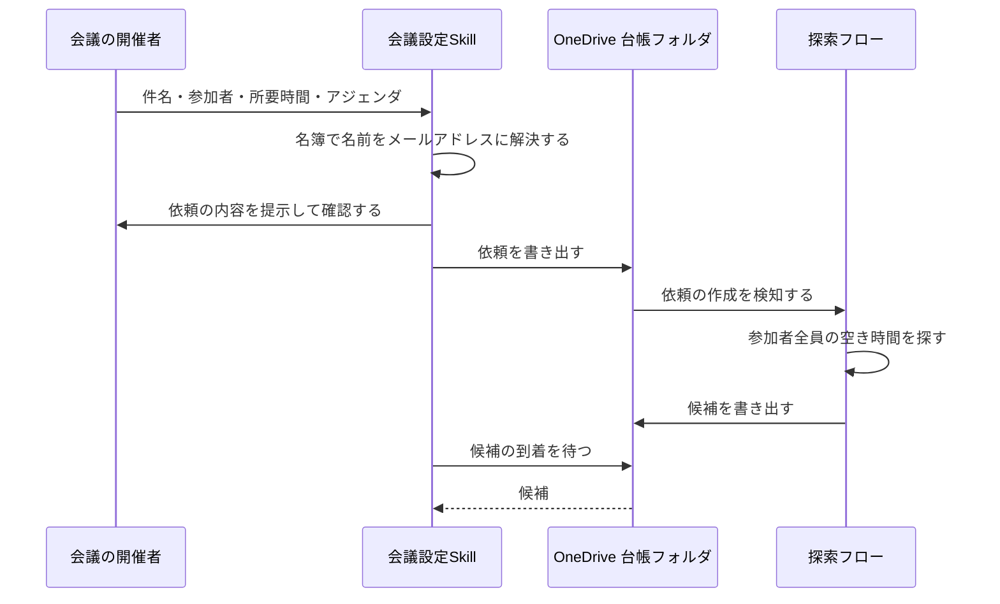
```mermaid
sequenceDiagram
    participant O as 会議の開催者
    participant S as 会議設定Skill
    participant D as OneDrive 台帳フォルダ
    participant F1 as 探索フロー

    O->>S: 件名・参加者・所要時間・アジェンダ
    S->>S: 名簿で名前をメールアドレスに解決する
    S->>O: 依頼の内容を提示して確認する
    S->>D: 依頼を書き出す
    D->>F1: 依頼の作成を検知する
    F1->>F1: 参加者全員の空き時間を探す
    F1->>D: 候補を書き出す
    S->>D: 候補の到着を待つ
    D-->>S: 候補
```

図はこの処理の俯瞰。手順の文章が正。候補が届いた後は[候補の絞り込みと選択画面の用意](#候補の絞り込みと選択画面の用意)。

詳細を開く

チャットで受けた件名・参加者・所要時間・アジェンダを名簿で解決し、確認のうえ依頼ファイルを書き出して探索フローを起動する。

- **対象**: チャットで受け取った1件の会議設定の依頼
- **手順**:
  1. 件名・参加者・所要時間・アジェンダを受け取る。探索の期間・時間帯・候補件数の指定があれば受け取り、指定のない項目には既定値(当日から2週間、9時30分から17時30分、対象は月曜から金曜、最大5件)を使う
  2. 参加者の名前をメンバー名簿でメールアドレスに解決する
     - **照合に使う表記**: 名簿の人ごとに、氏名のフルネーム・姓・名を照合用の表記として持つ。ローマ字表記を持つ人は、ローマ字のフルネームを「名 姓」と「姓 名」の両方の並びで持ち(3語以上ある場合は先頭の語と末尾の語だけで並びを作る)、ローマ字の姓・名も持つ(Outlookの表示名「姓, 名」は読点を落とすと「姓 名」の並びになる)。ローマ字表記が無い人・空白だけの人は氏名だけを持つ
     - **表記のゆれの吸収**: 比べる前に、名簿の表記と打たれた名前の両方から空白(全角・半角)と読点を落とし、全角の英数字を半角に揃え、大文字・小文字をそろえる
     - **照合の段**: 打たれたとおりの照合、敬称「さん」を外した照合、末尾の番号(半角・全角の数字の並び)を外した照合の順に見て、該当が見つかった最初の段で打ち切る。1つの段で外すのは敬称か番号のどちらか一方だけで、外すと空になる名前はその段を飛ばす
     - **該当者の数え方**: 同じ段では、フルネーム・姓・名・ローマ字のどれで該当した人もすべて該当者として数える。同じ人が複数の表記で該当しても1人と数える。同じ人を別の表記で複数回挙げても、出席者は1人にまとめる
     - **聞き返し**: 該当が1人に定まらない名前が1つでもある場合は、依頼を書き出さずに聞き返して終了する(部分的に解決できた分だけで先に進まない)。登録が無い名前はその旨を、複数人が該当する名前は該当者のフルネームとメールアドレスの一覧を示す。番号を外した段で複数人が該当した場合も、番号では絞らずに同じ一覧を示す
     - **解決後の扱い**: 解決できた参加者は、開催者が打った文字列ではなく名簿の氏名で以降扱う(確認の提示が入力の写しになっていると、姓だけの指定で別人に解決されても気づけないため)。番号を外した段で解決した参加者は、手順4の確認の提示で氏名にメールアドレスを添える(同姓同名の別人でないことを確かめられるようにするため)
  3. 依頼IDを作る。起動時刻と乱数から作り、同じ時刻に複数の依頼が立っても重ならない値にする(形式は [appendix.md](appendix.md) の「IDと日時の形式」)
  4. 依頼の内容(件名・参加者・所要時間・探索条件)をチャットに提示し、開催者の確認を得る。誤りがあればここで作り直す
  5. 依頼を依頼フォルダへ書き出す。アジェンダの原文と絞り込みの条件も依頼に含める(再開時に復元するため)。ファイル名には依頼IDと試行番号を含める。試行番号は初回が1で、代替案2の依頼が2になる(それ以上は増えない)
  6. 書き出しに失敗した場合(同期フォルダへ書けない場合)は、以降へ進まず失敗を伝えて終了する
  7. 候補ファイルの到着を待つ(待ち方は[往復の待ち合わせと打ち切り](#往復の待ち合わせと打ち切り))
- **関連するビジネスルール**: [requirements.md#候補探索の既定条件](requirements.md#候補探索の既定条件)、[requirements.md#参加者の解決](requirements.md#参加者の解決)、[requirements.md#台帳ファイルの扱い](requirements.md#台帳ファイルの扱い)

### 候補の絞り込みと選択画面の用意

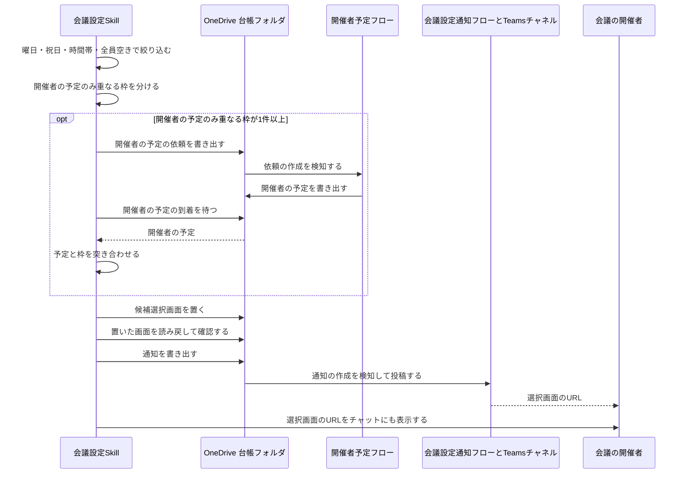
```mermaid
sequenceDiagram
    participant S as 会議設定Skill
    participant D as OneDrive 台帳フォルダ
    participant F3 as 開催者予定フロー
    participant N as 会議設定通知フローとTeamsチャネル
    participant O as 会議の開催者

    S->>S: 曜日・祝日・時間帯・全員空きで絞り込む
    S->>S: 開催者の予定のみ重なる枠を分ける
    opt 開催者の予定のみ重なる枠が1件以上
        S->>D: 開催者の予定の依頼を書き出す
        D->>F3: 依頼の作成を検知する
        F3->>D: 開催者の予定を書き出す
        S->>D: 開催者の予定の到着を待つ
        D-->>S: 開催者の予定
        S->>S: 予定と枠を突き合わせる
    end
    S->>D: 候補選択画面を置く
    S->>D: 置いた画面を読み戻して確認する
    S->>D: 通知を書き出す
    D->>N: 通知の作成を検知して投稿する
    N-->>O: 選択画面のURL
    S->>O: 選択画面のURLをチャットにも表示する
```

図はこの処理の俯瞰。手順の文章が正。開催者の予定の取得と突き合わせの中身は[開催者の予定のみ重なる枠の提示](#開催者の予定のみ重なる枠の提示)。

詳細を開く

届いた候補を依頼の条件で絞り込み、採用した枠と開催者の予定のみ重なる枠から選択画面を組み立てて、URLを通知とチャットで知らせる。

- **対象**: 探索フローが書き出した試行番号1の候補ファイル
- **手順**:
  1. 候補ファイルに失敗理由が入っている場合は、候補の絞り込みへ進まずその理由を伝えて終了する。ただし代替案2の候補ファイルの失敗は[候補が0件のときの代替案の提示](#候補が0件のときの代替案の提示)の手順5で扱い、ここでは終了させない
  2. 受け取った枠の開始・終了を日本時間に変換する。枠は世界標準時で届くため、この変換より前に日付・曜日・時間帯の判定を行わない
  3. 全員空きの判定は、出席者ごとの空き状況のすべてと開催者の空き状況の両方が「空き」であることとする。出席可能率では判定しない(下限を100%にしても、仮の予定が入った出席者や開催者を含む枠が返る)。仮の予定は空きとみなさない。開催者の空き状況は前後の空白を除き小文字に揃えた値で見て、`free`・`tentative` 以外(`busy`・`oof`・`workingElsewhere`・`unknown`)は「空きでも仮でもない」として扱う
  4. 受け取った枠を、この依頼の条件で絞り込む。枠の開始から終了までが指定の時間帯に収まらないものを除く。祝日にかかる枠を除く。対象とする曜日の指定がある場合はその曜日以外の枠を除き、指定がない場合は土曜・日曜の枠を除く。全員空きでない枠を除く(依頼時に一部不在の枠も含めるよう指示された場合はこの除外を行わない)。全員空きを求める依頼では、全員空きでない枠のうち「出席者全員が空きで、開催者だけが空き以外」の枠を除外せずに絞り込み結果の「開催者のみ不在」に分けて集める(`candidates.絞り込む` の結果の新しい項目。採用には入れない)
  5. 残った枠を開始時刻の早い順に並べ、既に採用した枠と時間の重なる枠を除き、先頭を上限件数まで採用する。同じ日に複数の枠が残ってもそのまま採用する。「開催者のみ不在」の枠も同じ並び順・同じ重複除外・同じ上限件数で揃える(採用した枠との重なりでは除かない。別の区画に出す枠だから)
  6. 「開催者のみ不在」の枠が1件以上あれば、[開催者の予定のみ重なる枠の提示](#開催者の予定のみ重なる枠の提示)の手順1〜2で開催者の予定の依頼を書き出す(すでにあれば書かない)
  7. 採用した枠が0件の場合は[候補が0件のときの代替案の提示](#候補が0件のときの代替案の提示)へ進む(開催者の予定の到着はそちらで代替案2と同時に待つ)
  8. 採用した枠が1件以上あり開催者の予定の依頼を書き出していれば、開催者の予定ファイルの到着を待つ(上限は候補の待ちと同じ)。届いたら、または待ち上限・失敗理由・書き出し失敗で取得できなければ、[開催者の予定のみ重なる枠の提示](#開催者の予定のみ重なる枠の提示)の手順4〜6で枠ごとの表示を作る
  9. 採用した枠の区画「候補」と、「開催者のみ不在」の枠があれば区画「開催者の予定のみ重なる枠(自分の予定を調整すれば開けられる枠)」をこの順で並べて候補選択画面(静的HTML)を組み立て、HTMLフォルダへ置く。ファイル名には依頼IDを含める。同じ依頼IDの画面が既にある場合は上書きする(再探索で候補が入れ替わったときに古い画面を残さない)
  10. 置いたHTMLを読み戻し、書いた内容と一致すること、続けて読んだときにサイズが変わらないことを確認する
  11. 同期の猶予時間(30秒)だけ待つ
  12. HTMLのビューア形式URLを組み立てる。ビューアのURLに付随するクエリは落とし、サーバー相対パスは一度デコードしてからエンコードする(エンコード済みの値を二重にエンコードしないため)
  13. 選択画面のURLと件名・候補件数を通知として通知フォルダへ書き出し、同じ内容をチャットにも表示する。代替案を提示する場合は、どちらの代替案によるものか、代替案1の枠の仮の予定を持つ参加者、代替案2の広げた後の条件も添える。開催者の予定のみ重なる枠がある場合は「開催者の予定のみ重なる枠: N件(自分の予定を調整すれば開けられる枠)」と枠ごとの1行を足す(文面は[開催者の予定のみ重なる枠の提示](#開催者の予定のみ重なる枠の提示)の手順7)。通知文には、開けない場合は数十秒待って再読込する旨を添える
  14. 通知の書き出しに失敗しても、チャットへのURL表示は行って選択の受け取りへ進む(通知だけの失敗で機能全体を止めない)
- **関連するビジネスルール**: [requirements.md#候補の提示](requirements.md#候補の提示)、[requirements.md#候補探索の既定条件](requirements.md#候補探索の既定条件)、[requirements.md#開催者の予定のみ重なる枠の提示](requirements.md#開催者の予定のみ重なる枠の提示)、[requirements.md#通知](requirements.md#通知)

### 開催者の予定のみ重なる枠の提示

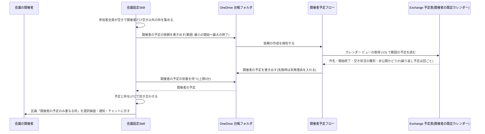
```mermaid
sequenceDiagram
    participant O as 会議の開催者
    participant S as 会議設定Skill
    participant D as OneDrive 台帳フォルダ
    participant F3 as 開催者予定フロー
    participant C as Exchange 予定表(開催者の既定カレンダー)

    S->>S: 参加者全員が空きで開催者だけ空き以外の枠を集める
    S->>D: 開催者の予定の依頼を書き出す(範囲: 最小の開始〜最大の終了)
    D->>F3: 依頼の作成を検知する
    F3->>C: カレンダー ビューの取得 (V3) で範囲の予定を読む
    C-->>F3: 件名・開始終了・空き状況の種別・非公開かどうか(繰り返し予定は回ごと)
    F3->>D: 開催者の予定を書き出す(失敗時は失敗理由を入れる)
    S->>D: 開催者の予定の到着を待つ(上限5分)
    D-->>S: 開催者の予定
    S->>S: 予定と枠をUTCで突き合わせる
    S->>O: 区画「開催者の予定のみ重なる枠」を選択画面・通知・チャットに示す
```

図はこの処理の俯瞰。手順の文章が正。待ちが上限を超えた・失敗理由が返った場合も、件名なしで枠を示す。

詳細を開く

参加者全員が空きで開催者だけが空き以外の枠について、開催者自身の予定を開催者予定フローで取り、枠と突き合わせて候補とは別の区画で選べるように示す。

- **対象**: 全員空きを求める依頼の、試行番号1の候補ファイルから分けた「開催者のみ不在」の枠(1件以上あるときだけ)。一部不在の枠も含めるよう指示された依頼では求めない(開催者の空き状況で枠を除外しないため、別に示す意味が無い)
- **手順**:
  1. 「開催者のみ不在」の枠の最小の開始と最大の終了をUTCに揃え、開催者の予定の依頼ファイル(依頼ID・範囲の開始と終了)を開催者の予定の依頼フォルダへ書き出す。同じ依頼IDの依頼ファイルが既にあれば書かない(取得は依頼1件につき1回)。書き出しに失敗した場合は理由を控え、手順4へ進む(枠の提示は止めない)
  2. 開催者予定フローは依頼の作成を検知し、「カレンダー ビューの取得 (V3)」で開催者自身の既定カレンダーを範囲で読む。繰り返し予定は回ごとに展開された状態で返る。予定ごとに件名・空き状況の種別(`showAs`)・非公開かどうか(`sensitivity`)・開始・終了だけを取り出し、開催者の予定ファイルとして開催者の予定フォルダへ書き出す。本文・出席者・場所は書き出さない。コネクタの呼び出しが失敗した場合も失敗理由を入れたファイルを書く。ファイル名は読んだ依頼の名前の `organizer-events-request-` を `organizer-events-` に置き換えて決める
  3. Skillは開催者の予定ファイルの到着を待つ(待ち方は[往復の待ち合わせと打ち切り](#往復の待ち合わせと打ち切り)、上限は候補の待ちと同じ)。候補が1件以上ある依頼では単独で待ち、候補が0件の依頼では代替案2の候補と同時に待つ([候補が0件のときの代替案の提示](#候補が0件のときの代替案の提示)の手順3〜4)。待ち上限を超えた・ファイルに失敗理由が入っていた場合は理由を控え、手順4へ進む
  4. 枠ごとの表示を作る。予定を取得できた場合は、予定と枠の両方をUTCに揃え、`予定.start < 枠.end かつ 予定.end > 枠.start` の予定をその枠に重なる予定とする。`showAs` が `free` の予定は示さない。重なる予定ごとに「<件名> HH:MM〜HH:MM(<種別>)」の行を開始時刻順に作る。時刻は日本時間で、枠の日と異なる日付にかかる予定は日付も添える。`sensitivity` が `private`・`confidential` の予定は件名の代わりに「非公開の予定」とする。種別は `tentative`→仮、`busy`→予約済み、`oof`→外出中、`workingElsewhere`→他の場所で作業中、それ以外→不明。重なる予定が1件も無い枠(空き状況だけが「不明」などで予定が無い場合)は「重なる予定は見つかりませんでした(空き状況: <開催者の空き状況の種別>)」とする
  5. 予定を取得できなかった場合(依頼を書き出せなかった・待ち上限を超えた・失敗理由が返った)は、件名の行の代わりに「開催者の予定を取得できませんでした(<理由>)」を枠ごとに添える。理由は「待ち上限(5分)を超えました」「開催者予定フローが失敗を返しました: <失敗理由>」「開催者の予定の依頼を書き出せませんでした: <エラー>」のいずれか
  6. 選択画面では、候補(代替案を提示するときは代替案1・代替案2)の区画の後ろに区画「開催者の予定のみ重なる枠(自分の予定を調整すれば開けられる枠)」を置く。カードには目印「⚠ 開催者の予定あり」のバッジと、手順4または5の行を並べる。ラジオボタンは候補と同じ `name="candidate"`、コピーする1行の書式も候補と同じで試行番号は1、候補番号は候補の区画から続く通し番号にする(書式は [appendix.md](appendix.md) の「選択結果のコピー1行の書式」)。選択後の流れは[選択結果の受け取りと会議の作成](#選択結果の受け取りと会議の作成)と同じで、突き合わせは試行番号1の候補ファイルに枠があるためそのまま通る。重なっている開催者の予定の変更・削除はこの機能では行わない
  7. 通知文とチャットの出力には「開催者の予定のみ重なる枠: N件(自分の予定を調整すれば開けられる枠)」と、枠ごとに「・MM/DD(曜) HH:MM〜HH:MM — <件名> HH:MM〜HH:MM(<種別>)」を1行ずつ足す(重なる予定が複数なら「、」で続ける)。取得できなかった場合は件名の代わりに手順5の理由を書く
  8. 同じ依頼IDで再開した場合は、台帳の有無から決める。「開催者のみ不在」の枠が無ければ何もしない。開催者の予定ファイルがあればそれを使う(取り直さない)。依頼ファイルがあって予定ファイルが無ければ手順3の待ちから再開する。どちらも無ければ手順1から行う
- **関連するビジネスルール**: [requirements.md#開催者の予定のみ重なる枠の提示](requirements.md#開催者の予定のみ重なる枠の提示)、[requirements.md#候補の提示](requirements.md#候補の提示)、[requirements.md#往復の待ち時間の上限](requirements.md#往復の待ち時間の上限)、[requirements.md#台帳ファイルの扱い](requirements.md#台帳ファイルの扱い)

### 候補が0件のときの代替案の提示

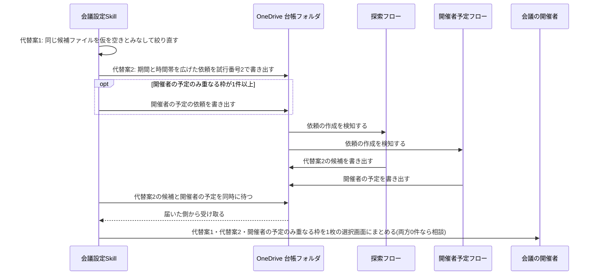
```mermaid
sequenceDiagram
    participant S as 会議設定Skill
    participant D as OneDrive 台帳フォルダ
    participant F1 as 探索フロー
    participant F3 as 開催者予定フロー
    participant O as 会議の開催者

    S->>S: 代替案1: 同じ候補ファイルを仮を空きとみなして絞り直す
    S->>D: 代替案2: 期間と時間帯を広げた依頼を試行番号2で書き出す
    opt 開催者の予定のみ重なる枠が1件以上
        S->>D: 開催者の予定の依頼を書き出す
    end
    D->>F1: 依頼の作成を検知する
    D->>F3: 依頼の作成を検知する
    F1->>D: 代替案2の候補を書き出す
    F3->>D: 開催者の予定を書き出す
    S->>D: 代替案2の候補と開催者の予定を同時に待つ
    D-->>S: 届いた側から受け取る
    S->>O: 代替案1・代替案2・開催者の予定のみ重なる枠を1枚の選択画面にまとめる(両方0件なら相談)
```

図はこの処理の俯瞰。手順の文章が正。片方の待ちが上限で打ち切られても、届いた側と手元の枠で提示を続ける。

詳細を開く

既定の条件で候補が0件なら、確認を挟まずに代替案1(仮の予定を含める)と代替案2(期間と時間帯を広げる)を調べ、開催者の予定と同時に待って1枚の選択画面にまとめる。

- **対象**: 既定の条件での絞り込みの結果が0件だった依頼
- **手順**:
  1. 2つの代替案を同時に走らせる。開催者への確認は挟まない
  2. **代替案1(仮の予定を含める)**: いま手元にある同じ候補ファイルを、仮の予定を空きとみなす条件で[候補の絞り込みと選択画面の用意](#候補の絞り込みと選択画面の用意)の手順4から絞り直す。期間・時間帯・曜日は変えない。探索の依頼は出し直さない(仮かどうかは候補ファイルの空き状況に入っているため)。代替案1に入れるのは仮の予定が入っている参加者(開催者自身を含む)が1人以上いる枠で、出席者全員が空きで開催者だけが空き以外の枠は代替案1に含めない(その枠は開催者の予定のみ重なる枠の区画に出す。同じ枠を2つの区画に出さない)
  3. **代替案2(期間と時間帯を広げる)**: 期間を当日から3週間、時間帯を9時30分から18時30分に広げた依頼を試行番号2で書き出す。開催者が明示的に指定した項目は広げない。広げられる項目が1つもない場合は代替案2を作らない。続けて、「開催者のみ不在」の枠が1件以上あれば開催者の予定の依頼を書き出す(すでにあれば書かない。[開催者の予定のみ重なる枠の提示](#開催者の予定のみ重なる枠の提示)の手順1)
  4. 代替案2の候補ファイルと開催者の予定ファイルを `wait_for_all` で同時に待つ。待ちごとに候補の待ちと同じ上限を適用し、片方が打ち切られてももう片方は上限まで待つ。代替案1は手元の候補ファイルの絞り直しなので待ちは要らない
  5. 代替案2が得られなかった場合は、代替案1の枠(と開催者の予定のみ重なる枠)を提示し、代替案2はその理由を添えて伝える。「得られなかった」には、待ち上限を超えた場合・結果ファイルに失敗理由が入っていた場合・依頼を書き出せなかった場合を含める。代替案2の候補ファイルに失敗理由が入っていた場合も、[候補の絞り込みと選択画面の用意](#候補の絞り込みと選択画面の用意)の手順1の一般則(失敗理由があれば終了する)には従わず、手元にある枠の提示を続ける。開催者の予定が得られなかった場合は、件名なしで枠を提示して理由を添える([開催者の予定のみ重なる枠の提示](#開催者の予定のみ重なる枠の提示)の手順5)
  6. 代替案の依頼と開催者の予定の依頼は既定の依頼から間を置かずに続くため、フォルダ監視トリガーの検知間隔が絞られて往復が伸び、待ち上限を超えて打ち切られることがある。これを異常として扱わず、打ち切りとして伝えて依頼IDでの再開に委ねる
  7. 代替案1の枠・代替案2の枠・開催者の予定のみ重なる枠をこの順の区画で1枚の選択画面にまとめ、どちらの代替案によるものか、代替案1の枠には仮の予定を持つ参加者、代替案2の枠には広げた後の条件、開催者の予定のみ重なる枠には重なる予定の行を添えて示す
  8. 代替案1が0件で、かつ受け取った枠の件数が依頼で要求した最大件数と同数だった場合は、応答が件数で打ち切られている可能性も併せて伝える
  9. 両方の代替案とも0件で、開催者の予定のみ重なる枠が1件以上ある場合は、その区画だけの選択画面を用意してURLを通知とチャットで知らせ、あわせて手順10の相談の文面(試した条件・広げなかった項目・参加者・期間・所要時間のどれを緩めるか)も伝える
  10. 両方の代替案とも0件で、開催者の予定のみ重なる枠も無い場合は、候補が見つからないことと試した条件(代替案2を作らなかった場合は既定と代替案1の2通り、作った場合は3通り)、広げなかった項目(開催者が指定したため広げなかったこと)を挙げて、参加者・期間・所要時間のどれを緩めるかを開催者に相談して終了する
  11. 代替案の候補からさらに自動で条件を緩めない
  12. どこまで進んだかを別に記録しない。代替案を提示したかどうかは、試行番号2の依頼があるかで判定する([データ設計(台帳ファイル)](#データ設計台帳ファイル))
  13. 代替案の台帳がある依頼を依頼IDを指定して再開した場合は、通常の絞り込みへ進まず「代替案の提示済み」として手順7から入り、代替案1と代替案2の両方を絞り直して1枚の選択画面にまとめ直す([状態管理](#状態管理))。試行番号2の候補だけを絞り込んで代替案1の枠を落とさない。開催者の予定は[開催者の予定のみ重なる枠の提示](#開催者の予定のみ重なる枠の提示)の手順8に従って使う・待つ・何もしないを決める
- **関連するビジネスルール**: [requirements.md#候補が0件のときの代替案の提示](requirements.md#候補が0件のときの代替案の提示)、[requirements.md#候補の提示](requirements.md#候補の提示)、[requirements.md#開催者の予定のみ重なる枠の提示](requirements.md#開催者の予定のみ重なる枠の提示)、[requirements.md#往復の待ち合わせ](requirements.md#往復の待ち合わせ)

### 選択結果の受け取りと会議の作成

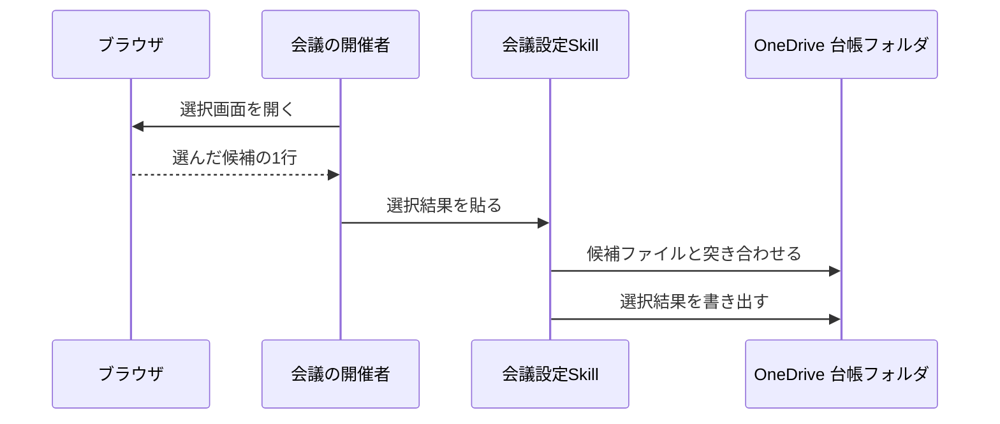
```mermaid
sequenceDiagram
    participant B as ブラウザ
    participant O as 会議の開催者
    participant S as 会議設定Skill
    participant D as OneDrive 台帳フォルダ

    O->>B: 選択画面を開く
    B-->>O: 選んだ候補の1行
    O->>S: 選択結果を貼る
    S->>D: 候補ファイルと突き合わせる
    S->>D: 選択結果を書き出す
```

候補の選択から選択結果の書き出しまで(手順1〜5)。開催者の予定のみ重なる枠を選んだ場合も同じ流れ。

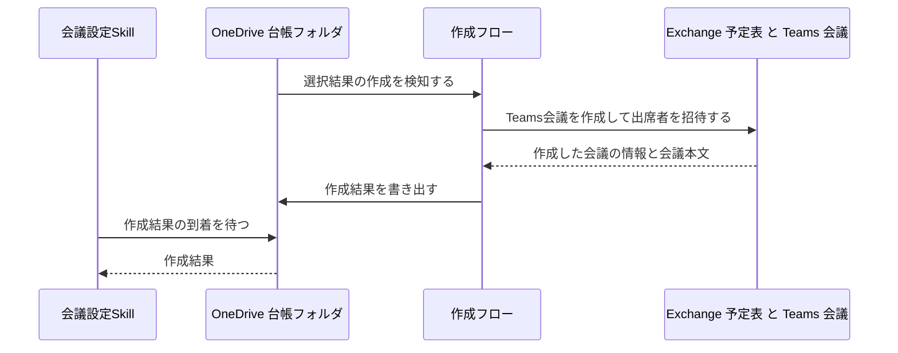
```mermaid
sequenceDiagram
    participant S as 会議設定Skill
    participant D as OneDrive 台帳フォルダ
    participant F2 as 作成フロー
    participant C as Exchange 予定表 と Teams 会議

    D->>F2: 選択結果の作成を検知する
    F2->>C: Teams会議を作成して出席者を招待する
    C-->>F2: 作成した会議の情報と会議本文
    F2->>D: 作成結果を書き出す
    S->>D: 作成結果の到着を待つ
    D-->>S: 作成結果
```

会議の作成(手順6〜7)。失敗したときは[会議の作成が失敗したときの再試行](#会議の作成が失敗したときの再試行)。

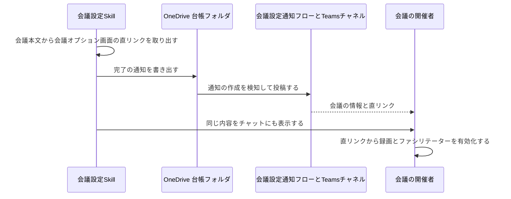
```mermaid
sequenceDiagram
    participant S as 会議設定Skill
    participant D as OneDrive 台帳フォルダ
    participant N as 会議設定通知フローとTeamsチャネル
    participant O as 会議の開催者

    S->>S: 会議本文から会議オプション画面の直リンクを取り出す
    S->>D: 完了の通知を書き出す
    D->>N: 通知の作成を検知して投稿する
    N-->>O: 会議の情報と直リンク
    S->>O: 同じ内容をチャットにも表示する
    O->>O: 直リンクから録画とファシリテーターを有効化する
```

完了の通知(手順8〜9)。手順の文章が正。

詳細を開く

貼られた1行を候補ファイルと突き合わせて選択結果を書き出し、作成フローの作成結果から参加URLと直リンクを取り出して完了を通知する。

- **対象**: 開催者がチャットに貼った選択結果の1行
- **手順**:
  1. 貼られた内容から、目印の語・依頼ID・試行番号・候補番号・開始時刻・終了時刻を読み取る(書式は [appendix.md](appendix.md) の「選択結果のコピー1行の書式」)。読み取れない場合は選択結果を書き出さず、選択画面のコピー内容をそのまま貼ってほしい旨を伝えて聞き返す
  2. 読み取った依頼IDと試行番号の候補ファイルを開き、貼られた開始時刻・終了時刻と一致する枠がその中に1つ存在することを確認する。候補ファイルの枠は世界標準時で届き、貼られた時刻は日本時間なので、文字列ではなく時点として比較する(候補ファイルの枠を日本時間に変換してから突き合わせる)。空き状況は見ないため、開催者の予定のみ重なる枠(試行番号1)もこの突き合わせを通る。存在しない場合は書き出さずに聞き返す(古い画面や別の依頼の内容を貼った場合に取り違えないため)。候補番号は選択画面上の並び順を表す表示用の番号なので突き合わせには使わない。これにより、絞り込みを再現しなくても貼られた内容を検証できる
  3. その依頼IDの選択結果ファイルが既にある場合は、新しく書き出さない。作成に成功した作成結果が既にあれば作成済みの内容をそのまま伝え、失敗した作成結果があれば[会議の作成が失敗したときの再試行](#会議の作成が失敗したときの再試行)へ進み、作成結果がまだ無ければ作成結果の待ちへ進む
  4. 依頼ファイルからアジェンダの原文を読み、見出しと箇条書きのHTMLに整形する(打ち切り後に別のセッションで再開した場合も、ここで依頼時のアジェンダを復元できる)
  5. 選択結果ファイルを選択結果フォルダへ書き出す。件名・開始終了時刻・必須出席者・整形したアジェンダ本文・オンライン会議として作ることの指定を含め、これ単体で会議を作れる内容にする。物理会議室(リソース)は含めない
  6. 作成フローが書き出す作成結果ファイルの到着を待つ
  7. 作成結果に失敗理由が入っている場合は、[会議の作成が失敗したときの再試行](#会議の作成が失敗したときの再試行)へ進む(完了として報告しない)
  8. 作成結果から、会議の日時・出席者・参加URLを取り出す。会議本文から会議オプション画面の直リンクを取り出す
  9. 会議の日時・出席者・参加URL・会議オプション画面の直リンクと、録画とファシリテーターは直リンクから開催者が手動で有効化する必要がある旨を通知として書き出し、同じ内容をチャットにも表示する
- **関連するビジネスルール**: [requirements.md#候補の選択](requirements.md#候補の選択)、[requirements.md#会議の作成](requirements.md#会議の作成)、[requirements.md#会議の作成内容](requirements.md#会議の作成内容)、[requirements.md#録画とファシリテーターの設定](requirements.md#録画とファシリテーターの設定)、[requirements.md#完了の通知](requirements.md#完了の通知)

### 会議の作成が失敗したときの再試行

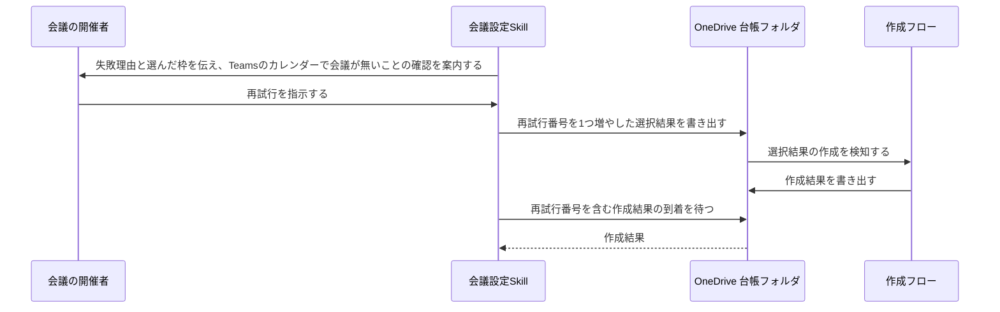
```mermaid
sequenceDiagram
    participant O as 会議の開催者
    participant S as 会議設定Skill
    participant D as OneDrive 台帳フォルダ
    participant F2 as 作成フロー

    S->>O: 失敗理由と選んだ枠を伝え、Teamsのカレンダーで会議が無いことの確認を案内する
    O->>S: 再試行を指示する
    S->>D: 再試行番号を1つ増やした選択結果を書き出す
    D->>F2: 選択結果の作成を検知する
    F2->>D: 作成結果を書き出す
    S->>D: 再試行番号を含む作成結果の到着を待つ
    D-->>S: 作成結果
```

図はこの処理の俯瞰。手順の文章が正。再試行は開催者の指示があったときだけ行う。

詳細を開く

失敗理由が入った作成結果がある依頼について、開催者の指示があったときに限り同じ内容の選択結果を再試行番号を増やして書き出し、作成フローを改めて発火させる。

- **対象**: 失敗理由が入った作成結果がある依頼
- **手順**:
  1. 失敗理由と、選んだ枠の開始・終了をそのまま伝える。完了としては報告しない
  2. 作成の途中で失敗した場合は会議が実際には作られていることがあるため、Teamsのカレンダーでその枠に会議が無いことを確かめてから再試行するよう案内する
  3. 開催者が再試行を指示した場合に限り、再試行番号を1つ増やした選択結果を書き出す。内容は前回と同じにする。ファイル名に再試行番号を含めるため、作成フローのトリガー(新しいファイルの作成)が改めて発火する
  4. 再試行番号を含む作成結果の到着を待ち、以降は[選択結果の受け取りと会議の作成](#選択結果の受け取りと会議の作成)の手順8以降と同じに進む
  5. 再試行は自動では行わない。何度失敗しても、そのたびに開催者の指示を待つ
- **関連するビジネスルール**: [requirements.md#会議の作成](requirements.md#会議の作成)、[requirements.md#候補の選択](requirements.md#候補の選択)

### 往復の待ち合わせと打ち切り

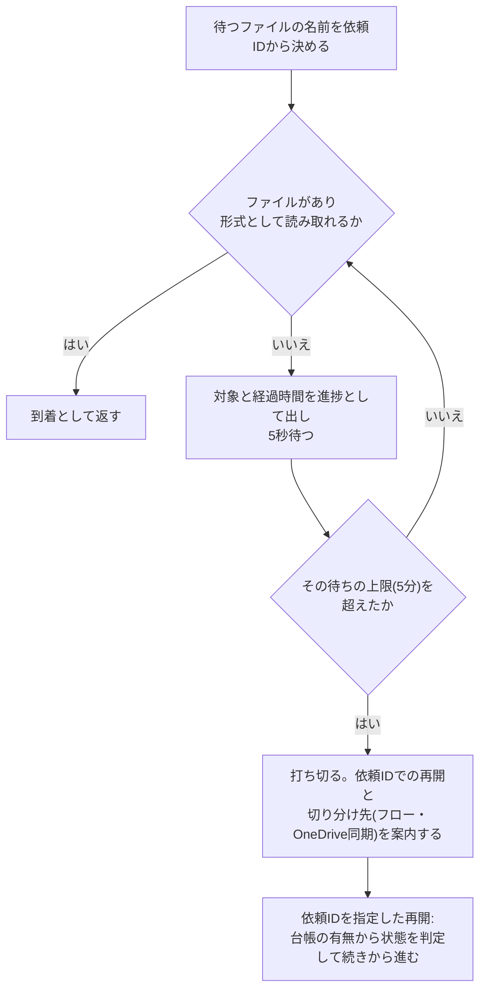
```mermaid
flowchart TD
    A["待つファイルの名前を依頼IDから決める"] --> B{"ファイルがあり<br>形式として読み取れるか"}
    B -- はい --> C["到着として返す"]
    B -- いいえ --> D["対象と経過時間を進捗として出し<br>5秒待つ"]
    D --> E{"その待ちの上限(5分)を<br>超えたか"}
    E -- いいえ --> B
    E -- はい --> F["打ち切る。依頼IDでの再開と<br>切り分け先(フロー・OneDrive同期)を案内する"]
    F --> G["依頼IDを指定した再開:<br>台帳の有無から状態を判定して続きから進む"]
```

図はこの処理の俯瞰。手順の文章が正。複数のファイルを同時に待つときは待ちごとにこの判定を回す。

詳細を開く

依頼IDから名前が決まるファイルの出現を一定間隔で確かめ、上限を超えたら台帳を残したまま打ち切って依頼IDでの再開に委ねる。

- **対象**: 候補ファイル(試行番号1・2)の到着待ち、開催者の予定ファイルの到着待ち、作成結果ファイルの到着待ち
- **手順**:
  1. 待つ相手のファイルは依頼IDから名前が決まるため、フォルダの一覧は取らず、その名前のファイルがあるかどうかだけを繰り返し確かめる(同期フォルダは一覧の取得が許可されないことがあるため)
  2. 一定間隔(5秒)で確認し、待っている対象と経過時間を進捗として出す
  3. 現れたファイルは、内容が読めて完全に書かれていること(想定の形式として読み取れること)まで確認する。読み取れない場合は書き込み中とみなして待ち続ける
  4. その待ちの上限(候補の待ちと作成結果の待ちで別々に持ち、いずれも5分。代替案2の候補の待ちと開催者の予定の待ちには候補の待ちの上限を適用する)を超えたら待ちを打ち切る。打ち切ったことと、依頼IDを指定して再度起動すれば続きから再開できること、フロー側の異常のほかにOneDrive同期が止まっている可能性も切り分け先になることを伝えて終了する
  5. 複数のファイルを同時に待つとき(`wait_for_all`。代替案2の候補と開催者の予定)は、待ちごとに別々の上限を適用し、片方が打ち切られてももう片方は上限まで待ち続ける。届いた側の結果は打ち切られた側の有無に関わらず使う
  6. 開催者の予定の待ちが打ち切られても依頼全体は終了せず、件名なしで枠を提示して進む([開催者の予定のみ重なる枠の提示](#開催者の予定のみ重なる枠の提示)の手順5)。候補・作成結果の待ちの打ち切りは依頼を終了させる
  7. 依頼IDを指定して起動された場合は、その依頼IDの台帳ファイルの有無から進行状態を判定し、その続きから再開する(判定は[状態管理](#状態管理))
- **関連するビジネスルール**: [requirements.md#往復の待ち合わせ](requirements.md#往復の待ち合わせ)、[requirements.md#往復の待ち時間の上限](requirements.md#往復の待ち時間の上限)

## バリデーション

参加者は名簿で一人に定まること、所要時間・探索期間・時間帯・候補件数は受け付け条件の範囲にあること、貼られた選択結果は候補ファイルの枠と一致すること。NGなら台帳ファイルを書き出さず聞き返す 〔合意〕

詳細を開く

- **参加者**: 名簿で一人に定まること。定まらない名前が1つでもあれば依頼を書き出さず、複数人が該当する場合はその一覧を示す
- **所要時間**: 5分以上、かつ1日の時間帯の長さに収まること
- **探索期間**: 開始日が終了日以前であること。開始日は当日以降であること。終了日は当日から3週間以内であること
- **時間帯**: 開始時刻が終了時刻より前で、その差が所要時間以上あること
- **候補件数**: 1件以上であること
- **アジェンダ**: 指定は任意。指定が無くても不正としない
- **貼られた選択結果**: 目印の語・依頼ID・試行番号・候補番号・開始終了時刻がすべて読み取れ、候補ファイルの内容と一致すること。空き状況は見ない(開催者の予定のみ重なる枠も同じ検証で通る)
- **開催者の予定ファイル**: `requestId` が依頼IDと一致し、`events` が配列として読めること。読めない場合は「まだ来ていない」として待ち続け、`error` が空でなければ取得失敗として扱う。予定ごとの `showAs`・`sensitivity` が知らない値のときは種別「不明」・件名そのまま(非公開扱いにしない)として読む

いずれもNGの場合は台帳ファイルを書き出さず、何がNGだったかを伝えて聞き返す。境界の値とその根拠は [requirements.md#依頼内容の受け付け条件](requirements.md#依頼内容の受け付け条件) が正。

## エラーハンドリング

フローの失敗は結果ファイルの失敗理由で検知して理由を伝えて終了し、同期フォルダへの書き込み失敗はそこで止める。待ち上限の打ち切りは失敗ではなく、台帳を残して依頼IDで再開する 〔合意〕

開催者の予定だけは例外で、依頼を書き出せない・待ち上限を超える・失敗理由が返るのいずれでも、件名なしで枠を提示して選択画面の提示を止めない 〔提案〕

詳細を開く

- **フローは失敗しても結果ファイルを書く。** 探索フロー・開催者予定フロー・作成フローは、コネクタの呼び出しが失敗した場合も失敗理由を入れた結果ファイルを書き出す。Skillは試行番号1の候補と作成結果に失敗理由があればその時点で理由を伝えて終了する(待ち上限まで待たされない)。代替案2の候補と開催者の予定の失敗は独立して扱い、手元にある枠の提示を止めない
- **同期フォルダへの書き込み失敗はそこで止める。** 依頼・選択結果・HTMLの書き出しに失敗したら次の手順へ進まない。例外は3つ。代替案2の依頼の書き出し失敗は代替案1の枠(と開催者の予定のみ重なる枠)だけを提示して、代替案2は書き出せなかった旨を伝える。開催者の予定の依頼の書き出し失敗は件名なしで枠を提示して理由を添える。通知の書き出し失敗はチャットへの表示を行って処理を続ける(通知はOneDrive同期とフローに依存するため、そこが止まっても機能全体を使えなくしない)
- **同期フォルダの読み取り失敗は「まだ来ていない」として扱う。** 台帳ファイルが読めない・途中まで書かれている場合は失敗とせず待ちを続け、待ち上限で打ち切る
- **開催者の予定を取得できないとき。** 待ち上限を超えた・結果に失敗理由が入っていた・依頼を書き出せなかったのいずれも、枠は提示し、カードと通知に「開催者の予定を取得できませんでした(<理由>)」を添える。依頼全体の打ち切りにはしない。候補が0件の依頼で代替案2と同時に待っていた場合も、代替案2の結果とは独立に扱う
- **会議オプション画面の直リンクが取り出せない場合。** 作成結果の会議本文にそれらしいURLが見つからない場合は、通知に「直リンクを取り出せなかったこと」と「Teamsのカレンダーから会議を開いて会議オプションを開く手順」を書く。会議自体は作成できているため、失敗としては扱わない
- **作成の失敗を完了と区別する。** 作成結果に失敗理由が入っている場合は「作成失敗」として扱い、完了として報告しない。失敗理由を伝えたうえで、開催者の指示があったときだけ再試行する([会議の作成が失敗したときの再試行](#会議の作成が失敗したときの再試行))
- **二重の会議作成を防ぐ。** 選択結果ファイルは1つの再試行番号につき1回しか書き出さない。作成に成功した作成結果ファイルがある依頼IDについては選択結果を書き出さず、作成済みの内容を伝える。再試行番号を増やして書き出すのは、失敗した作成結果があり、かつ開催者が再試行を指示した場合だけにする
- **打ち切りは失敗ではない。** 待ち上限を超えた場合、台帳ファイルは削除も書き換えもせず残し、依頼IDを指定した再起動で続きから再開できる状態にしておく。開催者の予定の依頼ファイルも残し、再開時に予定ファイルがあればそれを使い、無ければ待ちから再開する
- **想定外の例外**は経過をそのまま出して終了する。台帳ファイルは残るため、同じ依頼IDでの再開が可能な状態を壊さない

## 関連するファイル(抜粋)

SKILL.md は `~/.claude/skills/meeting-setup/` に置き、処理・テンプレート・テストは study リポジトリのアプリ配下に置く。開催者の予定の依頼・読み取り・突き合わせは `organizer_events.py` が持ち、絞り込み・流れ・画面・通知・設定の各モジュールが開催者の予定のみ重なる枠を扱う 〔提案〕

詳細を開く

チャット向けの手順(SKILL.md)は `~/.claude/skills/` に置き、処理・テンプレート・テストはstudyリポジトリのアプリ配下に置いて絶対パスで呼び出す(`night-batch`・`extend-teams-automation` と同じ形)。

- `~/.claude/skills/meeting-setup/SKILL.md` — チャットから起動する手順(studyリポジトリ外)
- `apps/meeting-setup-automation/application/main.py` — コマンドの入口。依頼の書き出し・再開・選択結果の受け取り・作成の再試行をサブコマンドとして持つ。候補の処理では開催者の予定の依頼の書き出し・到着待ち・代替案2との同時待ちの流れを持つ
- `apps/meeting-setup-automation/application/config.py` — 台帳フォルダ(開催者の予定の依頼・開催者の予定の2つを含む)・通知フォルダ・HTMLフォルダのパス、ビューアURL、待ち上限・確認間隔・同期猶予、既定の探索条件(値は [appendix.md](appendix.md) の「設定値の一覧」)
- `apps/meeting-setup-automation/application/ledger.py` — 台帳ファイルの名前の決め方(開催者の予定の依頼・開催者の予定を含む)とJSONの読み書き
- `apps/meeting-setup-automation/application/roster.py` — メンバー名簿の読み込みと名前の解決
- `apps/meeting-setup-automation/application/holidays_jp.py` — 日本の祝日の固定テーブル(`retro-check` と同じ方式。標準ライブラリのみ)
- `apps/meeting-setup-automation/application/request.py` — 依頼IDの生成、依頼の組み立てと書き出し、候補が0件のときの代替案の組み立て(代替案1は開催者だけが空き以外の枠を除く)
- `apps/meeting-setup-automation/application/wait_for.py` — 台帳ファイルの到着待ちと進捗の出力。複数のファイルを同時に待つ `wait_for_all`
- `apps/meeting-setup-automation/application/candidates.py` — 候補の絞り込み(曜日・祝日・時間帯・全員空き・重複除外)。絞り込み結果に「開催者のみ不在」の枠を分けて持つ
- `apps/meeting-setup-automation/application/organizer_events.py` — 開催者の予定の依頼(範囲の算出と書き出し)、開催者の予定ファイルの読み取り、予定と枠の突き合わせと表示の行の組み立て、取得できなかったときの理由の文
- `apps/meeting-setup-automation/application/select_html.py` — 候補選択画面の組み立て(区画の並び・開催者の予定ありの目印と予定の行)とビューアURLの組み立て
- `apps/meeting-setup-automation/application/selection.py` — 貼られた選択結果の読み取り・突き合わせ・選択結果ファイルの書き出し
- `apps/meeting-setup-automation/application/result.py` — 作成結果の読み取りと会議オプション画面の直リンクの取り出し
- `apps/meeting-setup-automation/application/notify.py` — 通知文の組み立て(開催者の予定のみ重なる枠の件数と枠ごとの行を含む)と通知フォルダへの書き出し
- `apps/meeting-setup-automation/application/progress.py` — 依頼IDから進行状態を判定する
- `apps/meeting-setup-automation/application/templates/select.html` — 候補選択画面のテンプレート
- `apps/meeting-setup-automation/application/power-automate/README.md` — 探索フロー・開催者予定フロー・作成フロー・会議設定通知フローの構築手順、設定内容、構築でつまずく点
- `apps/meeting-setup-automation/application/roster.example.json` — メンバー名簿の記入例(実体はGit管理外)
- `apps/meeting-setup-automation/application/tests/` — 単体テスト(unittest)
- `apps/meeting-setup-automation/README.md` — セットアップ・運用手順

既存で使うもの:

- `~/.claude/skills/teams-post/scripts/run.py` — 通知の投稿(投稿先を表示名で指定して呼ぶ)
- `~/.claude/config/project-profiles.json` — 投稿先「会議設定通知」の登録先(最上位の `user.teams.destinations`)
- `~/Library/Application Support/meeting-setup-automation/roster.json` — メンバー名簿の実体(Git管理外)

### 手順の担い手

チャットでのやり取りはSKILL.mdの手順が担い、ファイルの読み書きと判定は `main.py` のサブコマンドが担う。どちらが担うかを決めておかないと、同期の猶予待ちやチャットへの提示のような「どちらでもできる手順」が実装から抜け落ちる。手順とサブコマンドの対応表は [appendix.md](appendix.md) の「サブコマンドの表(手順の担い手)」を参照。

`main.py resume` は依頼IDだけを受け取り、[状態管理](#状態管理)の判定に従ってその依頼の続きを進める。打ち切った後の再開も、依頼の直後の待ちも同じサブコマンドで行う。開催者の予定の依頼・待ち・突き合わせも `resume` の中で行い、SKILL.md は相談の文面と選択画面のURLをチャットに伝える。判定が「作成失敗」だった場合は、完了として報告せず失敗理由と再試行の案内を出して終わり、再試行そのものは `retry-create` に委ねる。

## データ設計(台帳ファイル)

> 読み手: AI

DBは使わずOneDrive上の8種類のファイル(依頼・候補・開催者の予定の依頼・開催者の予定・選択結果・作成結果・候補選択画面・通知)を台帳とし、用途ごとにフォルダを分けて同じファイルをSkillとPower Automateの双方から書かない 〔合意〕

開催者の予定の依頼と開催者の予定は依頼1件につき1ファイルで、開催者予定フローが「カレンダー ビューの取得 (V3)」で読んだ件名・時刻・種別・非公開かどうかだけを持つ。4本のフローはいずれも読んだファイル名の先頭を置き換えて書き出す名前を決める 〔提案〕

詳細を開く

フォルダ・ファイル名・IDと日時の形式・各ファイルのJSONの形・通知ファイルのHTML断片は [appendix.md](appendix.md) の「台帳ファイルの書式」を参照。ここでは各ファイルの役割と持つ内容を定める。

- ファイル名には依頼IDを含め、1件の依頼に属するファイルを対応付ける。試行番号は初回が1で代替案2の依頼が2(それ以上は増えない)、再試行番号は初回の作成が0で会議の作成をやり直すたびに1増える
- **フローが書き出すファイルの名前は、読んだファイルの名前の先頭を置き換えて決める。** 探索フローは `request-` を `candidates-` に、開催者予定フローは `organizer-events-request-` を `organizer-events-` に、作成フローは `selection-` を `result-` に置き換える。フローは番号を解釈せず、名前を組み立てる判断はSkill側だけが持つ
- 選択結果のファイル名を決めるのはSkillで、再試行番号が0のときは接尾辞を付けず、1以上のときだけ `-r<再試行番号>` を付ける
- Skillが書く日時はISO 8601形式で日本時間のオフセット付き。開催者の予定の依頼の範囲だけはUTC(フローがそのままコネクタに渡すため)
- **通知ファイルの中身はHTML断片で書く。** 会議設定通知フローは中身をそのままTeamsの投稿本文に渡し、Teamsは本文をHTMLとして描画する。チャットに出す文は同じ内容をプレーンテキストのまま出す
- 作成結果まで到達した依頼のファイルは削除しない。開催者の予定の依頼・開催者の予定も削除しない

### 依頼ファイルの区分

- **依頼の識別** — 依頼IDと試行番号
- **会議の内容** — 件名・所要時間・必須出席者のメールアドレス・アジェンダの原文
- **探索の指示(フローが読む)** — 探索期間の開始と終了、出席可能率の下限、返してほしい枠の最大件数
- **絞り込みの条件(Skillだけが読む)** — 時間帯の開始と終了、対象とする曜日(既定は月曜から金曜)、全員空きを求めるかどうか、最終的に提示する候補の上限件数。祝日は常に除くため項目として持たない
- **開催者が指定した項目(Skillだけが読む)** — 期間・時間帯・候補件数・曜日・全員空きのうち、開催者が明示的に指定したものの一覧

「開催者が指定した項目」を持つのは、候補が0件のときの自動の緩和を開催者の指定に作用させないため([候補が0件のときの代替案の提示](#候補が0件のときの代替案の提示))。既定値と同じ値を開催者が明示的に指定した場合も指定として扱うため、値の比較では区別できない。

どこまで進んだかは別に持たない。判断は台帳ファイルの有無と試行番号から導く。

- **代替案をすでに提示したか** — 試行番号2の依頼ファイルがあるかどうか
- **代替案2を作れるか** — 開催者が指定した項目に探索期間と時間帯のどちらかが含まれていないこと。両方が指定されていれば代替案2は作らない
- **ある枠が代替案1のものか代替案2のものか** — その枠が試行番号1の候補ファイルにあるか、試行番号2の候補ファイルにあるか
- **開催者の予定を取得済みか** — 開催者の予定ファイルがあるかどうか。依頼ファイルだけがあれば到着待ちの途中

代替案1は依頼を出し直さないため、試行番号1の候補ファイルを絞り直した結果になる。同じ候補ファイルを同じ条件で絞り直すので、打ち切った後に別のセッションで再開しても同じ枠・同じ表示になる。開催者の予定のみ重なる枠も試行番号1の候補ファイルから分けるため同じ。

**全員空きを求めるかどうかは、探索の指示と絞り込みの条件の両方に反映する。** 出席可能率の下限を100%のままにすると一部不在の枠はフローから返ってこないため、全員空きを求めない指示を受けた場合は下限を下げて依頼に書く(既定は100%)。絞り込み側だけを緩めても候補は増えない。

探索のコネクタは1つの期間しか受け取れないため、フローには上限件数より多めの枠を返させ、絞り込みの条件はSkillが持つ。絞り込みの条件とアジェンダの原文を依頼ファイルに書いておくことで、待ちを打ち切った後に別のセッションで再開しても、同じ条件で絞り込み、依頼時のアジェンダを会議本文に入れられる(別の状態ファイルを持たない)。探索フローはアジェンダを読まない。

### 候補ファイルの区分

- **依頼の識別** — 依頼IDと試行番号
- **枠の一覧** — 枠ごとの開始・終了、出席可能率、出席者ごとの空き状況、開催者の空き状況
- **枠が無かった理由** — コネクタが枠を返さなかった場合にその理由
- **失敗理由** — フローの処理が失敗した場合にその内容(正常時は空)

枠の開始・終了は世界標準時で届く。開催者の空き状況は出席者ごとの空き状況には含まれず、別の項目として届く。時刻の変換と全員空きの判定、「開催者のみ不在」の枠の分離はいずれもSkill側で行う([候補の絞り込みと選択画面の用意](#候補の絞り込みと選択画面の用意))。開催者の空き状況の値は `free`・`tentative`・`busy`・`oof`・`workingElsewhere`・`unknown` で、`free` 以外はすべて「開催者だけが空き以外」の判定に当たる。

### 開催者の予定の依頼ファイルの区分

- **依頼の識別** — 依頼ID(試行番号は持たない。依頼1件につき1ファイル)
- **取得する範囲(フローが読む)** — 範囲の開始と終了(UTC)。開催者の予定のみ重なる枠の最小の開始から最大の終了まで

書くのはSkillで、全員空きを求める依頼で「開催者のみ不在」の枠が1件以上あるときだけ。同じ依頼IDのファイルが既にあれば書かない。フローは依頼IDと範囲以外を読まない。

### 開催者の予定ファイルの区分

- **依頼の識別** — 依頼ID(依頼ファイルから引き継ぐ)
- **予定の一覧** — 予定ごとの件名、空き状況の種別(`showAs`)、非公開かどうか(`sensitivity`)、開始・終了(UTC)。繰り返し予定は回ごとに展開された状態で入る
- **失敗理由** — フローの処理が失敗した場合にその内容(正常時は空)

書くのは開催者予定フローで、「カレンダー ビューの取得 (V3)」の応答から上の項目だけを写す。本文・出席者・場所・会議の参加URLは書かない(Skillも読まない)。Skillは `showAs` が `free` の予定を表示から外し、`sensitivity` が `private`・`confidential` の予定は件名を「非公開の予定」に置き換える。開催者の予定の依頼ファイルがあってこのファイルが無い状態が「到着待ちの途中」で、再開時はそこから待ち直す。

### 選択結果ファイルの区分

- **依頼の識別** — 依頼IDと再試行番号(初回の作成では0)
- **会議の内容** — 件名・開始・終了・必須出席者のメールアドレス・会議本文(整形したアジェンダ)・オンライン会議として作る指定

作成フローがこのファイルだけで会議を作れるようにする(依頼ファイルを読みに行かせない)。開催者の予定のみ重なる枠を選んだ場合も同じ区分で、開催者の予定に関する項目は持たない(開催者の予定の変更・削除はこの機能で行わない)。

### 作成結果ファイルの区分

- **依頼の識別** — 依頼IDと再試行番号(選択結果から引き継ぐ)
- **作成した会議** — 会議の識別子・件名・開始・終了・出席者・参加URL・会議本文・会議を開くリンク
- **失敗理由** — フローの処理が失敗した場合にその内容(正常時は空)

会議オプション画面の直リンクはフローでは取り出さず、会議本文をそのまま渡してSkillが取り出す(判断をSkillに一本化する方針)。

### Power Automateフローの役割

| フロー | トリガー | 行うこと |
|---|---|---|
| 探索フロー | 依頼フォルダにファイルが作成されたとき | 依頼の探索の指示を「会議の時間を検索 (V2)」へ渡し、返った枠と失敗理由を候補ファイルとして書き出す。候補のファイル名は、読んだ依頼のファイル名の `request-` を `candidates-` に置き換えて決める |
| 開催者予定フロー | 開催者の予定の依頼フォルダにファイルが作成されたとき | 依頼の範囲を Office 365 Outlook コネクタの「カレンダー ビューの取得 (V3)」へ渡して開催者自身の既定カレンダーを読み(繰り返し予定は回ごとに展開して返る)、予定ごとの件名・`showAs`・`sensitivity`・開始・終了と失敗理由を開催者の予定ファイルとして書き出す。本文・出席者・場所は書き出さない。ファイル名は、読んだ依頼のファイル名の `organizer-events-request-` を `organizer-events-` に置き換えて決める |
| 作成フロー | 選択結果フォルダにファイルが作成されたとき | 選択結果の内容で `POST /me/events` を呼んでオンライン会議を作成し、応答と失敗理由を作成結果ファイルとして書き出す。作成結果のファイル名は、読んだ選択結果のファイル名の `selection-` を `result-` に置き換えて決める |
| 会議設定通知フロー | 通知フォルダにファイルが作成されたとき | ファイルの内容を自分専用チャネルへ投稿する。投稿先ごとに専用フォルダと専用フローが1組必要なため、この機能用に新設する(`extend-teams-automation` の手順で既存の投稿フローを複製する) |

`POST /me/events` だけを Office 365 Outlook コネクタのパススルー経由で呼ぶ。会議オプション画面の直リンクは応答の会議本文から取り出す必要があり、本文を返す経路を選ぶ。

**パススルーで通るのは `POST /me/events` だけ。** `me/calendar/getSchedule` や `me/calendarView` のような3階層のパスやクエリ付きのGETはコネクタの検証で弾かれる([architecture.md#技術的制約](../architecture.md#技術的制約))。予定の読み取りは専用アクション「カレンダー ビューの取得 (V3)」で行い、パススルーでは行わない。読めるのは接続アカウント(開催者自身)のカレンダーだけで、参加者の予定は読まない。

## 画面設計

候補選択画面(静的HTML)は1枚で、ヘッダーの下に候補(または代替案1・代替案2)の区画と「開催者の予定のみ重なる枠」の区画を順に並べ、全区画共通のラジオボタンで1つ選んでコピーした1行をチャットに貼る 〔合意〕

開催者の予定のみ重なる枠のカードは「⚠ 開催者の予定あり」のバッジと、重なる予定ごとの「<件名> HH:MM〜HH:MM(<種別>)」の行を持ち、取得できなかったときは理由の行に置き換わる 〔提案〕

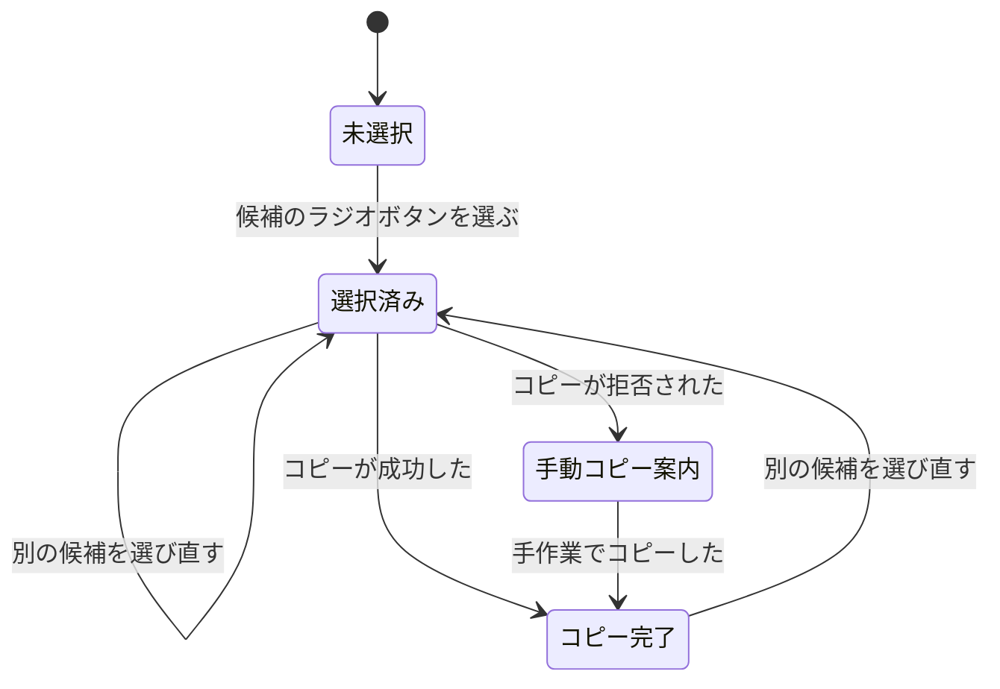
```mermaid
stateDiagram-v2
    [*] --> 未選択
    未選択 --> 選択済み: 候補のラジオボタンを選ぶ
    選択済み --> 選択済み: 別の候補を選び直す
    選択済み --> コピー完了: コピーが成功した
    選択済み --> 手動コピー案内: コピーが拒否された
    手動コピー案内 --> コピー完了: 手作業でコピーした
    コピー完了 --> 選択済み: 別の候補を選び直す
```

画面の中の状態の切り替わり。開催者の予定のみ重なる枠のカードも同じラジオボタンの集合に属し、遷移は変わらない。

詳細を開く

- ヘッダー: 件名・所要時間・参加者の人数・絞り込みに使った条件の要約(代替案で広げた場合は広げた後の値と、広げたことが分かる表示)
- 区画: 見出し・条件・カード一覧の並びで、画面には次の順で置く。既定の候補なら「候補」の1区画。代替案なら「代替案1(仮の予定を含める)」「代替案2(期間と時間帯を広げる)」の順。開催者の予定のみ重なる枠があれば最後に「開催者の予定のみ重なる枠(自分の予定を調整すれば開けられる枠)」。見出しに、候補ではなく開催者が自分の予定を調整すれば開けられる枠であることを書く。両方の代替案が0件で開催者の予定のみ重なる枠だけがあるときは、この区画だけの画面になる
- 候補カード(1候補につき1枚、縦に並べる): 候補番号・日付・曜日・開始と終了の時刻・参加者の空き状況。ラジオボタンで1つだけ選べる。候補番号は画面に並べた順の1からの連番で区画をまたいで通し採番し、開催者が口頭で候補を指すための表示用の番号
- 代替案1の枠には仮の予定を持つ参加者の名前(開催者自身を含む)を、代替案2の枠には広げた後の期間と時間帯を添える
- 開催者の予定のみ重なる枠のカード: 候補カードの項目に加えて、目印「⚠ 開催者の予定あり」のバッジと、重なる開催者の予定ごとに「<件名> HH:MM〜HH:MM(<種別>)」の行(非公開の予定は件名の代わりに「非公開の予定」)。取得できなかったときは「開催者の予定を取得できませんでした(<理由>)」の行。参加者の空き状況は「参加者は全員空き」と示す
- 参加者の空き状況は「全員空き」または空いていない人数だけを示す。参加者の予定の件名は示さない(件名を示すのは開催者自身の予定だけ)
- 「選択結果をコピー」ボタン: 選んだ候補の1行を組み立ててクリップボードへ入れる
- コピー用の入力欄: 選んだ候補の1行を常に表示する。コピーできなかった場合はここを選択状態にして手作業でコピーできる
- 案内文: コピーした1行をチャットに貼ると会議が作られること。開催者の予定のみ重なる枠を選ぶ場合は、重なる予定を開催者が手で動かす必要があること

クリップボードへ入れる1行は、目印の語・依頼ID・試行番号・候補番号・開始時刻・終了時刻を並べたものにする(書式は [appendix.md](appendix.md) の「選択結果のコピー1行の書式」)。**試行番号は画面全体で1つではなく、その枠が入っていた候補ファイルの試行番号をカードごとに埋め込む**(候補・代替案1・開催者の予定のみ重なる枠は1、代替案2は2)。1枚の画面に2つの試行番号の枠が並ぶため、画面単位で最大の試行番号を使うと試行番号1の枠が突き合わせで弾かれる。時刻は日本時間のオフセット付きで書く(台帳の日時と同じ書き方に揃え、貼られた側が時点として解釈できるようにする)。目印の語を先頭に置くことで、貼られた内容が選択結果かどうかを取り違えずに判定できる。

カードの値は `data-` 属性で渡し、JavaScriptはテンプレート側に静的に置く(値を文字列連結でJSに埋め込むと、改行を含む値でJSの文字列が壊れるため)。件名・参加者名・予定の件名はHTMLエスケープして埋め込む。

コピーは3段構えにする。押した瞬間に同期のまま古い方式のコピーを試し、駄目ならクリップボードの機能の有無を確かめてから呼び、どちらも駄目なら入力欄を選択状態にして手作業でのコピーを案内する(共有ストレージ上のビューアで開いた場合とローカルで開いた場合で、使える方式が変わるため)。

- **関連するビジネスルール**: [requirements.md#候補の提示](requirements.md#候補の提示)、[requirements.md#候補の選択](requirements.md#候補の選択)、[requirements.md#開催者の予定のみ重なる枠の提示](requirements.md#開催者の予定のみ重なる枠の提示)

## 状態管理

依頼1件の進行状態は台帳ファイルの有無から導く7状態(依頼済み・候補到着・代替案の提示中・代替案の提示済み・選択済み・作成失敗・作成済み)で、専用の状態ファイルは持たない 〔合意〕

開催者の予定の取得は新しい状態にせず、候補到着・代替案の提示中・代替案の提示済みの処理の中の一段として、開催者の予定の依頼と予定ファイルの有無で「待つ・使う・何もしない」を決める 〔提案〕

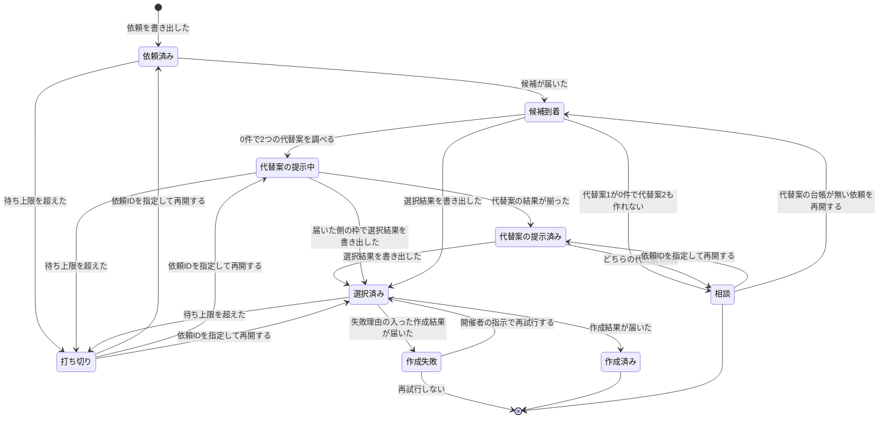
```mermaid
stateDiagram-v2
    [*] --> 依頼済み: 依頼を書き出した
    依頼済み --> 候補到着: 候補が届いた
    依頼済み --> 打ち切り: 待ち上限を超えた
    候補到着 --> 代替案の提示中: 0件で2つの代替案を調べる
    候補到着 --> 相談: 代替案1が0件で代替案2も作れない
    代替案の提示中 --> 代替案の提示済み: 代替案の結果が揃った
    代替案の提示中 --> 打ち切り: 待ち上限を超えた
    代替案の提示済み --> 相談: どちらの代替案も0件
    代替案の提示済み --> 選択済み: 選択結果を書き出した
    代替案の提示中 --> 選択済み: 届いた側の枠で選択結果を書き出した
    候補到着 --> 選択済み: 選択結果を書き出した
    選択済み --> 作成済み: 作成結果が届いた
    選択済み --> 作成失敗: 失敗理由の入った作成結果が届いた
    選択済み --> 打ち切り: 待ち上限を超えた
    作成失敗 --> 選択済み: 開催者の指示で再試行する
    作成失敗 --> [*]: 再試行しない
    相談 --> 代替案の提示済み: 依頼IDを指定して再開する
    相談 --> 候補到着: 代替案の台帳が無い依頼を再開する
    打ち切り --> 依頼済み: 依頼IDを指定して再開する
    打ち切り --> 代替案の提示中: 依頼IDを指定して再開する
    打ち切り --> 選択済み: 依頼IDを指定して再開する
    作成済み --> [*]
    相談 --> [*]
```

依頼の一生。「打ち切り」と「相談」は表の状態ではなく、待ちをやめて終了した位置を表す。

詳細を開く

**表は上から順に当てはめ、最初に一致した行をその依頼の状態とする。** 後の工程の状態を先に置いてあるため、先の工程の行が後の工程を食い潰すことがない。

| 状態 | 判定 | 次にすること |
|---|---|---|
| 作成済み | 最後の再試行番号の作成結果があり、失敗理由が入っていない | 完了内容を伝える |
| 作成失敗 | 最後の再試行番号の作成結果があり、失敗理由が入っている | 失敗理由を伝え、開催者の指示があれば再試行する |
| 選択済み | 最後の再試行番号の選択結果がある | 作成結果の到着を待つ |
| 代替案の提示済み | 試行番号2の依頼があり、その候補が届いている | 代替案1と代替案2の両方を絞り直す。開催者のみ不在の枠が1件以上あれば、開催者の予定ファイルがあれば使い、依頼ファイルだけなら到着を待ち、どちらも無ければ依頼を書いて待つ(取得できなければ件名なし)。1枚の選択画面にまとめ、選択を受け取る |
| 代替案の提示中 | 試行番号2の依頼があり、その候補がまだ届いていない | 代替案2の候補の到着を待つ。開催者のみ不在の枠が1件以上あって開催者の予定ファイルが無ければ、その到着も同時に待つ(依頼ファイルが無ければ書いてから待つ) |
| 候補到着 | 試行番号1の候補がある | 既定の条件で絞り込む。採用が1件以上で開催者のみ不在の枠があれば、開催者の予定ファイルがあれば使い、無ければ依頼を書いて(あれば書かずに)到着を待つ。選択画面の用意・選択の受け取り。採用が0件なら代替案の提示へ |
| 依頼済み | 試行番号1の依頼がある | 候補の到着を待つ |

再試行番号は、その依頼IDの選択結果ファイルのうち最も大きい番号を今の再試行とする。試行番号は状態の判定には使わず、代替案2の依頼と候補を試行番号2のファイル名で指すためだけに使う(依頼ファイルの最大の試行番号で状態を決めると、代替案2の依頼を書いた直後に「依頼済み」へ戻ってしまう)。

開催者の予定の依頼ファイルと予定ファイルの有無は状態の判定に使わない。「開催者のみ不在」の枠があるかは試行番号1の候補ファイルを絞り込めば分かり、枠が無い依頼では開催者の予定の台帳が無くても何もしない。枠がある依頼では、予定ファイルがあれば使い、依頼ファイルだけなら待ち、どちらも無ければ依頼を書いて待つ。これにより、どの状態で打ち切られても再開時に同じ判断に至る。

「代替案の提示済み」で結果が揃っているかは、試行番号2の依頼に対応する候補があるかで見る。代替案2を作らなかった依頼では代替案の台帳が増えないため、再開したときは既定の絞り込みからやり直して同じ結果に至る。

図の「打ち切り」と「相談」は、表の状態ではなく、待ちをやめて終了した位置を表す。台帳ファイルから導けるのは表の7状態だけで、打ち切って終了した依頼も、どちらの代替案でも候補が出ずに相談で終わった依頼も、台帳の上では直前の状態のまま残る。相談で終わった依頼を依頼IDを指定して再開した場合は、代替案の台帳があれば「代替案の提示済み」として、台帳が増えていなければ「候補到着」として同じ絞り込みをやり直し、いずれも同じ結論(相談。開催者の予定のみ重なる枠だけがある場合はその区画だけの選択画面と相談)に至る。開催者の予定の待ちだけが打ち切られた場合は依頼を終了せず件名なしで提示を続けるため、図の「打ち切り」には当たらない。

- **関連するビジネスルール**: [requirements.md#往復の待ち合わせ](requirements.md#往復の待ち合わせ)、[requirements.md#台帳ファイルの扱い](requirements.md#台帳ファイルの扱い)、[requirements.md#開催者の予定のみ重なる枠の提示](requirements.md#開催者の予定のみ重なる枠の提示)

## セキュリティ

メンバー名簿はGit管理外に置き、他人の予定について扱うのは空き状況だけに限り、ログにメールアドレス・アジェンダ・参加URL・会議本文・予定の件名を出さず、資格情報を保存しない 〔合意〕

開催者の予定ファイルに入るのは開催者自身の予定の件名・時刻・種別・非公開かどうかだけで、本文・出席者・場所は取得も保存もせず、非公開の予定は件名を伏せ、ファイルは他の台帳と同じく個人のOneDriveに残す 〔提案〕

詳細を開く

- **聞き返しに出す候補一覧はチャットへの表示にとどめる。** 複数人が該当したときに示すフルネームとメールアドレスは標準出力にだけ出し、ログファイルには残さない(ログにメールアドレスを出さない制約を崩さない)。ログには「何件該当したか」だけを残す。末尾の番号を外して解決した参加者の確認の提示に添えるメールアドレスも、同じくチャットへの表示にとどめる
- **メンバー名簿は個人情報である。** 氏名・ローマ字表記・メールアドレスの対応表は `~/Library/Application Support/meeting-setup-automation/roster.json` に置き、Gitリポジトリの外に出す。リポジトリには記入例だけを置く。この場所を選ぶのは、リポジトリ内に置いて `.gitignore` で守る形にすると、書き忘れ1つで個人情報がコミットされるため
- **他人の予定について扱うのは空き状況だけに限る。** 候補・代替案1のいずれでも、参加者の予定の件名・本文・出席者は取得も表示もしない。代替案1で示すのは「誰に仮の予定があるか」までとする。探索フローも空き状況以上のものを候補ファイルに書かない
- **開催者自身の予定は件名・時刻・種別・非公開かどうかまでに限る。** 開催者予定フローが開催者の予定ファイルに書くのは件名・`showAs`・`sensitivity`・開始・終了だけで、本文・出席者・場所・参加URLは取り出さない。読むのは接続アカウント本人の既定カレンダーだけで、他人のカレンダーは読まない。`sensitivity` が `private`・`confidential` の予定は選択画面・通知・チャットのいずれでも件名を「非公開の予定」に置き換える(選択画面と通知はOneDriveとTeamsに残るため)
- **開催者の予定ファイルは個人のOneDriveの範囲に留める。** 他の台帳と同じく削除せず残すが、置き場所は個人のOneDriveの台帳フォルダで、共有フォルダ・共有リンクには出さない。削除しないのは、台帳の有無で進行を決める方式を保ち、同じ依頼で取り直さないため
- **参加URLを知れば会議に参加できる。** 参加URLを含む作成結果ファイルと通知は、個人のOneDriveと自分専用のTeamsチャネルの範囲に留める。共有フォルダ・共有チャネルには置かない
- **選択画面のURLは会議の候補と参加者数、開催者の予定の件名を含む。** 置き場所は個人のOneDriveのままとし、共有リンクの発行はしない(URLを知っているだけでは開けない状態を保つ)
- **ログに個人情報と会議内容を出さない。** メールアドレス・アジェンダ本文・参加URL・会議本文・予定の件名(開催者自身の予定を含む)はログに出さず、依頼IDと件数・状態だけを残す
- **資格情報を持たない。** クライアントシークレット・証明書・アクセストークンをこの機能はどこにも保存しない(認証はOneDrive同期クライアントとPower Automateのコネクタに委ねる)
- **貼られた内容をそのまま信じない。** 選択結果は候補ファイルと突き合わせて一致を確認してから会議の作成に進む
- **HTMLへの埋め込みは全てエスケープする。** 件名・参加者名は開催者が入力した値、開催者の予定の件名はカレンダーから来た値であり、候補選択画面へ埋め込む際にHTMLとして解釈されないようにする。通知ファイルのHTML断片でも同じ

## ログ

進捗と結果は標準出力に出して開催者がその場で読めるようにし、あわせて作業フォルダの `meeting-setup.log` へ追記する(5世代でローテーション)。依頼IDと件数・状態だけを残し、メールアドレス・アジェンダ・参加URL・会議本文・予定の件名は出さない 〔合意〕

詳細を開く

- 出力先・ローテーション・タイミングごとの内容とレベルの表は [appendix.md](appendix.md) の「ログの表」を参照
- 開催者の予定に関するログは、依頼の書き出し(依頼ID・範囲・対象の枠の件数)、突き合わせ(依頼ID・受け取った予定の件数・枠ごとに重なった件数)、取得できなかったこと(依頼ID・理由)の3つ。予定の件名はログに出さない
- フローからの失敗理由は、探索フロー・開催者予定フロー・作成フローのいずれもERRORで残す。ただし開催者予定フローの失敗は依頼を終了させないため、取得できなかったことのWARNINGも併せて残す
- 名前の解決に失敗したときに該当者のフルネーム・メールアドレスを出さず、件数だけを残す

## テスト戦略

requirements の [n] 全95項目に割り当て済み・漏れなし。Power Automate の実機に依存する項目(開催者予定フローの動作、開催者が予約済みの枠が探索で返るか)は「実機確認(E8/E9)」、チャット・ブラウザ・フローに依存する項目は「手動」とし、残りは単体・結合で担う 〔提案〕

詳細を開く

E2Eの自動化は行わない。画面は静的HTML1枚で、継続的な改修によるデグレのリスクが繰り返し発生する性質のものではなく、外部依存(Power Automate・OneDrive同期・Teams)を自動テストから動かす手段もないため。Power Automateとブラウザに依存する項目は手動確認とし、その内容は [tasks.md](tasks.md) の確認チェックリストに残す。開催者予定フローに依存する項目は仕様承認PR前の実機確認E8(開催者が予約済みの枠が探索で返るか)・E9(「カレンダー ビューの取得 (V3)」で件名・開始終了・種別・非公開かどうかと繰り返し予定の各回が取れるか)で確かめる。開催者の予定ファイルを読む側は、E9で得た実応答(件名は置き換える)を fixture にした単体テストで担う。

| 仕様項目 | テストレベル | 備考 |
|---|---|---|
| 会議設定の依頼-1 | 手動 | チャットからの起動 |
| 会議設定の依頼-2 | 単体 | 既定値の適用と指定値の優先 |
| 会議設定の依頼-3 | 単体 | 名簿での名前の解決 |
| 会議設定の依頼-4 | 単体 | 解決できない名前があれば書き出さない |
| 会議設定の依頼-5 | 単体 | 依頼IDの生成とファイル名 |
| 会議設定の依頼-6 | 手動 | 提示内容の確認 |
| 候補の提示-1 | 単体 | 世界標準時で届いた枠を日本時間に変換すること。探索フローそのものは手動確認 |
| 候補の提示-2 | 単体 | HTMLの生成と置き場所 |
| 候補の提示-3 | 単体 | 表示項目 |
| 候補の提示-4 | 単体 | カード1枚とラジオボタン |
| 候補の提示-5 | 結合 | 通知の書き出しとチャット表示 |
| 候補の提示-6 | 単体 | ビューアURLの組み立て。実機で開くことは手動確認 |
| 候補の提示-7 | 単体 | 0件のときの代替案の提示への分岐。開催者の予定のみ重なる枠があっても候補0件の判定が変わらないこと |
| 候補の提示-8 | 単体 | どちらの代替案によるものかと、広げた後の条件が選択画面・通知・チャットの文に入ること |
| 候補の提示-9 | 単体 | 開催者の予定のみ重なる枠が、候補の区画の後ろの別区画に見出し(自分の予定を調整すれば開けられる枠)付きで置かれること。通知文とチャットの出力に件数と枠ごとの日時・件名の行が入ること。代替案の提示時は代替案2の区画の後ろに置かれること |
| 候補の提示-10 | 単体 | カードに「⚠ 開催者の予定あり」の目印と、重なる予定ごとの件名・開始終了の時刻・種別(仮・予約済み・外出中・他の場所で作業中・不明)の行が入ること |
| 候補の提示-11 | 結合 | 開催者の予定のみ重なる枠のカードが候補と同じ `name="candidate"` のラジオボタンと試行番号1のコピー1行を持ち、貼られた1行が `select` の突き合わせを通って選択結果が書き出されること。開催者の予定に関する項目を選択結果に持たないこと |
| 候補の提示-12 | 単体 | 待ち上限・結果の `error`・依頼の書き出し失敗のそれぞれで、枠は提示され、件名の代わりに「開催者の予定を取得できませんでした(<理由>)」がカードと通知に入ること |
| 候補の選択-1 | 単体 | 生成物にコピーの3段構えが含まれること。動作は手動確認 |
| 候補の選択-2 | 単体 | 入力欄の自動選択が含まれること。動作は手動確認 |
| 候補の選択-3 | 単体 | 貼られた1行の読み取りと選択結果の書き出し |
| 候補の選択-4 | 単体 | 読み取れない場合・開始終了が候補ファイルの枠と一致しない場合は書き出さない |
| 候補の選択-5 | 単体 | 選択結果は1回だけ書き出す。再試行のときだけ再試行番号を付けて書き出す |
| 会議の作成-1 | 手動 | 作成フローの実機確認 |
| 会議の作成-2 | 単体 | アジェンダの整形 |
| 会議の作成-3 | 単体 | 作成結果の読み取りと直リンクの取り出し |
| 会議の作成-4 | 単体 | 作成に成功した作成結果がある依頼IDでは選択結果を書き出さない |
| 会議の作成-5 | 単体 | 失敗した作成結果の判定と、指示を受けたときだけ再試行番号付きの選択結果を書き出すこと |
| 会議の作成-6 | 単体 | 再試行を促す出力に、その枠に会議が無いことを確かめる案内が含まれること |
| 完了の通知-1 | 結合 | 通知の書き出しとチャット表示 |
| 完了の通知-2 | 単体 | 手動有効化の注意書きが通知文に含まれること |
| 往復の待ち合わせ-1 | 単体 | 依頼の後は候補を、開催者の予定の依頼の後は開催者の予定を、選択結果の後は作成結果を待つこと(待つファイルの名前が依頼IDから決まること) |
| 往復の待ち合わせ-2 | 単体 | 打ち切りと案内 |
| 往復の待ち合わせ-3 | 結合 | 台帳ファイルの有無から進行状態を判定して再開する |
| 往復の待ち合わせ-4 | 単体 | 待っている対象と経過時間の出力 |
| 往復の待ち合わせ-5 | 結合 | 2つの待ちのうち片方だけが打ち切られた場合に、届いた側を提示して届かなかった側を打ち切りとして伝えること。代替案2の依頼の書き出し失敗・失敗理由入りの候補でも代替案1を提示すること |
| 依頼内容の受け付け条件-1 | 単体 | 所要時間の下限と時間帯への収まり |
| 依頼内容の受け付け条件-2 | 単体 | 探索期間の前後関係と当日以降 |
| 依頼内容の受け付け条件-3 | 単体 | 探索期間の終了日の上限 |
| 依頼内容の受け付け条件-4 | 単体 | 時間帯の前後関係と所要時間との比較 |
| 依頼内容の受け付け条件-5 | 単体 | 候補件数の下限 |
| 依頼内容の受け付け条件-6 | 単体 | アジェンダ未指定でも受け付け、無いことが分かる本文にする |
| 依頼内容の受け付け条件-7 | 単体 | 満たさない場合に依頼を書き出さず聞き返す |
| 依頼内容の受け付け条件-8 | 単体 | 参加者の人数で依頼を弾かないこと |
| 候補探索の既定条件-1 | 単体 | 期間・時間帯・件数の既定値 |
| 候補探索の既定条件-2 | 単体 | 祝日の除外。曜日の指定がないときの土日の除外と、指定があるときに土日も候補になること |
| 候補探索の既定条件-3 | 単体 | 開催者を含む全員空きの絞り込みと指示による例外。出席者ごとの空き状況と開催者の空き状況の両方を見ること、例外時に出席可能率の下限も併せて下げること。開催者だけが空き以外の枠は候補に入らず「開催者のみ不在」に分かれること |
| 候補探索の既定条件-4 | 単体 | 重なる枠の除外 |
| 候補探索の既定条件-5 | 単体 | 既定では仮の予定を空きとみなさないこと。代替案1ではみなすこと。開催者のみ不在の枠の判定では開催者の仮・予約済み・外出中・他の場所で作業中・不明をいずれも「空き以外」とすること |
| 開催者の予定のみ重なる枠の提示-1 | 単体 | 曜日・時間帯・祝日を満たし、出席者全員が `free` で開催者が `free` 以外(`tentative`・`busy`・`oof`・`workingElsewhere`・`unknown`、前後の空白と大文字小文字の違いを含む)の枠だけが分かれること。一部不在を許す依頼では分けないこと |
| 開催者の予定のみ重なる枠の提示-2 | 単体 | 開催者の予定のみ重なる枠を採用件数に数えず、候補0件の判定と代替案の提示が枠の有無で変わらないこと |
| 開催者の予定のみ重なる枠の提示-3 | 単体 | 代替案1が仮の予定を持つ参加者が1人以上いる枠だけになり、出席者全員が `free` で開催者だけ非 `free` の枠を含まないこと。開催者も仮で参加者にも仮がいる枠は代替案1に入ること |
| 開催者の予定のみ重なる枠の提示-4 | 単体 | 開始時刻順・重複除外・候補件数の上限が候補と同じに適用されること |
| 開催者の予定のみ重なる枠の提示-5 | 実機確認(E8/E9) | 「カレンダー ビューの取得 (V3)」で開催者自身の既定カレンダーから件名・開始終了・`showAs`・`sensitivity` が取れ、本文・出席者・場所を書き出さないフローになっていること(E9)。空き時間の探索が開催者が `busy` の枠を返すか(E8)。読む側の非公開の予定の置き換えと `free` の予定の非表示は単体(E9の実応答を fixture にする) |
| 開催者の予定のみ重なる枠の提示-6 | 結合 | 枠が1件以上あるときだけ依頼を書き出し、同じ依頼IDでは2度書かないこと。待ち上限が候補の待ちと同じ値であること。待ち上限・`error`・書き出し失敗のそれぞれで件名なしの提示と理由の文になり、選択画面の書き出しと通知が行われること |
| 開催者の予定のみ重なる枠の提示-7 | 結合 | 依頼ファイルだけがある状態で再開すると待ちから続き、予定ファイルがある状態で再開すると依頼を書かずに使うこと。枠が無い依頼では台帳が無くても何もしないこと |
| 開催者の予定のみ重なる枠の提示-8 | 結合 | 両方の代替案が0件で開催者の予定のみ重なる枠だけがあるとき、その区画だけの選択画面とURLの通知が行われ、相談の文面(試した条件・広げなかった項目・緩める候補)も出力されること |
| 開催者の予定のみ重なる枠の提示-9 | 実機確認(E8/E9) | 繰り返し予定の各回が展開されて予定ファイルに入ること(E9)。読む側は展開済みの回を1件の予定として突き合わせる単体テストで担う |
| 候補が0件のときの代替案の提示-1 | 単体 | 2つの代替案を両方作ること。代替案1は同じ候補ファイルを絞り直し、探索の依頼を出し直さないこと。参加者全員が空きで開催者だけが空き以外の枠は代替案1に入らず開催者の予定のみ重なる枠の区画に出ること |
| 候補が0件のときの代替案の提示-2 | 単体 | 代替案1の枠に仮の予定を持つ参加者を添えること。参加者の予定の件名を扱わないこと |
| 候補が0件のときの代替案の提示-3 | 単体 | 代替案1で示す参加者に開催者自身を含めること |
| 候補が0件のときの代替案の提示-4 | 単体 | 開催者が指定した項目を広げないこと。両方指定されていれば代替案2を作らないこと |
| 候補が0件のときの代替案の提示-5 | 単体 | どちらの代替案によるものかが分かる形で示すこと |
| 候補が0件のときの代替案の提示-6 | 単体 | 代替案からさらに緩めず、両方0件なら相談に切り替えること。開催者の予定のみ重なる枠があるときは選択画面と相談の両方を出すこと |
| 候補が0件のときの代替案の提示-7 | 単体 | 受け取った枠が要求件数と同数のときに打ち切りの可能性を伝えること |
| 候補が0件のときの代替案の提示-8 | 結合 | 代替案の提示は依頼1件につき1回。台帳の有無から判定でき、再開しても同じ結果になること |
| 往復の待ち時間の上限-1 | 単体 | 候補の待ちと作成結果の待ちの上限をそれぞれ持ち、いずれも既定が5分であること |
| 往復の待ち時間の上限-2 | 単体 | 代替案2の候補の待ちと開催者の予定の待ちに候補の待ちと同じ上限を適用すること |
| 往復の待ち時間の上限-3 | 結合 | 代替案2の候補・開催者の予定の待ちが打ち切られても台帳を残し、依頼IDを指定した再開で続けられること。開催者の予定の待ちの打ち切りでは依頼を終了させず件名なしで提示すること |
| 参加者の解決-1 | 単体 | Git管理外の名簿の読み込み |
| 参加者の解決-2 | 単体 | 登録なし・複数人該当は中断する |
| 参加者の解決-3 | 単体 | 名簿にない相手は参加者にならない |
| 参加者の解決-4 | 単体 | 表記ゆれの吸収と、姓だけ・名だけの指定 |
| 参加者の解決-5 | 単体 | 複数該当時にフルネームとメールアドレスの一覧を示す |
| 参加者の解決-6 | 単体 | 照合の段の順序と、フルネーム・姓・名・ローマ字の該当の合算(氏名で該当した人とローマ字で該当した別人がいれば聞き返す) |
| 参加者の解決-7 | 単体 | 同じ人を別表記で複数回指定しても出席者は1人 |
| 参加者の解決-8 | 単体 | ローマ字での照合(姓名の順番・大文字小文字・全角英字・姓だけ・名だけ・3語以上)と、ローマ字表記が無い人・空白だけの人は氏名だけで照合すること |
| 参加者の解決-9 | 単体 | 末尾の番号を外した照合(番号まで一致する登録の優先・外すと空になる名前・敬称と番号の両方が付いた名前)、番号を外して解決した参加者へのメールアドレスの添え書き、番号を外して複数該当したときの聞き返し |
| 会議の作成内容-1 | 手動 | Teams会議として作られ参加URLが発行されること |
| 会議の作成内容-2 | 単体 | 全員を必須出席者にする |
| 会議の作成内容-3 | 単体 | 会議室を含めない |
| 会議の作成内容-4 | 手動 | 開催者が起動した本人になること |
| 録画とファシリテーターの設定-1 | 手動 | 直リンクからの手動有効化 |
| 録画とファシリテーターの設定-2 | 単体 | 会議本文からの直リンクの取り出し |
| 録画とファシリテーターの設定-3 | 単体 | 直リンクを取り出せない場合の通知文と代替手順。実際に本文へ残るかは [tasks.md](tasks.md#仕様承認pr前に行う実機確認) のE3で確認する |
| 台帳ファイルの扱い-1 | 単体 | 依頼・候補・開催者の予定の依頼・開催者の予定・選択結果・作成結果の6種類が用途ごとのフォルダに分かれ、Skillが書くのは依頼・開催者の予定の依頼・選択結果だけであること |
| 台帳ファイルの扱い-2 | 単体 | 6種類のファイル名に依頼IDを含めること。開催者の予定の依頼・開催者の予定は試行番号・再試行番号を持たないこと |
| 台帳ファイルの扱い-3 | 単体 | 到達した依頼のファイルを削除しない(開催者の予定の依頼・開催者の予定を含む) |
| 台帳ファイルの扱い-4 | 単体 | 通知フォルダを台帳と分ける |
| 台帳ファイルの扱い-5 | 単体 | 依頼ファイルにアジェンダの原文と絞り込みの条件が含まれ、再開時に復元できること |
| 通知-1 | 結合 | 通知フォルダへの書き出しによる投稿 |
| 通知-2 | 手動 | HTTP投稿の経路を持たないことをレビューで確認する |
| 通知-3 | 単体 | 通知が失敗してもチャット表示で続けられる |
| 非機能要件-1 | 単体 | 依頼IDによる取り違えの防止(開催者の予定の依頼・予定ファイルを含む) |
| 非機能要件-2 | 手動 | 定期実行・無人実行の仕組みを持たないこと |

