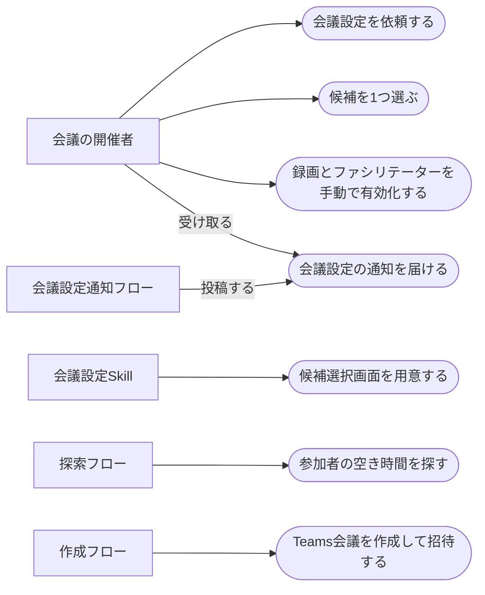

# 空き時間からの会議候補提示とTeams会議の自動作成

> ステータス: 仕様確認中(未実装)

## サマリ

社内メンバーとの会議を設定するとき、参加者全員の空き時間を人が突き合わせて枠を決め、Teams会議を作って招待する作業が毎回発生する。この機能は、チャットで件名・参加者・所要時間・アジェンダを伝えるだけで、参加者全員が空いている候補枠を提示し、選んだ枠でTeams会議を作成して参加者を招待するところまでを自動化する。

候補の提示と選択はブラウザで開ける選択画面で行い、そのURLと作成完了はTeams通知で受け取る。**録画の自動開始とファシリテーター機能の有効化は自動化できないため、作成完了通知に含まれる会議オプション画面の直リンクから利用者が手動で有効化する。**

物理会議室の押さえ、社外参加者、繰り返し会議、作成後の変更・キャンセルはスコープ外。全体像は[ユースケース図](#ユースケース図)を参照。

## 概要

- 機能名: 空き時間からの会議候補提示とTeams会議の自動作成
- 目的: 社内会議の日程調整と会議作成・招待にかかる手作業をなくす
- 優先度: 中

## ユーザーストーリー

- 会議の開催者としては、参加者と所要時間を伝えるだけで、全員が空いている候補枠を出してほしい
- 会議の開催者としては、候補を1つ選ぶだけで、Teams会議の作成と参加者の招待まで済ませてほしい
- 会議の開催者としては、候補が出そろったことと会議が作られたことをTeamsの通知で知り、ターミナルを見張らずに済むようにしたい

## ユースケース図

線はアクターとユースケースの関わりを表し、処理の順序ではない。正となる文章は[機能要件](#機能要件)・[ビジネスルール・制約](#ビジネスルール制約)を参照。

## 機能要件

### 会議設定の依頼

- [1] 開催者がチャットから明示的に起動し、件名・参加者・所要時間・アジェンダを伝えて依頼できること
- [2] 探索の期間・時間帯・候補件数は任意で指定でき、指定がない項目には既定値を使うこと(既定値は[ビジネスルール](#候補探索の既定条件)を参照)
- [3] 参加者は名前で指定でき、メンバー名簿でメールアドレスに解決すること
- [4] 名簿で解決できない名前が含まれる場合は依頼を送らず、解決できなかった名前を示して聞き返すこと
- [5] 依頼は依頼フォルダへのファイル書き出しで行い、依頼1件ごとに一意な依頼IDを与えること
- [6] 依頼の内容(件名・参加者・所要時間・探索条件)を送信前にチャットに提示し、開催者が誤りに気づけること

### 候補の提示

- [1] 参加者全員の空き時間から会議候補を取得すること
- [2] 取得した候補から選択画面を生成し、ブラウザで表示できる場所に置くこと
- [3] 選択画面には件名・所要時間・参加者数と、候補ごとの日付・曜日・時刻・空き状況を表示すること
- [4] 候補は1候補につき1枚のカードを縦に並べて表示し、ラジオボタンで1つだけ選べること
- [5] 選択画面のURLをTeams通知で知らせ、同じURLをチャットにも表示すること
- [6] 選択画面のURLは開いたときにブラウザで表示される形式であること(ファイルのダウンロードにならないこと)
- [7] 候補が0件だった場合の挙動は[ビジネスルール](#候補が0件のときの代替案の提示)に従うこと
- [8] 代替案として候補を提示する場合は、どの代替案によるものかと、広げた後の条件を選択画面・Teams通知・チャットに示すこと。根拠: 既定の条件の外にある枠が候補に出た理由が伝わらないと、条件を取り違えて提示されたと誤解される

### 候補の選択

- [1] 選択画面で候補を1つ選び、選択結果をクリップボードにコピーできること
- [2] クリップボードへのコピーが動作しない場合でも、選択結果を画面上で選択して手作業でコピーできること
- [3] 開催者がコピーした選択結果をチャットに貼ることで、選択結果が選択結果フォルダへ書き出されること
- [4] 貼られた内容から依頼IDと候補を特定できない場合は、選択結果を書き出さずに聞き返すこと
- [5] 同一の依頼IDについて、1つの再試行番号あたり選択結果を書き出すのは1回までとすること。会議の作成が失敗した場合は、[会議の作成](#会議の作成) [5] の再試行として、再試行番号を増やして書き出せること【推測】

### 会議の作成

- [1] 選択された枠でTeams会議として予定を作成し、参加者全員を必須出席者として招待すること
- [2] 依頼時に受け取ったアジェンダを読みやすく整形して会議本文に含めること
- [3] 作成結果から、会議の日時・参加者・参加URL・会議オプション画面の直リンクを取り出せること
- [4] 会議の作成に成功した依頼IDについて、会議を作り直さないこと
- [5] 会議の作成が失敗した場合は、失敗の理由を伝えたうえで、開催者が同じ枠での再試行を指示したときに限り作成をやり直せること。再試行を自動で行わないこと。再試行の回数に上限は設けないが、そのたびに開催者の指示を求めること【推測】
- [6] 再試行を促す際は、その枠に会議が既に作られていないかを開催者が確かめられるよう案内すること。根拠: 会議の作成に成功した直後の処理で失敗した場合は会議だけが残っていることがあり、確認せずに再試行すると同じ枠に会議が二重にできる【推測】

### 完了の通知

- [1] 作成した会議の日時・参加者・参加URLと、会議オプション画面の直リンクをTeams通知で知らせ、同じ内容をチャットにも表示すること
- [2] 通知には、録画とファシリテーターは直リンクから開催者が手動で有効化する必要があることを明記すること

### 往復の待ち合わせ

- [1] 依頼を書き出した後は候補の到着を、予定の件名を求めた後は予定詳細の到着を、選択結果を書き出した後は作成結果の到着を、それぞれ待つこと
- [2] 待ち時間の上限を超えた場合は待ちを打ち切り、後から結果を確認する手順を案内して終了すること(上限は[ビジネスルール](#往復の待ち時間の上限)を参照)
- [3] 打ち切った後に依頼IDを指定して再度起動した場合、その依頼の待ち合わせの続きから再開できること
- [4] 待っている間、何を待っているか・どれだけ経過したかが開催者に分かること
- [5] 2つの待ちを同時に行っていて片方だけが上限を超えた場合は、全体を終了せず、届いた側の結果を提示したうえで届かなかった側を打ち切りとして伝えること。根拠: 候補が0件のときの2つの代替案は独立しており、片方が届けば選択に進める

## ビジネスルール・制約

### 依頼内容の受け付け条件

- [1] 所要時間は5分以上で、探索する時間帯の長さに収まること。根拠: これより短い枠は日程調整の対象にならず、時間帯に収まらない所要時間は候補が原理的に0件になるため、依頼を送る前に弾く【推測】
- [2] 探索期間は開始日が終了日以前で、開始日が当日以降であること。根拠: 過ぎた日付を探索しても候補にならない
- [3] 探索期間の終了日は当日から3週間以内とすること。根拠: 代替案として広げる期間の上限が当日から3週間であり([候補が0件のときの代替案の提示](#候補が0件のときの代替案の提示) [1])、それより長い期間を最初から指定すると代替案が意味を持たなくなる
- [4] 時間帯は開始時刻が終了時刻より前で、その差が所要時間以上あること。根拠: 差が所要時間未満だと候補が原理的に0件になる
- [5] 提示する候補件数は1件以上であること。根拠: 0件の指定は候補を提示しない依頼になり、依頼として意味を持たない
- [6] アジェンダの指定は任意とすること。指定がない場合も依頼を受け付け、アジェンダが無いことが分かる会議本文にすること。根拠: 枠を押さえることが先で議題は後から決まる会議があり、アジェンダを必須にすると依頼できない
- [7] [1]から[5]のいずれかを満たさない場合は依頼を書き出さず、満たしていない項目を示して聞き返すこと
- [8] 参加者の人数に上限を設けないこと。根拠: 空き時間を探すコネクタに参加者数の上限は規定されていない。人数が多いほど全員が空く枠は見つかりにくくなるが、それは候補0件として扱えばよく、依頼の受け付けを断る理由にはならない

### 候補探索の既定条件

- [1] 期間は起動日の当日から2週間、時間帯は9時30分から17時30分、候補件数は最大5件とすること。根拠: 社内の通常勤務時間帯に収まり、当日・翌日の急な設定にも2週間先の調整にも同じ既定値で対応できる。時間帯は1日の中の時刻の範囲だけを指す条件で、どの曜日を対象にするかは[2]が決める
- [2] 祝日は候補に含めないこと。曜日の指定がない場合は土曜・日曜も候補に含めないこと。曜日を指定された場合はその指定に従い、土曜・日曜も候補になりうること。根拠: 曜日を明示するのは平日の外も含めて調整したい場面であり、開催者の指示を既定より優先する。祝日は曜日ではなく日付単位の休業日なので、曜日の指定とは別に常に除く【推測】
- [3] 候補は開催者を含む参加者全員が空いている枠のみとすること。ただし依頼時に一部不在の枠も含めるよう指示された場合はその指示に従うこと。根拠: 全員が空いている枠を提示するのが既定の期待であり、例外は依頼のたびに開催者が判断する。開催者自身の予定が埋まっている枠を出しても選べない
- [4] 候補どうしは重複しない別々の枠とし、同じ日に複数の候補が出てもよいこと
- [5] 空いているかどうかの判定では、仮の予定が入っている状態を空いていないものとして扱うこと。ただし候補が0件のときの代替案1はこの限りではない([候補が0件のときの代替案の提示](#候補が0件のときの代替案の提示) [1])。根拠: 仮でも予定が入っている枠を候補に出すと、選ばれた後に先約との調整が必要になり日程調整をやり直すことになる。候補が1件も無いときだけは、調整の余地がある枠を判断材料として示すほうが役に立つ

### 候補が0件のときの代替案の提示

- [1] 既定の条件で候補が0件の場合、開催者に確認を求めずに次の2つの代替案を両方調べ、その結果をまとめて報告すること
  - **代替案1(仮の予定を含める)**: 期間と時間帯を変えずに、仮の予定が入っている参加者を空いているものとみなして候補を出す
  - **代替案2(期間と時間帯を広げる)**: 期間を当日から3週間、時間帯を9時30分から18時30分に広げて候補を出す
- [2] 代替案1の候補には、仮の予定が入っている参加者と、その予定の件名を添えて、選択画面・Teams通知・チャットのそれぞれに示すこと。件名を取得できない参加者については取得できないことを示し、非公開に設定された予定の件名は示さないこと。予定の本文と出席者は扱わないこと。根拠: 仮の予定に重ねてよいかは予定の内容で判断が変わるため、判断材料として示す。件名が取得できるかは相手の空き時間の共有設定に依存し、こちらでは保証できない
- [3] 代替案2では、開催者が探索期間または時間帯として明示的に指定した項目を広げないこと。広げられる項目が1つもない場合は代替案2を提示しないこと。根拠: 開催者が明示した条件を自動で緩めるのは、避けたい枠に踏み込む判断を代わりに行うことにあたる【推測】
- [4] 2つの代替案の候補は、どちらの代替案によるものかが分かる形で示すこと
- [5] 代替案の候補からさらに自動で条件を緩めないこと。両方の代替案とも候補が0件の場合は、試した条件を報告して、参加者・期間・所要時間のどれを緩めるかを開催者に相談すること。根拠: これ以上緩めるのは「本来なら避けたい枠」に踏み込む判断であり、自動で決めるべきではない
- [6] 代替案1が0件で、かつ受け取った枠が探索で要求した最大件数と同数だった場合は、応答が件数で打ち切られている可能性を併せて伝えること。根拠: 空き時間の応答は要求した件数で打ち切られ、打ち切られた集合の外にある枠は代替案1では現れない
- [7] 代替案の提示は依頼1件につき1回とすること。すでに提示したかどうかは台帳ファイルの有無から判定できること。打ち切りのあとに同じ依頼IDで再開した場合は同じ2つの代替案を作り直すが、同じ台帳から同じ条件で作るため結果は変わらないこと。代替案1が0件で代替案2も作れない場合は台帳が増えないが、再開しても既定の絞り込みからやり直して同じ相談に至ること

### 往復の待ち時間の上限

- [1] 候補の待ち・予定詳細の待ち・作成結果の待ちのそれぞれについて待ち時間の上限を設け、いずれも5分とすること。根拠: どの待ちも「台帳ファイルの書き出し → フォルダ監視トリガーの検知 → フロー内のアクション実行 → 結果ファイルのOneDrive同期」という同じ経路をたどるため、同じ決め方をする。間隔を空けた単発の往復時間は候補が45〜50秒、作成結果が70秒であり、いずれも3倍が210秒に収まる。予定詳細も同じ経路をたどるため同じ上限を用いる。それを十分に上回る切りのよい値として5分を用いる。3倍を目安にするのは、同期の遅れが平常時の倍以上に振れても打ち切らないため
- [2] 代替案の予定詳細の待ちと代替案2の候補の待ちは別々の待ちとして扱い、それぞれに上限を適用すること
- [3] 既定の依頼から間を置かずに続く代替案の待ちでは上限を超えて打ち切られることがあり、それを異常として扱わないこと。打ち切ったあとも台帳を残し、依頼IDを指定した再開で続けられること。根拠: フォルダ監視トリガーの検知間隔は短時間に連続して依頼を出すと絞られ、7分間隔での連続実行では往復が670秒まで伸びる。2つの代替案は既定の依頼の直後に続けて出すため、これに当たる

### 参加者の解決

- [1] 参加者はメンバー名簿で名前からメールアドレスに解決すること。名簿はGit管理外の設定ファイルに置くこと。根拠: 氏名とメールアドレスの対応表は個人情報であり、リポジトリに含めない
- [2] 名簿で一意に解決できない名前(登録がない、同じ名前が複数ある)は解決を試みず、依頼を中断して聞き返すこと。根拠: 誤字や同姓の別人を黙って会議に招待する事故を防ぐ
- [3] 参加者は社内のメンバーのみとすること

### 会議の作成内容

- [1] Teams会議として作成し、参加URLが発行されること
- [2] 参加者は全員を必須出席者とすること
- [3] 物理会議室(リソース)は押さえないこと
- [4] 会議の開催者は、この機能を起動した本人とすること

### 録画とファシリテーターの設定

- [1] 録画の自動開始とファシリテーター機能の有効化は自動化せず、会議オプション画面の直リンクから開催者が手動で有効化すること。根拠: これらを設定する手段が、このアプリが使える接続の権限の範囲に無いため(調査の内容と再検討の条件は[adr/0001](../adr/0001-manual-recording-and-facilitator.md))
- [2] 会議オプション画面の直リンクは、会議作成の応答に含まれる会議本文から機械的に取り出すこと
- [3] 会議本文から会議オプション画面の直リンクを取り出せなかった場合は、取り出せなかったことと、Teamsのカレンダーから会議を開いて会議オプションを開く手順を通知に含めること。会議の作成自体は失敗として扱わないこと。根拠: 直リンクが応答に含まれるかは外部サービスの振る舞いに依存し、こちらで保証できない。会議は作成できているため、手順を案内すれば作業を続けられる

### 台帳ファイルの扱い

- [1] 依頼・候補・選択結果・作成結果は用途ごとに別のフォルダに分け、同じファイルにこちらとPower Automateの双方から書き込まないこと。根拠: 同一ファイルを双方が書くと同期の競合ファイルが生まれる
- [2] 4種類のファイルはいずれもファイル名に依頼IDを含め、1件の依頼に属するファイルが対応付けられること
- [3] 作成結果まで到達した依頼のファイルは削除せず残すこと。根拠: どの会議をこの機能で設定したかを後から追える
- [4] 通知用のフォルダは台帳のフォルダと分けること。根拠: 通知フォルダを監視するフローが台帳ファイルを誤検知して投稿してしまうのを防ぐ
- [5] 依頼のファイルには、その依頼を最後まで進めるのに必要な内容(アジェンダと絞り込みの条件を含む)をすべて含めること。根拠: 進行状態を台帳ファイルだけから導く方式のため、依頼のファイルに無い情報は待ちを打ち切った後の再開で復元できない

### 通知

- [1] Teams通知は通知用フォルダへのファイル書き出しで行い、同フォルダを監視するこの機能専用のPower Automateフローを新設してTeamsへ投稿すること。根拠: 投稿先ごとに専用フォルダと専用フローが1組必要であり、既存の投稿先のフローは別のフォルダを見ている
- [2] Webhookによる直接投稿は使えないこと。根拠: 組織のPower Platform DLPポリシーでブロックされる
- [3] Teams通知が届かない場合でも、選択画面のURLと完了内容がチャットに表示されることで作業を続けられること。根拠: 通知はOneDrive同期とフローに依存しており、そこが止まっても機能全体が使えなくならないようにする

## 非機能要件

- [1] 想定する利用は月に数回、1回の参加者は5名程度とすること。複数の依頼が同時に走ることは想定しないが、依頼IDによって取り違えは起きないこと
- [2] 実行はこのMac上のチャットセッションからのみとし、定期実行や無人実行は行わないこと

## 依存関係

- 候補を探索して候補ファイルを書き出すPower Automateフローを新設すること
- 選択結果から会議を作成して作成結果ファイルを書き出すPower Automateフローを新設すること
- Teamsへの投稿は`teams-post` Skillを通じて行い、この機能用の投稿先を投稿先設定に登録すること
- 仮の予定の件名を取得して結果ファイルを書き出すPower Automateフローを新設すること
- この機能の通知フォルダを監視してTeamsへ投稿するPower Automateフローを新設すること
- 台帳ファイルの受け渡しと選択画面の公開はOneDrive同期クライアントの稼働に依存すること
- 会議候補の探索・会議の作成・会議本文の取得は、Power Automateの標準コネクタから到達できる範囲の機能だけで行うこと(プレミアムコネクタ・カスタムコネクタ・素のHTTPアクションは利用できない)

## スコープ外

- 物理会議室(リソース)の空き確認と押さえ
- 録画の自動開始・ファシリテーター機能の自動有効化(利用できる接続の権限では到達できず、ファシリテーターにはAPI自体が無い)
- 会議テンプレートの適用(自動で作成した会議には適用されない。理由は[adr/0001](../adr/0001-manual-recording-and-facilitator.md))
- 社外参加者を含む会議の設定
- 繰り返し会議(定期会議)の設定
- 作成した会議の変更・キャンセル・日程の再調整
- 共同開催者の指定
- 定期実行・条件監視による自動起動(チャットからの明示起動のみ)
- Teamsのチャネル会議としての作成
- 参加者による候補への投票・回答の集約(候補を選ぶのは開催者)
