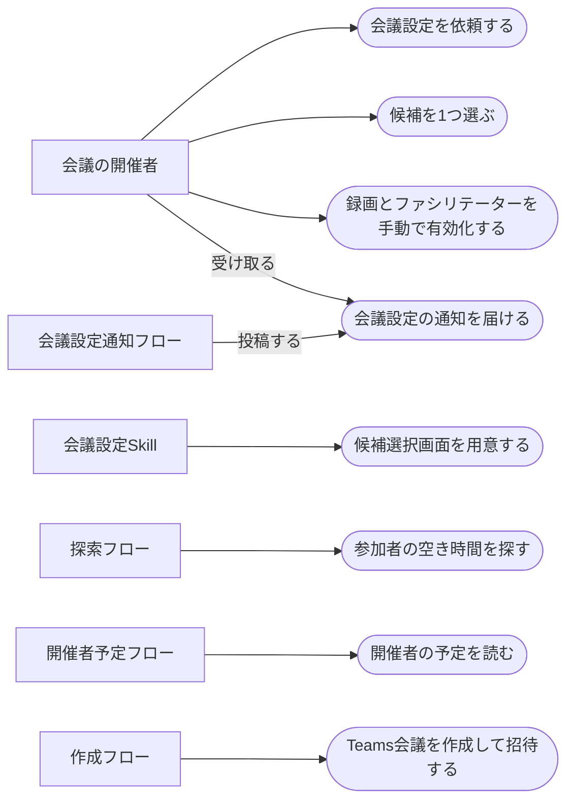

# 空き時間からの会議候補提示とTeams会議の自動作成

ステータス: 実装中 ／ 優先度: 中

## 概要

社内メンバーとの会議を設定するとき、参加者全員の空き時間を人が突き合わせて枠を決め、Teams会議を作って招待する作業が毎回発生する。この機能は、チャットで件名・参加者・所要時間・アジェンダを伝えるだけで、参加者全員が空いている候補枠を提示し、選んだ枠でTeams会議を作成して参加者を招待するところまでを自動化する。 〔合意〕

- **会議設定の依頼**: チャットで受けた件名・参加者・所要時間・アジェンダを、メンバー名簿でメールアドレスに解決して依頼ファイルに書き出す。参加者全員の空き時間を探すPower Automateフロー(探索フロー)の入口になる 〔合意〕
- **候補の提示と選択**: 届いた候補を曜日・時間帯・祝日・全員空きで絞り込み、ブラウザで開ける選択画面に並べる。選択画面のURLはTeams通知とチャットの両方で受け取り、候補を1つ選んでコピーした1行をチャットに貼ると選択結果になる 〔合意〕
- **開催者の予定のみ重なる枠の提示**: 参加者全員は空いていて開催者自身の予定だけが重なる枠を、候補とは別の区画「開催者の予定のみ重なる枠」として選択画面・Teams通知・チャットに示す。重なる開催者の予定の件名と時刻を開催者自身のカレンダーから取得して添え、候補と同じように選べる。開催者が自分の予定を動かすだけで開けられる枠を、調整しろとして見せるために要る 〔合意〕
- **候補が0件のときの代替案**: 既定の条件で候補が0件なら、仮の予定を含める案と期間・時間帯を広げる案の2つを自動で調べ、1枚の選択画面にまとめて示す 〔合意〕
- **Teams会議の作成と完了の通知**: 選択結果をトリガーにPower Automateフロー(作成フロー)がTeams会議を作成して参加者を招待し、会議の日時・参加URL・会議オプション画面の直リンクをTeamsとチャットで知らせる。録画の自動開始とファシリテーター機能の有効化は自動化できないため、直リンクから開催者が手動で有効化する 〔合意〕

進め方: 物理会議室の押さえ、社外参加者、繰り返し会議、作成後の変更・キャンセルはスコープ外。全体像は[ユースケース図](#ユースケース図)を参照。

## ユーザーストーリー

- 会議の開催者としては、参加者と所要時間を伝えるだけで、全員が空いている候補枠を出してほしい 〔合意〕
- 会議の開催者としては、候補を1つ選ぶだけで、Teams会議の作成と参加者の招待まで済ませてほしい 〔合意〕
- 会議の開催者としては、候補が出そろったことと会議が作られたことをTeamsの通知で知り、ターミナルを見張らずに済むようにしたい 〔合意〕
- 会議の開催者としては、参加者全員は空いていて自分の予定だけが重なる枠も、どの予定が重なるかと一緒に見せてほしい。自分の予定なら動かして枠を開けられるため、候補と区別したうえで選べるようにしたい 〔合意〕

## ユースケース図

```mermaid
flowchart LR
    organizer["会議の開催者"]
    skill["会議設定Skill"]
    searchflow["探索フロー"]
    eventsflow["開催者予定フロー"]
    createflow["作成フロー"]
    notifyflow["会議設定通知フロー"]

    uc1(["会議設定を依頼する"])
    uc2(["参加者の空き時間を探す"])
    uc3(["候補選択画面を用意する"])
    uc8(["開催者の予定を読む"])
    uc4(["候補を1つ選ぶ"])
    uc5(["Teams会議を作成して招待する"])
    uc6(["録画とファシリテーターを手動で有効化する"])
    uc7(["会議設定の通知を届ける"])

    organizer --> uc1
    organizer --> uc4
    organizer --> uc6
    organizer -->|受け取る| uc7
    skill --> uc3
    searchflow --> uc2
    eventsflow --> uc8
    createflow --> uc5
    notifyflow -->|投稿する| uc7
```

線はアクターとユースケースの関わりを表し、処理の順序ではない。正となる文章は[機能要件](#機能要件)・[ビジネスルール・制約](#ビジネスルール制約)を参照。

## 機能要件

### 会議設定の依頼

チャットで受けた件名・参加者・所要時間・アジェンダを確認のうえ依頼ファイルに書き出し、探索フローを起動する 〔合意〕

詳細を開く

- [1] 開催者がチャットから明示的に起動し、件名・参加者・所要時間・アジェンダを伝えて依頼できること
- [2] 探索の期間・時間帯・候補件数は任意で指定でき、指定がない項目には既定値を使うこと(既定値は[ビジネスルール](#候補探索の既定条件)を参照)
- [3] 参加者は名前で指定でき、メンバー名簿でメールアドレスに解決すること
- [4] 名簿で解決できない名前が含まれる場合は依頼を送らず、解決できなかった名前を示して聞き返すこと
- [5] 依頼は依頼フォルダへのファイル書き出しで行い、依頼1件ごとに一意な依頼IDを与えること
- [6] 依頼の内容(件名・参加者・所要時間・探索条件)を送信前にチャットに提示し、開催者が誤りに気づけること

### 候補の提示

届いた候補から選択画面を生成し、候補の区画と「開催者の予定のみ重なる枠」の区画を分けて並べ、URLをTeams通知とチャットで知らせる 〔合意〕

詳細を開く

- [1] 参加者全員の空き時間から会議候補を取得すること
- [2] 取得した候補から選択画面を生成し、ブラウザで表示できる場所に置くこと
- [3] 選択画面には件名・所要時間・参加者数と、候補ごとの日付・曜日・時刻・空き状況を表示すること
- [4] 候補は1候補につき1枚のカードを縦に並べて表示し、ラジオボタンで1つだけ選べること
- [5] 選択画面のURLをTeams通知で知らせ、同じURLをチャットにも表示すること
- [6] 選択画面のURLは開いたときにブラウザで表示される形式であること(ファイルのダウンロードにならないこと)
- [7] 候補が0件だった場合の挙動は[ビジネスルール](#候補が0件のときの代替案の提示)に従うこと
- [8] 代替案として候補を提示する場合は、どの代替案によるものかと、広げた後の条件を選択画面・Teams通知・チャットに示すこと。根拠: 既定の条件の外にある枠が候補に出た理由が伝わらないと、条件を取り違えて提示されたと誤解される
- [9] 参加者全員が空いていて開催者の空き状況だけが「空き」以外の枠([ビジネスルール](#開催者の予定のみ重なる枠の提示) [1])がある場合は、候補とは別の区画「開催者の予定のみ重なる枠」として、候補の区画の後ろに置いて選択画面に示し、その件数と各枠の日時・重なる予定の件名をTeams通知とチャットにも示すこと。見出しには、候補ではなく開催者が自分の予定を調整すれば開けられる枠であることを書くこと。根拠: 候補と同じ区画に混ぜると、先約との調整が要る枠を候補と取り違える
- [10] 「開催者の予定のみ重なる枠」のカードには、開催者の予定が重なっていることが一目で分かる目印を付け、重なる開催者の予定ごとに件名・開始と終了の時刻・空き状況の種別(仮・予約済み・外出中・他の場所で作業中・不明)を示すこと
- [11] 「開催者の予定のみ重なる枠」は候補と同じラジオボタンで1つだけ選べ、選んだ後は候補を選んだ場合と同じ流れで会議を作成すること。重なっている開催者の予定の変更・削除はこの機能では行わず、開催者が手で行うこと
- [12] 重なる開催者の予定を取得できなかった場合も枠は示し、件名の代わりに取得できなかったことと理由を示すこと(条件は[ビジネスルール](#開催者の予定のみ重なる枠の提示) [6])

### 候補の選択

選択画面でコピーした1行をチャットに貼ると、依頼IDと候補を特定して選択結果ファイルを書き出す 〔合意〕

詳細を開く

- [1] 選択画面で候補を1つ選び、選択結果をクリップボードにコピーできること
- [2] クリップボードへのコピーが動作しない場合でも、選択結果を画面上で選択して手作業でコピーできること
- [3] 開催者がコピーした選択結果をチャットに貼ることで、選択結果が選択結果フォルダへ書き出されること
- [4] 貼られた内容から依頼IDと候補を特定できない場合は、選択結果を書き出さずに聞き返すこと
- [5] 同一の依頼IDについて、1つの再試行番号あたり選択結果を書き出すのは1回までとすること。会議の作成が失敗した場合は、[会議の作成](#会議の作成) [5] の再試行として、再試行番号を増やして書き出せること

### 会議の作成

選択された枠でTeams会議を作成して参加者全員を招待し、失敗したときは開催者の指示があったときだけ同じ枠で作り直す 〔合意〕

詳細を開く

- [1] 選択された枠でTeams会議として予定を作成し、参加者全員を必須出席者として招待すること
- [2] 依頼時に受け取ったアジェンダを読みやすく整形して会議本文に含めること
- [3] 作成結果から、会議の日時・参加者・参加URL・会議オプション画面の直リンクを取り出せること
- [4] 会議の作成に成功した依頼IDについて、会議を作り直さないこと
- [5] 会議の作成が失敗した場合は、失敗の理由を伝えたうえで、開催者が同じ枠での再試行を指示したときに限り作成をやり直せること。再試行を自動で行わないこと。再試行の回数に上限は設けないが、そのたびに開催者の指示を求めること
- [6] 再試行を促す際は、その枠に会議が既に作られていないかを開催者が確かめられるよう案内すること。根拠: 会議の作成に成功した直後の処理で失敗した場合は会議だけが残っていることがあり、確認せずに再試行すると同じ枠に会議が二重にできる

### 完了の通知

作成した会議の日時・参加者・参加URL・会議オプション画面の直リンクをTeams通知とチャットで知らせる 〔合意〕

詳細を開く

- [1] 作成した会議の日時・参加者・参加URLと、会議オプション画面の直リンクをTeams通知で知らせ、同じ内容をチャットにも表示すること
- [2] 通知には、録画とファシリテーターは直リンクから開催者が手動で有効化する必要があることを明記すること

### 往復の待ち合わせ

台帳ファイルを書き出すたびに結果ファイルの到着を待ち、上限を超えたら打ち切って依頼IDで再開できるようにする 〔合意〕

詳細を開く

- [1] 依頼を書き出した後は候補の到着を、開催者の予定の依頼を書き出した後は開催者の予定の到着を、選択結果を書き出した後は作成結果の到着を、それぞれ待つこと
- [2] 待ち時間の上限を超えた場合は待ちを打ち切り、後から結果を確認する手順を案内して終了すること(上限は[ビジネスルール](#往復の待ち時間の上限)を参照)
- [3] 打ち切った後に依頼IDを指定して再度起動した場合、その依頼の待ち合わせの続きから再開できること
- [4] 待っている間、何を待っているか・どれだけ経過したかが開催者に分かること
- [5] 代替案2の候補が得られなかった場合でも全体を終了せず、代替案1の枠を提示したうえで代替案2が得られなかった理由を伝えること。得られなかった場合には、待ち上限を超えた場合・結果に失敗理由が返った場合・依頼を書き出せなかった場合を含めること。根拠: 2つの代替案は独立しており、片方が得られれば選択に進める

## ビジネスルール・制約

### 依頼内容の受け付け条件

所要時間は5分以上で時間帯に収まり、期間は当日から3週間以内、候補件数は1件以上。満たさない依頼は書き出さずに聞き返す 〔合意〕

詳細を開く

- [1] 所要時間は5分以上で、探索する時間帯の長さに収まること。根拠: これより短い枠は日程調整の対象にならず、時間帯に収まらない所要時間は候補が原理的に0件になるため、依頼を送る前に弾く
- [2] 探索期間は開始日が終了日以前で、開始日が当日以降であること。根拠: 過ぎた日付を探索しても候補にならない
- [3] 探索期間の終了日は当日から3週間以内とすること。根拠: 代替案として広げる期間の上限が当日から3週間であり([候補が0件のときの代替案の提示](#候補が0件のときの代替案の提示) [1])、それより長い期間を最初から指定すると代替案が意味を持たなくなる
- [4] 時間帯は開始時刻が終了時刻より前で、その差が所要時間以上あること。根拠: 差が所要時間未満だと候補が原理的に0件になる
- [5] 提示する候補件数は1件以上であること。根拠: 0件の指定は候補を提示しない依頼になり、依頼として意味を持たない
- [6] アジェンダの指定は任意とすること。指定がない場合も依頼を受け付け、アジェンダが無いことが分かる会議本文にすること。根拠: 枠を押さえることが先で議題は後から決まる会議があり、アジェンダを必須にすると依頼できない
- [7] [1]から[5]のいずれかを満たさない場合は依頼を書き出さず、満たしていない項目を示して聞き返すこと
- [8] 参加者の人数に上限を設けないこと。根拠: 空き時間を探すコネクタに参加者数の上限は規定されていない。人数が多いほど全員が空く枠は見つかりにくくなるが、それは候補0件として扱えばよく、依頼の受け付けを断る理由にはならない

### 候補探索の既定条件

期間は当日から2週間・時間帯は9時30分から17時30分・最大5件。祝日と(曜日指定が無ければ)土日を除き、開催者を含む全員が「空き」の枠だけを候補にする。仮の予定は空きとみなさない 〔合意〕

詳細を開く

- [1] 期間は起動日の当日から2週間、時間帯は9時30分から17時30分、候補件数は最大5件とすること。根拠: 社内の通常勤務時間帯に収まり、当日・翌日の急な設定にも2週間先の調整にも同じ既定値で対応できる。時間帯は1日の中の時刻の範囲だけを指す条件で、どの曜日を対象にするかは[2]が決める
- [2] 祝日は候補に含めないこと。曜日の指定がない場合は土曜・日曜も候補に含めないこと。曜日を指定された場合はその指定に従い、土曜・日曜も候補になりうること。根拠: 曜日を明示するのは平日の外も含めて調整したい場面であり、開催者の指示を既定より優先する。祝日は曜日ではなく日付単位の休業日なので、曜日の指定とは別に常に除く
- [3] 候補は開催者を含む参加者全員が空いている枠のみとすること。ただし依頼時に一部不在の枠も含めるよう指示された場合はその指示に従うこと。根拠: 全員が空いている枠を提示するのが既定の期待であり、例外は依頼のたびに開催者が判断する。開催者自身の予定が埋まっている枠は候補にはしないが、参加者全員が空いていれば候補とは別に[開催者の予定のみ重なる枠](#開催者の予定のみ重なる枠の提示)として示す
- [4] 候補どうしは重複しない別々の枠とし、同じ日に複数の候補が出てもよいこと
- [5] 空いているかどうかの判定では、仮の予定が入っている状態を空いていないものとして扱うこと。ただし候補が0件のときの代替案1([候補が0件のときの代替案の提示](#候補が0件のときの代替案の提示) [1])と、[開催者の予定のみ重なる枠](#開催者の予定のみ重なる枠の提示)の提示はこの限りではない。根拠: 仮でも予定が入っている枠を候補に出すと、選ばれた後に先約との調整が必要になり日程調整をやり直すことになる。候補が1件も無いときと、調整の相手が開催者自身だけのときに限り、調整の余地がある枠を判断材料として示すほうが役に立つ

### 開催者の予定のみ重なる枠の提示

参加者全員が「空き」で開催者だけが「空き」以外の枠を、候補に数えずに別区画で示す。重なる予定の件名・時刻は開催者自身のカレンダーから専用のフロー(開催者予定フロー)で取り、取れなくても枠の提示は止めない 〔合意〕

詳細を開く

- [1] 開催者の予定のみ重なる枠は、既定の条件の探索で受け取った枠のうち、曜日・時間帯・祝日の条件を満たし、参加者全員の空き状況が「空き」で、開催者の空き状況だけが「空き」以外(仮・予約済み・外出中・他の場所で作業中・不明)のものとすること。一部不在の枠も含めるよう指示された依頼では求めないこと。根拠: 他の参加者に確認を要さず、開催者が自分の予定を動かすだけで開けられる枠であり、候補には入れないが判断材料として価値がある。一部不在を許す依頼では開催者の空き状況で枠を除外しないため、別に示す意味がない
- [2] 開催者の予定のみ重なる枠は候補に数えないこと。既定の条件の候補が0件かどうかの判定と代替案の提示は、開催者の予定のみ重なる枠の有無に関わらず[候補が0件のときの代替案の提示](#候補が0件のときの代替案の提示)に従うこと。根拠: 調整が要る枠を候補と同列に扱うと、候補が出たように見えて先約との調整が後から発覚する
- [3] 代替案1の候補には、開催者の予定のみ重なる枠を含めないこと。代替案1は仮の予定が入っている参加者が1人以上いる枠とする。根拠: 同じ枠が2つの区画に出ると、どちらを選んでも同じなのに違う候補に見える
- [4] 開催者の予定のみ重なる枠の並び順と件数の上限は候補と同じとすること(開始時刻順、候補件数の上限まで)
- [5] 重なる開催者の予定は開催者自身のカレンダーから取得し、示すのは件名・開始と終了の時刻・空き状況の種別までとすること。本文・出席者・場所は取得も保存もしないこと。非公開(プライベート)に設定された予定は件名の代わりに非公開の予定であることを示すこと。根拠: 開催者自身のカレンダーは共有設定に依存せず常に読めるため、参加者の予定の件名を扱わない方針([候補が0件のときの代替案の提示](#候補が0件のときの代替案の提示) [2]・[スコープ外](#スコープ外))とは前提が異なる。示す項目を判断に要るものに絞るのは、選択画面と通知がOneDriveとTeamsに残るため
- [6] 開催者の予定の取得は、依頼1件につき開催者の予定のみ重なる枠が1件以上あるときだけ行うこと。取得の待ち上限は候補の待ちと同じとし([往復の待ち時間の上限](#往復の待ち時間の上限) [2])、上限を超えた場合・結果に失敗理由が返った場合・依頼を書き出せなかった場合は、件名を示さずに枠を提示し、取得できなかった理由を併せて伝えること。選択画面の提示を止めないこと。根拠: 件名は判断材料であって枠の提示の前提ではない
- [7] 打ち切りの後に同じ依頼IDで再開した場合、開催者の予定の到着待ちの続きから再開できること。すでに取得済みの依頼では取り直さないこと。取得済みかどうかは台帳ファイルの有無から判定できること
- [8] 両方の代替案とも候補が0件で、開催者の予定のみ重なる枠だけがある場合は、その枠を載せた選択画面を提示したうえで、参加者・期間・所要時間のどれを緩めるかの相談も併せて伝えること。根拠: 開催者が自分の予定を動かせば済む枠があるのに、相談だけで終わると調整の選択肢が1つ隠れる
- [9] 繰り返し予定は、枠に重なるその回を重なる予定として示すこと。根拠: 定例会議は繰り返し予定として入っていることが多く、外すと重なる予定が「無い」ように見える

### 候補が0件のときの代替案の提示

既定の条件で0件なら、仮の予定を含める案(代替案1)と期間・時間帯を広げる案(代替案2)の両方を確認なしで調べて1回だけ提示する。それ以上は自動で緩めず相談する 〔合意〕

詳細を開く

- [1] 既定の条件で候補が0件の場合、開催者に確認を求めずに次の2つの代替案を両方調べ、その結果をまとめて報告すること
  - **代替案1(仮の予定を含める)**: 期間と時間帯を変えずに、仮の予定が入っている参加者を空いているものとみなして候補を出す。参加者全員が空いていて開催者だけが空いていない枠は[開催者の予定のみ重なる枠](#開催者の予定のみ重なる枠の提示)として別に示し、代替案1には含めない
  - **代替案2(期間と時間帯を広げる)**: 期間を当日から3週間、時間帯を9時30分から18時30分に広げて候補を出す
- [2] 代替案1の候補には、仮の予定が入っている参加者を、選択画面・Teams通知・チャットのそれぞれに示すこと。参加者の予定の件名・本文・出席者は扱わないこと。根拠: 誰に仮の予定があるかが分かれば、その人に確認して重ねてよいか判断できる。参加者の予定の件名を機械的に取得する経路は参加者側のカレンダー共有設定に依存し、共有している相手が限られるため、機能として当てにできない
- [3] 代替案1で示す参加者には、開催者自身も含めること。根拠: 開催者が自分で仮に押さえた枠に重ねてよいかの判断は、他の参加者に確認を要しないため最も決めやすい
- [4] 代替案2では、開催者が探索期間または時間帯として明示的に指定した項目を広げないこと。広げられる項目が1つもない場合は代替案2を提示しないこと。根拠: 開催者が明示した条件を自動で緩めるのは、避けたい枠に踏み込む判断を代わりに行うことにあたる
- [5] 2つの代替案の候補は、どちらの代替案によるものかが分かる形で示すこと
- [6] 代替案の候補からさらに自動で条件を緩めないこと。両方の代替案とも候補が0件の場合は、試した条件を報告して、参加者・期間・所要時間のどれを緩めるかを開催者に相談すること(開催者の予定のみ重なる枠がある場合の扱いは[開催者の予定のみ重なる枠の提示](#開催者の予定のみ重なる枠の提示) [8])。根拠: これ以上緩めるのは「本来なら避けたい枠」に踏み込む判断であり、自動で決めるべきではない
- [7] 代替案1が0件で、かつ受け取った枠が探索で要求した最大件数と同数だった場合は、応答が件数で打ち切られている可能性を併せて伝えること。根拠: 空き時間の応答は要求した件数で打ち切られ、打ち切られた集合の外にある枠は代替案1では現れない
- [8] 代替案の提示は依頼1件につき1回とすること。すでに提示したかどうかは台帳ファイルの有無から判定できること。打ち切りのあとに同じ依頼IDで再開した場合は同じ2つの代替案を作り直すが、同じ台帳から同じ条件で作るため結果は変わらないこと。代替案の台帳が増えないことがあり、その場合も再開したときは既定の絞り込みからやり直して同じ結果に至ること。台帳が増えないのは、代替案2を作らない場合(開催者が期間と時間帯の両方を指定していた場合)と、代替案1が0件で代替案2も作れない場合

### 往復の待ち時間の上限

候補・開催者の予定・作成結果の待ちはいずれも上限5分。間を置かずに続く待ちが打ち切られても異常とせず、依頼IDで再開する 〔合意〕

詳細を開く

- [1] 候補の待ちと作成結果の待ちのそれぞれについて待ち時間の上限を設け、いずれも5分とすること。根拠: どちらの待ちも「台帳ファイルの書き出し → フォルダ監視トリガーの検知 → フロー内のアクション実行 → 結果ファイルのOneDrive同期」という同じ経路をたどるため、同じ決め方をする。間隔を空けた単発の往復時間は候補が45〜50秒、作成結果が70秒であり、いずれも3倍が210秒に収まる。それを十分に上回る切りのよい値として5分を用いる。3倍を目安にするのは、同期の遅れが平常時の倍以上に振れても打ち切らないため
- [2] 代替案2の候補の待ちと開催者の予定の待ちにも、候補の待ちと同じ上限を適用すること。根拠: どちらも同じ経路をたどる
- [3] 既定の依頼から間を置かずに続く代替案の待ちと開催者の予定の待ちでは上限を超えて打ち切られることがあり、それを異常として扱わないこと。打ち切ったあとも台帳を残し、依頼IDを指定した再開で続けられること。根拠: フォルダ監視トリガーの検知間隔は短時間に連続して依頼を出すと絞られ、7分間隔での連続実行では往復が670秒まで伸びる。2つの代替案と開催者の予定の依頼は既定の依頼の直後に続けて出すため、これに当たる

### 参加者の解決

名前はGit管理外のメンバー名簿でメールアドレスに解決する。表記ゆれ・敬称・ローマ字表記・末尾の番号を吸収し、一意に決まらない名前は聞き返す 〔合意〕

詳細を開く

- [1] 参加者はメンバー名簿で名前からメールアドレスに解決すること。名簿はGit管理外の設定ファイルに置くこと。根拠: 氏名とメールアドレスの対応表は個人情報であり、リポジトリに含めない
- [2] 名簿で一人に定まらない名前(登録がない、複数人が該当する)は解決を試みず、依頼を中断して聞き返すこと。根拠: 誤字や同姓の別人を黙って会議に招待する事故を防ぐ
- [3] 参加者は社内のメンバーのみとすること
- [4] 名前は表記のゆれを吸収して照合すること。姓と名の区切り(全角スペース・半角スペース・読点・区切り無し)の違いと敬称「さん」の有無を同じ名前として扱い、姓だけ・名だけの指定も受け付けること。根拠: 数百人規模の名簿では、登録されている表記どおりに打ち分けることを利用者に求められない
- [5] 複数人が該当して一意に解決できない場合は、該当者のフルネームとメールアドレスの一覧を示して聞き返すこと。根拠: 誰を指定し直せばよいかが分からないと、利用者が名簿を自分で開いて調べることになる
- [6] 照合は、打たれたとおりの照合、敬称を外した照合、末尾の番号を外した照合([9])の順に行い、該当が見つかった段で打ち切ること。同じ段では、フルネーム・姓・名・ローマ字表記([8])のいずれで該当した人も、すべて該当者として数えること。根拠: 片方を優先して打ち切ると、同姓の別人が候補にも現れないまま1人に確定してしまう
- [7] 同じ人を別の表記で複数回指定しても、出席者は1人として扱うこと。根拠: 姓だけとフルネームを混ぜて挙げただけで、同じ相手が二重に招待される
- [8] 名簿の各人はローマ字表記を任意で持てること。ローマ字表記は名簿に「名 姓」の順で書き、3語以上ある場合は先頭の語を名、末尾の語を姓として扱い、間の語は照合に使わない。ローマ字表記を持つ人は、氏名に加えてローマ字でも照合し、姓と名の順番(「名 姓」と「姓, 名」)の違い・大文字と小文字の違い・全角と半角の英字の違いを同じ名前として扱い、ローマ字の姓だけ・名だけの指定も受け付けること。ローマ字表記が無い人・空白だけの人は、氏名だけで照合すること。根拠: OutlookやTeamsの表示名はローマ字の「姓, 名」であり、そこから写した名前で参加者を指定できないと、利用者が相手の漢字表記を調べ直すことになる
- [9] 末尾の番号を外した照合では、名前の末尾にある数字の並び(半角・全角を問わず、直前の空白の有無も問わない)を外して照合すること。番号を外すと空になる名前は照合しない。敬称と番号の両方が付いた名前では、1つの段で外すのはどちらか一方だけとする。番号を外して1人に解決した参加者は、依頼内容の確認で氏名にメールアドレスを添えて示すこと。番号を外して複数人が該当した場合は、番号で絞り込まずに[5]の一覧を示して聞き返すこと。根拠: Outlookは同姓同名を区別するために表示名の末尾へ番号(「Baba, Masahiro 1」の「1」)を付けるが、この番号は名簿のローマ字表記に含まれないため、外さないと表示名を写した指定が解決できない。一方で番号は別人を区別する印でもあるので、外して解決したときは同姓同名の別人でないことを開催者がメールアドレスで確かめられるようにする

### 会議の作成内容

Teams会議として作成し、参加者全員を必須出席者にする。会議室は押さえず、開催者は起動した本人 〔合意〕

詳細を開く

- [1] Teams会議として作成し、参加URLが発行されること
- [2] 参加者は全員を必須出席者とすること
- [3] 物理会議室(リソース)は押さえないこと
- [4] 会議の開催者は、この機能を起動した本人とすること

### 録画とファシリテーターの設定

録画とファシリテーターは自動化せず、会議本文から取り出した会議オプション画面の直リンクを通知して開催者が手動で有効化する 〔合意〕

詳細を開く

- [1] 録画の自動開始とファシリテーター機能の有効化は自動化せず、会議オプション画面の直リンクから開催者が手動で有効化すること。根拠: これらを設定する手段が、このアプリが使える接続の権限の範囲に無いため(調査の内容と再検討の条件は[adr/0001](../adr/0001-manual-recording-and-facilitator.md))
- [2] 会議オプション画面の直リンクは、会議作成の応答に含まれる会議本文から機械的に取り出すこと
- [3] 会議本文から会議オプション画面の直リンクを取り出せなかった場合は、取り出せなかったことと、Teamsのカレンダーから会議を開いて会議オプションを開く手順を通知に含めること。会議の作成自体は失敗として扱わないこと。根拠: 直リンクが応答に含まれるかは外部サービスの振る舞いに依存し、こちらで保証できない。会議は作成できているため、手順を案内すれば作業を続けられる

### 台帳ファイルの扱い

6種類の台帳ファイルは用途ごとのフォルダに分け、ファイル名に依頼IDを含め、作成結果まで到達した依頼のファイルは残す。通知フォルダは台帳と分ける 〔合意〕

詳細を開く

- [1] 依頼・候補・開催者の予定の依頼・開催者の予定・選択結果・作成結果は用途ごとに別のフォルダに分け、同じファイルにこちらとPower Automateの双方から書き込まないこと。根拠: 同一ファイルを双方が書くと同期の競合ファイルが生まれる
- [2] 6種類のファイルはいずれもファイル名に依頼IDを含め、1件の依頼に属するファイルが対応付けられること
- [3] 作成結果まで到達した依頼のファイルは削除せず残すこと。根拠: どの会議をこの機能で設定したかを後から追える
- [4] 通知用のフォルダは台帳のフォルダと分けること。根拠: 通知フォルダを監視するフローが台帳ファイルを誤検知して投稿してしまうのを防ぐ
- [5] 依頼のファイルには、その依頼を最後まで進めるのに必要な内容(アジェンダと絞り込みの条件を含む)をすべて含めること。根拠: 進行状態を台帳ファイルだけから導く方式のため、依頼のファイルに無い情報は待ちを打ち切った後の再開で復元できない

### 通知

Teams通知は通知フォルダへの書き出しと専用フローで行う。Webhookは使えず、通知が届かなくてもチャットの表示で作業を続けられる 〔合意〕

詳細を開く

- [1] Teams通知は通知用フォルダへのファイル書き出しで行い、同フォルダを監視するこの機能専用のPower Automateフローを新設してTeamsへ投稿すること。根拠: 投稿先ごとに専用フォルダと専用フローが1組必要であり、既存の投稿先のフローは別のフォルダを見ている
- [2] Webhookによる直接投稿は使えないこと。根拠: 組織のPower Platform DLPポリシーでブロックされる
- [3] Teams通知が届かない場合でも、選択画面のURLと完了内容がチャットに表示されることで作業を続けられること。根拠: 通知はOneDrive同期とフローに依存しており、そこが止まっても機能全体が使えなくならないようにする

## 非機能要件

- [1] 想定する利用は月に数回、1回の参加者は5名程度とすること。複数の依頼が同時に走ることは想定しないが、依頼IDによって取り違えは起きないこと 〔合意〕
- [2] 実行はこのMac上のチャットセッションからのみとし、定期実行や無人実行は行わないこと 〔合意〕

## 依存関係

Power Automateフロー4本(探索・開催者予定・作成・会議設定通知)とOneDrive同期に依存する。開催者予定フローだけが実現性未確定で、仕様承認PR前の実機確認E8・E9で確かめる 〔提案〕

詳細を開く

- 候補を探索して候補ファイルを書き出すPower Automateフロー(探索フロー)を新設すること。実現性: できる(実機確認E1)
- 開催者自身のカレンダーから指定した期間の予定を取得して開催者の予定ファイルを書き出すPower Automateフロー(開催者予定フロー)を新設すること。実現性: 未確定。「カレンダー ビューの取得 (V3)」で開催者自身の既定カレンダーの予定(繰り返し予定の各回を含む)の件名・開始終了・空き状況の種別・非公開かどうかを取れるか(E9)と、空き時間の探索が開催者の空き状況が「予約済み」の枠を返すか(E8。返さなければ実際に示されるのは「仮」の枠だけになるが、仕様は変えない)を実機で確かめる
- 選択結果から会議を作成して作成結果ファイルを書き出すPower Automateフロー(作成フロー)を新設すること。実現性: できる(実機確認E2〜E4)
- Teamsへの投稿は`teams-post` Skillを通じて行い、この機能用の投稿先を投稿先設定に登録すること。実現性: できる
- この機能の通知フォルダを監視してTeamsへ投稿するPower Automateフロー(会議設定通知フロー)を新設すること。実現性: できる
- 台帳ファイルの受け渡しと選択画面の公開はOneDrive同期クライアントの稼働に依存すること
- 会議候補の探索・開催者の予定の取得・会議の作成・会議本文の取得は、Power Automateの標準コネクタから到達できる範囲の機能だけで行うこと(プレミアムコネクタ・カスタムコネクタ・素のHTTPアクションは利用できない)

## スコープ外

- 物理会議室(リソース)の空き確認と押さえ 〔合意〕
- 録画の自動開始・ファシリテーター機能の自動有効化(利用できる接続の権限では到達できず、ファシリテーターにはAPI自体が無い) 〔合意〕
- 参加者の予定の件名の提示(予定を読める手段が「開催者のメールボックスにマウントされたカレンダー」を対象にしたものしかなく、件名が取れるのはカレンダーを共有している相手に限られるため、機能として当てにできない)。開催者自身の予定の件名は[開催者の予定のみ重なる枠の提示](#開催者の予定のみ重なる枠の提示)の対象 〔合意〕
- 開催者の予定のみ重なる枠を開けるための、開催者の予定の変更・削除(開催者が手で行う) 〔合意〕
- 会議テンプレートの適用(自動で作成した会議には適用されない。理由は[adr/0001](../adr/0001-manual-recording-and-facilitator.md)) 〔合意〕
- 社外参加者を含む会議の設定 〔合意〕
- 繰り返し会議(定期会議)の設定 〔合意〕
- 作成した会議の変更・キャンセル・日程の再調整 〔合意〕
- 共同開催者の指定 〔合意〕
- 定期実行・条件監視による自動起動(チャットからの明示起動のみ) 〔合意〕
- Teamsのチャネル会議としての作成 〔合意〕
- 参加者による候補への投票・回答の集約(候補を選ぶのは開催者) 〔合意〕
