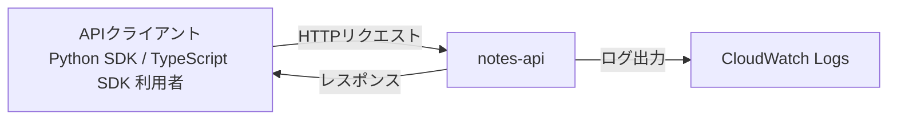
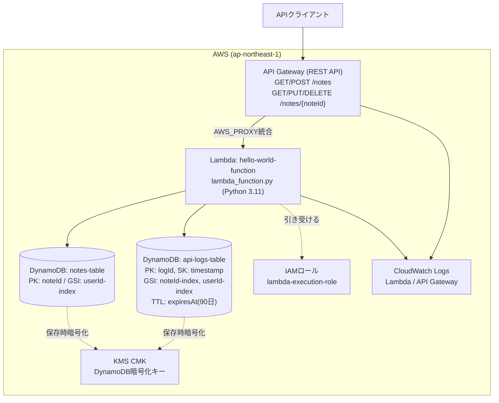

# notes-api アーキテクチャ

## サマリ

メモ(Note)の作成・取得・一覧・更新・削除を提供するREST APIアプリ。AWS API Gateway + Lambda(Python 3.11) + DynamoDBのサーバーレス構成で、インフラはTerraformで管理する。API仕様はOpenAPI 3.0.3(`openapi.yaml`)で定義し、Python/TypeScriptの2種類のSDKクライアントを提供する。

主要技術: Terraform / AWS API Gateway / AWS Lambda(Python 3.11) / AWS DynamoDB / AWS KMS。

specはまだ作成されていない。機能マップの各行は現時点でコードから読み取れる機能単位を示すが、対応するspecへのリンクは持たない([機能マップ](#機能マップ)参照)。全体の境界は[コンテキスト図](#コンテキスト図)、内部構成は[システム構成図](#システム構成図)を参照。

## 概要

APIクライアント(Python SDK / TypeScript SDKの利用者)からのHTTPリクエストを、単一のLambda関数がAWS_PROXY統合で受け取り、メモデータをDynamoDBに読み書きする。すべてのAPI呼び出しは呼び出しログとして別テーブルに記録され、90日後に自動削除される。

## コンテキスト図

- `APIクライアント` はSDK(`application/client/python-sdk` または `application/client/typescript-sdk`)を通じてAPIを呼び出す利用者、または任意のHTTPクライアント
- `CloudWatch Logs` はLambda・API Gatewayの実行ログの保存先で、アプリからは書き込み専用

## システム構成図

## アーキテクチャ概要

API Gatewayは `/notes`(GET, POST)と `/notes/{noteId}`(GET, PUT, DELETE)の5メソッドをすべて、単一のLambda関数(`hello-world-function-${environment}`)へAWS_PROXY統合でルーティングする。振り分け自体はAPI Gateway側では行わず、Lambda内の `lambda_handler` が `event` の `path` と `httpMethod` を見て処理関数(`list_notes` / `create_note` / `get_note` / `update_note` / `delete_note`)を呼び分ける。

メモ本体は `notes-table`(パーティションキー `noteId`)に保存し、`userId` でのユーザー単位検索は `userId-index` というGSIで行う。API呼び出しはすべて `api-logs-table`(パーティションキー `logId`、ソートキー `timestamp`)に記録され、`noteId` / `userId` それぞれのGSIで検索でき、`expiresAt` 属性のTTLにより90日後に自動削除される。両テーブルは同一のKMS CMKで保存時暗号化される。

リクエストのバリデーション(必須フィールド・`title`/`content` の最大文字数)は、Lambdaが起動時に読み込んだ `openapi.yaml` のスキーマ定義を参照して行う。読み込みに失敗した場合は、コードにハードコードされたフォールバック値(`title` 最大200文字、`content` 最大10000文字、必須フィールド `title`/`content`)で検証する。

## 採用技術

| 技術 | 用途 |
|---|---|
| Terraform (`~> 5.0`, AWSプロバイダー) | AWSインフラのIaC管理 |
| AWS API Gateway(REST API) | HTTPエンドポイントの公開とLambdaへのAWS_PROXY統合 |
| AWS Lambda(Python 3.11) | API処理本体(ルーティング・バリデーション・DynamoDBアクセス・ログ記録) |
| AWS DynamoDB(PAY_PER_REQUEST) | メモデータ(`notes-table`)とAPI呼び出しログ(`api-logs-table`)の永続化 |
| AWS KMS(カスタマーマスターキー) | DynamoDB 2テーブルの保存時暗号化 |
| AWS CloudWatch Logs | Lambda・API Gatewayの実行ログ保存(30日保持) |
| OpenAPI 3.0.3 | API仕様定義。Lambda実行時にバリデーションルールの参照元としても使う |

## 機能マップ

| spec | 機能(利用者から見て) | 役割 | 依存 | 状態 |
|---|---|---|---|---|
| (未作成) | メモをAPI経由で作成・取得・一覧・更新・削除できる | `/notes`・`/notes/{noteId}` のCRUDエンドポイントを提供する | notes-table、`userId-index` GSI | 実装済み(spec未作成) |
| (未作成) | API呼び出しの履歴が自動的に90日間記録・保持される | メモへの操作をすべて `api-logs-table` に記録し、TTLで自動削除する | api-logs-table、`noteId-index`/`userId-index` GSI | 実装済み(spec未作成) |
| (未作成) | Python/TypeScriptから型付きでAPIを呼び出せる | Notes API向けのSDKクライアント(Python / TypeScript)を提供する | notes-apiのエンドポイント仕様(`openapi.yaml`) | 実装済み(spec未作成) |

## 外部サービス

| サービス | 用途 |
|---|---|
| AWS API Gateway | HTTPエンドポイントの公開 |
| AWS Lambda | API処理の実行基盤 |
| AWS DynamoDB | メモデータ・API呼び出しログの永続化 |
| AWS KMS | DynamoDBの保存時暗号化キー管理 |
| AWS CloudWatch Logs | Lambda・API Gatewayの実行ログ保存 |

## 関連ADR

- [0001-multi-app-monorepo-layout.md](../../../doc/adr/0001-multi-app-monorepo-layout.md) — モノレポ構成の方針

## セキュリティ

- DynamoDBの `notes-table` / `api-logs-table` は同一のKMS CMKで保存時暗号化する
- API Gatewayの全メソッドは `authorization = "NONE"` で、認証なしでアクセスできる構成である
- Lambdaのレスポンスは `Access-Control-Allow-Origin: '*'` を含み、全オリジンからのブラウザアクセスを許可する
- `api-logs-table` にはリクエストボディがそのまま(JSON文字列として)保存されるため、メモの本文相当の情報を含みうる
- Lambda実行ロール(`lambda-execution-role`)の権限は、対象2テーブル(とそのGSI)へのDynamoDB操作、対象KMSキーへの暗号化・復号操作、CloudWatch Logsへの書き込みに限定される

## 技術的制約

- Lambda関数は1つ(`hello-world-function-${environment}`)のみで、全エンドポイントの処理を1つの関数内でpath/httpMethodによる分岐で行う
- `openapi.yaml` の読み込みに失敗した場合、リクエストのバリデーションはコード内にハードコードされたフォールバック値で行われ、`openapi.yaml` 側の値と乖離する可能性がある
- `environment` は `yamazaki-dev` / `yamazaki-stg` / `yamazaki-prod` の3値に限定される(Terraform変数のバリデーション)
- DynamoDBは両テーブルともPAY_PER_REQUEST(オンデマンド課金)で、容量のプロビジョニングは行わない
