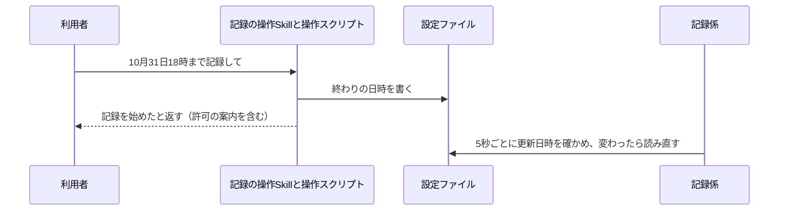
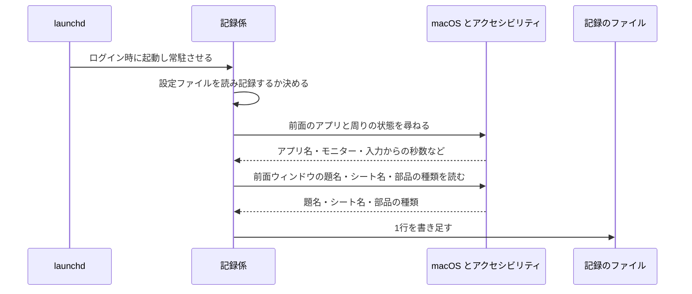
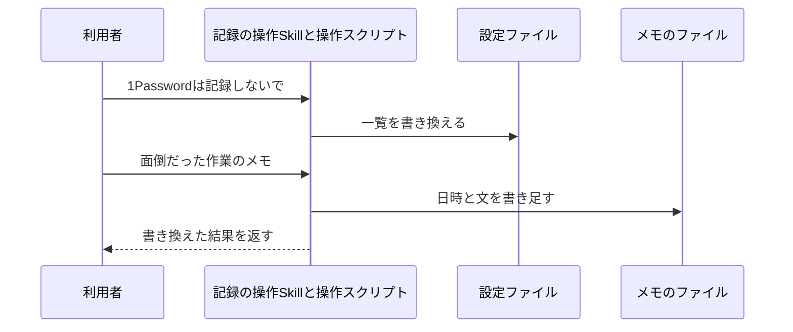
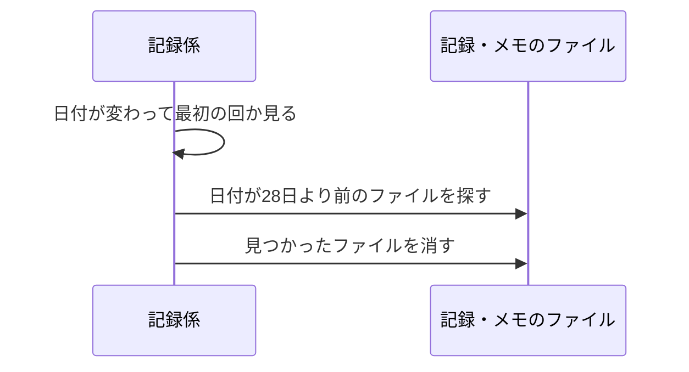

# 操作の記録 設計

## 概要

launchd で常駐する Swift の記録係が、5秒ごとに前面のアプリとその周りの状態・前面ウィンドウの題名を日ごとのファイルに書き足す。題名はアクセシビリティで読み、画面を撮らず、ほかのアプリへ命令(Apple Events)を送らない。チャットの記録の操作Skillは Python の操作スクリプトを呼ぶ。操作スクリプトは設定ファイル(終わりの日時と記録しないアプリ・ことばの一覧)とメモのファイルを書き換える。記録係は設定ファイルの更新日時を5秒ごとに確かめ、変わったときだけ読み直す。記録係は5秒ごとに状態のファイル `recorder-status.json` も書き直し、操作スクリプトがそれを読んで、記録係が動いているか・アクセシビリティの許可があるか・設定が読めたかを、状態の確認で利用者に返す。 〔提案〕

## 決定事項

| 論点 | 選んだ案 | 採らなかった案 | 理由 | 影響範囲 | 出所 |
|---|---|---|---|---|---|
| アプリの中身の取り方 | アクセシビリティで前面ウィンドウの題名・Excelのシート名・カーソルのある部品の種類だけを読む | Apple Events でページ本文・URL・セル位置を取る / 画面を撮って文字起こしする | ブラウザや他アプリを外から操作する動き・画面の撮影は会社のセキュリティ監視に検知されるおそれが高い。題名は、画面の撮影・Apple Events・ブラウザのファイルの読み取りを使わず、どのアプリでもアクセシビリティの属性を読むだけで取れる(監視に検知されないかは未確定。requirements.md#依存関係) | 記録係・週次レポート | 合意 |
| 記録係の作り直しでアクセシビリティの許可が外れる問題 | 記録係を Swift の1本にまとめて決まった場所に置き、キーチェーンアクセスで作る自己署名の証明書で署名する。効かなければ作り直すたびにアクセシビリティの一覧で付け直す | 署名せず置き方だけ工夫する | アクセシビリティの許可は起動したプログラムごとに付く。署名があれば作り直しても同じプログラムとして扱われる見込み | 記録係・セットアップ手順 | 合意 |
| 記録係に持たせる処理 | 情報を集めて書くことと、記録するかどうか・除外の判定だけにする。集計と状態のまとめは操作スクリプトと週次レポート係(Python) | 記録係で集計や状態のまとめもする | 許可の付いたプログラムを作り直す回数を減らす | 記録係・操作スクリプト・週次レポート | 提案 |
| 記録の始め方・止め方の仕組み | 記録係は常に常駐させ、5秒ごとに設定ファイルの終わりの日時を見て、記録するかどうかを決める | Skill が記録係を launchd に登録・解除する | Claude Code から launchctl を使えない。常駐させておけば再起動後の再開も launchd に任せられる | 記録係・Skill | 提案 |
| 記録の形式 | 日ごとのファイルに1行1件の JSON(JSON Lines)で書き足す | SQLite のデータベース | 4週間より古い記録の削除がファイルの削除で済み、書き足すだけなので途中で落ちても壊れにくい | 記録係・操作スクリプト・週次レポート | 提案 |
| 記録しないアプリの見分け方 | 一覧のアプリ名かバンドルIDのどちらかが前面のアプリと一致したら除外する | アプリ名だけで見分ける | 日本語名と英語名の違いで除外が漏れるのを防ぐ | 記録係・Skill | 提案 |
| 記録したくない画面の除外 | 前面ウィンドウの題名に、一覧の「ことば」のどれかが含まれたら除外する | URLの先頭一致で除外する | URLは読まないと決めたため。給与・人事などの画面を題名のことばで外す | 記録係・Skill | 提案 |
| 記録の異常の知らせ方 | 状態の確認(チャット)と、週次レポートの記録の状態で見せる | 利用者への通知(Teams など)を出す | 記録係は外へ何も送らない。異常は状態の確認で見え、取れなかった時間は週次レポートに出る | 記録係・操作スクリプト | 提案 |
| ログの残し方 | アクセシビリティで題名が取れなかった理由は、前回と変わったときだけ書く。ログは消さず、大きさの上限も設けない | 毎回書く / ログを回して古い分を消す | 5秒ごとに同じ行を並べなければ1日に数KBで、回す仕組みを持たずに済む | 記録係・操作スクリプト | 提案 |
| メモの長さの上限 | 1件2,000字まで。超えたら残さずに短くするよう返す | 上限を設けない | 貼り付けた長文(メール本文・ログなど)がメモに入って Claude へ送られるのを防ぎ、週次レポートの材料の量を抑える | 操作スクリプト・週次レポート | 提案 |

残りの決定は折りたたみの中。書式そのものは [appendix.md](appendix.md)。

詳細を開く

承認の判断には効かないが、実装の根拠として残す決定。

| 論点 | 選んだ案 | 採らなかった案 | 理由 | 影響範囲 | 出所 |
|---|---|---|---|---|---|
| Skill の置き場所 | SKILL.md は `~/.claude/skills/routine-work-finder/` に置き、処理は study の操作スクリプトを絶対パスで呼ぶ | 処理も Skill のフォルダに置く | 会議設定の Skill と同じ形。記録係・週次レポート係と同じリポジトリで記録の形式を共有できる | Skill・操作スクリプト | 提案 |
| 繰り返しの回し方 | 記録係のメインのランループで5秒ごとのタイマーを回す | 眠りと起きるを繰り返すだけのループ | ランループを回さないと、前面のアプリの情報が更新されない | 記録係 | 提案 |
| 題名を読む待ち時間 | アクセシビリティの問い合わせ1回につき1秒で打ち切り、取れなかった印を付ける | 待ち時間を設けない | 応答しないアプリで1回分の記録が止まらないようにする | 記録係 | 提案 |
| 入力からの秒数・スリープの抑止・マイクの取り方 | macOS の関数を直接呼び、5秒ごとに別のコマンドを起動しない | ioreg・pmset のコマンドを毎回起動する | CPU の使用率を抑えるため | 記録係 | 提案 |
| 記録が取れなかった時間の見分け方 | 記録している期間の中で、前後の行の間が30秒以上空いた所を取れなかった時間とする | スリープの通知を受けて印を書く | 記録係の処理を増やさずに、スリープ・電源断・ログアウト・記録係の停止・設定が読めなかった回をまとめて拾える | 操作スクリプト・週次レポート | 提案 |
| 取れなかった時間を返す関数の置き場所 | 共通の `records.py` が持ち、状態の確認と週次レポートの集計(aggregate.py)の両方が使う | 週次レポート側で作り直す | 見分け方を1か所に置き、2つの仕様で食い違わせない | 操作スクリプト・週次レポート | 提案 |
| 記録している期間の区切り | 記録を始めたときに「開始」の行を書く。停止の行は、記録のファイルの最後の行が停止の行でなく、今は記録しない状態(終わりの日時を過ぎた・止めた・終わりの日時が無い)の回に書く。停止の行の時刻は、最後の行の時刻と、終わりの日時または止めた日時(`stoppedAt`)の遅い方。終わりの日時が無い場合(`endsAtMissing`)は寄せる先が無いため、その回の時刻 | 区切りの行を書かない / 直前の回まで記録していたときだけ停止の行を書く / 停止の行の時刻を書いた回の時刻のままにする | 止めていた時間を取れなかった時間と取り違えないため。記録係が起動し直した最初の回や、設定が読めなかった回のあとで止めた設定が読めた回でも、記録している期間が閉じる。書いた回の時刻のままだと、Macを閉じていた間に終わりの日時を過ぎたとき、終わりの日時から書いた回までが取れなかった時間に数えられてしまう | 記録係・週次レポート | 提案 |
| タブ群の探し方 | 前面ウィンドウの子を1段だけ見て `AXTabGroup` を探し、選択中タブの名前をシート名とする | ウィンドウの中を深くすべて走査する | 深い走査は遅く、部品の中の文字まで触れてしまう。1段ならExcelのシート名が取れることを実機で確認済み | 記録係 | 提案 |
| 古い記録の削除の担当 | 記録係が、日付が変わって最初の回に消す | 削除用の launchd のジョブを別に作る | ジョブを増やさない。記録を止めていても記録係は常駐している | 記録係 | 提案 |
| メモの置き場 | 日ごとのファイルに分ける | 1つのファイルにまとめる | Skill がメモを消すときと記録係が古い分を消すときに、同じファイルを書き換え合わない | 操作スクリプト・記録係 | 提案 |
| 壊れた設定ファイルの扱い(操作スクリプト) | 初期値で上書きせず、始める・止める・除外の追加と削除を断り、状態の確認で「設定ファイルが読めない」と返す。メモは書ける | 初期値で作り直して書き換えを続ける | 利用者が足した記録しないアプリ・ことばを黙って消さない | 操作スクリプト | 提案 |
| 設定ファイルの書き換え方 | 一時ファイルに書いてから名前を付け替える | 直接上書きする | 記録係が書きかけの設定を読まないため | 操作スクリプト | 提案 |
| 設定ファイルが無いとき(記録係) | 「終わりの日時が無い」として扱い記録しない。`configError` は `null` にし、最後の行が停止の行でなければ、その回の時刻で `endsAtMissing` の停止の行を書く。設定が読めなかった時間は、停止の行より前の空きとして取れなかった時間に残る | 読めない場合と同じく停止の行を書かずに理由を書く | ファイルが無いのは壊れたのではなく、まだ始めていないか利用者が消した状態で、記録している期間を閉じてよい。読めない場合(停止の行を書かない)と区別する | 記録係・週次レポート | 提案 |
| 設定ファイルが読めないとき | その回は記録せず、状態のファイルに理由を書いて終える。停止の行は書かない。その時間は週次レポートで記録が取れなかった時間として見える | 前回読めた設定で記録を続ける / 停止の行を書く | 終わりの日時を確かめられないまま記録を続けない。停止の行を書くと、利用者が止めた時間と区別できず、取れなかった時間から消える | 記録係・週次レポート | 合意 |
| 日時の書き方 | 記録には日本時間の時差を付けた日時を書く | UTC で書く | 日ごとのファイルの区切りと集計の曜日を日本時間で揃える | 記録係・週次レポート | 提案 |

## 処理フロー

### 記録を始める・止める・状態を確かめる

図はこの処理の俯瞰。手順の文章が正。

詳細を開く

チャットで終わりの日時を受け取り、設定ファイルに書く。止めるときは終わりの日時を消し、状態は記録係が書いた状態のファイルと記録のファイルからまとめて返す。

- **対象**: 設定ファイル `config.json`(終わりの日時と記録しないアプリ・ことばの一覧)と、状態のファイル `recorder-status.json`(記録係が5秒ごとに書き直す。中身は最後に動いた日時・アクセシビリティの許可の状態・設定が読めたか。操作スクリプトが状態の確認と記録の開始のときに読み、記録係が動いているか・許可があるかを利用者に返すために使う)
- **手順**:
  1. Skill は、チャットの「10月31日18時まで」のような言い方を日本時間の日時に直して操作スクリプトに渡す。終わりの日時が言われていない場合は、操作スクリプトを呼ばずに終わりの日時を尋ね返す
  2. 操作スクリプトは、終わりの日時が今より後かを確かめる。今と同じか前の場合は書き換えずに「過去の日時」と返し、Skill は終わりの日時を尋ね返す
  3. 設定ファイルを書き換える操作(始める・止める・除外の追加と削除)のどれでも、設定ファイルが無ければ、記録しないアプリの初期値(macOS の「パスワード」アプリ・キーチェーンアクセス・システム設定)と空の記録しないことばで作ってから書き換える。設定ファイルがあるが読めない・形が違う場合は、初期値で上書きせず、設定ファイルの書き換え(始める・止める・除外の追加と削除)を断って「設定ファイルが読めない」(`configUnreadable`)と返す。メモは別のファイルなので書ける。利用者が設定ファイルを手で直すか消すと、次の書き換えから受け付ける(消した場合は、次の書き換える操作で初期値から作る)
  4. 終わりの日時を設定ファイルに書き、止めた日時(`stoppedAt`)を `null` に戻す。記録中に別の日時を言われた場合も同じ手順で上書きする
  5. 状態のファイルを読み、最後に記録係が動いた日時が今より30秒以上前の場合、または状態のファイルがまだ無い場合は、記録係が動いていないことと、README のセットアップの手順を返す
  6. 状態のファイルでアクセシビリティの許可がまだ無い場合は、システム設定の「プライバシーとセキュリティ → アクセシビリティ」の一覧で記録係をオンにする必要があることを返す
  7. 「記録を止めて」と頼まれた場合は、設定ファイルの終わりの日時を消し、止めた日時を書く
  8. 状態を尋ねられた場合は、次をまとめて返す。終わりの日時が今より後なら記録中、そうでなければ停止中。終わりの日時。今日の記録の行数(開始・停止の行は数えない)に5秒を掛けた記録時間。記録が取れなかった時間帯を新しい順に3つまで。取れなかった時間帯は、`records.py` に前日0時から今(状態を尋ねた日時)までの範囲を渡して求める(範囲の終わりの扱いにより、記録係が止まっていて最後の行から今まで30秒以上空いていれば、その時間帯も入る)。状態のファイルから、記録係が動いているか(`updatedAt` が今より30秒以上前、または状態のファイルがまだ無いなら動いていない)・アクセシビリティの許可があるか・設定が読めなかった理由(`configError`)。操作スクリプト自身が設定ファイルを読めない・形が違う場合も「設定ファイルが読めない」と返す。設定ファイルが無い場合は「停止中・終わりの日時なし」とし、「設定ファイルが読めない」とは返さない(ファイルは作らない)
- **関連するビジネスルール**: `requirements.md#記録の始め方・止め方`、`requirements.md#使ってよい期間`

### 5秒ごとに操作と題名を記録する

図はこの処理の俯瞰。手順の文章が正。

詳細を開く

5秒ごとに、記録している期間なら前面のアプリとその周りの状態、前面ウィンドウの題名とExcelのシート名・部品の種類を1行にまとめて、その日のファイルに書き足す。

- **対象**: 記録のファイル `records/<日付>.jsonl` と状態のファイル `recorder-status.json`
- **手順**:
  1. launchd はログインしたときに記録係を起動し、落ちたら起動し直す。記録係はメインのランループで5秒ごとのタイマーを回す
  2. 設定ファイルの更新日時が前回と変わっていれば読み直す。設定ファイルが無い場合は「終わりの日時が無い」として扱い、`configError` を `null` にして手順3へ進む(最後の行が停止の行でなければ `endsAtMissing` の停止の行を書く)。読めない・形が違う場合は記録しない側に倒し、状態のファイルに「設定が読めない」と理由を書いて、この回を終える。停止の行は書かず、この回は「記録していない回」として扱う。設定が読めるようになった最初の回は手順4で「開始」の行を書くため、読めなかった間は、読む側で記録が取れなかった時間として見える
  3. 終わりの日時が無いか、今がその日時以降の場合は記録しない。記録のファイルの最後の行が停止の行でなければ、理由(終わりの日時を過ぎた / 止める依頼 / 終わりの日時が無い)を付けた「停止」の行を書く。最後の行がすでに停止の行なら書かない。状態のファイルを書き直して、この回を終える
     - 停止の理由は設定から見分ける。終わりの日時(`endsAt`)が有り今がそれ以降なら `endsAtPassed`、`endsAt` が無く `stoppedAt` が有れば `stopRequested`、どちらも無ければ `endsAtMissing`
     - 停止の行の時刻は、終わりの日時を過ぎて書く場合は「記録のファイルの最後の行の時刻」と「終わりの日時」の遅い方、止める依頼で書く場合は「最後の行の時刻」と `stoppedAt` の遅い方とする。終わりの日時と `stoppedAt` がどちらも無い場合は、理由を「終わりの日時が無い」(`endsAtMissing`)とし、寄せる先が無いため時刻はその回の時刻とする(それまでに設定が読めなかった時間があれば、停止の行より前の空きとして取れなかった時間に残る)。停止の行は、その時刻の日本時間の日付のファイルに書き足す。例: 終わりの日時が水曜18時で、Macを水曜17時30分に閉じて木曜9時に開いた場合、停止の行は水曜18時の時刻で水曜のファイルに書かれ、17時30分〜18時だけが記録が取れなかった時間になる
     - 最後の行の時刻と種類は記録係が覚えておく。起動した最初の回は、いちばん新しい記録のファイルの最後に読める行を読んで初期値にする。最終行が書きかけ(JSON として読めない)なら飛ばして1つ前の行を使う。記録のファイルが無い・読める行が無い場合は停止の行とみなす
     - このため、記録係が起動し直した最初の回や、設定が読めなかった回のあとで止めた設定が読めた回でも、記録している期間が停止の行で閉じる
  4. 記録している期間で、直前の回に記録していなかった場合(記録係が起動した直後を含む)は「開始」の行を書く
  5. 前面のアプリの表示名とバンドルIDを尋ねる。記録しないアプリの一覧のアプリ名かバンドルIDのどちらかと一致した場合は、時刻と「除外中」の印だけの行を書き、この回を終える(題名も読まない)
  6. マウスカーソルのあるモニターの番号、最後のキーボードかマウスの入力からの秒数、画面ロック中かどうか、既定のマイクが使用中かどうか、画面のスリープを止めているアプリがあるかどうかを、macOS の関数で尋ねる
  7. アクセシビリティで前面ウィンドウの題名を読む。読めた題名に、記録しないことばの一覧のどれかが含まれる場合は、時刻と「除外中」の印だけの行を書き、この回を終える(アプリ名も題名も残さない)
  8. どのアプリでも、カーソルのある部品の種類(role と、あれば subrole)を読む。前面のアプリが Excel の場合は、加えて前面ウィンドウの子を1段だけ見てタブ群を探し、選択中タブの名前をシート名として読む。部品の中の文字は読まない
  9. 題名が1,000字を超える場合は先頭の1,000字に切り詰めて切り詰めた印を付ける
  10. アクセシビリティの問い合わせは合わせて1秒で打ち切る。前面ウィンドウが取れない・許可が無い・打ち切りの場合は、アプリ名だけを残し、取れなかった印と理由を付ける。許可の有無は状態のファイルにも書く
  11. 時刻・前面のアプリ・バンドルID・モニター・入力からの秒数・画面ロック・マイク・スリープの抑止と、取れた題名・シート名・部品の種類を1行にまとめ、その日の記録のファイルに書き足す。その日のファイルが無ければ作る
  12. 状態のファイルに、この回の日時・所要ミリ秒・記録中かどうか・アクセシビリティの許可の状態を書き直す
- スリープ中・電源が切れている間・ログアウトしている間はタイマーが動かないため、行が書かれない。この空きを、読む側が「記録が取れなかった時間」として扱う(「開始」の行の直前の空きも含む)
- **関連するビジネスルール**: `requirements.md#操作の記録`、`requirements.md#ウィンドウの題名の記録`、`requirements.md#記録しないアプリ・ことばの一覧`、`requirements.md#記録する間隔`、`requirements.md#記録しないもの`、`requirements.md#日付と週の基準`

### 記録しないアプリ・ことばを変える・メモを書き足す

図はこの処理の俯瞰。手順の文章が正。

詳細を開く

記録しないアプリ・ことばの一覧を設定ファイルで書き換え、面倒だった作業のメモを日ごとのメモのファイルに書き足す・一覧にする・消す。

- **対象**: 設定ファイル `config.json` と、メモのファイル `memos/<日付>.jsonl`
- **手順**:
  1. 記録しないアプリの追加では、アプリ名を受け取る。Skill は、`/Applications` などにある同じ名前のアプリからバンドルIDが分かれば一緒に渡す。同じ名前がすでにあれば何もせず「すでにある」と返す
  2. 記録しないことばの追加では、題名に含めて除外したいことばを受け取る。前後の空白を除いて空でないことを確かめる
  3. 削除では、一覧にある名前・ことばと完全に一致するものを消す。一致するものが無ければ書き換えずに今の一覧を返す
  4. 追加・削除のあとは、一時ファイルに書いてから名前を付け替えて設定ファイルを書き換え、今の一覧を返す。設定ファイルが無ければ初期値から作ってから書き換え、あるが読めない・形が違う場合は、書き換えずに「設定ファイルが読めない」(`configUnreadable`)と返す(「記録を始める・止める・状態を確かめる」の手順3)。記録係は次の回に更新日時の変化で読み直すため、次の記録の時点から反映される
  5. 一覧を尋ねられた場合は、設定ファイルの記録しないアプリとことばを返す。設定ファイルが無ければ初期値を返し、ファイルは作らない。あるが読めない・形が違う場合は「設定ファイルが読めない」と返す
  6. メモを頼まれた場合は、文が2,000字を超えるなら書き足さずに、2,000字以内に短くするよう返す。2,000字以内なら、記録中かどうかにかかわらず、今の日時・メモの番号・文を、その日のメモのファイルに書き足し、残したことと番号を返す
  7. その週のメモの一覧を尋ねられた場合は、日本時間のその週の月曜から今日までのメモのファイルを読み、日時と番号と文を古い順に返す
  8. メモの削除では番号を受け取り、そのメモが入っている日のファイルから該当の行を除いて書き直す。番号が見つからなければ何も消さずにその旨を返す
- **関連するビジネスルール**: `requirements.md#記録しないアプリ・ことばの一覧`、`requirements.md#面倒だった作業のメモ`、`requirements.md#日付と週の基準`

### 4週間より古い記録を消す

図はこの処理の俯瞰。手順の文章が正。

詳細を開く

記録係が日付の変わった最初の回に、ファイル名の日付が今日から28日より前の記録・メモのファイルを消す。

- **対象**: `records/`・`memos/` の日ごとのファイル
- **手順**:
  1. 記録係は、前回消した日付を覚えておき、今日の日付と違う回(記録係が起動した最初の回を含む)で削除を行う。記録を止めている期間も行う
  2. 2つのフォルダのうち、ファイル名が日付の形をしていて、その日付が今日から28日より前のファイルを消す。日付の形でないファイルは触らない
  3. 消したファイルの数をログに書く。消せなかったファイルはログに書き、翌日にもう一度試す
- **関連するビジネスルール**: `requirements.md#古い記録の削除`、`requirements.md#記録を残す場所と期間`、`requirements.md#日付と週の基準`

## バリデーション

操作スクリプトは終わりの日時が今より後か、記録しないことばが空でないか、メモの文が空でないかを確かめ、NG なら何も書かずに理由を返す 〔提案〕

詳細を開く

- 終わりの日時: 日時として読めて、今より後であること。NG なら書き換えずに「終わりの日時がない / 過去の日時」と返す
- 記録しないアプリ: 空でないこと
- 記録しないことば: 前後の空白を除いて空でないこと
- メモ: 前後の空白を除いて空でないこと。長さは2,000字までとし、超えたら書かずに短くするよう返す
- メモの番号(削除): 形が appendix.md の「メモのファイルの形」の番号に合うこと
- 記録係は設定ファイルの形を確かめ、決まった項目が欠けている・型が違う場合は記録しない(エラーハンドリングを参照)

## エラーハンドリング

記録係は、設定ファイルが読めない回は記録せず、状態のファイルに理由を書いて終え、その時間は週次レポートで記録が取れなかった時間として見える 〔合意〕

記録係は1回分の失敗で止まらず、取れなかった印を残して次の回に進む。設定が読めない理由は状態の確認で知らせ、Teams などへの通知は出さない 〔提案〕

詳細を開く

- アクセシビリティの問い合わせの失敗(打ち切り・許可なし・前面ウィンドウが取れないなど)は、その行に取れなかった印と理由を付けて続ける。理由が前回と変わったときだけログに書き、5秒ごとに同じエラーを並べない
- macOS の関数で周りの状態が取れなかった項目は、その項目を空にして行を書く
- 記録のファイルへの書き込みに失敗した場合は、ログに書き、状態のファイルに最後のエラーとして残す。次の回にもう一度書く
- 設定ファイルが読めない・形が違う場合は、その回を記録せず、停止の行も書かない。状態のファイルの理由を、操作スクリプトが状態の確認で返す。読めなかった間は行が無いため、週次レポートでは記録が取れなかった時間として見える。操作スクリプトは壊れた設定ファイルを初期値で上書きせず、設定ファイルの書き換えを断る。利用者が手で直すか消すと元に戻る(消した場合は、設定ファイルを書き換える操作(始める・止める・除外の追加と削除)のどれかで初期値から作る)
- 設定ファイルが無い場合、記録係はそれを「終わりの日時が無い」として扱い、記録しない。`configError` は `null` にし、最後の行が停止の行でなければ `endsAtMissing` の停止の行を書く。読めない・形が違う場合(停止の行を書かない)とは区別する
- 記録係が落ちた場合は launchd が起動し直す。起動し直したあとの最初の回で「開始」の行を書くため、落ちていた間は取れなかった時間として見える
- 操作スクリプトは、状態のファイルの `updatedAt` が今より30秒以上前の場合に記録係が動いていないと判断し、記録を始める・状態を確かめるときに知らせる
- 利用者への通知(Teams など)は出さない。記録の異常は状態の確認と週次レポートの記録の状態で見える

## 関連するファイル(抜粋)

新規は記録係(Swift)・操作スクリプト(Python)・launchd の設定・記録の操作Skill。既存のものは変更しない 〔提案〕

詳細を開く

新規(`apps/routine-work-finder/` の下):

- `README.md` — 前提条件・コマンド・セットアップ(証明書の作り方・記録係の置き方・アクセシビリティの許可・launchd への登録)・解除・ログ
- `application/recorder/Package.swift` — 記録係の Swift パッケージ。外部の依存は持たない
- `application/recorder/Sources/RecorderCore/` — 判定と行の組み立て(設定の読み取り・記録するかの判定・アプリの除外の判定・題名のことばでの除外の判定・題名の切り詰め・行の書き方・古いファイルの選び方)。テストできる形にまとめる
- `application/recorder/Sources/rwf-recorder/` — macOS とアクセシビリティに尋ねる部品と、5秒ごとの繰り返し
- `application/recorder/Tests/RecorderCoreTests/` — 判定と行の組み立てのテスト(Swift Testing)
- `application/scripts/install_recorder.sh` — 記録係を作り、自己署名の証明書で署名して決まった場所に置く
- `application/launchd/com.example.routine-work-finder-recorder.plist` — 記録係の常駐の設定
- `application/routine_work_finder/paths.py` — データフォルダとファイルの場所
- `application/routine_work_finder/config_store.py` — 設定ファイルの読み書き
- `application/routine_work_finder/records.py` — 記録・メモのファイルを期間で読む共通の処理と、記録している期間の中で前後の行の間が30秒以上空いた所(記録が取れなかった時間)を返す関数。範囲の始まりが記録している期間の内か外かは、範囲の直前の行(範囲より前のファイルの最後に読める行。28日の保持で無ければ期間の外)で決め、期間の内で直前の行から範囲内の最初の行までが30秒以上空いていれば、範囲の始まりから最初の行までを空きとして扱う。範囲の終わりは、範囲の最後の行が記録している期間の内(停止の行でない)で、範囲の終わりまで30秒以上空いていれば、最後の行から範囲の終わりまでを空きとして扱う(範囲の後の行は見ない)(appendix.md「操作の記録の行の形」)。週次レポートの集計(aggregate.py)もこの関数を使い、作り直さない
- `application/routine_work_finder/control.py` — 操作スクリプトの入口(始める・止める・状態・除外・メモ)
- `application/tests/` — 操作スクリプトのテスト(unittest)と、plist の検査・記録係のソースの走査(構造検証)
- `~/.claude/skills/routine-work-finder/SKILL.md` — 記録の操作Skill

データ(リポジトリの外):

- `~/Library/Application Support/routine-work-finder/` — 設定・状態・記録・メモ・署名した記録係。構成は appendix.md の「データフォルダの構成」

変更: なし

## セキュリティ

記録係は、記録しないアプリには題名も読まず、記録しないことばに当たる画面は題名を書く前に捨てる。記録係がアクセシビリティで読むのは題名・シート名・部品の種類だけで、部品の中の文字は読まない 〔提案〕

詳細を開く

- **認証情報の画面を残さない**: 記録しないアプリが前面のときは、アプリ名も題名も書かない。初期値は macOS の「パスワード」アプリ・キーチェーンアクセス・システム設定。他社のパスワード管理アプリは利用者がチャットで追加する
- **記録したくない画面**: 前面ウィンドウの題名を読んだ時点でメモリの中でことばを判定し、当たれば題名を書かずに捨てる
- **部品の中の文字は読まない**: アクセシビリティで読むのは、ウィンドウの題名・Excelの選択シート名・カーソルのある部品の種類(role / subrole)だけ。入力欄・メール本文・セルの値・一覧の中身は読まない
- **取らないもの**: 画面の画像、題名・シート名・部品の種類のほかの画面に見えている文字、キーボードで打った文字の中身、カメラは、取る処理そのものを持たない
- **アプリを起動しない**: 前面にある(起動している)アプリのウィンドウだけを読む。終了しているアプリに尋ねて起動させることはしない
- **記録の置き場所**: `~/Library/Application Support/routine-work-finder/` に置き、フォルダは本人だけが読み書きできる権限(700)、ファイルは600にする。同期フォルダには置かない
- **自己署名の証明書**: ログインキーチェーンに作り、用途はコード署名だけにする。書き出し・共有はしない。この証明書で署名するのは記録係だけ
- **Skill からの入力**: メモの文・アプリ名・ことばは JSON の文字列として書き、シェルのコマンドに埋め込まない。Skill は操作スクリプトに引数の配列として渡す
- **社外への送信**: 記録係と操作スクリプトは外へ何も送らない。Claude への送信は `weekly-automation-report/requirements.md#社外へ送るもの` で扱う
- 使ってよい期間(クライアント業務に就いていない期間)の判断は利用者が行い、この仕組みは判定しない。終わりの日時の無い記録は始めない

## パフォーマンス

記録係は、5秒ごとに別のコマンドを起動せず、アクセシビリティの問い合わせは前面のウィンドウだけに絞り、1秒で打ち切る 〔提案〕

詳細を開く

- 入力からの秒数・スリープの抑止・マイク・画面ロックは macOS の関数を直接呼び、ioreg・pmset のコマンドを起動しない
- アクセシビリティの問い合わせは前面ウィンドウの題名・選択シート名・カーソルの部品に絞り、ウィンドウの中を深く走査しない。合わせて1秒で打ち切る
- 設定ファイルは更新日時が変わったときだけ読み直す
- 記録しない回は、設定ファイルの更新日時を確かめ、状態のファイルを書き直して終える。ほかに行うのは、最後の行が停止の行でないときの停止の行の書き足し、日付が変わった最初の回の古い記録の削除、起動した最初の回の記録のファイルの最後の行の読み取りだけで、macOS やアクセシビリティには尋ねない

## ログ

記録係は、記録の開始・停止、設定の読み直し、アクセシビリティで題名が取れなかった理由が変わったとき、記録のファイルへの書き込みの失敗、古い記録の削除をログに書き、操作スクリプトは書き換えた操作を1行ずつ残す。どちらも1日に数KBのため消さない 〔提案〕

詳細を開く

- 記録係のログ `~/Library/Logs/routine-work-finder-recorder.log`(launchd の標準出力・標準エラー)
  - 記録係の起動(INFO)
  - 記録の開始・停止と理由(INFO)
  - 設定ファイルの読み直しと読めなかった理由(INFO / WARN)
  - アクセシビリティで取れなかった理由が変わったとき(WARN)。同じ理由が続く間は書かない
  - 記録のファイルへの書き込みの失敗(ERROR)
  - 古い記録の削除の件数と、消せなかったファイル(INFO / WARN)
- 操作スクリプトのログ `~/Library/Application Support/routine-work-finder/control.log`
  - 始める・止める・終わりの日時の置き換え・除外の追加と削除・メモの追加と削除(INFO)。メモの文は書かず番号だけを書く
- ログに題名・シート名・メモの文は書かない
- 2つのログは消さず、大きさの上限も設けない。根拠: 取れなかった理由は変わったときだけ書き、5秒ごとの行は書かないため、1日に数十行(数KB)、1年でも数MBにとどまる見込み。大きくなった場合は、利用者がファイルを消して記録係を launchd で起動し直せば作り直される(操作スクリプトのログは次の書き込みで作り直される)
- 書式は appendix.md の「ログの書式」

## テスト戦略

requirements の [n] 全44項目に割り当て済み・漏れなし。テストを置かないのは1項目(使ってよい期間-2)、出荷後の実測で確かめるのは2項目(非機能-1 は実測だけで、非機能-2 は性能テストに加えて出荷後にも確かめる) 〔提案〕

詳細を開く

記録係の判定と行の組み立ては Swift Testing(`swift test`)、操作スクリプトと記録係のソースの走査は unittest で書く。macOS とアクセシビリティに尋ねる部品は環境スモークで確かめる。

| 仕様項目 | リスク種別 | テスト種別 | 量の目安 | 備考 |
|---|---|---|---|---|
| 記録の始め方・止め方-1 | 論理 | 単体 | 正常1 + 分岐3 | 操作スクリプト。終わりの日時が設定ファイルに書かれ、`stoppedAt` が `null` に戻る。設定ファイルが無い状態から始めると、初期値で作ってから終わりの日時を書く。設定ファイルがあるが壊れている場合は初期値で上書きせず `configUnreadable` で断り、ファイルの中身が変わらない。`stoppedAt` が欠けた設定ファイルは `null` とみなして読める |
| 記録の始め方・止め方-1 | 境界 | 契約 | 正常2 + 失敗形3 | 操作スクリプトが書いた設定ファイルを記録係が読む。fixture は操作スクリプトの単体テストが書き出したファイル。必須の項目の欠け・型違い・壊れた JSON で記録しない側に倒れる。`stoppedAt` が欠けた設定は記録係も読める(`null` とみなす) |
| 記録の始め方・止め方-2 | 論理 | 単体 | 分岐2 | 日時なし・過去の日時で書き換えない |
| 記録の始め方・止め方-3 | 論理 | 単体 | 正常1 | 記録中の上書き |
| 記録の始め方・止め方-4 | 論理 | 単体 | 境界値6 + 分岐8 | 記録係の判定。設定ファイルが無い場合は記録しない状態で、`configError` を `null` にし、最後の行が停止でなければ `endsAtMissing` の停止の行を書く・最後の行が停止なら書かない(設定が読めない場合は停止の行を書かないことと区別する)。終わりの日時の1秒前・ちょうど・後。停止の行が1回だけ書かれる。起動し直した最初の回と、設定が読めるようになった回に、記録しない状態なら停止の行を書く。最後の行がすでに停止の行なら書かない。停止の行の時刻: 終わりの日時が水曜18時で最後の行が17時30分、木曜9時に書く場合は水曜18時(水曜のファイル)。最後の行が終わりの日時より後なら最後の行の時刻。止める依頼では `stoppedAt` と最後の行の遅い方。`endsAt` と `stoppedAt` がどちらも null なら理由 `endsAtMissing`・時刻はその回の時刻(設定が読めなかった時間が停止の行より前の空きとして残る)。起動した最初の回の最後の行の読み取り: 書きかけの最終行を飛ばして1つ前を使う・ファイルが無い場合は停止とみなす・読める行が無い場合も停止とみなす |
| 記録の始め方・止め方-5 | 論理 | 単体 | 正常1 | 止めると終わりの日時が消え、記録係の判定が停止になる |
| 記録の始め方・止め方-6 | 論理 | 単体 | 正常1 + 分岐9 + 境界値2 | 設定ファイルが無いときは「停止中・終わりの日時なし」を返し、「設定ファイルが読めない」とは返さない。記録中・停止中・記録係が止まっている・取れなかった時間帯の抽出・設定が読めなかった理由(`configError`)を返す。状態のファイルがまだ無いときは記録係が動いていないと返す。操作スクリプトが設定ファイルを読めないときは「設定ファイルが読めない」と返す。取れなかった時間帯は前日0時から今までの範囲で求め、記録中で最後の行が数秒前なら空きを返さない・記録係が止まっていて最後の行から今まで30秒以上空いていればその時間帯を返す。記録時間に開始・停止の行を数えない。記録係が止まっているとみなす境目は `updatedAt` が今より29秒前(動いている)と30秒前(止まっている) |
| 記録の始め方・止め方-7 | 環境 | 環境スモーク | 1回 | ログアウトしてログインし、終わりの日時より前なら開始の行が書かれる |
| 記録の始め方・止め方-7 | 生成物 | 構造検証 | 1件 | 記録係の launchd の設定ファイルを plistlib で読め、ログイン時の起動と落ちたときの起動し直しの指定があり、実行ファイルの場所が決まった場所を指す |
| 記録の始め方・止め方-8 | 論理 | 単体 | 分岐2 | 操作スクリプトが、状態のファイルでアクセシビリティの許可が無い・あるを読み分けて案内を返す |
| 操作の記録-1 | 環境 | 環境スモーク | 1回 | launchd から起動し、7項目が入った行が5秒ごとに書かれる |
| 操作の記録-1 | 境界 | 契約 | 正常1 + 失敗形2 | 記録係が書いた行を Python の共通の読み取り処理で読む。fixture は記録係の単体テストが書き出した行。書きかけの最終行・知らない項目を読み飛ばす |
| 操作の記録-2 | 論理 | 単体 | 分岐2 | アプリ名一致・バンドルID一致で除外中の行だけになる |
| 操作の記録-3 | 環境 | 環境スモーク | 1回 | launchd から動く記録係で、Macをスリープさせて戻ったあと、状態の確認がその空きを記録が取れなかった時間として返す(tasks.md タスク18) |
| 操作の記録-3 | 環境 | 単体 | 境界値7 + 分岐5 | 環境スモークを補う、`records.py` の取れなかった時間の抽出。空き29秒・30秒・停止中の空きは数えない。範囲の始まり: 範囲内に開始の行が無い週で、直前の行が通常の行なら月曜0時から最初の行までを数える・直前の行が停止の行なら数えない・直前の行が無い(28日より前)なら数えない。範囲をまたぐ空き: 日曜23:59:58→月曜0:00:03(5秒)は数えない・日曜23:59:50→月曜0:00:30(40秒)は月曜0:00〜0:00:30を数える。範囲の終わり: 範囲の終わりが金曜17時で最後の行が金曜15時なら15時〜17時を数える・最後の行が停止の行なら数えない・最後の行から範囲の終わりまで29秒は数えず30秒は数える |
| ウィンドウの題名の記録-1 | 境界 | 契約 | 正常1 + 失敗形2 | 記録係がアクセシビリティから読んだ題名の行への組み込み。fixture は実装時に記録係で取った実応答(題名は置き換える)。空の題名・前面ウィンドウなし |
| ウィンドウの題名の記録-2 | 境界 | 契約 | 正常1 + 失敗形1 | Excel の選択シート名(タブ群)。fixture は実装時に取った実応答。タブ群が無いアプリで空になる |
| ウィンドウの題名の記録-3 | 境界 | 契約 | 正常1 + 失敗形1 | カーソルの部品の種類(role / subrole)。fixture は実機で取った role 名(AXLayoutArea・AXWebArea など)。部品が取れないとき |
| ウィンドウの題名の記録-1 | 環境 | 環境スモーク | 1回 | launchd から動く記録係で、VS Code・Chrome・Teams・Outlook・Excel の題名が行に入る(tasks.md タスク18) |
| ウィンドウの題名の記録-2 | 環境 | 環境スモーク | 1回 | 同じ確認で、Excel のシート名が行に入る(tasks.md タスク18) |
| ウィンドウの題名の記録-3 | 環境 | 環境スモーク | 1回 | 同じ確認で、各アプリの部品の種類が行に入る(tasks.md タスク18) |
| ウィンドウの題名の記録-4 | 境界 | 契約 | 失敗形3 | 前面ウィンドウなし・許可なし・打ち切りを理由に分ける |
| ウィンドウの題名の記録-5 | 論理 | 単体 | 境界値3 | 999字・1,000字・1,001字。切り詰めた印 |
| 記録しないアプリ・ことばの一覧-1 | 論理 | 単体 | 正常1 | 設定ファイルの初期値 |
| 記録しないアプリ・ことばの一覧-2 | 論理 | 単体 | 正常1 | 記録しないことばの初期値が空 |
| 記録しないアプリ・ことばの一覧-3 | 論理 | 単体 | 正常1 | 題名にことばが含まれると行にアプリ名も題名も入らない |
| 記録しないアプリ・ことばの一覧-4 | 論理 | 単体 | 境界値3 | 題名の先頭・途中・末尾に含まれる場合に当たる・含まれない場合は当たらない |
| 記録しないアプリ・ことばの一覧-5 | 論理 | 単体 | 正常2 + 分岐3 | 追加・削除・重複・一致なし・設定ファイルが壊れているときは書き換えず `configUnreadable` で断る(メモは書ける)。記録係が更新日時の変化で読み直す |
| 記録しないアプリ・ことばの一覧-6 | 論理 | 単体 | 正常1 + 分岐1 | 一覧を返す。設定ファイルが無いときは初期値を返し、ファイルを作らない |
| 面倒だった作業のメモ-1 | 論理 | 単体 | 正常1 + 分岐1 | 空の文を断る |
| 面倒だった作業のメモ-2 | 論理 | 単体 | 正常1 | 停止中でも書ける |
| 面倒だった作業のメモ-3 | 論理 | 単体 | 正常1 | 週の範囲のメモを古い順に返す |
| 面倒だった作業のメモ-4 | 論理 | 単体 | 正常1 + 分岐1 | 番号が見つからない |
| 面倒だった作業のメモ-5 | 境界 | 単体 | 境界値3 | 1,999字・2,000字は残り、2,001字は残さず `tooLong` を返す |
| 古い記録の削除-1 | 論理 | 単体 | 境界値3 | 27日前・28日前・29日前。日付の形でないファイルは触らない |
| 古い記録の削除-2 | 論理 | 単体 | 正常1 | 停止中の日付の変わり目でも削除の判定が動く |
| 記録する間隔-1 | 環境 | 環境スモーク | 1回 | 操作の記録-1 と同じ確認で、行の間隔が5秒であること |
| 記録する間隔-2 | 論理 | 単体 | 正常1 | 題名・シート名・部品の種類が同じ5秒の行に入る(ウィンドウの題名の記録-1 のテストで兼ねる) |
| 使ってよい期間-1 | 論理 | 単体 | 正常1 | 記録の始め方・止め方-2 のテストで兼ねる |
| 使ってよい期間-2 | 論理 | なし | — | 利用者の判断の運用ルールで、仕組みが判定しない |
| 記録しないもの-1 | 論理 | 構造検証 | 1件 | 記録係のソース(`recorder/Sources/`)を走査し、画面収録の関数(`CGWindowListCreateImage`・`CGDisplayCreateImage`・`ScreenCaptureKit`・`SCStream` 等)と Apple Events(`NSAppleScript`・`NSAppleEventDescriptor`・`AESendMessage` 等)を呼んでいないことを確かめる。否定確認は呼び出しを1行足して落ちること |
| 記録しないもの-2 | 論理 | 構造検証 | 1件 | 同じ走査で、キー入力を受け取る関数(`CGEvent.tapCreate`・`NSEvent.addGlobalMonitorForEvents` 等)を呼んでいないことを確かめる |
| 記録しないもの-3 | 論理 | 構造検証 | 1件 | 同じ走査で、カメラを使う型(`AVCaptureDevice`・`AVCaptureSession` 等)を使っていないことを確かめる |
| 記録しないもの-4 | 論理 | 構造検証 | 1件 | 同じ走査で、部品の中の文字を返す属性(`kAXSelectedTextAttribute`・`kAXSelectedTextRangeAttribute`・`kAXStringForRangeParameterizedAttribute` 等)を読んでいないこと、`kAXValueAttribute` はタブの選択状態を見る1か所(Excel のシート名の読み取り)だけで使うこと、読む属性が許可リストの8つ(`kAXFocusedWindowAttribute`・`kAXTitleAttribute`・`kAXFocusedUIElementAttribute`・`kAXRoleAttribute`・`kAXSubroleAttribute`・`kAXChildrenAttribute`・`kAXTabsAttribute`・`kAXValueAttribute`。appendix.md「アクセシビリティの読み方」)に限られることを確かめる |
| 日付と週の基準-1 | 論理 | 単体 | 境界値2 | 日本時間の 23:59:59 と 0:00:00(UTC では 14:59:59 と 15:00:00)で、書き足す日のファイルと28日の数え方が日本時間の日付に従う |
| 日付と週の基準-2 | 論理 | 単体 | 境界値2 | 日曜 23:59 のメモは前の週、月曜 0:00 のメモはその週の一覧に入る |
| 記録を残す場所と期間-1 | 論理 | 単体 | 正常1 + 分岐1 | データフォルダが同期フォルダの下でないこと・権限が700 |
| 記録を残す場所と期間-2 | 論理 | 単体 | 正常1 | 古い記録の削除-1 のテストで兼ねる |
| 非機能-1 | 非機能 | 出荷後の実測 | 1日分 | 記録中の1日、記録係のプロセスの CPU 使用率の平均を ps で測り5%以下(tasks.md タスク18) |
| 非機能-2 | 非機能 | 性能 | 1件 | 判定と行の組み立てが1回20ミリ秒以内(`recorder/Tests/RecorderCorePerfTests/`)。アクセシビリティの問い合わせは1秒の打ち切りで上限を作り、状態のファイルの所要ミリ秒で出荷後に確かめる |
| 非機能-3 | 非機能 | 性能 | 1件 | 8時間分(5,760行、題名は1,000字の上限近く)を書いたファイルの合計が100MBの2/3以下(`recorder/Tests/RecorderCorePerfTests/`) |

