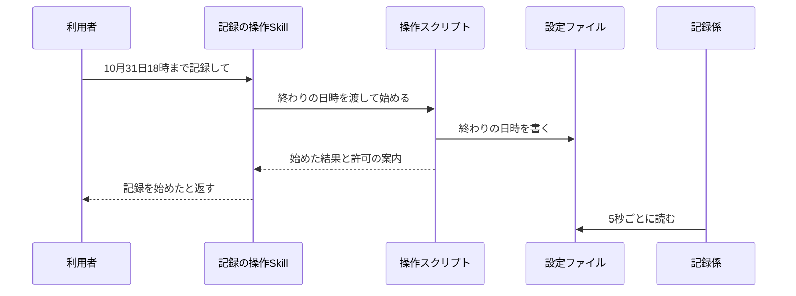
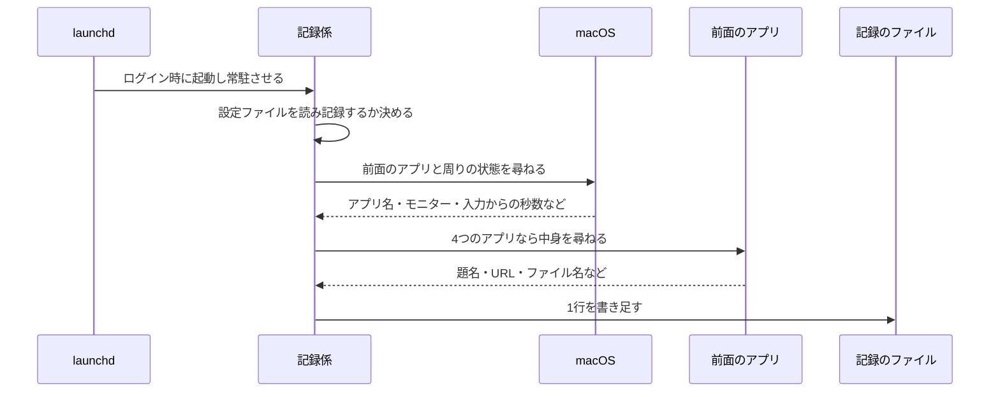
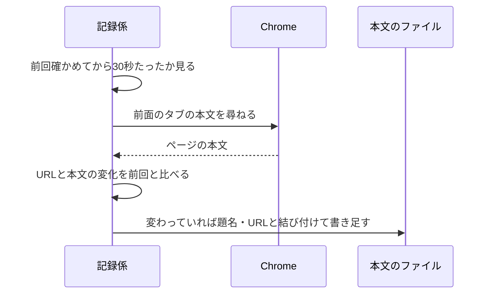
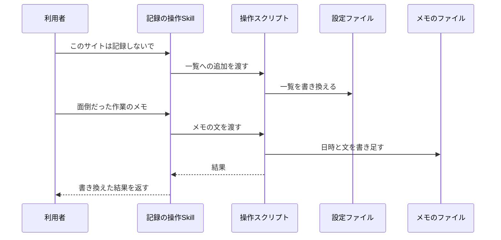
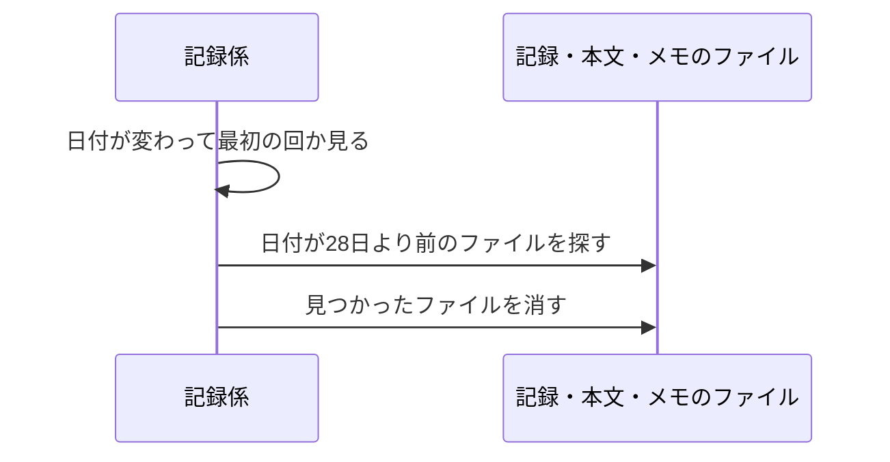

# 操作の記録 設計

## 概要

launchd で常駐する Swift の記録係が、5秒ごとに前面のアプリとその周りの状態・アプリの中身を日ごとのファイルに書き足す。チャットの記録の操作Skillは Python の操作スクリプトを呼び、記録係が毎回読む設定ファイル(終わりの日時と記録しないアプリ・サイトの一覧)とメモのファイルを書き換える。 〔提案〕

## 決定事項

| 論点 | 選んだ案 | 採らなかった案 | 理由 | 影響範囲 | 出所 |
|---|---|---|---|---|---|
| 作り直しでオートメーションの許可が外れる問題 | 記録係を Swift の1本にまとめて決まった場所に置き、キーチェーンアクセスで作る自己署名の証明書で署名する。効かなければ作り直すたびに許可のダイアログに答え直す | 署名せず置き方だけ工夫する / Python から osascript で尋ねる | 署名があれば作り直しても同じプログラムとして扱われる見込み。Python に許可を与えると、ほかの Python のバッチにも Chrome などの操作を許してしまう | 記録係・セットアップ手順 | 合意 |
| 記録係に持たせる処理 | 情報を集めて書くことと、記録するかどうか・除外・本文を取り直すかの判定だけにする。集計と状態のまとめは Python 側 | 記録係で集計や状態のまとめもする | 許可の付いたプログラムを作り直す回数を減らす | 記録係・操作スクリプト・週次レポート | 提案 |
| 記録の始め方・止め方の仕組み | 記録係は常に常駐させ、5秒ごとに設定ファイルの終わりの日時を見て、記録するかどうかを決める | Skill が記録係を launchd に登録・解除する | Claude Code から launchctl を使えない。常駐させておけば再起動後の再開も launchd に任せられる | 記録係・Skill | 提案 |
| 記録の形式 | 日ごとのファイルに1行1件の JSON(JSON Lines)で書き足す | SQLite のデータベース | 4週間より古い記録の削除がファイルの削除で済み、書き足すだけなので途中で落ちても壊れにくい | 記録係・操作スクリプト・週次レポート | 提案 |
| 記録しないアプリの見分け方 | 一覧のアプリ名かバンドルIDのどちらかが前面のアプリと一致したら除外する | アプリ名だけで見分ける | 日本語名と英語名の違いで除外が漏れるのを防ぐ | 記録係・Skill | 提案 |
| Chrome の「Apple Events からの JavaScript を許可」の扱い | 記録を止めたとき・終わりの日時を過ぎたあとの状態確認で、設定をオフに戻すよう案内する | 案内しない | この設定はオートメーションの許可を持つほかのアプリにも Chrome のページの操作を許すため、使わない期間は閉じておく | Skill | 提案 |

残りの決定は折りたたみの中。書式そのものは [appendix.md](appendix.md)。

詳細を開く

承認の判断には効かないが、実装の根拠として残す決定。

| 論点 | 選んだ案 | 採らなかった案 | 理由 | 影響範囲 | 出所 |
|---|---|---|---|---|---|
| Skill の置き場所 | SKILL.md は `~/.claude/skills/routine-work-finder/` に置き、処理は study の操作スクリプトを絶対パスで呼ぶ | 処理も Skill のフォルダに置く | 会議設定の Skill と同じ形。記録係・週次レポート係と同じリポジトリで記録の形式を共有できる | Skill・操作スクリプト | 提案 |
| 繰り返しの回し方 | 記録係のメインのランループで5秒ごとのタイマーを回す | 眠りと起きるを繰り返すだけのループ | ランループを回さないと、前面のアプリの情報が更新されない | 記録係 | 提案 |
| 中身を尋ねる待ち時間 | アプリへの問い合わせ1回につき1秒で打ち切り、取れなかった印を付ける | 待ち時間を設けない | 1回分の記録を2秒以内に終わらせるため | 記録係 | 提案 |
| 入力からの秒数・スリープの抑止・マイクの取り方 | macOS の関数を直接呼び、5秒ごとに別のコマンドを起動しない | ioreg・pmset のコマンドを毎回起動する | CPU の使用率を抑えるため | 記録係 | 提案 |
| 記録が取れなかった時間の見分け方 | 記録している期間の中で、前後の行の間が30秒以上空いた所を取れなかった時間とする | スリープの通知を受けて印を書く | 記録係の処理を増やさずに、スリープ・電源断・ログアウト・記録係の停止をまとめて拾える | 操作スクリプト・週次レポート | 提案 |
| 記録している期間の区切り | 記録を始めた・止めたときに「開始」「停止」の印の行を書く | 区切りの行を書かない | 止めていた時間を取れなかった時間と取り違えないため | 記録係・週次レポート | 提案 |
| 本文を取り直すかの判定 | 本文のハッシュ値と URL を前回取ったときと比べる | 前回の本文をそのまま持って比べる | 記録係が持つ量を小さくする | 記録係 | 提案 |
| 古い記録の削除の担当 | 記録係が、日付が変わって最初の回に消す | 削除用の launchd のジョブを別に作る | ジョブを増やさない。記録を止めていても記録係は常駐している | 記録係 | 提案 |
| メモの置き場 | 日ごとのファイルに分ける | 1つのファイルにまとめる | Skill がメモを消すときと記録係が古い分を消すときに、同じファイルを書き換え合わない | 操作スクリプト・記録係 | 提案 |
| 設定ファイルの書き換え方 | 一時ファイルに書いてから名前を付け替える | 直接上書きする | 記録係が書きかけの設定を読まないため | 操作スクリプト | 提案 |
| 設定ファイルが読めないとき | 記録しない側に倒し、状態のファイルに理由を書く | 前回読めた設定で記録を続ける | 終わりの日時を確かめられないまま記録を続けない | 記録係 | 提案 |
| 本文の件数の数え方 | 日ごとの本文のファイルの行数を、読む側で数える | 件数を別のファイルに書く | 本文のファイルそのものが件数の記録になり、二重に持たない | 操作スクリプト・週次レポート | 提案 |
| 日時の書き方 | 記録には日本時間の時差を付けた日時を書く | UTC で書く | 日ごとのファイルの区切りと集計の曜日を日本時間で揃える | 記録係・週次レポート | 提案 |

## 処理フロー

### 記録を始める・止める・状態を確かめる

図はこの処理の俯瞰。手順の文章が正。

詳細を開く

チャットで終わりの日時を受け取り、設定ファイルに書く。止めるときは終わりの日時を消し、状態は記録係が書いた状態のファイルと記録のファイルからまとめて返す。

- **対象**: 設定ファイル `config.json`(終わりの日時と記録しないアプリ・サイトの一覧)と、記録係が毎回書き直す状態のファイル `recorder-status.json`(最後に記録した日時・アプリごとの許可の状態・設定が読めたか)
- **手順**:
  1. Skill は、チャットの「10月31日18時まで」のような言い方を日本時間の日時に直して操作スクリプトに渡す。終わりの日時が言われていない場合は、操作スクリプトを呼ばずに終わりの日時を尋ね返す
  2. 操作スクリプトは、終わりの日時が今より後かを確かめる。今と同じか前の場合は書き換えずに「過去の日時」と返し、Skill は終わりの日時を尋ね返す
  3. 設定ファイルが無い場合は、記録しないアプリの初期値(パスワード・キーチェーンアクセス・システム設定)と空の記録しないサイトで作る
  4. 終わりの日時を設定ファイルに書く。記録中に別の日時を言われた場合も同じ手順で上書きする
  5. 状態のファイルを読み、最後に記録係が動いた日時が30秒より前の場合は、記録係が動いていないことと、README のセットアップの手順を返す
  6. 状態のファイルで Chrome・Excel・PowerPoint・Finder のうち許可を確かめられていないアプリがある場合は、そのアプリを前面にしたときに許可を求めるダイアログが出ることと、Chrome の「表示 → 開発 / 管理 → Apple Events からの JavaScript を許可」を入れる必要があることを返す
  7. 「記録を止めて」と頼まれた場合は、設定ファイルの終わりの日時を消し、止めた日時を書く。あわせて Chrome の JavaScript の許可をオフに戻すよう案内する
  8. 状態を尋ねられた場合は、次をまとめて返す。終わりの日時が今より後なら記録中、そうでなければ停止中。終わりの日時。今日の記録の行数に5秒を掛けた記録時間。今日と前日のうち記録している期間の中で、前後の行の間が30秒以上空いた時間帯を新しい順に3つまで。終わりの日時を過ぎて停止中になっていて、Chrome の JavaScript の許可の案内をまだしていない場合は、その案内も添える
- **関連するビジネスルール**: `requirements.md#記録の始め方・止め方`、`requirements.md#使ってよい期間`

### 5秒ごとに操作を記録する

図はこの処理の俯瞰。手順の文章が正。

詳細を開く

5秒ごとに、記録している期間なら前面のアプリとその周りの状態、4つのアプリならその中身を1行にまとめて、その日のファイルに書き足す。

- **対象**: 記録のファイル `records/<日付>.jsonl` と状態のファイル `recorder-status.json`
- **手順**:
  1. launchd はログインしたときに記録係を起動し、落ちたら起動し直す。記録係はメインのランループで5秒ごとのタイマーを回す
  2. 設定ファイルの更新日時が前回と変わっていれば読み直す。読めない・形が違う場合は記録しない側に倒し、状態のファイルに「設定が読めない」と理由を書いて、この回を終える
  3. 終わりの日時が無いか、今がその日時以降の場合は記録しない。直前の回まで記録していた場合は、理由(終わりの日時を過ぎた / 止める依頼)を付けた「停止」の行を書く。状態のファイルを書き直して、この回を終える
  4. 記録している期間で、直前の回に記録していなかった場合(記録係が起動した直後を含む)は「開始」の行を書く
  5. 前面のアプリの表示名とバンドルIDを尋ねる。記録しないアプリの一覧のアプリ名かバンドルIDのどちらかと一致した場合は、時刻と「除外中」の印だけの行を書き、この回を終える(アプリへの問い合わせもしない)
  6. マウスカーソルのあるモニターの番号、最後のキーボードかマウスの入力からの秒数、画面ロック中かどうか、既定のマイクが使用中かどうか、画面のスリープを止めているアプリがあるかどうかを、macOS の関数で尋ねる
  7. 前面のアプリが Chrome の場合は、前面のタブの題名と URL を尋ねる。URL が記録しないサイトのどれかで始まる場合は、時刻と「除外中」の印だけの行を書き、この回を終える(題名と URL は捨てる)
  8. 前面のアプリが Excel の場合はブック名・シート名・選んでいるセルの位置、PowerPoint の場合は開いている資料の名前、Finder の場合は前面のウィンドウで開いているフォルダの場所を尋ねる。Excel のセルの値は尋ねない
  9. アプリへの問い合わせは1回につき1秒で打ち切る。打ち切った・許可が無い・Chrome の JavaScript の許可が無い・その他のエラーの場合は、アプリ名だけを残し、取れなかった印と理由を付ける。許可の有無は、アプリごとに状態のファイルにも書く
  10. 上の4つ以外のアプリの場合は、アプリへの問い合わせをせず、アプリ名だけを残す
  11. 時刻・前面のアプリ・バンドルID・モニター・入力からの秒数・画面ロック・マイク・スリープの抑止と、取れた中身を1行にまとめ、その日の記録のファイルに書き足す。その日のファイルが無ければ作る
  12. Chrome の本文を確かめる時刻になっていれば、次の「Chrome のページの本文を記録する」を行う
  13. 状態のファイルに、この回の日時・所要ミリ秒・記録中かどうか・アプリごとの許可の状態を書き直す
- スリープ中・電源が切れている間・ログアウトしている間はタイマーが動かないため、行が書かれない。この空きを、読む側が「記録が取れなかった時間」として扱う(「開始」の行の直前の空きも含む)
- **関連するビジネスルール**: `requirements.md#操作の記録`、`requirements.md#アプリの中身の記録`、`requirements.md#記録しないアプリ・サイトの一覧`、`requirements.md#記録する間隔`、`requirements.md#記録しないもの`

### Chrome のページの本文を記録する

図はこの処理の俯瞰。手順の文章が正。

詳細を開く

Chrome が前面にあり除外中でない回のうち、前回確かめてから30秒以上たった回で本文を取り、URL か本文が変わっていれば残す。

- **対象**: 本文のファイル `pages/<日付>.jsonl`
- **手順**:
  1. 5秒ごとの記録で Chrome が前面にあり、記録しないサイトに当たらず、題名と URL が取れた回だけを対象にする
  2. 前回本文を確かめてから30秒たっていない場合は何もしない
  3. 前面のタブで、ページの本文の文字列を返す決まった JavaScript を実行する。1秒で打ち切り、取れなかった場合は何も残さず、次に確かめる時刻を30秒後にする
  4. 取れた本文のハッシュ値を求め、URL と一緒に前回残したときと比べる。URL もハッシュ値も同じなら残さない
  5. 変わっていれば、本文が20,000字を超える場合は先頭の20,000字に切り詰めて切り詰めた印を付け、時刻・題名・URL と一緒に、その日の本文のファイルに書き足す
  6. 今回の URL とハッシュ値を、次に比べるために覚えておく(記録係が起動し直したら忘れてよい)
- **関連するビジネスルール**: `requirements.md#アプリの中身の記録`、`requirements.md#記録する間隔`

### 記録しないアプリ・サイトを変える・メモを書き足す

図はこの処理の俯瞰。手順の文章が正。

詳細を開く

記録しないアプリ・サイトの一覧を設定ファイルで書き換え、面倒だった作業のメモを日ごとのメモのファイルに書き足す・一覧にする・消す。

- **対象**: 設定ファイル `config.json` と、メモのファイル `memos/<日付>.jsonl`
- **手順**:
  1. 記録しないアプリの追加では、アプリ名を受け取る。Skill は、`/Applications` などにある同じ名前のアプリからバンドルIDが分かれば一緒に渡す。同じ名前がすでにあれば何もせず「すでにある」と返す
  2. 記録しないサイトの追加では、`http://` か `https://` で始まる URL の先頭部分を受け取る。そうでない場合は書き換えずに、URL の先頭で指定するよう返す
  3. 削除では、一覧にある名前・URL と完全に一致するものを消す。一致するものが無ければ書き換えずに今の一覧を返す
  4. 追加・削除のあとは、一時ファイルに書いてから名前を付け替えて設定ファイルを書き換え、今の一覧を返す。記録係は次の回に更新日時の変化で読み直すため、次の記録の時点から反映される
  5. 一覧を尋ねられた場合は、設定ファイルの記録しないアプリとサイトを返す
  6. メモを頼まれた場合は、記録中かどうかにかかわらず、今の日時・メモの番号・文を、その日のメモのファイルに書き足し、残したことと番号を返す
  7. その週のメモの一覧を尋ねられた場合は、その週の月曜から今日までのメモのファイルを読み、日時と番号と文を古い順に返す
  8. メモの削除では番号を受け取り、そのメモが入っている日のファイルから該当の行を除いて書き直す。番号が見つからなければ何も消さずにその旨を返す
- **関連するビジネスルール**: `requirements.md#記録しないアプリ・サイトの一覧`、`requirements.md#面倒だった作業のメモ`

### 4週間より古い記録を消す

図はこの処理の俯瞰。手順の文章が正。

詳細を開く

記録係が日付の変わった最初の回に、ファイル名の日付が今日から28日より前の記録・本文・メモのファイルを消す。

- **対象**: `records/`・`pages/`・`memos/` の日ごとのファイル
- **手順**:
  1. 記録係は、前回消した日付を覚えておき、今日の日付と違う回(記録係が起動した最初の回を含む)で削除を行う。記録を止めている期間も行う
  2. 3つのフォルダのうち、ファイル名が日付の形をしていて、その日付が今日から28日より前のファイルを消す。日付の形でないファイルは触らない
  3. 消したファイルの数をログに書く。消せなかったファイルはログに書き、翌日にもう一度試す
- **関連するビジネスルール**: `requirements.md#古い記録の削除`、`requirements.md#記録を残す場所と期間`

## バリデーション

操作スクリプトは終わりの日時が今より後か、サイトが URL の先頭の形か、メモの文が空でないかを確かめ、NG なら何も書かずに理由を返す 〔提案〕

詳細を開く

- 終わりの日時: 日時として読めて、今より後であること。NG なら書き換えずに「終わりの日時がない / 過去の日時」と返す
- 記録しないサイト: `http://` か `https://` で始まり、ホスト名を含むこと。NG なら書き換えない
- 記録しないアプリ: 空でないこと
- メモ: 前後の空白を除いて空でないこと。長さは2,000字までとし、超えたら書かずに短くするよう返す
- メモの番号(削除): 形が appendix.md の「メモのファイルの形」の番号に合うこと
- 記録係は設定ファイルの形を確かめ、決まった項目が欠けている・型が違う場合は記録しない(エラーハンドリングを参照)

## エラーハンドリング

記録係は1回分の失敗で止まらず、取れなかった印を残して次の回に進む。設定ファイルが読めないときは記録を止め、状態の確認で知らせる 〔提案〕

詳細を開く

- アプリへの問い合わせの失敗(打ち切り・許可なし・JavaScript の許可なし・アプリの終了直後など)は、その行に取れなかった印と理由を付けて続ける。理由が前回と変わったときだけログに書き、5秒ごとに同じエラーを並べない
- macOS の関数で周りの状態が取れなかった項目は、その項目を空にして行を書く
- 記録のファイルへの書き込みに失敗した場合は、ログに書き、状態のファイルに最後のエラーとして残す。次の回にもう一度書く
- 設定ファイルが読めない・形が違う場合は記録しない。状態のファイルの理由を、操作スクリプトが状態の確認で返す。Skill の次の書き換えで正しい形に戻る
- 記録係が落ちた場合は launchd が起動し直す。起動し直したあとの最初の回で「開始」の行を書くため、落ちていた間は取れなかった時間として見える
- 操作スクリプトは、状態のファイルが30秒より古い場合に記録係が動いていないと判断し、記録を始める・状態を確かめるときに知らせる
- 利用者への通知(Teams など)は出さない。記録の異常は状態の確認と週次レポートの記録の状態で見える

## 関連するファイル(抜粋)

新規は記録係(Swift)・操作スクリプト(Python)・launchd の設定・記録の操作Skill。既存のものは変更しない 〔提案〕

詳細を開く

新規(`apps/routine-work-finder/` の下):

- `README.md` — 前提条件・コマンド・セットアップ(証明書の作り方・記録係の置き方・launchd への登録)・解除・ログ
- `application/recorder/Package.swift` — 記録係の Swift パッケージ。外部の依存は持たない
- `application/recorder/Sources/RecorderCore/` — 判定と行の組み立て(設定の読み取り・記録するかの判定・除外の判定・本文を取り直すかの判定・切り詰め・行の書き方・古いファイルの選び方)。テストできる形にまとめる
- `application/recorder/Sources/rwf-recorder/` — macOS とアプリに尋ねる部品と、5秒ごとの繰り返し
- `application/recorder/Tests/RecorderCoreTests/` — 判定と行の組み立てのテスト(Swift Testing)
- `application/scripts/install_recorder.sh` — 記録係を作り、自己署名の証明書で署名して決まった場所に置く
- `application/launchd/com.example.routine-work-finder-recorder.plist` — 記録係の常駐の設定
- `application/routine_work_finder/paths.py` — データフォルダとファイルの場所
- `application/routine_work_finder/config_store.py` — 設定ファイルの読み書き
- `application/routine_work_finder/records.py` — 記録・本文・メモのファイルを期間で読む共通の処理(週次レポートも使う)
- `application/routine_work_finder/control.py` — 操作スクリプトの入口(始める・止める・状態・除外・メモ)
- `application/tests/` — 操作スクリプトのテスト(unittest)と plist の検査
- `~/.claude/skills/routine-work-finder/SKILL.md` — 記録の操作Skill

データ(リポジトリの外):

- `~/Library/Application Support/routine-work-finder/` — 設定・状態・記録・本文・メモ・署名した記録係。構成は appendix.md の「データフォルダの構成」

変更: なし

## セキュリティ

記録しないアプリには問い合わせもせず、記録しないサイトは題名・URLを書く前に捨てる。記録は権限を絞ったローカルフォルダだけに置き、署名用の証明書は記録係の署名だけに使う 〔提案〕

詳細を開く

- **認証情報の画面を残さない**: 記録しないアプリが前面のときは、アプリ名も書かず、アプリへの問い合わせもしない。初期値はパスワード・キーチェーンアクセス・システム設定
- **記録しないサイト**: URL を尋ねた時点でメモリの中で判定し、当たれば題名・URL を書かずに捨て、本文も取らない
- **取らないもの**: 画面の画像・キーボードで打った文字の中身・カメラ・Excel のセルの値は、問い合わせ自体をしない
- **アプリを起動しない**: 前面にある(起動している)アプリにだけ問い合わせる。終了しているアプリに尋ねて起動させることはしない
- **JavaScript は決まった1文だけ**: Chrome で実行するのは本文の文字列を返す決まった1文だけで、記録の内容や設定から組み立てない
- **Chrome の JavaScript の許可**: 使わない期間はオフにするよう、止めたとき・終わりの日時を過ぎたあとの状態確認で案内する
- **記録の置き場所**: `~/Library/Application Support/routine-work-finder/` に置き、フォルダは本人だけが読み書きできる権限(700)、ファイルは600にする。同期フォルダには置かない
- **自己署名の証明書**: ログインキーチェーンに作り、用途はコード署名だけにする。書き出し・共有はしない。この証明書で署名するのは記録係だけ
- **Skill からの入力**: メモの文・アプリ名・URL は JSON の文字列として書き、シェルのコマンドに埋め込まない。Skill は操作スクリプトに引数の配列として渡す
- **社外への送信**: 記録係と操作スクリプトは外へ何も送らない。Claude への送信は週次レポートの仕様で扱う
- 使ってよい期間(クライアント業務に就いていない期間)の判断は利用者が行い、この仕組みは判定しない。終わりの日時の無い記録は始めない

## パフォーマンス

5秒ごとに別のコマンドを起動せず、アプリへの問い合わせは前面の1つだけ、本文は30秒に1回まで・変わったときだけ書く 〔提案〕

詳細を開く

- 入力からの秒数・スリープの抑止・マイク・画面ロックは macOS の関数を直接呼び、ioreg・pmset のコマンドを起動しない
- アプリへの問い合わせは前面のアプリ1つにだけ行い、1回1秒で打ち切る
- 本文は30秒に1回だけ確かめ、変わったときだけ書く。1ページ20,000字までに切り詰める
- 設定ファイルは更新日時が変わったときだけ読み直す
- 記録しない期間は、設定ファイルの更新日時を見るだけで終える

## ログ

記録係は始まり・止まり・設定の読み直し・問い合わせの理由の変化・書き込みの失敗・古い記録の削除をログに書き、操作スクリプトは書き換えた操作を1行ずつ残す 〔提案〕

詳細を開く

- 記録係のログ `~/Library/Logs/routine-work-finder-recorder.log`(launchd の標準出力・標準エラー)
  - 記録係の起動(INFO)
  - 記録の開始・停止と理由(INFO)
  - 設定ファイルの読み直しと読めなかった理由(INFO / WARN)
  - アプリごとの取れなかった理由が変わったとき(WARN)。同じ理由が続く間は書かない
  - 記録のファイルへの書き込みの失敗(ERROR)
  - 古い記録の削除の件数と、消せなかったファイル(INFO / WARN)
- 操作スクリプトのログ `~/Library/Application Support/routine-work-finder/control.log`
  - 始める・止める・終わりの日時の置き換え・除外の追加と削除・メモの追加と削除(INFO)。メモの文は書かず番号だけを書く
  - バリデーションで断った操作と理由(WARN)
- ログに本文・題名・URL・メモの文は書かない
- 書式は appendix.md の「ログの書式」

## テスト戦略

requirements の [n] 全46項目に割り当て済み・漏れなし。うち5項目はテストを置かず、理由を表の備考に書いた 〔提案〕

詳細を開く

記録係の判定と行の組み立ては Swift Testing(`swift test`)、操作スクリプトは unittest で書く。macOS とアプリに尋ねる部品は環境スモークで確かめる。

| 仕様項目 | リスク種別 | テスト種別 | 量の目安 | 備考 |
|---|---|---|---|---|
| 記録の始め方・止め方-1 | 論理 | 単体 | 正常1 | 操作スクリプト。終わりの日時が設定ファイルに書かれる |
| 記録の始め方・止め方-1 | 境界 | 契約 | 正常1 + 失敗形3 | 操作スクリプトが書いた設定ファイルを記録係が読む。fixture は操作スクリプトの単体テストが書き出したファイル。項目の欠け・型違い・壊れた JSON で記録しない側に倒れる |
| 記録の始め方・止め方-2 | 論理 | 単体 | 分岐2 | 日時なし・過去の日時で書き換えない |
| 記録の始め方・止め方-3 | 論理 | 単体 | 正常1 | 記録中の上書き |
| 記録の始め方・止め方-4 | 論理 | 単体 | 境界値3 | 記録係の判定。終わりの日時の1秒前・ちょうど・後。停止の行が1回だけ書かれる |
| 記録の始め方・止め方-5 | 論理 | 単体 | 正常1 | 止めると終わりの日時が消え、記録係の判定が停止になる |
| 記録の始め方・止め方-6 | 論理 | 単体 | 正常1 + 分岐3 | 記録中・停止中・記録係が止まっている・取れなかった時間帯の抽出 |
| 記録の始め方・止め方-7 | 環境 | 環境スモーク | 1回 | ログアウトしてログインし、終わりの日時より前なら開始の行が書かれる |
| 記録の始め方・止め方-7 | 生成物 | 構造検証 | 1件 | 記録係の launchd の設定ファイルを plistlib で読め、ログイン時の起動と落ちたときの起動し直しの指定があり、実行ファイルの場所が決まった場所を指す |
| 記録の始め方・止め方-8 | 論理 | 単体 | 分岐2 | 状態のファイルに未確認のアプリがある・すべて許可済み |
| 操作の記録-1 | 環境 | 環境スモーク | 1回 | launchd から起動し、7項目が入った行が5秒ごとに書かれる |
| 操作の記録-1 | 境界 | 契約 | 正常1 + 失敗形2 | 記録係が書いた行を Python の共通の読み取り処理で読む。fixture は記録係の単体テストが書き出した行。書きかけの最終行・知らない項目を読み飛ばす |
| 操作の記録-2 | 論理 | 単体 | 分岐2 | アプリ名一致・バンドルID一致で除外中の行だけになる |
| 操作の記録-3 | 論理 | 単体 | 境界値3 | 操作スクリプトの取れなかった時間の抽出。空き29秒・30秒・停止中の空きは数えない |
| アプリの中身の記録-1 | 境界 | 契約 | 正常1 + 失敗形2 | Chrome の応答の読み取り。fixture は実装時に記録係で取った実応答(題名・URL は置き換える) |
| アプリの中身の記録-2 | 論理 | 単体 | 分岐3 | 30秒未満は確かめない・URL が変わった・本文が変わった |
| アプリの中身の記録-3 | 論理 | 単体 | 正常1 | URL と本文が同じなら書かない |
| アプリの中身の記録-4 | 論理 | 単体 | 境界値3 | 19,999字・20,000字・20,001字。切り詰めた印 |
| アプリの中身の記録-5 | 境界 | 契約 | 正常1 + 失敗形2 | Excel の応答の読み取り。fixture は実装時に取った実応答。セルの値を尋ねる文が無いことも検査する |
| アプリの中身の記録-6 | 境界 | 契約 | 正常1 + 失敗形1 | PowerPoint の応答。資料を開いた状態の応答は実装時に初めて取る |
| アプリの中身の記録-7 | 境界 | 契約 | 正常1 + 失敗形1 | Finder の応答。fixture は実装時に取った実応答 |
| アプリの中身の記録-8 | 境界 | 契約 | 失敗形4 | 打ち切り・許可なし(-1743)・JavaScript の許可なし・その他のエラーを理由に分ける。エラー番号は実機で出たものを使う |
| アプリの中身の記録-9 | 論理 | 単体 | 正常1 | 4つ以外のアプリでは問い合わせをしない |
| アプリの中身の記録-10 | 論理 | 単体 | 正常1 | 操作スクリプトが日ごとの本文の行数を数える |
| 記録しないアプリ・サイトの一覧-1 | 論理 | 単体 | 正常1 | 設定ファイルの初期値 |
| 記録しないアプリ・サイトの一覧-2 | 論理 | 単体 | 正常1 | 記録しないサイトの初期値が空 |
| 記録しないアプリ・サイトの一覧-3 | 論理 | 単体 | 正常1 | 当たったときに題名・URL が行に入らない |
| 記録しないアプリ・サイトの一覧-4 | 論理 | 単体 | 境界値3 | 先頭一致・途中一致は当たらない・末尾の / の有無 |
| 記録しないアプリ・サイトの一覧-5 | 論理 | 単体 | 正常2 + 分岐3 | 追加・削除・重複・一致なし・URL の形でない。記録係が更新日時の変化で読み直す |
| 記録しないアプリ・サイトの一覧-6 | 論理 | 単体 | 正常1 | 一覧を返す |
| 面倒だった作業のメモ-1 | 論理 | 単体 | 正常1 + 分岐1 | 空の文を断る |
| 面倒だった作業のメモ-2 | 論理 | 単体 | 正常1 | 停止中でも書ける |
| 面倒だった作業のメモ-3 | 論理 | 単体 | 正常1 | 週の範囲のメモを古い順に返す |
| 面倒だった作業のメモ-4 | 論理 | 単体 | 正常1 + 分岐1 | 番号が見つからない |
| 古い記録の削除-1 | 論理 | 単体 | 境界値3 | 27日前・28日前・29日前。日付の形でないファイルは触らない |
| 古い記録の削除-2 | 論理 | 単体 | 正常1 | 停止中の日付の変わり目でも削除の判定が動く |
| 記録する間隔-1 | 環境 | 環境スモーク | 1回 | 操作の記録-1 と同じ確認で、行の間隔が5秒であること |
| 記録する間隔-2 | 論理 | 単体 | 正常1 | アプリの中身の記録-2 のテストで兼ねる |
| 使ってよい期間-1 | 論理 | 単体 | 正常1 | 記録の始め方・止め方-2 のテストで兼ねる |
| 使ってよい期間-2 | 論理 | なし | — | 利用者の判断の運用ルールで、仕組みが判定しない |
| 記録しないもの-1 | 論理 | なし | — | 画面を撮る処理を持たない。実装レビューで画面収録の関数を呼んでいないことを確かめる |
| 記録しないもの-2 | 論理 | なし | — | キーボード入力の中身を読む処理を持たない。実装レビューで確かめる |
| 記録しないもの-3 | 論理 | なし | — | カメラを使う処理を持たない。実装レビューで確かめる |
| 記録しないもの-4 | 論理 | 単体 | 正常1 | アプリの中身の記録-5 のテストで兼ねる(セルの値を尋ねない) |
| 記録を残す場所と期間-1 | 論理 | 単体 | 正常1 + 分岐1 | データフォルダが同期フォルダの下でないこと・権限が700 |
| 記録を残す場所と期間-2 | 論理 | 単体 | 正常1 | 古い記録の削除-1 のテストで兼ねる |
| 非機能-1 | 非機能 | なし | — | 出荷後の実測で確かめる。記録中の1日、記録係の CPU 使用率の平均を ps で測り5%以下 |
| 非機能-2 | 非機能 | 性能 | 1件 | 判定と行の組み立てが1回20ミリ秒以内(tests/perf/)。アプリへの問い合わせは1秒の打ち切りで上限を作り、状態のファイルの所要ミリ秒で出荷後に確かめる |
| 非機能-3 | 非機能 | 性能 | 1件 | 8時間分(5,760行と本文300件)を書いたファイルの合計が100MBの2/3以下(tests/perf/) |

