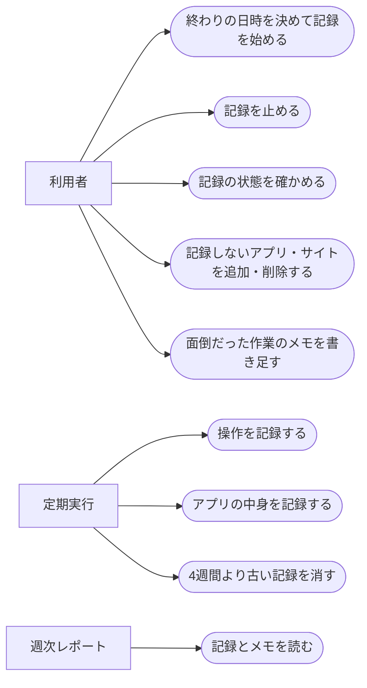

# 操作の記録

ステータス: 仕様確認中(未実装) ／ 優先度: 中

## 概要

自分の定型業務を洗い出す材料として、このMacでどのアプリを何にどれだけ使ったかを、チャットで指定した終わりの日時まで記録する。画面の画像は撮らず、アプリが教えてくれる情報(Chromeのページの本文、Excelのセルの位置など)と、自分で書き足すメモを材料にする。 〔提案〕

- **操作の記録**: 5秒ごとに、前面のアプリ・マウスのあるモニター・最後に入力してからの秒数・画面ロック・マイクの使用中などを1行ずつ残す。週次レポートで時間の使い方を集計し、離席や会議を見分けるために要る 〔合意〕
- **アプリの中身の記録**: Chrome・Excel・PowerPoint・Finder が前面にあるとき、開いているページやファイルの情報を残す。Chromeはページの題名・URLと、ページが変わったときの本文、Excelはブック名・シート名・選んでいるセルの位置。週次レポートが「その作業で何をしていたか」を書くために要る 〔合意〕
- **記録しないアプリ・サイトの一覧**: 前面にあるあいだは何も記録しないアプリと、本文を含めて何も記録しないサイトを並べた設定。認証情報や、記録したくないページを残さないために要る 〔合意〕
- **面倒だった作業のメモ**: 「これは面倒だ」と思ったときにチャットで一言を書き足すメモ。機械では分からない作業の中身を週次レポートに伝えるために要る 〔合意〕
- **記録の操作Skill**: チャットで記録を始める・止める・状態を確かめる・メモを書き足すためのClaude Code Skill 〔合意〕

## ユーザーストーリー

- 利用者(自分)としては、チャットで終わりの日時を伝えて記録を始め、その日時に自動で止まってほしい 〔合意〕
- 利用者としては、記録を途中で止めたり、記録中かどうかと終わる日時をチャットで確かめたりしたい 〔合意〕
- 利用者としては、モニターが複数あっても、操作しているアプリの時間だけを数えてほしい 〔合意〕
- 利用者としては、パスワード管理などのアプリは記録しないでほしい 〔合意〕
- 利用者としては、面倒だと思った作業を、思ったときにチャットで一言書き残したい 〔合意〕

## ユースケース図

線はアクターとユースケースの関わりを表し、処理の順序ではない。正となる文章は機能要件・ビジネスルール・制約を参照。

## 機能要件

### 記録の始め方・止め方

チャットで「10月31日18時まで記録して」のように頼むと、記録の操作Skillが終わりの日時を設定して記録を始める。止める・状態を確かめるのもチャットで行う 〔合意〕

詳細を開く

- [1] 終わりの日時を添えて記録を頼んだ場合、その日時を終わりとして記録を始めること 〔論理〕
- [2] 終わりの日時が無い、または過去の日時の場合、記録を始めず、終わりの日時を尋ね返すこと 〔論理〕
- [3] 記録中に別の終わりの日時を伝えた場合、終わりの日時をその値に置き換えること 〔論理〕
- [4] 終わりの日時を過ぎた場合、次の記録の時点で記録を止め、それ以降は何も記録しないこと 〔論理〕
- [5] 「記録を止めて」と頼んだ場合、終わりの日時より前でも記録を止めること 〔論理〕
- [6] 記録の状態を尋ねた場合、記録中か停止中か・終わりの日時・今日の記録時間・直近で記録が取れなかった時間帯を返すこと 〔論理〕
- [7] Macの再起動やログアウトのあとも、終わりの日時より前であれば、ログインした時点で記録を再開すること 〔環境〕
- [8] 記録を始めたときに、Chrome・Excel・PowerPoint・Finder への操作の許可がまだ無い場合、許可を求めるダイアログが出ることと、Chromeの「Apple Events からの JavaScript を許可」を入れる必要があることを伝えること 〔環境〕

### 操作の記録

5秒ごとに、前面のアプリとその周りの状態を1行ずつ残す。キーボードで打った文字の中身は残さない 〔合意〕

詳細を開く

- [1] 5秒ごとに、時刻・前面のアプリ名・マウスカーソルのあるモニター・最後のキーボードかマウスの入力からの秒数・画面ロック中かどうか・マイクが使用中かどうか・画面のスリープを止めているアプリがあるかどうかを1行として残すこと 〔環境〕
- [2] 記録しないアプリが前面にある場合、アプリ名を含めて何も残さず、時刻と「除外中」の印だけを残すこと 〔論理〕
- [3] Macがスリープ中・電源が切れている間は記録せず、その時間を「記録が取れなかった時間」として後から分かるようにすること 〔環境〕

### アプリの中身の記録

Chrome・Excel・PowerPoint・Finder が前面にあるとき、操作の記録と同じ5秒ごとに題名やファイルの情報を残し、Chromeのページの本文はページが変わったときだけ取る 〔提案〕

詳細を開く

- [1] Chrome が前面にある場合、5秒ごとに、前面のタブの題名とURLを操作の記録の行に添えること 〔境界〕
- [2] Chrome が前面にある場合、30秒ごとに前面のタブを確かめ、URLか本文が前回取ったときから変わっていれば、本文を取って時刻・題名・URLと結び付けて残すこと 〔境界〕
- [3] 同じページを開いたままで本文が変わっていない場合、本文を取り直さないこと 〔論理〕
- [4] 1ページの本文が20,000字を超える場合、先頭から20,000字までを残し、切り詰めた印を付けること 〔境界〕
- [5] Excel が前面にある場合、5秒ごとに、ブック名・シート名・選んでいるセルの位置を操作の記録の行に添えること。セルの値は残さない 〔境界〕
- [6] PowerPoint が前面にある場合、5秒ごとに、開いている資料の名前を添えること 〔境界〕
- [7] Finder が前面にある場合、5秒ごとに、前面のウィンドウで開いているフォルダの場所を添えること 〔境界〕
- [8] アプリが応答しない・許可が無いなどで中身が取れなかった場合、アプリ名だけを残し、取れなかった印と理由を付けること 〔境界〕
- [9] 上の4つ以外のアプリ(Teams・Outlook・VS Code など)は、アプリ名だけを残すこと 〔論理〕
- [10] 取ったページの本文の件数を日ごとに数えて残すこと(週次レポートの「記録の状態」に出す) 〔論理〕

### 記録しないアプリ・サイトの一覧

記録しないアプリの初期値はパスワード管理・キーチェーンアクセス・システム設定の3つ。記録しないサイトの初期値は空。どちらもチャットで追加・削除できる 〔合意〕

詳細を開く

- [1] 初期値として、パスワード管理アプリ・キーチェーンアクセス・システム設定を記録しないアプリにすること 〔論理〕
- [2] 記録しないサイトの初期値は空にすること 〔論理〕
- [3] 記録しないサイトに当たるページが Chrome の前面にある場合、題名・URL・本文を残さず、時刻と「除外中」の印だけを残すこと 〔論理〕
- [4] 記録しないサイトは、URLの先頭の一致(例: `https://example.com/hr/`)で指定できること 〔論理〕
- [5] チャットで記録しないアプリ・サイトの追加・削除を頼んだ場合、一覧を書き換え、次の記録の時点から反映すること 〔論理〕
- [6] 一覧を尋ねた場合、今の一覧を返すこと 〔論理〕

### 面倒だった作業のメモ

チャットで「面倒だった作業のメモ: 勤怠の通知メールを毎回手でフォルダに移している」のように伝えると、日時付きで残る。週の途中いつでも書き足せる 〔合意〕

詳細を開く

- [1] メモを頼んだ場合、伝えた文と日時を残し、残したことを返すこと 〔論理〕
- [2] 記録を止めている間もメモは残せること 〔論理〕
- [3] その週のメモの一覧を尋ねた場合、日時と文を返すこと 〔論理〕
- [4] メモの削除を頼んだ場合、指定したメモを消すこと 〔論理〕

### 古い記録の削除

操作の記録・アプリの中身の記録・メモは4週間残し、それより古い分は自動で消す 〔合意〕

詳細を開く

- [1] 1日1回、記録した日から4週間(28日)を過ぎた操作の記録・アプリの中身の記録・メモを消すこと 〔論理〕
- [2] 記録を止めたあとも、4週間を過ぎるまでは記録を残すこと(週次レポートの作り直しに使う) 〔論理〕

## ビジネスルール・制約

### 記録する間隔

操作の記録は5秒ごと。Chromeのページの本文は30秒ごとに確かめ、変わったときだけ取る 〔合意〕

詳細を開く

- [1] 操作の記録は5秒ごとに行うこと。根拠: /requirement のヒアリングで、取りこぼしと負荷の釣り合いから3案のうち中間の案を選んだ 〔論理〕
- [2] Chromeのページの本文は30秒ごとに確かめ、変わったときだけ取ること。根拠: 同じページを開いたままの時間が長く、毎回取ると同じ本文がいくつも残るため。確かめる間隔の30秒は、/requirement のヒアリングで決めた画面の確認の間隔に合わせた 〔論理〕

### 使ってよい期間

クライアント業務に就いていない期間だけ使う。終わりの日時の指定は必須で、終わりの無い記録は始めない 〔合意〕

詳細を開く

- [1] 終わりの日時を指定しない記録は始めないこと。根拠: /consult で、クライアント業務に就いていない期間に限って使うと決めたため。クライアントの情報がページの本文に入る期間に記録が続かないよう、必ず終わりを決めてから始める 〔論理〕
- [2] クライアント業務に就く前に記録を止めるのは利用者の判断で行う。この仕組みはクライアント業務の有無を判定しない

### 記録しないもの

画面の画像・キーボードで打った文字の中身・カメラの映像・Excelのセルの値は記録しない 〔提案〕

詳細を開く

- [1] 画面の画像を撮らないこと。根拠: 実機の確認で、画面収録の許可を会社の端末管理のため本人が入れられないと分かった 〔論理〕
- [2] キーボード入力の中身を記録しないこと。根拠: /requirement のヒアリングで「取らない」と決めた。パスワードなどが混ざるため 〔論理〕
- [3] カメラを使わないこと。根拠: /requirement のヒアリングで、視線の計測は別の仕様として後から足すと決めた 〔論理〕
- [4] Excelのセルの値は記録しないこと。根拠: セルの値は業務の数値そのもので、どのシートのどのセルを触っているかが分かれば繰り返しは見分けられるため 〔論理〕

### 記録を残す場所と期間

記録はこのMacのローカルフォルダに置き、OneDrive などの同期フォルダには置かない。4週間(28日)残す 〔提案〕

詳細を開く

- [1] 記録をこのMacのローカルフォルダに置き、同期フォルダには置かないこと。根拠: ページの本文がクラウドへ上がるのを避けるため 〔論理〕
- [2] 4週間を過ぎた記録を消すこと。根拠: /requirement のヒアリングで、週をまたいだ繰り返し(月末の作業など)を見つけられるよう4週間を選んだ 〔論理〕

## 非機能要件

- [1] 記録の処理全体のCPU使用率が、記録中の平均で5%以下であること 〔非機能〕 〔提案〕
- [2] 5秒ごとの1回分の記録(アプリの中身を含む)が2秒以内に終わること 〔非機能〕 〔提案〕
- [3] 1日8時間の記録で、残る記録(操作の記録・アプリの中身・本文)が100MB以下であること 〔非機能〕 〔提案〕

## 依存関係

実現性: launchd から動かす実機の確認で、必要な情報はすべて取れた。PowerPoint の資料名だけは資料を開いた状態でまだ確かめていない 〔提案〕

詳細を開く

| 依存 | 結論 | 確認内容 |
|---|---|---|
| 前面のアプリ名・マウスのあるモニター・最後の入力からの秒数・画面ロック・マイクの使用中・画面スリープの抑止 | できる | 2026-10-05 に launchd から動かした確認用プログラムで、許可なしで取れた |
| Chrome の前面のタブの題名・URL・本文 | できる | 同日、アプリごとの操作の許可(オートメーション)をダイアログで許可し、Chrome の「Apple Events からの JavaScript を許可」を入れた状態で取れた |
| Excel のブック名・シート名・選んでいるセルの位置 | できる | 同日、オートメーションで取れた |
| Finder の前面のフォルダの場所 | できる | 同日、オートメーションで取れた |
| PowerPoint の資料名 | 未確定 | 応答はあったが、資料を開いていない状態だったため空だった |
| 操作の許可が作り直しで外れること | 対処が要る | このMacで作るプログラムは作り直すと別物として扱われ、与えた許可がもう一度聞かれる。設計で、作り直しを減らす置き方を決める |
| 画面収録・アクセシビリティの許可 | 使わない | 会社の端末管理で本人は入れられない。この仕様はこれらの許可を使わない |
| 記録の操作Skill | できる | Claude Code Skill からローカルの設定ファイルを書き換える形は、既存のSkill群で実績がある |

## スコープ外

- 画面の撮影と文字起こし 〔提案〕
- Chrome・Excel・PowerPoint・Finder 以外のアプリの中身(Teams・Outlook・VS Code などはアプリ名だけ) 〔提案〕
- キーボードで打った文字の中身の記録 〔合意〕
- カメラによる視線の計測。後から別の仕様(gaze-tracking)として足す 〔合意〕
- 記録の集計・分析・レポート。週次レポートの仕様(weekly-automation-report)で扱う 〔合意〕
- このMac以外のPCや、他の人の操作の記録 〔提案〕
- クライアント業務に就いているかどうかの自動判定 〔提案〕
