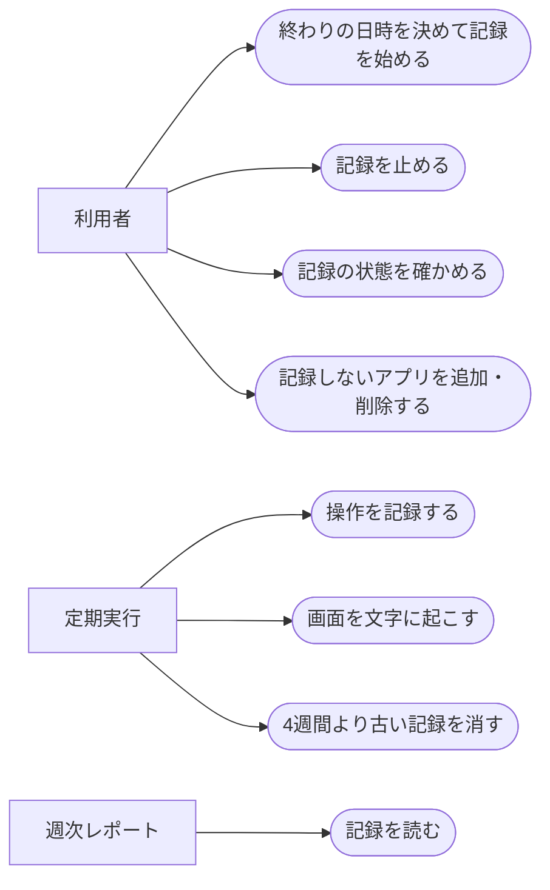

# 画面の操作記録

ステータス: 仕様確認中(未実装) ／ 優先度: 中

## 概要

自分の定型業務を洗い出す材料として、このMacで何をどれだけ操作したかと画面に映っていた文字を、チャットで指定した終わりの日時まで記録する。 〔合意〕

- **操作の記録**: 5秒ごとに、前面のアプリ・ウィンドウのタイトル・マウスのあるモニター・最後に入力してからの秒数などを1行ずつ残す。週次レポートで時間の使い方を集計し、離席を見分けるために要る 〔合意〕
- **画面の文字起こし**: 30秒ごとに操作中のウィンドウだけを撮り、このMacの中で文字に起こして画像はすぐ消す。週次レポートが「その作業で具体的に何をしていたか」を書くために要る 〔合意〕
- **記録しないアプリの一覧**: 前面にあるあいだは何も記録しないアプリを並べた設定。パスワードなどの認証情報を記録に残さないために要る 〔合意〕
- **記録の操作Skill**: チャットで記録を始める・止める・状態を確かめるためのClaude Code Skill 〔合意〕

進め方: launchd から動かしたときに画面収録とウィンドウタイトル取得の許可が会社の端末管理(MDM)で通るかを、設計の最初に実機で確かめる。通らなければこの仕様を見直す 〔提案〕

## ユーザーストーリー

- 利用者(自分)としては、チャットで終わりの日時を伝えて記録を始め、その日時に自動で止まってほしい 〔合意〕
- 利用者としては、記録を途中で止めたり、記録中かどうかと終わる日時をチャットで確かめたりしたい 〔合意〕
- 利用者としては、モニターが複数あっても、操作しているウィンドウの時間だけを数えてほしい 〔合意〕
- 利用者としては、パスワード管理などの画面は記録しないでほしい 〔合意〕
- 利用者としては、画面の画像をMacの外へ出さず、文字に起こしたものだけを分析に使いたい 〔合意〕

## ユースケース図

線はアクターとユースケースの関わりを表し、処理の順序ではない。正となる文章は機能要件・ビジネスルール・制約を参照。

## 機能要件

### 記録の始め方・止め方

チャットで「10月31日18時まで画面の記録をして」のように頼むと、記録の操作Skillが終わりの日時を設定して記録を始める。止める・状態を確かめるのもチャットで行う 〔合意〕

詳細を開く

- [1] 終わりの日時を添えて記録を頼んだ場合、その日時を終わりとして記録を始めること 〔論理〕
- [2] 終わりの日時が無い、または過去の日時の場合、記録を始めず、終わりの日時を尋ね返すこと 〔論理〕
- [3] 記録中に別の終わりの日時を伝えた場合、終わりの日時をその値に置き換えること 〔論理〕
- [4] 終わりの日時を過ぎた場合、次の記録の時点で記録を止め、それ以降は操作も画面も記録しないこと 〔論理〕
- [5] 「記録を止めて」と頼んだ場合、終わりの日時より前でも記録を止めること 〔論理〕
- [6] 記録の状態を尋ねた場合、記録中か停止中か・終わりの日時・今日の記録時間・直近で記録が取れなかった時間帯を返すこと 〔論理〕
- [7] Macの再起動やログアウトのあとも、終わりの日時より前であれば、ログインした時点で記録を再開すること 〔環境〕

### 操作の記録

5秒ごとに、操作しているウィンドウとその周りの状態を1行ずつ残す。キーボードで打った文字の中身は残さない 〔合意〕

詳細を開く

- [1] 5秒ごとに、時刻・前面のアプリ名・操作中のウィンドウのタイトル・マウスカーソルのあるモニター・最後のキーボードかマウスの入力からの秒数・画面ロック中かどうか・マイクが使用中かどうか・画面のスリープを止めているアプリがあるかどうかを1行として残すこと 〔環境〕
- [2] ウィンドウのタイトルが取れなかった場合、アプリ名だけを残し、タイトルが取れなかった印を付けること 〔境界〕
- [3] 記録しないアプリが前面にある場合、アプリ名・タイトルを含めて何も残さず、時刻と「除外中」の印だけを残すこと 〔論理〕
- [4] Macがスリープ中・電源が切れている間は記録せず、その時間を「記録が取れなかった時間」として後から分かるようにすること 〔環境〕

### 画面の文字起こし

30秒ごとに操作中のウィンドウだけを撮り、前回とほぼ同じ画面は捨て、残した画像はこのMacの中で文字に起こしてからすぐ消す 〔合意〕

詳細を開く

- [1] 30秒ごとに、操作中のウィンドウ1つだけを撮ること(他のモニターや背後のウィンドウは撮らない) 〔環境〕
- [2] 撮った画像が、同じウィンドウの前回の画像とほぼ同じ場合、文字に起こさずに捨てること 〔論理〕
- [3] 残した画像は、このMacの中だけで文字に起こし、起こした文字を撮った時刻・アプリ名・タイトルと結び付けて残すこと 〔環境〕
- [4] 文字に起こし終えた画像は、成否にかかわらずすぐ消すこと 〔論理〕
- [5] 文字に起こせなかった場合、その時刻に失敗の印を残すこと 〔境界〕
- [6] 記録しないアプリが前面にある場合、画面を撮らないこと 〔論理〕
- [7] 撮った枚数と、ほぼ同じで捨てた枚数を日ごとに数えて残すこと(週次レポートの「記録の状態」に出す) 〔論理〕

### 記録しないアプリの一覧

記録しないアプリは設定で持ち、初期値はパスワード管理・キーチェーンアクセス・システム設定の3つ。チャットで追加・削除できる 〔合意〕

詳細を開く

- [1] 初期値として、パスワード管理アプリ・キーチェーンアクセス・システム設定を記録しないアプリにすること 〔論理〕
- [2] チャットで記録しないアプリの追加・削除を頼んだ場合、一覧を書き換え、次の記録の時点から反映すること 〔論理〕
- [3] 記録しないアプリの一覧を尋ねた場合、今の一覧を返すこと 〔論理〕

### 古い記録の削除

操作の記録と文字に起こした文字は4週間残し、それより古い週の分は自動で消す 〔合意〕

詳細を開く

- [1] 1日1回、記録した日から4週間(28日)を過ぎた操作の記録と文字に起こした文字を消すこと 〔論理〕
- [2] 記録を止めたあとも、4週間を過ぎるまでは記録を残すこと(週次レポートの作り直しに使う) 〔論理〕

## ビジネスルール・制約

### 記録する間隔

操作の記録は5秒ごと、画面の撮影は30秒ごと。1日8時間で操作の記録は5,760行、撮影は最大960枚になる 〔合意〕

詳細を開く

- [1] 操作の記録は5秒ごと、画面の撮影は30秒ごとに行うこと。根拠: /requirement のヒアリングで、取りこぼしと負荷の釣り合いから3案のうち中間の案を選んだ 〔論理〕

### 使ってよい期間

クライアント業務に就いていない期間だけ使う。終わりの日時の指定は必須で、終わりの無い記録は始めない 〔合意〕

詳細を開く

- [1] 終わりの日時を指定しない記録は始めないこと。根拠: /consult で、クライアント業務に就いていない期間に限って使うと決めたため。クライアントの情報が画面に映る期間に記録が続かないよう、必ず終わりを決めてから始める 〔論理〕
- [2] クライアント業務に就く前に記録を止めるのは利用者の判断で行う。この仕組みはクライアント業務の有無を判定しない

### 記録しないもの

キーボードで打った文字の中身と、カメラの映像は記録しない。画面の画像はMacの外へ出さず、残す期間も文字に起こすまでに限る 〔合意〕

詳細を開く

- [1] キーボード入力の中身を記録しないこと。根拠: /requirement のヒアリングで「取らない」と決めた。パスワードなどが混ざるうえ、画面の文字起こしで入力の結果は分かるため 〔論理〕
- [2] カメラを使わないこと。根拠: /requirement のヒアリングで、視線の計測は別の仕様として後から足すと決めた 〔論理〕
- [3] 画面の画像をMacの外へ送らず、OneDrive などの同期フォルダにも置かないこと。根拠: /consult で、画面の内容は手元で文字に起こしてから必要な分だけ送ると決めた。同期フォルダに置くと画像がクラウドへ上がるため 〔論理〕

### 記録を残す期間

操作の記録と文字に起こした文字は4週間(28日)残す 〔合意〕

詳細を開く

- [1] 4週間を過ぎた記録を消すこと。根拠: /requirement のヒアリングで、週をまたいだ繰り返し(月末の作業など)を見つけられるよう4週間を選んだ 〔論理〕

## 非機能要件

- [1] 記録の処理全体のCPU使用率が、記録中の平均で5%以下であること 〔非機能〕 〔提案〕
- [2] 1枚の画像を撮ってから文字に起こし終えるまでが30秒以内であること(次の撮影までに終える) 〔非機能〕 〔提案〕
- [3] 1日8時間の記録で、残る記録(操作の記録と文字に起こした文字)が100MB以下であること 〔非機能〕 〔提案〕

## 依存関係

実現性: 未確定が4件ある。launchd からの画面収録の許可、ウィンドウタイトル取得の許可、最後の入力からの秒数とスリープ抑止の取得、このMacの中での文字起こしの4つ 〔提案〕

詳細を開く

| 依存 | 結論 | 確認内容 |
|---|---|---|
| launchd から動かしたときの画面収録の許可 | 未確定 | macOSの「画面収録」の許可が要る。会社の端末管理(MDM)で禁止されていると管理者権限なしでは解除できない。未確認 |
| ウィンドウタイトルの取得 | 未確定 | アクセシビリティか画面収録の許可が要る。MDMの扱いは未確認 |
| 最後の入力からの秒数(`ioreg` の HIDIdleTime)・スリープを止めているものの一覧(`pmset -g assertions`) | 未確定 | Claude Code のサンドボックス内からは値が取れた(マイクの使用中も見えた)。launchd から動かしたときは未確認 |
| このMacの中での文字起こし | 未確定 | macOS標準の文字認識を使う想定。呼び出し方(新しいOSSが要るか)は設計で決め、OSSを使う場合は事前に承認を得る |
| 記録の操作Skill | できる | Claude Code Skill からローカルの設定ファイルを書き換える形は、既存のSkill群で実績がある |

## スコープ外

- キーボードで打った文字の中身の記録 〔合意〕
- カメラによる視線の計測。後から別の仕様(gaze-tracking)として足す 〔合意〕
- 記録の集計・分析・レポート。週次レポートの仕様(weekly-automation-report)で扱う 〔合意〕
- このMac以外のPCや、他の人の操作の記録 〔提案〕
- クライアント業務に就いているかどうかの自動判定 〔提案〕
