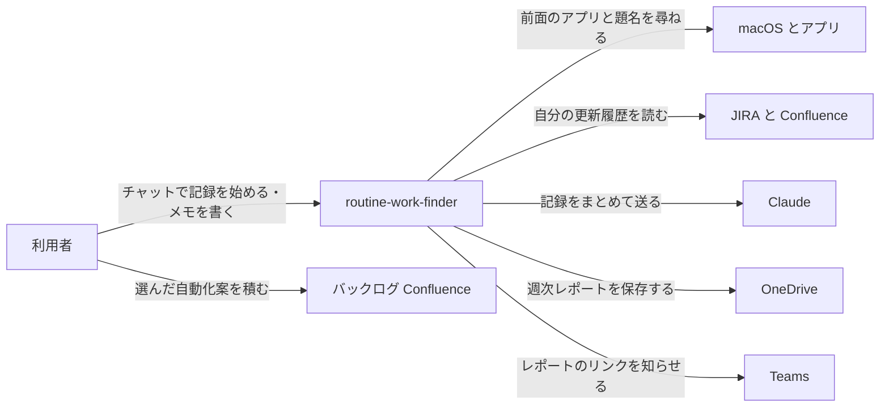
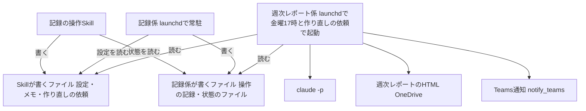

# routine-work-finder の全体像

## 概要

自分のMacでどのアプリを何にどれだけ使ったかを記録し、1週間ごとに時間の使い方と定型業務の自動化案をまとめて、OneDriveのレポートとTeamsの通知で届けるアプリ。画面の画像は撮らず、アクセシビリティで読める前面ウィンドウの題名(Excelはシート名も)・カーソルのある部品の種類・既存の作業の記録(JIRA・Confluence の自分の更新、Claude Code の会話、会議の議事録)・自分で書き足すメモを材料にする。 〔合意〕

## コンテキスト図

アプリが外とやり取りする相手と内容。記録はこのMacのローカルフォルダに置き、Claudeへは週次レポートを作るときにまとめて送る。正となる文章は各specの requirements.md を参照。

## システム構成図

2つのファイルの組はどちらもこのMacのローカルのデータフォルダにある。Skill は設定(終わりの日時と記録しないアプリ・ことばの一覧)・メモ・作り直しの依頼を書き、記録係が書く状態のファイルを読んで状態の確認に答える。記録係が5秒ごとの操作と前面ウィンドウの題名を記録し、週次レポート係がそれと既存の作業の記録(JIRA・Confluence の自分の更新、Claude Code の会話、会議の議事録)を合わせてレポートを作る。通知は既存の共通部品 notify_teams(`~/.claude/lib/atlassian_rest/teams_notify.py`。通知先を設定ファイルで切り替える)で送る。各部品の詳細は各specの design.md で決める。

## 機能一覧表(機能マップ)

| spec | 機能(利用者から見て) | 役割 | 依存 | 状態 |
|---|---|---|---|---|
| [activity-recording](activity-recording/requirements.md) | チャットで終わりの日時を決めて、使ったアプリと前面ウィンドウの題名を記録し、面倒だった作業のメモを書き足す | 記録 | なし | 仕様のみ(未実装) |
| [weekly-automation-report](weekly-automation-report/requirements.md) | 毎週金曜に時間の使い方と自動化案のレポートを受け取り、選んだ案をバックログに積む。レポートの記録しない候補(ことば・アプリ)から選んだものを、次の記録から外す依頼にできる | 集計・レポート | activity-recording | 仕様のみ(未実装) |

## 採用技術

既存の自動化アプリと同じく launchd で動かし、前面ウィンドウの題名はmacOS標準のアクセシビリティで読み、分析には `claude -p`、Teams への通知には既存の共通部品 notify_teams を使う 〔提案〕

詳細を開く

| 技術 | 用途 |
|---|---|
| Swift(標準のフレームワークだけ) | 記録係。自己署名の証明書で署名し、作り直してもアクセシビリティの許可が残るようにする |
| Python 3(標準ライブラリだけ) | 週次レポート係と、記録の操作Skillから呼ぶ操作スクリプト |
| launchd | 記録係の常駐と、週次レポート係の起動(金曜17時と、作り直しの依頼のフォルダが変わったとき) |
| macOS のアクセシビリティ(AX API) | 前面ウィンドウの題名・Excelのシート名・カーソルのある部品の種類を読む |
| `claude -p`(`~/.claude/lib/claude_headless.py`) | 自動化案・作業の要約・記録しない候補の作成 |
| `~/.claude/lib/atlassian_rest` | JIRA の更新履歴と Confluence の編集の読み込み |
| `notify_teams`(`~/.claude/lib/atlassian_rest/teams_notify.py`。他のバッチと共通の Teams 通知の部品で、通知先を設定ファイルで切り替える) | Teamsへの通知 |
| Claude Code Skill | チャットからの記録の開始・停止・状態確認・記録しないアプリ・ことばの追加と削除・週次レポートの記録しない候補の受け入れ・メモと、週次レポートの作り直しの依頼 |

## 非機能要件への対応

記録係の負荷と1回分の時間は「別のコマンドを起動しない・アクセシビリティの問い合わせを前面ウィンドウだけに絞り、1秒で打ち切る」で、週次レポートの時間と呼び出し回数は「Claude の呼び出しを1週あたり3回にまとめる」で担保する 〔提案〕

詳細を開く

| 非機能要件 | 実現方式 | 関連spec |
|---|---|---|
| 記録係のCPU使用率 | 5秒ごとに別のコマンドを起動せず macOS の関数を直接呼ぶ。設定ファイルは更新日時が変わったときだけ読み直す | activity-recording/requirements.md#非機能要件-1 |
| 1回分の記録の時間 | アクセシビリティの問い合わせを前面ウィンドウの題名・選択シート名・カーソルの部品に絞り、合わせて1秒で打ち切る | activity-recording/requirements.md#非機能要件-2 |
| 1日の記録の大きさ | 題名を1,000字で切り詰め、1行1件の JSON で書き足す | activity-recording/requirements.md#非機能要件-3 |
| 週次レポートの作成時間 | 集計は Python の標準ライブラリだけで行い、Claude の呼び出しを3回(自動化案・作業の要約・記録しない候補)にまとめる | weekly-automation-report/requirements.md#非機能要件-1 |
| Claude の呼び出し回数 | 呼び出しを3回(自動化案・作業の要約・記録しない候補)にまとめ、再試行は回数に含めない | weekly-automation-report/requirements.md#非機能要件-2 |

## 外部連携IF一覧

外とのやり取りは4つ: JIRA・Confluence からの自分の更新の読み込み、OneDrive へのHTMLのファイル保存、notify_teams による Teams 通知、`claude -p` による Claude への材料の送信 〔提案〕

詳細を開く

| 相手 | 方向 | 方式・形式 | タイミング | 失敗したとき | 疎通確認 |
|---|---|---|---|---|---|
| JIRA・Confluence(`~/.claude/lib/atlassian_rest` の REST。サイトは PJプロファイルで決まる) | 受ける | JIRA は JQL で選んだチケットの変更履歴、Confluence は CQL で選んだページの最後の版の作者と日時を JSON で読む。自分の分だけを残す | 週次レポートの作成ごと | 認証の失敗・通信の失敗・形の違いが起きた記録は使わず、名前と理由をレポートの記録の状態に出す。サイトが複数ある場合は読めたサイトの分だけを使う | 週次レポート係の契約テスト(実応答由来の fixture)と環境スモーク |
| OneDrive(本人の自動化フォルダ `00_root/auto/routineWorkFinder/`) | 送る | ローカルの控えを先に書き、`.part` に書いてから `<YYYY-Www>.html` へ名前を付け替える | 金曜17時を過ぎて最初の起動・作り直しの依頼 | 10秒あけて3回まで書き直す。それでも失敗したらローカルの控えを残し、Teams で失敗と控えの場所・作り直しの頼み方を知らせる。自動では作り直さない | 週次レポート係の環境スモークで、launchd から保存先にHTMLが書かれること |
| Teams(notify_teams。通知先は設定ファイルで決まり、本人宛て) | 送る | `notify_teams("routine-work-finder", "weekly-report", 本文)`。本文はHTML断片で、レポートのビューア形式のリンクを含む | レポートの保存のあと・保存の失敗時 | 10秒あけて3回まで送り直す。それでも失敗したらログに書き、定期の作成では週次レポート係の状態のファイルにも通知の失敗を書く(作り直しでは状態のファイルに書かない)。自動では送り直さない | 週次レポート係の環境スモークで通知が届くこと |
| Claude(`claude -p`、`~/.claude/lib/claude_headless.py`) | 送る・受ける | 材料を標準入力の JSON で渡し、JSON の答えを受け取って形を検査する。送るものは `weekly-automation-report/requirements.md#社外へ送るもの` に限る | 週次レポートの作成ごとに3回(自動化案・作業の要約・記録しない候補) | 検査を通らない・時間切れも失敗の1回と数え、3回続けて失敗したらその部分を除いてレポートを出す | 週次レポート係の環境スモーク |

- 認証情報(JIRA・Confluence・OneDrive・Teams の通知先・Claude)の置き場所は既存の共通部品の設定に従い、ここには書かない
- 記録係と操作スクリプトは外と何もやり取りしない

## データ運用

生の記録(操作の記録・メモ)はこのMacのローカルに28日残して自動で消す。週次レポートのローカルの控えと OneDrive のHTMLは、週に1ファイルで小さいため消さずに残す 〔提案〕

詳細を開く

| データ | 置き場所 | 保持期間 | 消し方 |
|---|---|---|---|
| 操作の記録 `records/` | `~/Library/Application Support/routine-work-finder/`(権限700) | 28日 | 記録係が日付の変わった最初の回に消す |
| 面倒だった作業のメモ `memos/` | 同上 | 28日 | 同上 |
| 設定・状態のファイル | 同上 | 消さない(1件ずつ書き直す) | — |
| 週次レポートのローカルの控え `reports/` | 同上 | 消さない(週に1ファイルで小さい。同じ週を作り直すと上書きする) | 利用者が必要に応じて手で消す |
| 週次レポートのHTML | 本人の OneDrive `00_root/auto/routineWorkFinder/` | 消さない(週に1ファイルで小さく、過去の週を見返すため) | 利用者が必要に応じて手で消す |
| 記録係・操作スクリプト・週次レポート係のログ | `~/Library/Logs/` とデータフォルダ | 消さない(1日に数KB) | 利用者が必要に応じて手で消す |

- 週次レポートのHTMLには、題名に由来する作業の要約・具体例(ファイル名・チケット番号・メールの件名など)が入る。28日で消える生の記録と違い、ローカルの控えも OneDrive のHTMLも期限なく残る。大きさは1週1ファイルで数十KB程度の見込み(画面モック `weekly-automation-report/mock.html` が約24KB)
- バックアップは取らない。記録は28日で消える前提の材料で、失っても次の週から取り直せる
- 初期データは、操作スクリプトが最初に作る設定ファイル(記録しないアプリの初期値3つ・空の記録しないことば)だけ

## セキュリティ

週次レポート係が、`weekly-automation-report/requirements.md#社外へ送るもの` に挙げたもの(題名・シート名・部品の種類・既存の作業の記録・メモ等)を Claude へ送り、レポートを本人の OneDrive に置く。画面の撮影・Apple Events・ブラウザのファイル読み取りは使わない。記録係の動きが会社のセキュリティ監視に検知されないかは未確定 〔合意〕

詳細を開く

- **保護対象**: ウィンドウの題名に入る業務の情報(ファイル名・チケット番号・メールの件名など)と、面倒だった作業のメモ
- **社外へ送るもの**: 週次レポート係が `claude -p` で Claude へ送るのは、`weekly-automation-report/requirements.md#社外へ送るもの` に挙げたもの(操作の記録の集計・ウィンドウの題名・Excelのシート名・部品の種類・既存の作業の記録・メモ・Skill とアプリの名前と説明)だけで、正は `weekly-automation-report/requirements.md#社外へ送るもの`。記録しない候補を作るために、その週のアプリ名とウィンドウの題名の組を重複なく全部、字数の上限内で送る。今の記録しないアプリ・ことばの一覧は、社外秘の固有名が入りうるため送らない(候補のうちすでに一覧にあるものはプログラムが捨てる)。一覧に当たった時間の記録も、アプリ名も題名も送らず、時刻と「除外中」の印だけを送る
- **置く場所**: 生の記録はこのMacのローカル(権限700・ファイル600)に置き、同期フォルダには置かない。レポートは本人の OneDrive の自動化フォルダにだけ置き、共有しない
- **取らないもの**: 画面の撮影、Apple Events(ほかのアプリへ命令を送る仕組み)、ブラウザのファイルの読み取り、ページ本文・URL・セル位置、キーボードで打った文字の中身、カメラは使わない
- **会社のセキュリティ監視**: 実機で確かめたのは、記録係が launchd からアクセシビリティで題名を取れることだけで、その動きが監視に検知されないかは未確定。検知された場合は記録係を止めて launchd から外す(activity-recording/tasks.md タスク18)
- **認証情報の画面**: macOS の「パスワード」アプリ・キーチェーンアクセス・システム設定は記録しないアプリの初期値にし(他社のパスワード管理アプリはチャットで追加する)、前面にあるあいだは題名も読まない
- 機能ごとの対策は各specの design.md「セキュリティ」が正

## 技術的制約

画面収録は会社のセキュリティ監視に検知されるおそれが高いため使わない。アプリの中身は、アクセシビリティで読める前面ウィンドウの題名とカーソルのある部品の種類(Excelはシート名も)に限る 〔合意〕

詳細を開く

- 画面収録は会社のセキュリティ監視に検知されるおそれが高く、画面の中身が社外へ出るため使わない。画面の撮影・文字起こしはしない
- アプリの中身として読むのは、アクセシビリティで取れる前面ウィンドウの題名・Excelのシート名・カーソルのある部品の種類だけ。部品の中の文字(メール本文・セルの値など)は読まない。記録係をアクセシビリティの一覧でオンにする必要がある
- このMacで作るプログラムは、署名が無いと作り直すたびに別物として扱われ、アクセシビリティの許可が外れうる。記録係は自己署名の証明書で署名する
- Claude Code から `launchctl` は使えない。記録係は常駐させたままにし、Skillは設定ファイル・メモのファイル・作り直しの依頼ファイルを書くだけにする
- `claude -p` からはMCPが使えないため、JIRA・Confluence は REST で読む。カレンダーの予定は読まない
- launchd から OneDrive へ書くと `Resource deadlock avoided` で失敗する例がある。既存アプリで対処済みの書き方に従う

