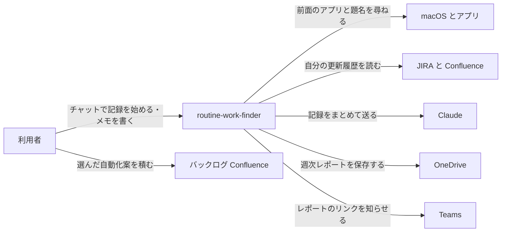
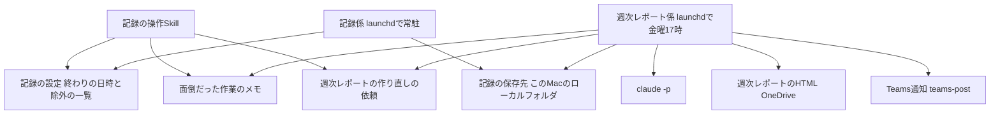

# routine-work-finder の全体像

## 概要

自分のMacでどのアプリを何にどれだけ使ったかを記録し、1週間ごとに時間の使い方と定型業務の自動化案をまとめて、OneDriveのレポートとTeamsの通知で届けるアプリ。画面の画像は撮らず、アクセシビリティで読める前面ウィンドウの題名(Excelはシート名も)・既存の作業の記録・自分で書き足すメモを材料にする。 〔提案〕

## コンテキスト図

アプリが外とやり取りする相手と内容。記録はこのMacのローカルフォルダに置き、Claudeへは週次レポートを作るときにまとめて送る。正となる文章は各specの requirements.md を参照。

## システム構成図

記録係が5秒ごとの操作と前面ウィンドウの題名を記録し、週次レポート係がそれと既存の作業の記録を合わせてレポートを作る。各部品の詳細は各specの design.md で決める。

## 機能一覧表(機能マップ)

| spec | 機能(利用者から見て) | 役割 | 依存 | 状態 |
|---|---|---|---|---|
| [activity-recording](activity-recording/requirements.md) | チャットで終わりの日時を決めて、使ったアプリと前面ウィンドウの題名を記録し、面倒だった作業のメモを書き足す | 記録 | なし | 仕様のみ(未実装) |
| [weekly-automation-report](weekly-automation-report/requirements.md) | 毎週金曜に時間の使い方と自動化案のレポートを受け取り、選んだ案をバックログに積む | 集計・レポート | activity-recording | 仕様のみ(未実装) |

## 採用技術

既存の自動化アプリと同じく launchd で動かし、前面ウィンドウの題名はmacOS標準のアクセシビリティで読み、分析には `claude -p`、通知には teams-post を使う 〔提案〕

詳細を開く

| 技術 | 用途 |
|---|---|
| Swift(標準のフレームワークだけ) | 記録係。自己署名の証明書で署名し、作り直してもアクセシビリティの許可が残るようにする |
| Python 3(標準ライブラリだけ) | 週次レポート係と、記録の操作Skillから呼ぶ操作スクリプト |
| launchd | 記録係の常駐と、金曜17時の週次レポート係の起動 |
| macOS のアクセシビリティ(AX API) | 前面ウィンドウの題名・Excelのシート名・カーソルのある部品の種類を読む |
| `claude -p`(`~/.claude/lib/claude_headless.py`) | 作業の要約と自動化案の作成 |
| `~/.claude/lib/atlassian_rest` | JIRA の更新履歴と Confluence の編集の読み込み |
| teams-post Skill の投稿の仕組み | Teamsへの通知 |
| Claude Code Skill | チャットからの記録の開始・停止・状態確認・メモと、週次レポートの作り直しの依頼 |

## 技術的制約

画面収録は会社のセキュリティ監視に検知されるおそれが高いため使わない。アプリの中身は、アクセシビリティで読める前面ウィンドウの題名(Excelはシート名・部品の種類も)に限る 〔提案〕

詳細を開く

- 画面収録は会社のセキュリティ監視に検知されるおそれが高く、画面の中身が社外へ出るため使わない。画面の撮影・文字起こしはしない
- アプリの中身として読むのは、アクセシビリティで取れる前面ウィンドウの題名・Excelのシート名・カーソルのある部品の種類だけ。部品の中の文字(メール本文・セルの値など)は読まない。記録係をアクセシビリティの一覧でオンにする必要がある
- このMacで作るプログラムは、署名が無いと作り直すたびに別物として扱われ、アクセシビリティの許可が外れうる。記録係は自己署名の証明書で署名する
- Claude Code から `launchctl` は使えない。記録係は常駐させたままにし、Skillは設定ファイルと依頼ファイルを書くだけにする
- `claude -p` からはMCPが使えないため、JIRA・Confluence は REST で読む。カレンダーの予定は読まない
- launchd から OneDrive へ書くと `Resource deadlock avoided` で失敗する例がある。既存アプリで対処済みの書き方に従う

