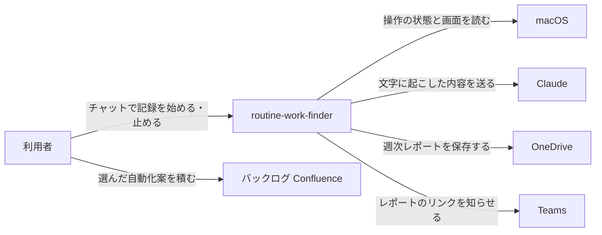
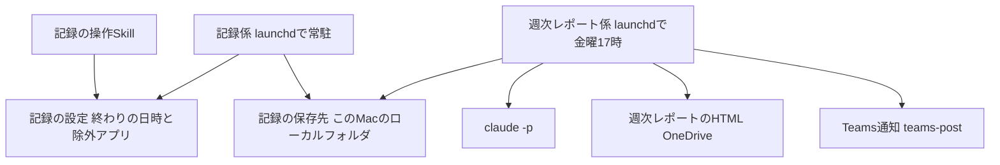

# routine-work-finder の全体像

## 概要

自分のMacでの操作と画面の文字を記録し、1週間ごとに時間の使い方と定型業務の自動化案をまとめて、OneDriveのレポートとTeamsの通知で届けるアプリ。記録・集計・文字起こしはこのMacの中で行い、社外へ送るのは文字に起こした内容だけにする。 〔合意〕

## コンテキスト図

アプリが外とやり取りする相手と内容。画面の画像はmacOSの外へ出さない。正となる文章は各specの requirements.md を参照。

## システム構成図

記録係が5秒ごとの操作と30秒ごとの画面を記録し、週次レポート係がそれを集計してレポートを作る。各部品の詳細は各specの design.md で決める。

## 機能一覧表(機能マップ)

| spec | 機能(利用者から見て) | 役割 | 依存 | 状態 |
|---|---|---|---|---|
| [activity-recording](activity-recording/requirements.md) | チャットで終わりの日時を決めて、操作と画面の文字を記録する | 記録 | なし | 仕様のみ(未実装) |
| [weekly-automation-report](weekly-automation-report/requirements.md) | 毎週金曜に時間の使い方と自動化案のレポートを受け取り、選んだ案をバックログに積む | 集計・レポート | activity-recording | 仕様のみ(未実装) |

## 採用技術

既存の自動化アプリと同じく Python + launchd で動かし、分析には `claude -p`、通知には teams-post を使う 〔提案〕

詳細を開く

| 技術 | 用途 |
|---|---|
| Python 3 | 記録係と週次レポート係の本体 |
| launchd | 記録係の常駐と、金曜17時の週次レポート係の起動 |
| macOS標準の文字認識 | 画面の文字起こし(呼び出し方は design.md で決める) |
| `claude -p` | 作業の要約と自動化案の作成 |
| teams-post Skill の投稿の仕組み | Teamsへの通知 |
| Claude Code Skill | チャットからの記録の開始・停止・状態確認 |

## 技術的制約

画面収録とウィンドウタイトルの取得には macOS の許可が要り、会社の端末管理(MDM)で止められている可能性がある。カレンダーの予定は無人実行から取れない可能性がある 〔提案〕

詳細を開く

- 画面収録・アクセシビリティの許可は利用者がシステム設定で与える。MDMで禁止されていると、このMacでは管理者権限(sudo)が使えないため解除できない
- `claude -p` からはMCPが使えないため、カレンダーの予定はOutlookコネクタ以外の経路で取る必要がある。取れない場合はマイクの使用中だけで会議を見分ける
- launchd から OneDrive へ書くと `Resource deadlock avoided` で失敗する例がある。既存アプリで対処済みの書き方に従う

