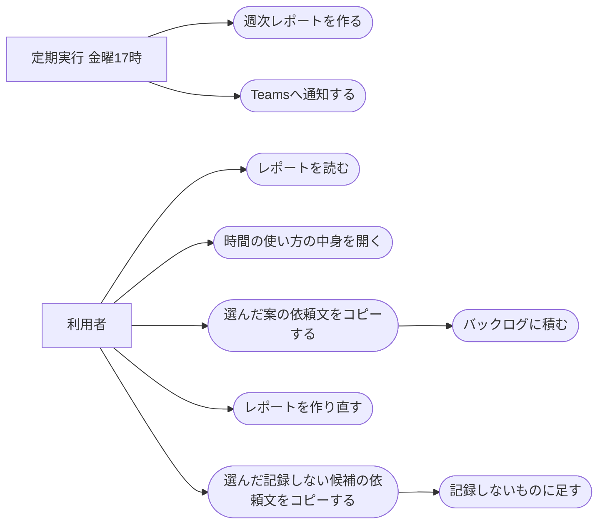

# 定型業務の週次レポート

ステータス: 仕様確認中(未実装) ／ 優先度: 中

## 概要

操作の記録(activity-recording)が残した1週間分の記録と、JIRA・Confluence・Claude Code・議事録に残っている自分の作業の記録から、何に時間を使ったかと、まだ自動化できていない定型業務への自動化案をまとめ、毎週金曜17時に届ける。 〔合意〕

- **週次レポートのHTML**: 自動化案・時間の使い方・記録の状態を1列に並べた1枚のページ。OneDriveに保存し、ブラウザで開いて読む。気に入った自動化案を選んでバックログに積む依頼文をコピーできる 〔合意〕
- **記録しない候補**: 週次レポートの中の欄。その週のウィンドウの題名から、記録すべきでないものを Claude が判断し、次の記録から外すことば(題名の一部)とアプリの候補を出す。チェックを入れた候補を記録の操作Skill(操作の記録(activity-recording)で作る routine-work-finder Skill)に頼む依頼文をコピーできる。記録したくない画面が一覧の漏れで記録され続けるのを防ぐために要る 〔合意〕
- **Teamsへの通知**: レポートができたことを、レポートを開けるリンク付きで自分に知らせる。レポートを開き忘れないために要る 〔合意〕
- **作り直しの入口**: 自動化案を作れなかった週や保存・通知に失敗した週を、チャットで頼んで作り直すための操作。週の途中で、その時点までの記録で自動化案を確かめるときにも使う。操作の記録(activity-recording)で作る記録の操作Skill(routine-work-finder Skill)に足す 〔提案〕

## ユーザーストーリー

- 利用者(自分)としては、毎週金曜に、その週どの作業に時間を使ったかと自動化案を受け取りたい 〔合意〕
- 利用者としては、時間の使い方の各項目で、具体的にどんな作業をしていたのかを要約と具体例で確かめたい 〔合意〕
- 利用者としては、気に入った自動化案を選んで、自分のバックログに積みたい 〔合意〕
- 利用者としては、自動化案を作れなかった週を、あとから作り直したい 〔提案〕
- 利用者としては、週の途中でも、その時点までの記録で自動化案を確かめたい 〔合意〕
- 利用者としては、記録すべきでない画面が記録されていたら、次の記録からそのことばやアプリを外す候補を提案してほしい 〔合意〕

## ユースケース図

線はアクターとユースケースの関わりを表し、処理の順序ではない。「バックログに積む」は依頼文をチャットに貼ったあと backlog Skill が、「記録しないものに足す」は依頼文をチャットに貼ったあと記録の操作Skill が行う。正となる文章は機能要件・ビジネスルール・制約を参照。

## 機能要件

### 時間の集計

その週(月曜〜金曜)の操作の記録を、作業・会議・離席・記録しなかった時間(記録しないアプリ・ことばに当たって除外した時間)の4つに分けて時間を数え、作業時間をアプリ名とウィンドウの題名の組ごとにまとめる。スリープ中など記録が取れなかった時間は4つに入れず別に数える 〔提案〕

優先度: Must(時間の使い方と自動化案の候補のもとになるため、無いとレポートが成り立たない) 〔提案〕

詳細を開く

- [1] 操作の記録を、作業・会議・離席・記録しなかった時間(記録しないアプリ・ことばで除外した時間)の4つに分け、それぞれの合計時間を出すこと 〔論理〕
- [2] 離席の判定は「ビジネスルール・制約」の「離席の判定」に従うこと 〔論理〕
- [3] マイクが使用中の時間は、入力の有無にかかわらず会議として数えること 〔論理〕
- [4] 作業の時間を、アプリ名とウィンドウの題名の組ごとにまとめ、長い順に上位10件を出すこと。Excel は題名(ブック名)にシート名を添えた組にする 〔論理〕
- [5] 題名が取れなかった時間は、アプリ名だけの組として数えること 〔論理〕
- [6] 記録が取れなかった時間帯(Macのスリープ中・電源が切れていた時間・記録係が設定を読めなかった時間など)と、題名が取れなかった時間を一覧にすること。記録が取れなかった時間は4つのどれにも数えず、合計を別に出す 〔論理〕

### 作業の要約

時間の使い方の上位10件それぞれについて、ウィンドウの題名・Excelのシート名・カーソルのある部品の種類・時間帯・既存の作業の記録・面倒だった作業のメモをもとに、何をしていたかの要約・主な時間帯・具体例をClaudeに作らせる 〔提案〕

優先度: Should(無くても時間の集計と自動化案は読めるが、各項目で何をしていたかを確かめるのに要る) 〔提案〕

詳細を開く

- [1] 上位10件それぞれについて、何をしていたかの要約を1〜2文で作ること 〔生成物〕
- [2] 上位10件それぞれについて、その作業をしていた主な時間帯(曜日と時刻の幅)を出すこと 〔論理〕
- [3] 上位10件それぞれについて、日時付きの具体例を最大3件作ること。具体例に書くのは、その項目のウィンドウの題名・カーソルのある部品の種類・時間帯と、同じ時間帯に重なる既存の作業の記録・メモから出せることだけにする(セルの位置や値・ページの中身・画面での操作の内容は記録に無いため書かない) 〔生成物〕
- [4] その項目に対応する自動化案がある場合、その案へのリンクを付けること 〔生成物〕
- [5] 題名が取れなかった項目は、前後に使ったアプリ・既存の作業の記録・メモから推定し、推定であることを要約に書くこと 〔生成物〕
- [6] Claudeに渡すのは「ビジネスルール・制約」の「社外へ送るもの」に挙げたものだけにすること 〔論理〕

### 既存の作業の記録の取り込み

作業の中身を補うために、その週の自分の JIRA の更新履歴・Confluence の編集・Claude Code への依頼・議事録を読み込む 〔合意〕

優先度: Should(読めなくてもレポートは作れるが、要約と自動化案の手がかりが減る) 〔提案〕

詳細を開く

- [1] PJプロファイルに登録したすべてのPJの JIRA から、その週に自分が更新したチケットと、変えた項目(状態・期日など)と日時を読み込むこと。同じサイトは1回だけ読む 〔境界〕
- [2] PJプロファイルに登録したすべてのPJの Confluence から、その週に自分が編集したページの題名と日時を読み込むこと。同じサイトは1回だけ読む 〔境界〕
- [3] Claude Code の会話の記録から、その週の依頼文の冒頭200字と日時・リポジトリ名を読み込むこと 〔境界〕
- [4] 議事録の自動生成(meeting-minutes-generator)が作った議事録から、その週の議事録の題名と要点を読み込むこと 〔境界〕
- [5] どれかの読み込みに失敗した場合、その記録を使わずにレポートを作り、記録の状態にどの記録が読めなかったかを出すこと 〔境界〕

### 自動化案

同じ操作の繰り返しから自動化案をClaudeに作らせ、週に使った時間が長い順に最大5件を出す 〔合意〕

優先度: Must(このアプリの目的そのもの) 〔提案〕

詳細を開く

- [1] 同じ操作の繰り返しが週2回以上ある作業を、自動化案の候補にすること。「同じ操作の繰り返し」は、同じアプリ名とウィンドウの題名の組(Excel はシート名も)の作業が、30分以上あけて現れることを指す(キー操作の中身は見ない) 〔論理〕
- [2] 候補を週に使った時間が長い順に並べ、最大5件を出すこと 〔論理〕
- [3] 各案に、週に使った時間・効果(大・中・小)・見えた繰り返し・自動化の案・使える既存の仕組みを付けること 〔生成物〕
- [4] 面倒だった作業のメモに書かれた作業は、繰り返しの回数にかかわらず候補として検討し、記録と突き合わせた結果を「見えた繰り返し」に書くこと 〔生成物〕
- [5] 「使える既存の仕組み」は、このMacにある Claude Code Skill と study の既存アプリから選び、当てはまるものが無ければ「なし(新しく作る)」とすること 〔生成物〕
- [6] 候補が0件の週は、自動化案の欄に「今週は自動化案になる繰り返しが見つかりませんでした」と、候補になる条件を出すこと 〔論理〕
- [7] その週の作業の記録が5時間未満の場合、自動化案と作業の要約を作らず、その理由を出すこと 〔論理〕
- [8] 自動化案か作業の要約の Claude の呼び出しが3回続けて失敗した場合、自動化案と作業の要約を出さずに、失敗したことと作り直す方法を出し、時間の集計と記録の状態はそのまま出すこと 〔境界〕

### レポートの作成と通知

毎週金曜17時に、その週の月曜〜金曜の分のレポートを作り、OneDriveに保存してTeamsで自分に知らせる 〔合意〕

優先度: Must(レポートを届ける手段が無いと使えない) 〔提案〕

詳細を開く

- [1] 毎週金曜17時に、その週の月曜0時から金曜17時までの記録でレポートを作ること。週の境界(月曜0時)と金曜17時は日本時間で求める 〔論理〕
- [2] 金曜17時にMacがスリープ中だった場合、次に起きたときにその週のレポートを作ること。まだ作っていない週が複数あれば、作り直しの依頼で先に作った週を除き、記録が残っている週を古い順にすべて作る。週次レポート係(レポートを作るプログラム)の状態のファイルが空のとき(初回・壊れて退避したあと)は、直近に過ぎた金曜17時の週だけを作る 〔環境〕
- [3] レポートのHTMLをOneDriveの決まったフォルダに、週を表す名前(例: 2026-W41)で保存すること 〔環境〕
- [4] レポートを保存したら、Teamsの自分宛ての通知先に、レポートをブラウザで開けるリンク付きで知らせること 〔環境〕
- [5] その週に操作の記録が1行も無い場合、レポートも通知も出さないこと。作り直しの依頼から定期の作成に切り替えた場合を除く(作り直し[6]のとおり知らせる) 〔論理〕
- [6] 記録の終わりの日時がその週の途中だった場合も、その週の金曜にレポートを作り、記録の状態に終わった日時を出すこと 〔論理〕
- [7] 定期の作成は、Claude の呼び出し・保存・通知に失敗した週も含めて1週に1回だけ行い、自動ではやり直さないこと。失敗した週は作り直しで救う 〔論理〕
- [8] 操作の記録の設定ファイルが無い場合は、記録の状態に設定の異常を出さず、記録しないアプリ・ことばは初期値を出し、今の週の終わりの予定は出さないこと。設定ファイルが読めない・形が違う場合は、記録の状態に「設定ファイルが読めない」と出し、記録しないアプリ・ことばと今の週の終わりの予定は出さないこと。読めない・形が違う場合も記録しない候補は作り、一覧による除外はしない(記録しない候補の提案[2])。どちらの場合もレポートは作り続ける 〔境界〕

### バックログに積む依頼文

自動化案にチェックを入れてボタンを押すと、選んだ案をバックログに積む依頼文がコピーされる。利用者がそれをClaude Codeのチャットに貼ると backlog Skill が積む 〔合意〕

優先度: Should(無くても手で依頼できるが、案を選んで積む手間を減らす) 〔提案〕

詳細を開く

- [1] 自動化案ごとにチェック欄を置き、1件も選んでいないときはコピーのボタンを押せないようにすること 〔生成物〕
- [2] ボタンを押した場合、週の名前と選んだ案の番号・題名を含む `/backlog` の依頼文をコピーすること。依頼文にPJ名は入れない(backlog Skill のデフォルトPJで積む) 〔生成物〕
- [3] コピーできた場合、「コピーしました」とチャット欄に貼る案内を出すこと 〔生成物〕
- [4] ブラウザの制限でコピーできなかった場合、依頼文を選択済みの欄に出し、手で選んでコピーするよう案内すること 〔境界〕

### 記録しない候補の提案

その週のウィンドウの題名とアプリ名から、既定の種類に当たる記録すべきでないものを Claude に判断させ、次の記録から外すことば・アプリの候補をレポートの欄に出す。チェックした候補の依頼文をコピーでき、受け入れた候補は次の記録からだけ外す 〔合意〕

優先度: Should(無くても週次レポートは成り立つが、記録したくない画面の記録を続けないために要る) 〔提案〕

詳細を開く

- [1] その週のアプリ名とウィンドウの題名の組から、既定の種類(給与・賞与、人事評価・採用・異動、他人の個人情報、認証情報や秘密の情報、医療・健康、私用、クライアントの社名・案件名など社外秘の固有名)に当たるものだけを、記録しないことば(題名の一部)か記録しないアプリの候補として Claude に作らせること 〔生成物〕
- [2] 候補は最大5件とし、今の記録しないアプリ・ことばの一覧にすでにあるものと、当たった題名にすでに一覧のことばが含まれているものは出さないこと。ただし、操作の記録の設定ファイルが読めないときは一覧による除外をせずに候補を出す(一覧と重なる候補が出ることがある) 〔論理〕
- [3] 各候補に、種類(既定の種類のどれか)・ことばかアプリか・提案する値・当たった題名の例1件・理由を付けること 〔生成物〕
- [4] 候補ごとにチェック欄を置き、1件も選んでいないときはコピーのボタンを押せないようにし、ボタンを押したら選んだ候補を記録の操作Skillに足してもらう依頼文をコピーすること。コピーの手順と、コピーできなかったときの案内はバックログに積む依頼文と同じにする 〔生成物〕
- [5] 受け入れた候補は次の記録からだけ外し、すでに残っている記録は書き換えないこと(28日で消えるのを待つ) 〔論理〕
- [6] 候補の作成で Claude の呼び出しが3回続けて失敗した場合、記録しない候補の欄に作れなかったことだけを出し、レポートの他の欄はそのまま出すこと 〔境界〕
- [7] 作業の記録が5時間未満の週でも候補を作り、記録が0行の週は作らないこと 〔論理〕
- [8] 記録しない候補は Teams の通知に載せないこと 〔論理〕

### レポートの作り直し

チャットで「定型業務レポートを作り直して」と、今週・先週(今の週の1つ前の週)・最新の週(金曜17時を過ぎた最新の週)・週の番号で週を指定して頼むと、指定した週のレポートを作り直して同じ名前で上書きし、Teamsで知らせる。金曜17時より前の今の週もその時点までの記録で作り直せ、作り直しは作成済みに数えず、その週の金曜17時の定期の作成は止めない。ただし、金曜17時を過ぎてまだ定期の作成をしていない週は、作り直しを定期の作成として作り、作成済みに数える 〔提案〕

優先度: Should(自動化案を作れなかった週・失敗した週の救済と、週の途中で自動化案を確かめる使い道。無くても定期のレポートは届く) 〔提案〕

詳細を開く

- [1] 作り直しを頼んだ場合、指定した週のレポートを作り直し、同じ名前のファイルに上書きすること 〔論理〕
- [2] 週の指定が無い場合、金曜17時(日本時間)を過ぎた最新の週を作り直すこと 〔論理〕
- [3] 指定した週の記録がもう消えている(4週間より前)場合、作り直さずにその旨を返すこと。28日以内でも記録のファイルが1つも無い週は、依頼を受け付けずに、その週の記録が無いことをチャットで返す。まだ来ていない週も、記録のファイルが無い週として同じく断る。ISO 週として存在しない週(例: 2026-W60)を指定された場合は、依頼を受け付けずに断る 〔論理〕
- [4] 金曜17時より前の今の週を指定された場合、その週の月曜0時から、頼んだ時点(依頼を受け付けた日時)と金曜17時の早い方までの記録で作り直すこと。作り直したレポートは作成済みに数えず、その週の金曜17時の定期の作成はそのまま行う 〔論理〕
- [5] 作り直しが終わったら、Teamsの自分宛ての通知先に、作り直したレポートをブラウザで開けるリンク付きで知らせること 〔環境〕
- [6] 依頼を受け付けたあとで、作り直しの範囲内の記録が0行だった場合、レポートを作らず、Teamsに作り直せなかったことを知らせること。[7] で定期の作成に切り替えた依頼も含む 〔論理〕
- [7] 金曜17時を過ぎてまだ定期の作成をしていない週の依頼は、作り直しではなく定期の作成として作り、作成済みに数えること(同じ週を二度作らない) 〔論理〕
- [8] チャットでは「今週」「先週」「最新の週」と週の番号(例: 2026-W41)で週を指定できること。「今週」は今の週、「先週」はいつ頼んでも今の週の1つ前の週、「最新の週」と指定なしは金曜17時(日本時間)を過ぎた最新の週とする 〔論理〕
- [9] それ以外の言い方(「来週」など)で週を指定された場合は、作り直さずに、週の番号か「今週」「先週」「最新の週」で言い直すよう求めること 〔論理〕

## ビジネスルール・制約

### 離席の判定

最後の入力から5分以上たったら離席とし、最後の入力の時点まで遡って離席として数える。画面ロック中も離席。スリープ中は記録が取れなかった時間として別に数える 〔合意〕

詳細を開く

- [1] 最後のキーボードかマウスの入力から5分以上たった時間を離席とし、最後に入力した時点まで遡って離席として数えること。根拠: /consult で決めた 〔論理〕
- [2] 画面ロック中は離席とすること。スリープ中・電源が切れていた時間は離席に数えず、記録が取れなかった時間とすること。根拠: 画面ロックは /consult で決めた。スリープ中は電源断・ログアウトと見分けられず、夜や週末の空きが離席に入って時間の使い方が読めなくなるため 〔論理〕
- [3] 入力が5分以上無くても、マイクが使用中・アプリが画面のスリープを止めている(動画や画面共有を見ている)場合は離席にしないこと。根拠: /consult で、長い会議や資料の閲覧を離席と誤って数えないために決めた。カレンダーの予定は、無人実行から読む経路を新しく保守しないため材料にしない 〔論理〕

### 自動化案を作る条件

自動化案は、同じアプリ名とウィンドウの題名の組の作業が30分以上あけて週2回以上現れたものから、時間の長い順に最大5件を出す。作業の記録が週5時間未満の週は作らない 〔提案〕

詳細を開く

- [1] 出す件数は最大5件。根拠: /consult で「自動化案の上位3〜5件」と決めた 〔論理〕
- [2] 候補にする条件は週2回以上の繰り返し。繰り返しは、同じアプリ名とウィンドウの題名の組(Excel はシート名も)の作業が30分以上あけて現れた回数で数え、キー操作の中身は見ない。根拠: 画面モックの作成時に補った値で、出典は無い。1回だけの作業は定型業務と言えないため 〔論理〕
- [3] 自動化案を作るのは作業の記録が週5時間以上ある週だけ。根拠: 画面モックの作成時に補った値で、出典は無い。記録が少ない週は繰り返しを見分けられないため 〔論理〕

### 社外へ送るもの

Claudeへ送るのは、操作の記録・ウィンドウの題名(Excelのシート名を含む)・カーソルのある部品の種類(中の文字は含まない)・既存の作業の記録・面倒だった作業のメモと、使える既存の仕組みを選ぶための Skill とアプリの名前と説明だけ。記録しない候補のためには、その週のアプリ名とウィンドウの題名の組を重複なく、字数の上限内で全部送る。今の記録しないアプリ・ことばの一覧は送らない。画面の画像・ページの本文・URL・セルの位置や値は記録していないので送らない 〔提案〕

詳細を開く

- [1] Claudeへ送るのは、操作の記録・ウィンドウの題名(Excelのシート名を含む)・カーソルのある部品の種類(中の文字は含まない)・既存の作業の記録・メモと、自動化案の「使える既存の仕組み」を選ぶための Claude Code Skill と study のアプリの名前と説明に限ること。今の記録しないアプリ・ことばの一覧は送らない。記録しない候補のためには、その週のアプリ名とウィンドウの題名の組を重複なく全部(字数の上限内)送る。根拠: /consult で、Team プランで学習には使われないものの、社外へ出ることは変わらないため、送るものを絞ると決めた 〔論理〕
- [2] 記録しないアプリ・ことば(題名に含まれると記録しないことば)に当たる時間は、時刻と「除外中」の印だけを送ること 〔論理〕
- [3] レポートの作業の要約と具体例には、ウィンドウの題名に含まれていた文字(チケット番号・ファイル名・メールの件名など)が入ることがある。レポートは利用者本人のOneDriveにだけ保存する 〔論理〕

### レポートを出す時刻

毎週金曜17時に、その週の月曜〜金曜の分を出す 〔合意〕

詳細を開く

- [1] 金曜17時にその週の分を出すこと。根拠: /requirement のヒアリングで、週のうちに振り返れるよう金曜17時を選んだ 〔論理〕

## 非機能要件

- [1] 1週間分のレポートの作成(集計・Claudeの呼び出し・HTMLの保存)が30分以内に終わること(失敗したときの再試行を除く) 〔非機能〕 〔提案〕
- [2] 1週間分のレポートの作成で、Claudeを呼び出す回数が10回以下であること(失敗したときの再試行を除く) 〔非機能〕 〔提案〕

## 依存関係

実現性: すべてできる。既存のアプリの実績か、このMacでの確認で確かめた。カレンダーの予定は使わない 〔提案〕

詳細を開く

| 依存 | 結論 | 確認内容 |
|---|---|---|
| 操作の記録(activity-recording) | できる | このアプリのもう1つの仕様。必要な情報が launchd から取れることは確かめた。先に作る |
| launchd からの `claude -p` の呼び出し | できる | meeting-minutes-generator が同じ形で稼働している |
| OneDriveへのHTMLの保存とビューア形式のリンク | できる | retro-check などのSkillが同じ形で稼働している。launchd から書くと `Resource deadlock avoided` で失敗する例があり、対処済みの書き方に従う |
| Teamsへの通知 | できる | teams-post Skill の投稿の仕組みが稼働している |
| JIRA の更新履歴・Confluence の編集の読み込み | できる | 無人実行では MCP が使えないため REST で読む。`~/.claude/lib/atlassian_rest` を使う担当チケットの朝通知などが稼働している |
| 議事録の読み込み | できる | meeting-minutes-generator が OneDrive に議事録を保存している |
| Claude Code の会話の記録の読み込み | できる | このMacの `~/.claude/projects/` の会話の記録は1行1件の形式で、各行に種類・日時・作業フォルダが入り、人が打った依頼文を種類と印で見分けられることを確かめた。`claude -p` の会話は起動元の印で見分けられる |
| カレンダーの予定の取得 | 使わない | 自分の予定を無人実行から読める経路が稼働しておらず、新しく保守しないと決めた。会議はマイクの使用中で見分ける |
| OneDriveのビューアで開いたレポートからのコピー | できる | 2026-09-08 に、ビューア形式のURLで開いたHTMLでJavaScriptが動き、3段構え(execCommand→Clipboard API→手で選ぶ)の1段目でコピーできることを確かめた(会議設定の自動化の選択画面) |

## UI/UX要件

画面モック: [mock.html](mock.html)(プレビュー: https://claude.ai/artifact/HoWvNeagjfT9imyPNrMkuJ )。配置・見た目・状態の切り替わりはモックが正 〔合意〕

- レポートは1列で、上から「週の合計(作業・会議・離席・記録しなかった時間。記録しなかった時間は記録しないアプリ・ことばに当たって除外した時間で、スリープ中など記録が取れなかった時間は含めず記録の状態に出す)」「自動化案」「時間の使い方」「記録しない候補」「記録の状態」の順に並べる 〔提案〕
- 見出しに「対象: 期間 ／ 作成: 日時」を出す。今の週を途中で作り直したレポートは、対象の終わりを頼んだ時点(依頼を受け付けた日時)にして「(途中までの記録)」と添える(例: 「対象: 10月5日(月)〜10月7日(水) 14:30(途中までの記録)」) 〔提案〕
- 自動化案は番号・題名・週の時間・効果を1行目に出し、その下に見えた繰り返し・自動化の案・使える仕組みを出す 〔提案〕
- 時間の使い方の各行は押すと開き、作業の要約・主な時間帯・具体例・対応する自動化案へのリンクが出る 〔合意〕
- 「記録しない候補」の欄には、候補ごとにチェック欄・ことばかアプリか・提案する値・種類・当たった題名の例・理由を出し、その下に依頼文をコピーするボタンを置く。候補が0件の週は「今週は記録しない候補はありません」、作れなかった週は作れなかったことを出す 〔提案〕
- 記録の状態には、記録中か終了か・終わりの日時・その週の記録時間・面倒だった作業のメモの件数・記録しないアプリと記録しないことば(題名に含まれると記録しないことば)・取れなかった時間・残しているデータの範囲・読めなかった既存の作業の記録(JIRA・Confluence・Claude Code の会話・議事録のうち読めなかったものと理由)を出す 〔提案〕
- 自動化案を作れなかった週は、自動化案の欄と時間の使い方の要約・具体例の代わりに理由を出す 〔提案〕
- スマホの幅でも崩れず読めること 〔提案〕

## スコープ外

- Artifactでのレポートの発行 〔合意〕
- 自動化案の実装。選んだ案をバックログに積むところまでで、実装は積んだ先のバックログ項目で行う 〔合意〕
- カメラによる視線の計測を使った集計。後から別の仕様(gaze-tracking)として足す 〔合意〕
- レポートを他の人と共有する機能 〔提案〕
- 月次など、週以外の単位でのレポート 〔提案〕
- 週次レポートを作るプログラムが金曜17時に動いたかどうかの点検。動かなかったことは金曜にレポートと Teams の通知が届かないことで気づき、定期処理の成否の点検は既存の日次ヘルスチェックの範囲で扱う 〔合意〕
