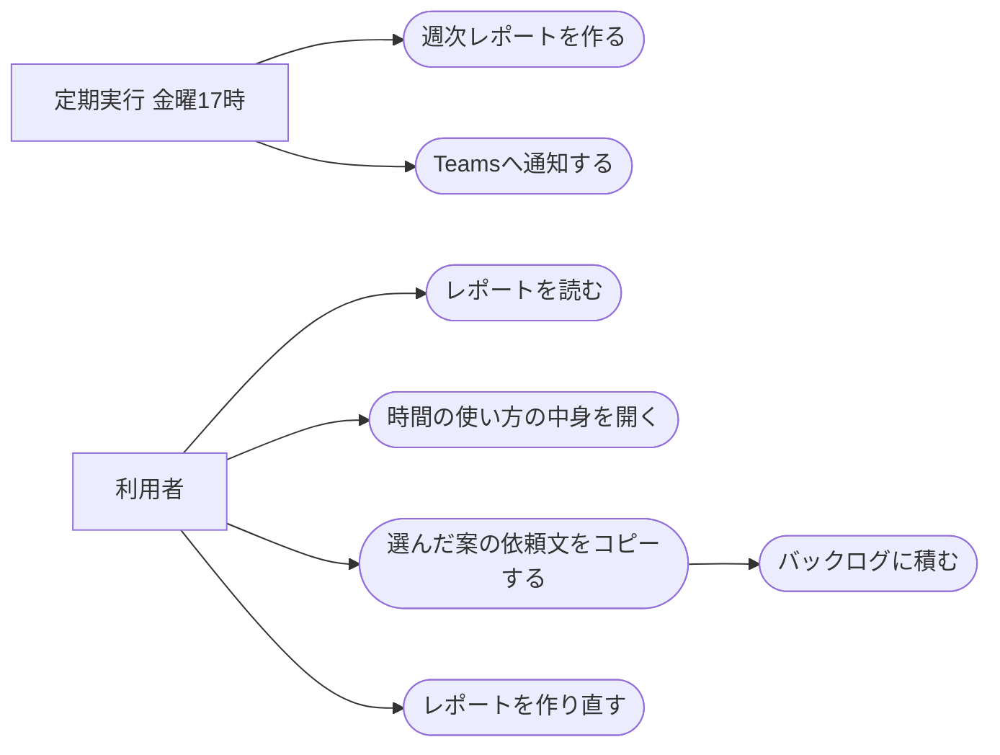

# 定型業務の週次レポート

ステータス: 仕様確認中(未実装) ／ 優先度: 中

## 概要

操作の記録(activity-recording)が残した1週間分の記録と、JIRA・Confluence・Claude Code・議事録に残っている自分の作業の記録から、何に時間を使ったかと、まだ自動化できていない定型業務への自動化案をまとめ、毎週金曜17時に届ける。 〔合意〕

- **週次レポートのHTML**: 自動化案・時間の使い方・記録の状態を1列に並べた1枚のページ。OneDriveに保存し、ブラウザで開いて読む。気に入った自動化案を選んでバックログに積む依頼文をコピーできる 〔合意〕
- **Teamsへの通知**: レポートができたことを、レポートを開けるリンク付きで自分に知らせる。レポートを開き忘れないために要る 〔合意〕
- **作り直しの入口**: 自動化案を作れなかった週を、チャットで頼んで作り直すためのClaude Code Skillの操作 〔提案〕

## ユーザーストーリー

- 利用者(自分)としては、毎週金曜に、その週どの作業に時間を使ったかと自動化案を受け取りたい 〔合意〕
- 利用者としては、時間の使い方の各項目で、具体的にどんな作業をしていたのかを要約と具体例で確かめたい 〔合意〕
- 利用者としては、気に入った自動化案を選んで、自分のバックログに積みたい 〔合意〕
- 利用者としては、自動化案を作れなかった週を、あとから作り直したい 〔提案〕

## ユースケース図

線はアクターとユースケースの関わりを表し、処理の順序ではない。「バックログに積む」は依頼文をチャットに貼ったあと backlog Skill が行う。正となる文章は機能要件・ビジネスルール・制約を参照。

## 機能要件

### 時間の集計

その週(月曜〜金曜)の操作の記録を、作業・会議・離席・記録しないアプリの4つに分けて時間を数え、作業時間をアプリと開いていたページ・ファイルの組ごとにまとめる 〔提案〕

詳細を開く

- [1] 操作の記録を、作業・会議・離席・記録しないアプリの4つに分け、それぞれの合計時間を出すこと 〔論理〕
- [2] 離席の判定は「ビジネスルール・制約」の「離席の判定」に従うこと 〔論理〕
- [3] マイクが使用中の時間は、入力の有無にかかわらず会議として数えること 〔論理〕
- [4] 作業の時間を、アプリ名とウィンドウの題名の組ごとにまとめ、長い順に上位10件を出すこと。Excel は題名(ブック名)にシート名を添えた組にする 〔論理〕
- [5] 題名が取れなかった時間は、アプリ名だけの組として数えること 〔論理〕
- [6] 記録が取れなかった時間帯(Macのスリープ中・電源が切れていた時間など)と、アプリの中身が取れなかった時間を一覧にすること。記録が取れなかった時間は4つのどれにも数えず、合計を別に出す 〔論理〕

### 作業の要約

時間の使い方の上位10件それぞれについて、ウィンドウの題名・Excelのシート名・既存の作業の記録・面倒だった作業のメモをもとに、何をしていたかの要約・主な時間帯・具体例をClaudeに作らせる 〔提案〕

詳細を開く

- [1] 上位10件それぞれについて、何をしていたかの要約を1〜2文で作ること 〔生成物〕
- [2] 上位10件それぞれについて、その作業をしていた主な時間帯(曜日と時刻の幅)を出すこと 〔論理〕
- [3] 上位10件それぞれについて、日時付きの具体例を最大3件作ること 〔生成物〕
- [4] その項目に対応する自動化案がある場合、その案へのリンクを付けること 〔生成物〕
- [5] 題名が取れなかった項目は、前後に使ったアプリ・既存の作業の記録・メモから推定し、推定であることを要約に書くこと 〔生成物〕
- [6] Claudeに渡すのは「ビジネスルール・制約」の「社外へ送るもの」に挙げたものだけにすること 〔論理〕

### 既存の作業の記録の取り込み

作業の中身を補うために、その週の自分の JIRA の更新履歴・Confluence の編集・Claude Code への依頼・議事録を読み込む 〔合意〕

詳細を開く

- [1] PJプロファイルに登録したすべてのPJの JIRA から、その週に自分が更新したチケットと、変えた項目(状態・期日など)と日時を読み込むこと。同じサイトは1回だけ読む 〔境界〕
- [2] PJプロファイルに登録したすべてのPJの Confluence から、その週に自分が編集したページの題名と日時を読み込むこと。同じサイトは1回だけ読む 〔境界〕
- [3] Claude Code の会話の記録から、その週の依頼文の冒頭200字と日時・リポジトリ名を読み込むこと 〔境界〕
- [4] 議事録の自動生成(meeting-minutes-generator)が作った議事録から、その週の議事録の題名と要点を読み込むこと 〔境界〕
- [5] どれかの読み込みに失敗した場合、その記録を使わずにレポートを作り、記録の状態にどの記録が読めなかったかを出すこと 〔境界〕

### 自動化案

同じ操作の繰り返しから自動化案をClaudeに作らせ、週に使った時間が長い順に最大5件を出す 〔合意〕

詳細を開く

- [1] 同じ操作の繰り返しが週2回以上ある作業を、自動化案の候補にすること 〔論理〕
- [2] 候補を週に使った時間が長い順に並べ、最大5件を出すこと 〔論理〕
- [3] 各案に、週に使った時間・効果(大・中・小)・見えた繰り返し・自動化の案・使える既存の仕組みを付けること 〔生成物〕
- [4] 面倒だった作業のメモに書かれた作業は、繰り返しの回数にかかわらず候補として検討し、記録と突き合わせた結果を「見えた繰り返し」に書くこと 〔生成物〕
- [5] 「使える既存の仕組み」は、このMacにある Claude Code Skill と study の既存アプリから選び、当てはまるものが無ければ「なし(新しく作る)」とすること 〔生成物〕
- [6] 候補が0件の週は、自動化案の欄に「今週は自動化案になる繰り返しが見つかりませんでした」と、候補になる条件を出すこと 〔論理〕
- [7] その週の作業の記録が5時間未満の場合、自動化案と作業の要約を作らず、その理由を出すこと 〔論理〕
- [8] Claudeの呼び出しが3回続けて失敗した場合、自動化案と作業の要約を出さずに、失敗したことと作り直す方法を出し、時間の集計と記録の状態はそのまま出すこと 〔境界〕

### レポートの作成と通知

毎週金曜17時に、その週の月曜〜金曜の分のレポートを作り、OneDriveに保存してTeamsで自分に知らせる 〔合意〕

詳細を開く

- [1] 毎週金曜17時に、その週の月曜0時から金曜17時までの記録でレポートを作ること 〔論理〕
- [2] 金曜17時にMacがスリープ中だった場合、次に起きたときにその週のレポートを作ること 〔環境〕
- [3] レポートのHTMLをOneDriveの決まったフォルダに、週を表す名前(例: 2026-W41)で保存すること 〔環境〕
- [4] レポートを保存したら、Teamsの自分宛ての通知先に、レポートをブラウザで開けるリンク付きで知らせること 〔環境〕
- [5] その週に操作の記録が1行も無い場合、レポートも通知も出さないこと 〔論理〕
- [6] 記録の終わりの日時がその週の途中だった場合も、その週の金曜にレポートを作り、記録の状態に終わった日時を出すこと 〔論理〕

### バックログに積む依頼文

自動化案にチェックを入れてボタンを押すと、選んだ案をバックログに積む依頼文がコピーされる。利用者がそれをClaude Codeのチャットに貼ると backlog Skill が積む 〔合意〕

詳細を開く

- [1] 自動化案ごとにチェック欄を置き、1件も選んでいないときはコピーのボタンを押せないようにすること 〔生成物〕
- [2] ボタンを押した場合、週の名前と選んだ案の番号・題名を含む `/backlog` の依頼文をコピーすること 〔生成物〕
- [3] コピーできた場合、「コピーしました」とチャット欄に貼る案内を出すこと 〔生成物〕
- [4] ブラウザの制限でコピーできなかった場合、依頼文を選択済みの欄に出し、手で選んでコピーするよう案内すること 〔境界〕

### レポートの作り直し

チャットで「定型業務レポートを作り直して」と頼むと、指定した週(指定が無ければ直近の週)のレポートを作り直して同じ名前で上書きし、Teamsで知らせる 〔提案〕

詳細を開く

- [1] 作り直しを頼んだ場合、指定した週のレポートを作り直し、同じ名前のファイルに上書きすること 〔論理〕
- [2] 週の指定が無い場合、直近に作った週を作り直すこと 〔論理〕
- [3] 指定した週の記録がもう消えている(4週間より前)場合、作り直さずにその旨を返すこと 〔論理〕

## ビジネスルール・制約

### 離席の判定

最後の入力から5分以上たったら離席とし、最後の入力の時点まで遡って離席として数える。画面ロック中も離席。スリープ中は記録が取れなかった時間として別に数える 〔合意〕

詳細を開く

- [1] 最後のキーボードかマウスの入力から5分以上たった時間を離席とし、最後に入力した時点まで遡って離席として数えること。根拠: /consult で決めた 〔論理〕
- [2] 画面ロック中は離席とすること。スリープ中・電源が切れていた時間は離席に数えず、記録が取れなかった時間とすること。根拠: 画面ロックは /consult で決めた。スリープ中は電源断・ログアウトと見分けられず、夜や週末の空きが離席に入って時間の使い方が読めなくなるため 〔論理〕
- [3] 入力が5分以上無くても、マイクが使用中・アプリが画面のスリープを止めている(動画や画面共有を見ている)場合は離席にしないこと。根拠: /consult で、長い会議や資料の閲覧を離席と誤って数えないために決めた。カレンダーの予定は、無人実行から読む経路を新しく保守しないため材料にしない 〔論理〕

### 自動化案を作る条件

自動化案は、同じ操作が週2回以上の作業から、時間の長い順に最大5件を出す。作業の記録が週5時間未満の週は作らない 〔提案〕

詳細を開く

- [1] 出す件数は最大5件。根拠: /consult で「自動化案の上位3〜5件」と決めた 〔論理〕
- [2] 候補にする条件は週2回以上の繰り返し。根拠: 画面モックの作成時に補った値で、出典は無い。1回だけの作業は定型業務と言えないため 〔論理〕
- [3] 自動化案を作るのは作業の記録が週5時間以上ある週だけ。根拠: 画面モックの作成時に補った値で、出典は無い。記録が少ない週は繰り返しを見分けられないため 〔論理〕

### 社外へ送るもの

Claudeへ送るのは、操作の記録・ウィンドウの題名(Excelのシート名を含む)・既存の作業の記録・面倒だった作業のメモと、使える既存の仕組みを選ぶための Skill とアプリの名前と説明だけ。画面の画像・画面の中身は撮らないので送らない 〔合意〕

詳細を開く

- [1] Claudeへ送るのは、操作の記録・ウィンドウの題名(Excelのシート名を含む)・既存の作業の記録・メモと、自動化案の「使える既存の仕組み」を選ぶための Claude Code Skill と study のアプリの名前と説明に限ること。根拠: /consult で、Team プランで学習には使われないものの、社外へ出ることは変わらないため、送るものを絞ると決めた 〔論理〕
- [2] 記録しないアプリ・サイトに当たる時間は、時刻と「除外中」の印だけを送ること 〔論理〕
- [3] レポートの作業の要約と具体例には、ウィンドウの題名に含まれていた文字(チケット番号・ファイル名・メールの件名など)が入ることがある。レポートは利用者本人のOneDriveにだけ保存する 〔論理〕

### レポートを出す時刻

毎週金曜17時に、その週の月曜〜金曜の分を出す 〔合意〕

詳細を開く

- [1] 金曜17時にその週の分を出すこと。根拠: /requirement のヒアリングで、週のうちに振り返れるよう金曜17時を選んだ 〔論理〕

## 非機能要件

- [1] 1週間分のレポートの作成(集計・Claudeの呼び出し・HTMLの保存)が30分以内に終わること 〔非機能〕 〔提案〕
- [2] 1週間分のレポートの作成で、Claudeを呼び出す回数が10回以下であること(失敗したときの再試行を除く) 〔非機能〕 〔提案〕

## 依存関係

実現性: すべてできる。既存のアプリの実績か、このMacでの確認で確かめた。カレンダーの予定は使わない 〔提案〕

詳細を開く

| 依存 | 結論 | 確認内容 |
|---|---|---|
| 操作の記録(activity-recording) | できる | このアプリのもう1つの仕様。必要な情報が launchd から取れることは確かめた。先に作る |
| launchd からの `claude -p` の呼び出し | できる | meeting-minutes-generator が同じ形で稼働している |
| OneDriveへのHTMLの保存とビューア形式のリンク | できる | retro-check などのSkillが同じ形で稼働している。launchd から書くと `Resource deadlock avoided` で失敗する例があり、対処済みの書き方に従う |
| Teamsへの通知 | できる | teams-post Skill の投稿の仕組みが稼働している |
| JIRA の更新履歴・Confluence の編集の読み込み | できる | 無人実行では MCP が使えないため REST で読む。`~/.claude/lib/atlassian_rest` を使う担当チケットの朝通知などが稼働している |
| 議事録の読み込み | できる | meeting-minutes-generator が OneDrive に議事録を保存している |
| Claude Code の会話の記録の読み込み | できる | このMacの `~/.claude/projects/` の会話の記録は1行1件の形式で、各行に種類・日時・作業フォルダが入り、人が打った依頼文を種類と印で見分けられることを確かめた。`claude -p` の会話は起動元の印で見分けられる |
| カレンダーの予定の取得 | 使わない | 自分の予定を無人実行から読める経路が稼働しておらず、新しく保守しないと決めた。会議はマイクの使用中で見分ける |
| OneDriveのビューアで開いたレポートからのコピー | できる | 2026-09-08 に、ビューア形式のURLで開いたHTMLでJavaScriptが動き、3段構え(execCommand→Clipboard API→手で選ぶ)の1段目でコピーできることを確かめた(会議設定の自動化の選択画面) |

## UI/UX要件

画面モック: [mock.html](mock.html)(プレビュー: https://claude.ai/artifact/HoWvNeagjfT9imyPNrMkuJ )。配置・見た目・状態の切り替わりはモックが正 〔合意〕

- レポートは1列で、上から「週の合計(作業・会議・離席・記録しないアプリ)」「自動化案」「時間の使い方」「記録の状態」の順に並べる 〔合意〕
- 自動化案は番号・題名・週の時間・効果を1行目に出し、その下に見えた繰り返し・自動化の案・使える仕組みを出す 〔提案〕
- 時間の使い方の各行は押すと開き、作業の要約・主な時間帯・具体例・対応する自動化案へのリンクが出る 〔合意〕
- 記録の状態には、記録中か終了か・終わりの日時・その週の記録時間・面倒だった作業のメモの件数・記録しないアプリとことば・取れなかった時間・残しているデータの範囲を出す 〔提案〕
- 自動化案を作れなかった週は、自動化案の欄と時間の使い方の要約・具体例の代わりに理由を出す 〔提案〕
- スマホの幅でも崩れず読めること 〔提案〕

## スコープ外

- Artifactでのレポートの発行 〔合意〕
- 自動化案の実装。選んだ案をバックログに積むところまでで、実装は積んだ先のバックログ項目で行う 〔合意〕
- カメラによる視線の計測を使った集計。後から別の仕様(gaze-tracking)として足す 〔合意〕
- レポートを他の人と共有する機能 〔提案〕
- 月次など、週以外の単位でのレポート 〔提案〕
