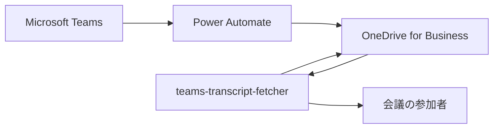
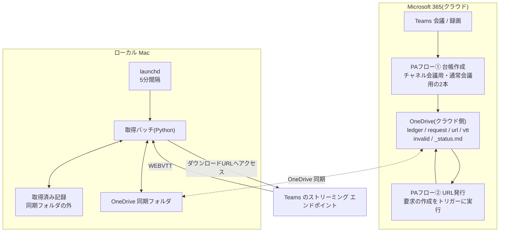

# teams-transcript-fetcher アーキテクチャ

## サマリ

Teams会議の録画から生成されるトランスクリプトを自動収集してOneDriveへ蓄積するアプリ。M365テナントへのAPI認証を一切必要としない点が最大の特徴で、収集の起点はPower Automateのクラウドフロー、取得はローカルMac上のPythonバッチが担い、両者はOneDrive上のファイルを介して連携する。

主要技術: Python 3 / launchd / Power Automate(クラウドフロー) / OneDrive同期クライアント / SharePoint REST API v2.1。

specは1つ([transcript-auto-fetch](transcript-auto-fetch/requirements.md))で、会議のトランスクリプトを自動収集してOneDriveへ保存する機能を担う。外部との境界は[コンテキスト図](#コンテキスト図)、内部構成は[システム構成図](#システム構成図)を参照。

## 概要

Teams会議の録画から生成されるトランスクリプト(WEBVTT)を自動収集し、OneDriveへ蓄積するローカル実行バッチ。収集の起点はPower Automateのクラウドフローで、両者はOneDrive上のファイルを介して連携する。

## アーキテクチャの目的

M365テナントへのAPI認証(Entra IDアプリ登録・テナント管理者同意)を一切必要とせずに、Teamsのトランスクリプトを自動収集する。

このアプリ固有の制約として、以下がすべて使用できない前提で構成を組む必要がある。

- Power Automateの素のHTTPアクション(任意URLへのアクセス)
- Azure(Functions / Logic Apps)
- Power Automateから外部サービスへの呼び出し
- Teams通知のWebhook

## 設計方針

**1. M365への認証はOneDrive同期クライアントに委ねる**

SharePoint/OneDriveをAPIで読み書きせず、同期されたローカルファイルとして扱う。これによりアプリ登録・管理者同意・条件付きアクセス・DLPのすべてを回避する。

この方針の裏返しとして、**バッチはローカル実機上でしか動作しない**。クラウド実行に移すと同期クライアントが存在せず認証が必須になるため、実行場所はアーキテクチャ上の制約であり最適化の対象ではない。

**2. Power Automateを「クラウド常駐のスケジューラ」として使う**

テナント内で24時間稼働し社内ポリシー審査済みの実行基盤として、Power Automateに「短命なダウンロードURLの鮮度を保証する役」を担わせる。バッチはPCの稼働時のみ動くため、取りこぼしの解消をPower Automate側に寄せる。

**3. 判定ロジックはバッチ側に一本化する**

「どのトランスクリプトが未取得か」の判定をPower Automateとバッチの両方に持たせない。ファイル名の整形ルールが2箇所に分かれると、片方だけ変更したときに静かに壊れるため。Power Automateは「頼まれたらURLを発行するだけ」の役に徹する。

**4. 短命な事前認証済みURLは「保存する」のではなく「その都度発行する」**

ダウンロードURLは実質ベアラトークンであり、寿命も保証されていない。URLそのものを中継するのではなく、URLを再発行するための識別情報(台帳)を中継することで、期限切れという概念自体を消す。

> **フェーズ1での例外**: この方針が完全に成立するのはフェーズ2からである。フェーズ1では台帳に発行済みURLを埋め込むため、URLはOneDrive上に会議終了から取得までの間存在し、PCが停止していれば数時間〜数日に及ぶ。これは段階的に作るための意図的な逸脱であり、フェーズ2で解消される。フェーズの定義は [transcript-auto-fetch/requirements.md](transcript-auto-fetch/requirements.md#フェーズ分け) を参照。

**5. 台帳の単位は「録画」であり「トランスクリプト」ではない**

録画が作成された時点でPower Automateが確実に知っているのは録画1件の存在だけで、トランスクリプトの件数は後から増えうる(会議の分割・再開)。台帳をトランスクリプト単位にすると、件数が増えたときに追加の台帳を作る経路が必要になるが、録画の作成をトリガーにするフローではそれを作れない。

録画単位にすることで、**件数と並び順の確定を「URLを発行する時点」に一元化**できる。URLと並び順が同じ応答から同時に得られるため、両者がずれて別のトランスクリプトを保存する事故が原理的に起きない。

## コンテキスト図

本アプリと、その外側にあるものだけを描く(内部構成は[システム構成図](#システム構成図))。



- `Power Automate` は録画の検知・台帳の作成・ダウンロードURLの発行を担う外部の実行環境で、テナント側に存在しこのリポジトリでは管理しない
- 本アプリと `Power Automate` は直接通信せず、`OneDrive` 上のファイルを介してやり取りする([実行環境](transcript-auto-fetch/requirements.md#実行環境) [3])
- 利用者は蓄積されたWEBVTTをOneDrive上で参照する

## システム構成図



## アーキテクチャ概要

会議の録画が作成されるとPower Automateフロー①が起動し、**その録画を識別する情報**を台帳としてOneDriveに書き出す(台帳1件 = 録画1件。設計方針5)。台帳はOneDrive同期クライアントによってローカルに降りてくる。

ローカルではlaunchdが5分間隔でバッチを起動する。バッチは台帳を読み、**その録画について使用するダウンロードURLの一覧を先に確定させる**(台帳内のURLと、フロー②が発行したURLのうち新しい方)。**この一覧の件数がその録画のトランスクリプト件数の正**であり、台帳の件数ではない(設計方針5)。確定した件数と取得済み記録を突き合わせて未取得のトランスクリプトを列挙し、有効なURLがなければ要求をOneDriveに書き出す。要求は同期を経てクラウド側に届き、それをトリガーにPower Automateフロー②がダウンロードURLを発行する。

発行されたURLは同期を経てローカルに降り、次回のバッチ実行で消費される。バッチはURLへアクセスしてWEBVTTを取得し、ファイル名を整形して出力先に書き出す。書き出したファイルは同期によってOneDriveへ反映される。

**この構成の要点は、バッチがURLを「発行された直後に」消費することである。** URLの寿命の長さに運用が依存しなくなり、PCが長期間停止していても起動後に新しいURLが発行されるだけになる。

### 段階的な構築(フェーズ1とフェーズ2)

上の説明はフェーズ2(最終形)の経路である。実際には2段階で作る。

| | Power Automate | バッチ |
|---|---|---|
| **フェーズ1** | フロー①のみ。台帳に発行済みURLも埋め込む | 台帳内のURLで取得する。有効なURLがなければ記録に残す |
| **フェーズ2** | フロー②を追加 | 有効なURLがなければ発行を要求し、次サイクルで消費する |

**台帳の形式はフェーズ間で変わらない。** フェーズ2で増えるのは「有効なURLがないときに発行を依頼する経路」だけであり、フェーズ1の実装はすべてそのまま使われる。

**各フェーズで何を取りこぼすかは [transcript-auto-fetch/requirements.md#フェーズ分け](transcript-auto-fetch/requirements.md#フェーズ分け) を正とする。** 同じ内容をここに転記すると片方だけ更新されてずれるため、この文書では持たない。

## 採用技術

| 技術 | 用途 |
|---|---|
| Python 3 | 取得バッチ本体 |
| launchd | バッチの定期実行(macOS) |
| Power Automate(クラウドフロー) | 録画の検知、台帳の作成、ダウンロードURLの発行 |
| OneDrive 同期クライアント | M365への認証代行およびクラウドとローカルのファイル受け渡し |
| SharePoint REST API v2.1(SharePointコネクタ経由) | トランスクリプト一覧とダウンロードURLの取得。**Microsoft Graphは使用しない** |

## 機能一覧表(機能マップ)

| spec | 機能(利用者から見て) | 役割 | 依存 | 状態 |
|---|---|---|---|---|
| [transcript-auto-fetch](transcript-auto-fetch/requirements.md) | 会議のトランスクリプトが自動でOneDriveに溜まる | 会議のトランスクリプトを自動収集してOneDriveへ保存する | Power Automateの既存フロー2本の改造、OneDrive同期クライアントの稼働 | リリース済み |

## ディレクトリ構成

CLAUDE.mdの一般規約(`infra/` + `application/`)からの逸脱がある。

```
apps/teams-transcript-fetcher/
├── application/     # バッチ本体(Python)と launchd の定義
└── specs/           # 仕様3点セット
```

- **`infra/` を持たない。** クラウドリソースを作らないため、Terraformの管理対象がない
- Power Automateのフロー定義はテナント側に存在し、このリポジトリでは管理しない。改造に使ったフロー定義とその手順は `application/` 配下に記録する

## 外部サービス

| サービス | 用途 |
|---|---|
| Microsoft Teams | 会議・録画・トランスクリプトの生成元 |
| OneDrive for Business | 台帳・要求・URL・成果物(WEBVTT)の置き場。およびM365への認証代行 |
| Power Automate | 録画の検知とダウンロードURLの発行 |

## 関連ADR

- [0001-multi-app-monorepo-layout.md](../../../doc/adr/0001-multi-app-monorepo-layout.md) — モノレポ構成の方針

## セキュリティ

- **ダウンロードURLは事実上のベアラトークンである。** そのURLを知れば会議音声由来の内容を第三者が取得できる。**フェーズ2では**設計方針4によりURLがOneDrive上に存在する時間が「発行から消費までの数分間」に限定される。**フェーズ1では台帳にURLが埋め込まれるため数時間〜数日存在しうる。** いずれの段階でも、置き場となるフォルダは共有せず個人利用の範囲に留める
- **トランスクリプトは会議の発話内容そのものであり、機微情報を含みうる。** 出力先を他者と共有する場合は、共有範囲を意識的に決める必要がある
- **資格情報を一切保持しない構成である。** クライアントシークレット・証明書・アクセストークンをこのアプリはどこにも保存しない。これは設計方針1の副次的な利点であり、実行場所をクラウドへ移すと失われる

## 技術的制約

- **Power Automateから任意のURLへアクセスできない。** 使用しているコネクタはSharePoint/OneDriveのホストのみを対象にできるため、ダウンロードURLへのアクセスはPower Automate内で行えない。これがローカルバッチを必要とする直接の理由である
- **バッチはPCが稼働している間のみ動作する。** 取りこぼしの解消はPower Automate側のURL再発行に依存する
- **フェーズ2の成立条件はダウンロードURLの寿命が「要求→発行→消費」のレイテンシ(約10分)を上回ることである。** 下回る場合は実行間隔の短縮などの再設計が必要
- **OneDrive同期には数秒〜数分のラグがある。** 即時性を前提とした設計はできない
- **Files On-Demandの未実体化(dataless)ファイルは、読み取り時のダウンロードが常に走るとは限らない。** launchdから起動されたプロセスは既定では実体化を引き起こせず、読み取りが即座に失敗する。このためバッチは起動時に実体化を自プロセスへ許可する([transcript-auto-fetch/requirements.md#実行環境](transcript-auto-fetch/requirements.md#実行環境) [4])。「常にこのデバイス上に保持」は遅延を減らす推奨設定にとどめ、正しさの前提にしない
- Power AutomateとバッチはOneDrive上の異なるフォルダにのみ書き込む。同一ファイルを双方が書くと同期の競合ファイルが生まれる

## 用語集

| 用語 | 意味 |
|---|---|
| 台帳 | 未処理の**録画1件**を表すファイル。Power Automateが録画の作成時に作成し、その録画のトランスクリプトをすべて保存し終えた時点でバッチが削除する(設計方針5) |
| 録画の識別子 | 録画ファイルを一意に指す値。台帳・要求・URLのファイル名に共通して使う唯一の共有点 |
| 要求 | バッチがPower Automateに「この録画のダウンロードURLを発行してほしい」と依頼するファイル |
| ダウンロードURL | Transcript APIが返す短命な事前認証済みURL。認証ヘッダを付けずにアクセスするとWEBVTTが得られる(付けると失敗する) |
| WEBVTT | トランスクリプトの標準的なテキスト形式。字幕ファイルと同じ形式 |
