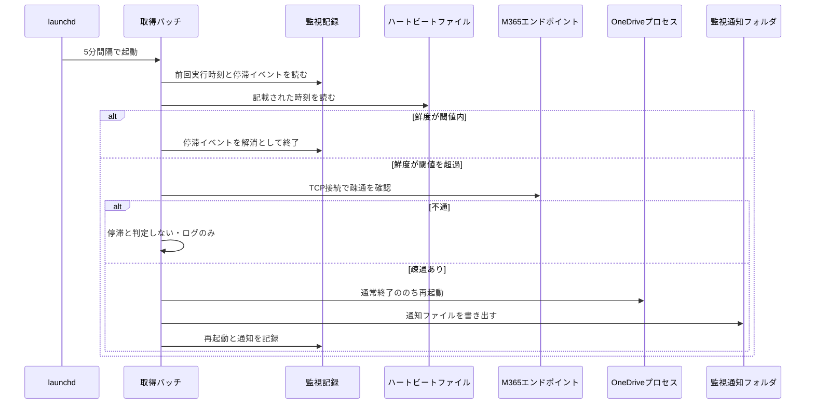
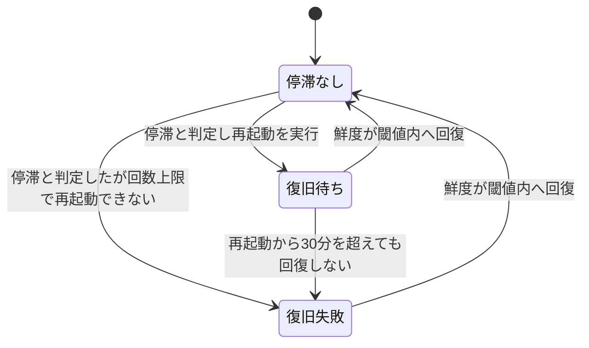

# OneDrive同期停滞の検知と自動復旧 — 設計

## サマリ

Power Automateが15分間隔で書くハートビートファイルの鮮度を、既存の5分間隔の取得バッチが毎サイクルの冒頭で確認し、鮮度が45分を超えていてかつM365エンドポイントへの疎通がある場合に同期停滞と判定してOneDrive同期クライアントを再起動する(通常終了→再起動。イベントにつき1回・直近24時間で2回まで)。通知は `teamsNotice/monitoring` フォルダへのファイル書き出しで行い、構築済みのPower Automateフローが本文をそのままTeamsへ投稿する。監視の記録(停滞イベント・再起動履歴・通知済み事象)は同期フォルダの外の `monitoring.json` に持つ。

主要な設計判断: 再起動はSIGTERMによる通常終了を試みてから強制終了に落とす方式、ネットワーク疎通は login.microsoftonline.com の443番ポートへのTCP接続、通知は1事象1ファイルで本文をそのまま投稿する形式。全体の流れは[シーケンス図](#同期停滞の判定バッチ毎サイクルの冒頭)、停滞イベントのライフサイクルは[状態遷移図](#状態管理)を参照。

## 監視で使うファイルと置き場

```
transcript/                     # 既存の作業フォルダ(OneDrive同期対象)
├── _heartbeat.txt              # ハートビート。Power Automateが15分間隔で上書きし、バッチは読むだけ
└── (既存: ledger/ request/ url/ vtt/ invalid/ _status.md)

teamsNotice/monitoring/         # 監視通知の書き出し先(transcriptと同じ00_root/auto配下)。
                                # バッチがファイルを作成し、構築済みフローが本文をTeamsへ投稿する

~/Library/Application Support/teams-transcript-fetcher/
└── monitoring.json             # 監視記録。同期フォルダの外(停滞中でも読み書きできる必要がある)
```

- ハートビートは毎回同じファイルへの上書きで、ファイル数は増えない([requirements.md#ハートビートの書き込み](requirements.md#ハートビートの書き込み) [3])
- `_heartbeat.txt` を書くのはPower Automateだけ、バッチは読むだけ。双方が同一ファイルを書くことによる同期競合は起きない
- 通知ファイルは1事象1ファイルで、ファイル名は日時と事象種別(例: `20260828-140503_同期停滞.md`)。作成後にバッチが削除・変更することはない

## 処理フロー

監視はバッチの1サイクルの中で「停滞判定と復旧 → 既存の取得サイクル → 失敗・警告の連続の検知 → 通知の書き出しと監視記録の保存」の順に動く。停滞判定・復旧が失敗しても取得サイクルは実行し、取得サイクルが失敗しても検知と通知は実行する(相互に道連れにしない)。

### ハートビートの書き込み(Power Automate・新設フロー)

- **対象**: `transcript/_heartbeat.txt`
- **手順**:
  1. 15分間隔の繰り返しトリガーで起動する。
  2. 現在時刻(UTCのISO 8601文字列)をファイル本文として `_heartbeat.txt` へ上書きする。ファイルが無ければ作成する。
  3. 1回の書き込み失敗はそのまま次回に任せる。停滞判定の閾値45分はハートビート3回分の欠落に相当し、単発の失敗では停滞と判定されない。
- **関連するビジネスルール**: [requirements.md#ハートビートの書き込み](requirements.md#ハートビートの書き込み)、[requirements.md#停滞判定の閾値](requirements.md#停滞判定の閾値)

### 同期停滞の判定(バッチ・毎サイクルの冒頭)

- **対象**: ハートビートファイルと監視記録
- **手順**:
  1. 監視記録から前回実行時刻を読む。前回実行時刻が無い場合(初回・監視記録の消失)、または前回から15分を超えて空いていた場合は「実行の中断からの復帰」とみなし、復帰時刻を今回の時刻で記録する。
  2. 復帰時刻から45分以内の場合は、停滞の判定を行わずに終える(復帰直後はハートビートが古いのが正常のため。スキップした理由をログに残す)。
  3. ハートビートファイルを読む。存在しない・読めない・時刻として解釈できない場合は、停滞の判定を行わず警告ログを残して終える(ハートビートフローが未構築・故障している期間に、正常な同期クライアントを誤って再起動しないため)。
  4. 鮮度(記載された時刻と現在時刻の差)を計算する。鮮度が閾値(45分)以内の場合、進行中の停滞イベントがあれば「解消」として終了させ、経過をログに残して終える。
  5. 鮮度が閾値を超えている場合、M365エンドポイント(login.microsoftonline.com の443番ポート)へのTCP接続(タイムアウト5秒)で疎通を確認する。不通の場合は停滞と判定せず、鮮度と疎通結果をログに残して終える(再起動も停滞の通知もしない)。
  6. 疎通がある場合は同期停滞と判定する。進行中の停滞イベントが無ければイベントの開始(開始時刻=今回の時刻)を監視記録に書き、OneDriveの再起動(次項)へ進む。
  7. 判定の結果によらず、サイクルの最後に今回の実行時刻を監視記録へ保存する。



正となる文章は上記の手順と[OneDriveの再起動と復旧確認](#onedriveの再起動と復旧確認バッチ)。

- **関連するビジネスルール**: [requirements.md#停滞判定の閾値](requirements.md#停滞判定の閾値)、[requirements.md#スリープ復帰直後の誤検知防止](requirements.md#スリープ復帰直後の誤検知防止)、[requirements.md#ハートビートの異常値の扱い](requirements.md#ハートビートの異常値の扱い)

### OneDriveの再起動と復旧確認(バッチ)

- **対象**: OneDrive同期クライアントのプロセス
- **手順**:
  1. この停滞イベントで再起動済みの場合は再起動しない。再起動から30分を超えてもハートビートの鮮度が閾値内へ戻っていなければ「復旧失敗」と判定し、通知事象に積む。30分以内なら回復を待つ(何もしない)。
  2. 未再起動で、直近24時間の再起動回数が既に2回に達している場合は再起動せず、「復旧失敗(回数上限で再起動不可)」として通知事象に積む。
  3. 再起動を実行する。OneDriveプロセスへ通常終了のシグナル(SIGTERM)を送り、最大30秒待つ。それでも残っていれば強制終了(SIGKILL)する。プロセスが元々存在しない場合は終了の手順を飛ばす。その後、OneDriveをバックグラウンドで起動する(`open -gja OneDrive` 相当)。
  4. 再起動の日時・このイベントで何回目か・直近24時間で何回目か・結果を監視記録とログに残し、「同期停滞を検知して再起動した」を通知事象に積む。
  5. 起動の実行自体が失敗した場合は「復旧失敗」として通知事象に積む。
- **関連するビジネスルール**: [requirements.md#再起動の回数制限](requirements.md#再起動の回数制限)

### 失敗・警告の連続の検知(バッチ・取得サイクルの後)

- **対象**: 取得サイクルが数えている連続失敗のカウンタと、バッチ自体の終了状態
- **手順**:
  1. 取得サイクルが想定外の例外で失敗した場合、または台帳置き場にアクセスできず中断した場合、「異常終了の連続回数」を1増やす(監視記録に持つ)。正常に終えた場合は0に戻す。
  2. 次の状態を「継続中の事象」として列挙する。回数はいずれも既存バッチが数えている値をそのまま使う。
     - 恒久的失敗の累積が上限(3回)に達して要手動確認になっている録画(ダウンロード失敗の連続)
     - 台帳の読み取り失敗が3回連続している録画
     - URLファイルの読み取り失敗が3回連続している録画
     - バッチの異常終了が3回連続している状態
  3. 列挙した事象を通知の抑止判定(次項)へ渡す。
- **関連するビジネスルール**: [requirements.md#失敗警告の連続の通知](requirements.md#失敗警告の連続の通知)

### 監視通知の書き出し(バッチ・サイクルの最後)

- **対象**: このサイクルで積まれた通知事象と `teamsNotice/monitoring` フォルダ
- **手順**:
  1. 「同期停滞を検知して再起動した」の通知は即時に書き出す。24時間ごとの抑止はせず、書き出しに成功するまで次サイクル以降も同じ内容で再試行する(再起動そのものはイベントにつき1回のみで、通知の再試行のために繰り返さない)。
  2. 継続型の事象(復旧失敗、失敗・警告の連続)は、通知済み記録に無ければ書き出して最終通知時刻を記録する。既にあれば、最終通知から24時間以上経過している場合のみ再度書き出して最終通知時刻を更新する。
  3. 今回のサイクルで継続していない事象は通知済み記録から取り除く(解消した後に再発した場合を新しい事象として通知するため)。
  4. 通知は1事象1ファイルとし、本文には事象の種類・検知時刻・状況の要点(ハートビートの鮮度、再起動の実施回数、対象の会議名など)を書く。構築済みのフローが本文をそのままTeamsへ投稿する。
  5. 即時・継続型を問わず、書き出しに失敗した事象は通知済みとして記録せず、次のサイクルで再試行する。OneDrive再起動の直後は同期経路がまだ使えず書き込みが失敗することがあるため、この再試行は即時通知でも起こりうる。
  6. 同期停滞の最中に書き出したファイルは同期が復旧するまでTeamsに届かないが、そのまま書き出しておく(復旧後に投稿される)。
- **関連するビジネスルール**: [requirements.md#通知の抑止と限界](requirements.md#通知の抑止と限界)、[requirements.md#記録](requirements.md#記録)

## バリデーション

- ハートビートの本文は「ISO 8601の日時文字列1つ」だけを受け付ける。前後の空白・改行は無視し、タイムゾーン表記(`Z`・オフセット)を解釈する。タイムゾーンが無い場合はUTCとみなす。解釈できない本文は「読めない」と同じ扱いにする(停滞判定をしない)
- 記載された時刻が現在より未来の場合(時計ずれ)、鮮度は0とみなす(停滞ではない側に倒す)

## エラーハンドリング

- **監視と取得を相互に道連れにしない。** 停滞判定・再起動・通知の各処理は例外から保護し、失敗してもログに残して取得サイクルを実行する。取得サイクルの失敗も監視側(異常終了の計数と通知)を止めない
- 監視記録(`monitoring.json`)が読めない場合は空として扱い、警告ログを残して続行する(既存の取得済み記録と同じ方針)。記録が失われると再起動の回数制限・通知の抑止の記憶も失われるが、上限は24時間2回と安全側のため、直後に再起動が1回余分に走りうることは許容する
- 監視記録の保存は一時ファイルへ書いてから所定の名前へ移す(途中で失敗しても既存の記録を壊さない。既存の取得済み記録と同じ方式)
- 再起動のどのステップが失敗しても(終了できない・起動できない)、結果をログに残し「復旧失敗」の通知事象に積む

## 関連するファイル(抜粋)

- 新規 `apps/teams-transcript-fetcher/application/sync_monitor.py` — 停滞判定・OneDrive再起動・通知事象の管理と書き出し・監視記録の読み書き
- 新規 `apps/teams-transcript-fetcher/application/tests/test_sync_monitor.py`
- 変更 `apps/teams-transcript-fetcher/application/config.py` — ハートビートファイル・監視通知フォルダ・監視記録ファイルのパスと、監視のしきい値の追加
- 変更 `apps/teams-transcript-fetcher/application/fetch_transcripts.py` — mainへの監視の組み込みと異常終了の計数
- 変更 `apps/teams-transcript-fetcher/application/power-automate/README.md` — ハートビートフローの構築手順の追記
- 参照 `apps/teams-transcript-fetcher/application/state.py` — 連続失敗のカウンタ(既存)を検知に使う

## 状態管理

監視記録(`monitoring.json`。同期フォルダの外)に以下を持つ。

| 項目 | 用途 |
|---|---|
| 前回実行時刻 | 実行の中断(15分超の空白)の検知 |
| 復帰時刻 | 復帰後45分間の判定スキップ |
| 進行中の停滞イベント(開始時刻・再起動時刻・復旧失敗判定済みか) | イベント単位の再起動1回制限と復旧確認 |
| 保留中の再起動通知(書き出しに未成功の「同期停滞」通知の内容) | 停滞イベントの解消後も含め、書き出しに成功するまでの再試行(design.md#監視通知の書き出しバッチサイクルの最後) |
| 再起動履歴(日時の一覧。24時間より古いものは捨てる) | 直近24時間で2回までの制限 |
| 通知済み事象(事象キー → 最終通知時刻) | 再通知の抑止と24時間ごとの再通知 |
| 異常終了の連続回数 | バッチ自体の異常終了の連続の検知 |

停滞イベントのライフサイクル:



正となる文章は[同期停滞の判定](#同期停滞の判定バッチ毎サイクルの冒頭)と[OneDriveの再起動と復旧確認](#onedriveの再起動と復旧確認バッチ)。

## セキュリティ

- **通知本文にダウンロードURL・トランスクリプト本文を書かない**(既存の記録ファイルと同じ方針)。書くのは事象の種類・時刻・鮮度・回数・会議名程度に留める
- **再起動対象のプロセスはプロセス名の完全一致で特定し、シェルを介さず引数の配列でコマンドを実行する**(別プロセスの誤終了と、外部由来文字列の混入によるコマンド注入の防止)
- **ハートビートの本文は外部由来の文字列として扱う。** 日時として解釈する以外の用途に使わず、解釈できなければ捨てる
- **疎通確認の接続先はコードに固定したホスト名のみ。** ファイル由来の宛先へは接続しない

## ログ

いずれも既存のログファイル(同期フォルダの外・ローテーション付き)へ出す。

| タイミング | 内容 | レベル |
|---|---|---|
| 毎サイクルの停滞判定 | 鮮度・判定結果(正常/復帰猶予中/ハートビート読めず/ネットワーク不通/停滞)と根拠 | INFO |
| 実行の中断からの復帰を検知 | 空白の長さと猶予の終了時刻 | INFO |
| 再起動の実行 | 日時・イベント内で何回目か・直近24時間で何回目か・終了と起動の結果 | WARNING |
| 復旧失敗の判定 | 再起動からの経過時間または上限到達の旨 | ERROR |
| 通知の書き出し | ファイル名と事象の種類 | INFO |
| ハートビートが存在しない・読めない | パスと理由 | WARNING |
| 監視記録の読み書き失敗 | パスと理由 | WARNING |

停滞判定の結果と根拠を毎サイクルINFOで残すのは、[requirements.md#同期停滞の検知](requirements.md#同期停滞の検知) [6](後から確認できること)のため。
