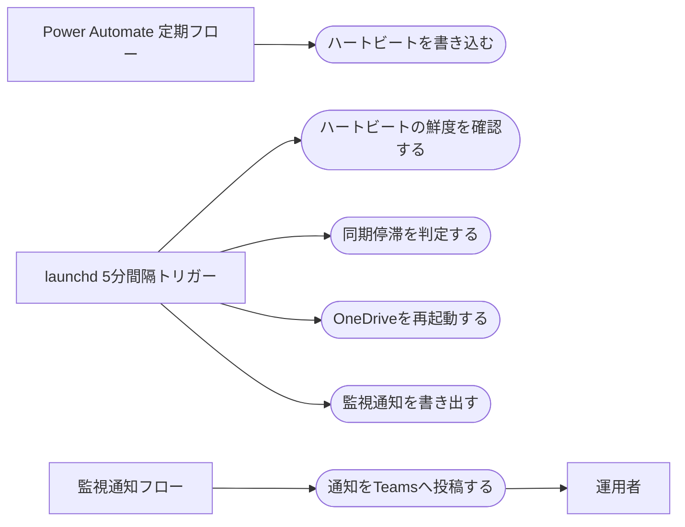

# OneDrive同期停滞の検知と自動復旧

> ステータス: 仕様確認中(未実装)

## サマリ

トランスクリプト取得バッチはOneDrive同期でファイルが届くことを前提に動くが、「Macは起きているのに同期だけが止まる」事態が起きると取得が長時間停止し、運用者は気づけない。この機能は、Power Automateが15分間隔で書くハートビートファイルの鮮度を既存の5分間隔バッチが毎サイクル確認し、ネットワークが生きているのに45分を超えて更新がなければ同期停滞と判定してOneDrive同期クライアントを自動再起動する(同一停滞につき1回・直近24時間で2回まで)。あわせて、停滞の検知・復旧失敗・同一の失敗や警告の連続を、`teamsNotice/monitoring` フォルダ経由のTeams投稿で運用者に通知する。ネットワーク断そのものの復旧、クラウド側からの外形監視はスコープ外。全体像は[ユースケース図](#ユースケース図)を参照。

## 概要

- 機能名: OneDrive同期停滞の検知と自動復旧(監視通知を含む)
- 目的: OneDrive同期の停滞によるトランスクリプト取得の長時間停止を、人手の監視なしで復旧・通知できるようにする
- 優先度: 高(同期停滞が再発すると、復旧まで取得が全面停止する)

## ユーザーストーリー

- 運用者としては、Macが起きているのにOneDrive同期が止まってトランスクリプトが届かない状態を、自分が監視していなくても自動で復旧してほしい
- 運用者としては、自動復旧できなかった異常や、バッチの失敗・警告が恒常化している状態を、Teamsへの通知で知りたい

## ユースケース図

正となる文章は[機能要件](#機能要件)・[ビジネスルール・制約](#ビジネスルール制約)を参照。

## 機能要件

### ハートビートの書き込み

- [1] Power Automateの定期フローが、15分間隔で現在時刻をハートビートファイルに書き込むこと
- [2] ハートビートファイルは、取得バッチが監視しているのと同じOneDrive同期経路(transcriptフォルダ配下)に置くこと
- [3] ハートビートは毎回同じファイルへの上書きとし、ファイル数が増えないこと

### 同期停滞の検知

- [1] 既存の5分間隔の取得バッチが、実行のたびにハートビートファイルの鮮度(記載された時刻と現在時刻の差)を確認すること
- [2] 鮮度が閾値(45分)を超えており、かつネットワークが生きている場合に限り、同期停滞と判定すること
- [3] ネットワークが不通の場合は同期停滞と判定せず、再起動も停滞の通知も行わないこと
- [4] スリープ復帰直後は同期停滞と判定しないこと(判定条件は[ビジネスルール](#スリープ復帰直後の誤検知防止)を参照)
- [5] 検知の判定結果と根拠(鮮度・ネットワーク状態)がログに残り、後から確認できること

### OneDriveの自動再起動

- [1] 同期停滞と判定した場合、OneDrive同期クライアントを自動で再起動すること
- [2] 再起動には回数制限を設けること(上限は[ビジネスルール](#再起動の回数制限)を参照)
- [3] 回数の上限に達している場合は再起動せず、通知のみ行うこと
- [4] 再起動の実行(日時・何回目か・結果)が記録に残り、後から確認できること
- [5] 再起動後、一定時間以内にハートビートの鮮度が閾値内へ戻らない場合、「復旧失敗」と判定すること

### 監視通知

- [1] 通知は `teamsNotice/monitoring` フォルダへのファイル書き出しで行い、同フォルダを監視する専用のPower Automateフロー(構築済み)がTeamsへ投稿すること
- [2] 次の3種類の事象を通知すること
  - 同期停滞を検知してOneDriveを再起動したとき
  - 再起動しても復旧しなかったとき(回数上限で再起動できなかった場合を含む)
  - 同一の失敗・警告が既定回数連続したとき(対象と回数は[ビジネスルール](#失敗警告の連続の通知)を参照)
- [3] 同一事象の再通知は抑止し、継続中は24時間ごとに再通知すること。解消した後に再発した場合は新しい事象として通知すること
- [4] 通知本文には、事象の種類・検知時刻・状況の要点(ハートビートの鮮度、再起動の実施回数など)を含めること

## ビジネスルール・制約

### 停滞判定の閾値

- [1] ハートビートの鮮度が45分を超えた場合、停滞の候補と判定すること。根拠: ハートビート3回分の欠落に相当し、Power Automateの実行遅延や同期の通常ラグ(数秒〜数分)による誤検知を吸収しつつ、1時間以内に復旧動作へ入れる
- [2] ネットワークが不通の間は、鮮度によらず停滞と判定しないこと。根拠: 同期停滞はネットワークが生きているのにファイルが届かない状態を指し、ネットワーク断はOneDrive再起動では直らない別の異常であるため

### スリープ復帰直後の誤検知防止

- [1] 前回のバッチ実行から15分を超えて間隔が空いていた場合、スリープ等による実行の中断とみなすこと。根拠: バッチは5分間隔で起動されるため、3サイクル分を超える空白は稼働の連続性が切れた証拠になる
- [2] 実行の中断からの復帰後45分間は、同期停滞と判定しないこと。根拠: 復帰直後はハートビートが古いのが正常であり、新しいハートビートが書かれて同期されるまで(最大でハートビート間隔+同期ラグ)の猶予が必要

### 再起動の回数制限

- [1] 再起動は同一の停滞イベントにつき1回までとすること。根拠: 1回で直らない停滞は再起動の繰り返しでは解決せず、人の対応が必要
- [2] 同一の停滞イベントとは、停滞判定が始まってからハートビートの鮮度が閾値内へ戻るまでの期間を指すこと
- [3] 直近24時間の再起動は合計2回までとすること。根拠: 短時間に停滞判定と復旧を繰り返す状態で再起動がループすることを防ぐ
- [4] 再起動後30分以内にハートビートの鮮度が閾値内へ戻らない場合、復旧失敗と判定すること。根拠: 再起動後の同期再開とハートビート2回分の更新を待つのに十分な時間

### 失敗・警告の連続の通知

- [1] 同期停滞以外でも、同一の失敗・警告が3回連続した場合に通知すること。対象は既存バッチが記録している異常(同一トランスクリプトのダウンロード失敗の連続、URL読み取り待ちの持ち越しの連続、バッチ自体の異常終了の連続)とすること。根拠: 3回連続は約15分に相当し、一過性の失敗を除外できる。既存の「読めないURLファイルは3回連続で記録」の閾値とも揃う

### 通知の抑止と限界

- [1] 同一事象の通知は、事象が継続している間は24時間ごとに1回とすること。根拠: 毎サイクル同じ通知が飛ぶノイズを防ぎつつ、長期化した異常の見落としも防ぐ
- [2] 通知はDLPポリシーによりTeams Webhookを使えないため、OneDriveフォルダへのファイル書き出しをPower Automateフローが拾って投稿する方式とすること
- [3] 同期停滞の最中に書き出した通知ファイルは、同期が復旧するまでTeamsに届かないこと(制約として許容する)。通知ファイル自体は書き出しておき、復旧後に投稿されること。根拠: 通知も同じOneDrive同期に依存しており、同期に依存しない通知経路は本specのスコープ外

### 記録

- [1] 停滞イベント・再起動・通知の履歴は、回数制限(24時間で2回)と再通知の抑止(24時間ごと)の判定に使える形で保持すること
- [2] 履歴の保存先は同期フォルダの外とすること。根拠: 同期停滞の最中でも読み書きできる必要がある

## 依存関係

- 検知・再起動・通知の実行主体は既存の取得バッチであり、その実行基盤(launchdによる5分間隔の起動)を共有する([transcript-auto-fetch/requirements.md#実行環境](../transcript-auto-fetch/requirements.md#実行環境))
- ハートビートを書き込むPower Automateの定期フローを新設すること
- 通知の投稿は `teamsNotice/monitoring` フォルダを監視する専用のPower Automateフロー(構築済み)が行うこと

## スコープ外

- 時刻ベースの盲目的な定期再起動(停滞していないのに再起動する運用はしない。停止時間の大半がスリープのケースには効果がなく、副作用だけが残るため)
- ネットワーク断そのものの検知・自動復旧
- クラウド側からの外形監視(Macが無応答であることをクラウド側で検知して通知する仕組み)
- Teams Webhookによる通知(DLPポリシーで使用不可)
- Macのスリープ運用の変更(スリープさせない設定など)
- 既存の取得ロジック(台帳・URL・ダウンロード処理)の変更
