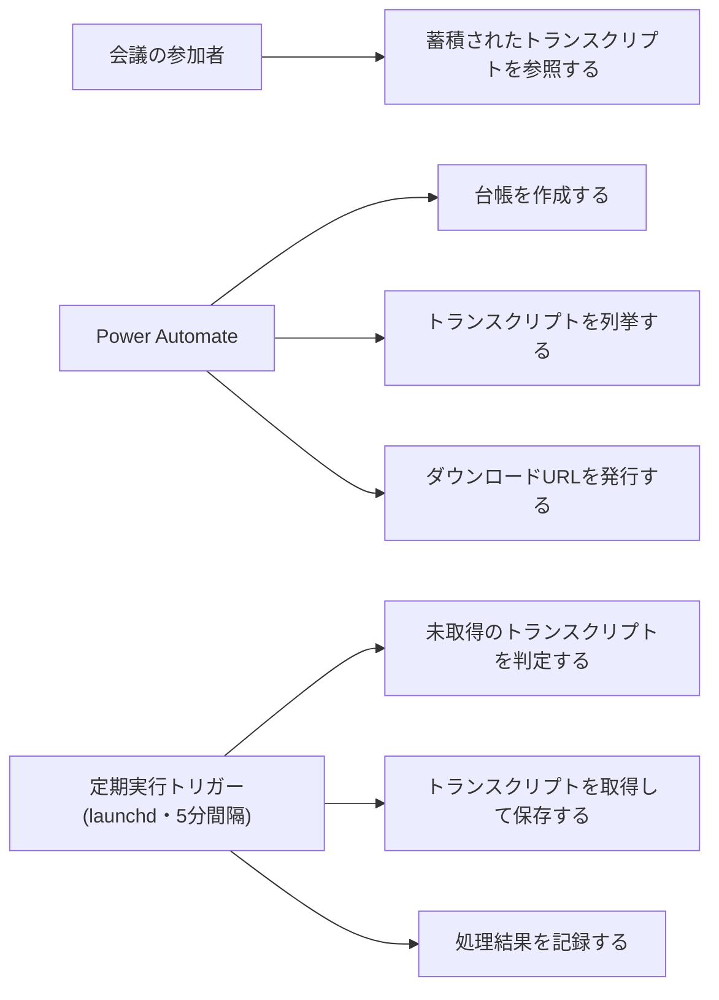

# Teams録画トランスクリプトの自動取得

## サマリ

会議の参加者が、Teams会議のトランスクリプト(WEBVTT)を手作業でダウンロードすることなくOneDriveへ自動蓄積できるようにする。Power Automateが録画1件ごとに台帳を作り、ローカルMac上のバッチが5分間隔で未取得のトランスクリプトを取得して保存する。M365へのAPI認証は行わず、OneDrive同期クライアントに委ねる。

主要なビジネスルール:

- 出力ファイル名は会議名・録画の作成時刻・一覧内の連番で決まり、120文字を超える場合は会議名の部分だけを切り詰める([ファイル名](#ファイル名))。同名の定例会議どうし、および同一録画内の複数トランスクリプトどうしの衝突を防ぐため
- **失敗が利用者に見えないまま放置されないこと**を全体を貫く方針とする。期限切れのダウンロードURLは同じURLでリトライせず、恒久的な失敗が続く録画は「要手動確認」として処理対象から切り離して記録する([エラー時の挙動](#エラー時の挙動))

スコープ外の要点: 稼働開始前に終了した会議のバックフィル、録画(mp4)本体の取得、トランスクリプトの加工・要約・検索インデックス化、Teamsへの通知(DLPにより不可)。詳細は[スコープ外](#スコープ外)。

全体像は[ユースケース図](#ユースケース図)を参照。

## 概要

- **機能名**: transcript-auto-fetch
- **目的**: Teams会議の録画から生成されるトランスクリプト(WEBVTT)を、手作業なしにOneDriveへ蓄積する
- **優先度**: 中
- **方式検討の経緯**: `~/Documents/社内/md-report/2026-08-19_Teams録画トランスクリプトの自動取得方式検討.md`(4案の比較と採用理由。本ドキュメントの「根拠」はこのレポートを指すことがある)

## ユーザーストーリー

会議の参加者としては、Teams会議のトランスクリプトを、会議ごとに手作業でダウンロードすることなく自動でOneDriveに蓄積したい。後から会議の内容を検索・参照できるようにするため。

## ユースケース図

図の正となる文章は[ユーザーストーリー](#ユーザーストーリー)と[機能要件](#機能要件)。

## 用語

| 用語 | 意味 |
|---|---|
| 台帳 | 未処理の**録画1件**を表すファイル。Power Automateが録画の作成時に作成し、その録画のトランスクリプトをすべて保存し終えた時点でバッチが削除する |
| 録画の識別子 | 録画ファイルを一意に指す値。台帳・要求・URLのファイル名に共通して使う |
| 要求 | バッチが「この録画のダウンロードURLを発行してほしい」とPower Automateに依頼するファイル |
| ダウンロードURL | トランスクリプト一覧の応答に含まれる短命な事前認証済みURL。認証ヘッダを付けずにアクセスするとWEBVTTが得られる |
| 取得済み記録 | どのトランスクリプトを取得し終えたかをバッチが保持する記録 |
| 実行(サイクル) | バッチが起動してから1巡の処理を終えるまで。既定5分間隔。本ドキュメントと design.md では「実行」「サイクル」を同義で用いる |

## 機能要件

### 台帳の作成(Power Automate側)

- [1] 録画が作成された場合、その**録画1件につき台帳が1件**作成されること
- [2] 台帳に、ダウンロードURLを発行するために必要な録画の識別情報と、会議名・録画の作成日時が含まれること
- [3] チャネル会議・通常会議の両方が対象となること
- [4] 台帳の保存先はOneDriveであること(SharePointには保存しない)
- [5] トランスクリプトが1件も見つからない場合も台帳が作成されること — 根拠: 録画の作成時点ではトランスクリプトの生成が完了していない場合があり、そこで台帳を作らないとその録画が永久に対象外になる
- [6] 録画以外のファイルが作成された場合は台帳を作成しないこと

### トランスクリプトの列挙

- [1] 1つの録画に含まれるトランスクリプトの件数と並び順は、**ダウンロードURLを発行した時点の一覧**に従うこと(ただし件数の下限については [5] が優先する) — 根拠: 録画の作成時点では件数が確定しておらず後から増えることがある。URLと並び順を同じ一覧から同時に得ることで、両者がずれて別のトランスクリプトを取得する事故を防ぐ
- [2] 1つの録画に複数のトランスクリプトがある場合、そのすべてが保存対象となること
- [3] 1つの録画について、**直近の発行時点で既知の全件**([5] による下限を含む)を保存し終えるまで、その台帳が保持されること
- [4] [3]の全件を保存し終えた時点で台帳は削除され、それ以降にその録画のトランスクリプトが増えても検知しないこと — 根拠: 検知するには完了済みの録画を継続的に再列挙する必要があり、未確認のケースに対してPower Automateの実行回数を恒常的に消費する。Teamsは録画セッションごとに録画ファイルを作るため、会議を止めて再開した場合は新しい録画として通常の経路で拾える(詳細は[スコープ外](#スコープ外))
- [5] 1つの録画について既知の件数は減らないものとして扱うこと。新しく取得した一覧の件数が、それまでに観測した最大の件数を下回る場合は、最大の件数を既知の件数とすること — 根拠: [状態管理](#状態管理) [5] のとおり一覧からトランスクリプトが消えることはない。件数が減ったように見えるのはURLファイルの書き込み順序が入れ替わったなどの一時的な事象であり、それを信じて「全件保存済み」と判定すると台帳が削除され、保存していないトランスクリプトを永久に取りこぼす。**この前提が崩れて実際に件数が減った場合は、既知件数分のURLが揃わないまま要求が続くため、[エラー時の挙動](#エラー時の挙動) [7] で打ち切る**

### 未取得の判定(バッチ)

- [1] 台帳に対応する録画のうち、まだ保存していないトランスクリプトがあるものを「未取得」と判定すること
- [2] 出力先に同名のトランスクリプトファイルが既に存在する場合は、そのトランスクリプトを取得済みとして扱うこと
- [3] 台帳の内容を書き換えないこと(台帳に対して行うのは削除と、不正な台帳の退避のみであること)
- [4] 未取得かどうかの判定はバッチ側にのみ存在し、Power Automate側では行わないこと

### ダウンロードURLの発行要求

- [1] 未取得の録画のうち、有効なダウンロードURLを持たないもの、**または既知件数分のURLが揃わないもの**について、**録画1件につき1つの要求**が作成されること — 根拠: 全件をまとめた1ファイルにすると発行側に繰り返し処理が必要になる。1件ずつにすると発行側が単純になり、ファイル名の規則を台帳・URLと共通化できる(共有する取り決めが減る)
- [2] すでに要求済みで未処理のものは重複して要求しないこと
- [3] 要求には録画の識別情報が含まれ、ダウンロードURLは含まれないこと — 根拠: ダウンロードURLは実質ベアラトークンであり、必要のない場所に置かない
- [4] 要求を受けたPower Automateが、その録画のトランスクリプト一覧を取得し、**一覧に含まれる全件分**のダウンロードURLを所定の場所に保存すること
- [5] 要求が滞留しきい値(既定30分)を超えて未処理のまま残っている場合、その要求を退避して対象の録画を解放し、その事実が記録されること — 根拠: 解析できない要求が残り続けると、そこに含まれる録画が「要求済み」扱いのまま永久に再要求されなくなる。しきい値はPower Automateフローの想定実行時間(1件あたり数秒。トリガーのポーリング遅延を含めて数分)より十分に長い値とし、正常な処理中に退避しないようにする

### トランスクリプトの取得と保存

- [1] ダウンロードURLへアクセスしてトランスクリプトを取得すること
- [2] 取得したトランスクリプトをWEBVTT形式のファイルとして出力先に保存すること
- [3] 保存に成功したトランスクリプトが取得済みとして記録されること
- [4] 1つの録画のすべてのトランスクリプトを保存し終えた場合、その台帳と使用済みのURLが削除されること
- [5] 上記が既定5分間隔で自動実行されること

### 処理結果の記録

- [1] 取得に失敗した対象がある場合、会議名・日時・失敗の理由が記録ファイルに追記されること
- [2] 記録ファイルはOneDrive上に置かれ、当該PCの前にいなくても内容を確認できること
- [3] 同じ対象の同じ失敗が繰り返し追記されないこと — 根拠: 5分間隔で実行されるため抑止しないと1日あたり数百行が同一内容で埋まり、「記録を見て気づく」という [2] の目的自体が損なわれる
- [4] 台帳が長期間(既定7日)処理されないまま残っている場合、その事実が記録されること — 根拠: 発行要求が届いていない・Power Automateが停止しているなど、失敗として現れない異常を検知する手段が他にない
- [5] 「要手動確認」の記録には、原因を次の3つに区別できるラベルが含まれること — 根拠: 1つ目は文字起こしを有効にしなかった会議のたびに日常的に発生する想定であり、調査が必要な2つ目・3つ目と混ざると [3] が守ろうとした「記録を見て気づく」価値が目減りする
  - **トランスクリプトが0件のまま**(日常的に発生する想定。[エラー時の挙動](#エラー時の挙動) [7] の1つ目のケース)
  - **既知件数分のURLが揃わない**(調査が必要。[エラー時の挙動](#エラー時の挙動) [7] の2つ目のケース)
  - **取得の失敗が続いた**(調査が必要。[エラー時の挙動](#エラー時の挙動) [5])

## ビジネスルール・制約

### ファイル名

- [1] 会議名から録画由来の拡張子が除去されること
- [2] ファイル名に使えない文字(`" * : < > ? / \ |`)・絵文字・先頭末尾の空白・末尾のピリオドが置換または除去されること — 根拠: SharePoint/OneDriveのファイル名制約
- [3] ファイル名に会議の時刻が含まれること — 根拠: 定例会議は同じ会議名が繰り返されるため、時刻がないと別々の会議のトランスクリプトが衝突・上書きされる
- [4] 時刻には録画ファイルの作成日時を用い、それが台帳から得られない場合は台帳ファイルの更新時刻で代用すること — 根拠: 会議の開始時刻そのものは取得できない。録画は会議終了直後に生成されるため、同名の定例会議を区別する目的には十分である
- [5] 1つの録画に複数のトランスクリプトがある場合、ファイル名に一覧内の並び順を示す連番が含まれること — 根拠: 同じ録画由来のトランスクリプトは会議名も時刻も同一になるため、連番がないと互いに衝突する
- [6] ファイル名の長さが120文字を超える場合、会議名の部分を末尾から切り詰めること。時刻と連番は切り詰めないこと — 根拠: OneDriveのファイル名長とパス長の制限に対し、同期フォルダの深い階層に置かれても収まる余裕を持たせる。時刻と連番を落とすと [3] [5] の衝突防止が機能しなくなる
- [7] 保存する文字コードがUTF-8・BOMなしであること — 根拠: 日本語のトランスクリプトで文字化けを防ぐ

### エラー時の挙動

- [1] ダウンロードURLへのアクセスが401・403・404を返した場合、URLの期限切れと判断し、同じURLでのリトライを行わないこと — 根拠: 事前認証済みURLは期限が切れると同じURLで成功することがないため、リトライは無駄な通信になる
- [2] 応答が成功であっても本文がWEBVTT形式でない場合、およびアクセス先URLがHTTPS・想定ホストの検証を通らない場合は、失敗として扱い保存しないこと — 根拠: 期限切れのURLがエラーページを本文として返し、ステータスだけは成功になる場合がある。保存してしまうと取得済みとして記録され台帳も削除されるため、復旧できない誤りになる
- [3] [1][2]の場合、台帳を削除せず残すこと。**フェーズ2では次回の発行要求の対象とし、フェーズ1では記録に残すことが終端となること**
- [4] 5xx・通信エラー・タイムアウトの場合は一時障害と判断し、次回の定期実行でリトライすること
- [4-2] [4]のうち**ローカルの設定不足が原因で待っても直らないもの**(TLS証明書の検証に失敗した場合など)は、分類を一時障害のまま([1]のようにURLを使い潰さない)とし、**その事実を記録に1回だけ残すこと** — 根拠: 通常の一時障害は次回に自然とリトライされるため記録しないが、設定不足は人が対処しないと永久に進まない。記録がないと利用者には「何も起きない」ことしか分からず原因に到達できない。実際に証明書の設定漏れで気づけない状態が発生した(2026-08-19)
- [5] **同じ録画**が[1][2]の失敗を3回繰り返した場合、その録画について以降の取得と発行要求を行わず「要手動確認」として記録すること — 根拠: 無限に要求を出し続けるとPower Automateの実行回数を消費し続ける。復旧しない対象は人が対処すべき状態として切り離す。単位を録画にするのは、「要手動確認」が「その録画の全トランスクリプトを打ち切る」判断であるため(識別自体はトランスクリプト単位で行う。[状態管理](#状態管理) [3])
- [6] [5]の回数は、1回の実行につき最大1回しか加算されないこと — 根拠: 1つの録画に複数のトランスクリプトがあり、そのURLがまとめて期限切れになった場合、トランスクリプトごとに数えると1回の実行で即座に上限へ達し、再発行で回復できるケースを人手案件に落としてしまう。同一実行内の複数の失敗は「URLの期限切れ」という1つの原因によるものとして1回と数える
- [7] 発行要求を出しても保存が1件も進まない実行が既定10回続いた録画は、**以降の取得と発行要求を行わず**「要手動確認」として記録すること。回数は実行1回につき1加算し、保存が1件でも進んだ時点で0に戻すこと — 根拠: [1][2]の恒久的失敗に該当しないまま要求と発行を無限に繰り返す経路がある。放置するとPower Automateの実行回数を消費し続けるが、[5]の上限は恒久的失敗しか数えないため届かない。該当する状況は主に次の2つ
  - **その録画のトランスクリプトが永久に0件のまま**(会議で文字起こしが有効でなかった場合など)。[台帳の作成](#台帳の作成power-automate側) [5] により台帳は作られるため、要求が出続けて保存は進まない。**実運用でこの状態に至る大半はこのケースと考えられる**
  - [トランスクリプトの列挙](#トランスクリプトの列挙) [5] の前提が崩れて一覧の件数が実際に減った場合(既知件数分のURLが永久に揃わない)
- [8] [7]の既定回数は、実行間隔(5分)との積が、トランスクリプト生成の遅れとして想定される時間を上回るよう設定すること。既定10回は約50分に相当する — 根拠: この状態には「まだ生成されていないだけ」という正常な待ち状態が含まれる。生成待ちの録画を人手案件に落とさないため、[5]の上限3回(約15分)より緩い値にする。実機の観測([前提・検証項目](#前提検証項目) #7)で生成の遅れがこれを超えると分かった場合は引き上げる
- [9] 1件の失敗が他の対象の処理を止めないこと
- [10] 台帳の**内容を読んだ上で不正と判断できた場合**(JSONとして解析できない・必須項目が欠けている)と、**そもそも内容を読み取れなかった場合**(入出力エラー)を区別すること。読み取れなかった台帳は退避せず、次回の定期実行に持ち越すこと — 根拠: 同期フォルダのファイルは、クラウド側に作られた直後などローカルで実体化されていない状態では一時的に読み取れないことがある(実機で `Resource deadlock avoided` が発生し、**中身は完全に正常な台帳が「不正」として退避された**。2026-08-19)。読み取れなかったことを不正と同じ扱いにすると、次回読めば処理できる台帳を人手による終端に落とし、そのトランスクリプトを取り逃す
- [11] 同じ台帳が既定3回続けて読み取れなかった場合、その事実を記録に1回だけ残すこと。**この場合も退避はしないこと** — 根拠: 実体化待ちは正常運用で起こりうるため1回目で記録すると[処理結果の記録](#処理結果の記録) [3] が守ろうとした価値が損なわれる。一方、権限異常などで永久に読み取れない場合、[処理結果の記録](#処理結果の記録) [4] の長期滞留の検知は**読み取れた台帳しか対象にできない**ため、記録しなければ気づく手段がない。退避しないのは、読み取れていない内容を不正と断定できないため
- [12] URL置き場に対象のURLファイルが存在するのに内容を読み取れなかった場合(入出力エラー)、「有効なURLがない」とは扱わず、**発行要求を出さずに**その録画を次回の定期実行に持ち越すこと — 根拠: 読み取れないURLファイルを「無い」と扱って再発行を要求すると、フロー②がファイルを書き直し、同期直後の未実体化状態に戻るため再び読み取れない。この繰り返しは自力で収束せず、Power Automateの実行回数を消費し続ける(実機で発生。2026-08-27)。なお内容を読んだ上で不正と判断できた場合(JSONとして解析できない等)は従来どおり「無い」として扱ってよい(書き直しによって直る見込みがあるため)
- [13] 同じ録画のURLファイルが既定3回続けて読み取れなかった場合、その事実を記録に1回だけ残すこと — 根拠: [11]と同じ。[12]で発行要求を止めるため、読み取れない状態が永久に続くと要求の滞留([ダウンロードURLの発行要求](#ダウンロードurlの発行要求) [5])にも掛からず、記録しなければ気づく手段がなくなる。しきい値を台帳([11])と同じ既定3回に揃えるのは、同じ「実体化待ち」に対する記録条件を2種類持たないため

上記全体を貫く方針として、**失敗が利用者に見えないまま放置されないこと**を要求する。期限切れが続くと録画が残っているのにトランスクリプトだけ永久に取得できない状態になるため、気づけることが必須である(具体的な記録の要件は[処理結果の記録](#処理結果の記録))。

### 状態管理

- [1] 取得済み記録が同期フォルダの外(ローカル専用の場所)に保持されること — 根拠: 同期フォルダに置くとOneDriveの競合ファイルが生まれ、状態が壊れる
- [2] 同じトランスクリプトが重複して保存されないこと
- [3] 識別は録画単位ではなくトランスクリプト単位で行うこと — 根拠: 1つの録画に複数のトランスクリプトが存在しうる
- [4] トランスクリプトの識別には「録画の識別子 + 一覧内の並び順」を用いること。一覧の応答に一意な識別子が含まれる場合はそれを優先すること
- [5] 一覧は追記順で安定している(すでに存在するトランスクリプトの並び順が後から変わらず、**一覧から消えることもない**)ことを前提とすること — 根拠: トランスクリプトは会議の分割・再開によって追加される想定であるため。この前提が崩れると別のトランスクリプトを取得済みと誤認する、または既知件数が永久に揃わない。**「消えないこと」は観測できるが、「並び順が変わらないこと」は観測手段がないため受容する**([前提・検証項目](#前提検証項目) #8・#8')

### 処理の順序と上限

- [1] 処理対象はダウンロードURLの発行時刻が新しい順に処理されること — 根拠: URLの寿命が短いため、古いものから処理すると新しいものが寿命内に消費できなくなる
- [2] 1回の実行で取得を試みる件数に上限(既定20件)を設けること — 根拠: 1回の実行が起動間隔(5分)を超えないようにする
- [3] 「要手動確認」となった**録画**は処理対象から除外し、上限件数を消費しないこと — 根拠: 復旧しない対象が枠を占めると、正常な対象がいつまでも処理されなくなる

### 実行環境

- [1] バッチはローカルのMac上で動作し、OneDrive同期クライアント経由でOneDriveを読み書きすること — 根拠: Entra IDアプリ登録とテナント管理者同意が得られない前提のため、M365への認証を同期クライアントに委ねる
- [2] バッチが行う外部通信はダウンロードURLへのアクセスのみであること
- [3] Power AutomateからのHTTP通信を使用しないこと — 根拠: 社内ポリシーにより使用不可(検証済み)
- [4] バッチは起動時に、未実体化(dataless)のファイルの読み取りが実体化(内容のダウンロード)を引き起こすことを自プロセスに許可すること(macOSのI/Oポリシー設定)。バッチが読むフォルダへの「常にこのデバイス上に保持」の設定は遅延を減らす推奨設定にとどめ、**読み取りの成立をこの設定に依存しないこと** — 根拠: launchdから起動されたプロセスは既定では実体化を引き起こせず、未実体化ファイルの読み取りが即座に失敗する(`Resource deadlock avoided`。実機で発生、2026-08-27)。また「常にこのデバイス上に保持」はOneDriveやmacOSの更新で効かなくなることがあり、正しさの前提にできない
- [5] SharePointライブラリの新規同期設定を必要としないこと — 根拠: サイト単位の同期がポリシーで禁止されている可能性があり、成立性を外部要因に依存させない
- [6] 作業フォルダを `00_root/auto/` の直下に置かないこと — 根拠: Teams投稿用のPower Automateフローのトリガーは `00_root/auto/teamsNotice/` 配下(投稿先ごとのサブフォルダ)のみを対象としており、`00_root/auto/transcript/` 配下では起動しない(検証項目9)

## 非機能要件

- 会議終了からトランスクリプト保存までの遅延は、**フェーズ1で約5〜10分、フェーズ2で約10〜15分**を許容する。即時性は要求しない
  - フェーズ1の内訳: 録画作成の検知(最大1分のポーリング)+ OneDrive同期(数秒〜数分)+ バッチの起動待ち(最大5分)
  - フェーズ2はこれに、要求の同期 + 発行の検知(最大1分)+ URLの同期 + 次のバッチ起動待ち(最大5分)が加わる
  - **上記はいずれも「録画の作成時点でトランスクリプトが生成済みである」場合の値。** 生成が遅れた場合、フェーズ2では遅れの分だけ後ろにずれ、フェーズ1では取得できない([フェーズ分け](#フェーズ分け)の取りこぼし②)
- PCが停止・スリープしていた期間に終了した会議も、起動後に取得できること(フェーズ2)
- 会議の発生件数は1日あたり数件〜十数件を想定し、特別な性能要件は設けない
- **監視対象のTeamsチームを追加できること。** 追加時の作業をPower Automateのフロー①の複製と監視先の差し替えだけに収め、バッチとフロー②は変更不要とする — 根拠: チームは今後増える見込みがある。バッチ側に手を入れる必要がある作りにすると、追加のたびにテストとリリースが必要になる

## フェーズ分け

| | 内容 | 取りこぼし |
|---|---|---|
| **フェーズ1** | 台帳に、その時点で発行済みのダウンロードURLも含める。バッチは台帳内のURLで取得する | ① PC停止中に期限切れになった録画は取得できない ② **録画の作成時点でトランスクリプトが未生成だった録画は、発行手段がないため取得できない**(検証項目7) |
| **フェーズ2** | バッチが「有効なURLがない」と判定した場合に発行要求を出し、Power Automateが一覧を取り直して全件分のURLを発行する | なし。ただし**全件を保存し終えた後にトランスクリプトが増えたケースは対象外**([トランスクリプトの列挙](#トランスクリプトの列挙) [4]・[スコープ外](#スコープ外)) |

**フェーズ2における「取りこぼしなし」の定義**: 録画の作成時点以降に生成されたトランスクリプトを、PCの稼働状況・トランスクリプト生成の遅れ・URLの期限切れに関わらず取得できること。

**両フェーズとも実装・実機確認が完了している**(2026-08-19)。フェーズ2は、期限切れ(発行から46分経過)の台帳から発行要求 → フロー②による再発行 → 取得までを本物のトランスクリプトで通した。

**フェーズ間で台帳の形式は変わらない。** フェーズ2で追加されるのは「有効なURLがないときに発行を依頼する経路」だけであり、フェーズ1で作るものはすべてそのまま使われる。捨てる実装は発生しない。

フェーズによって扱いが変わるのは以下に限られる。

| 対象 | フェーズ1 | フェーズ2 |
|---|---|---|
| 機能要件#ダウンロードURLの発行要求 | 対象外(実装しない) | 実装する |
| エラー時の挙動 [3] | 記録に残すことが終端 | 次回の発行要求の対象とする |
| エラー時の挙動 [5][6] | **構造上到達しない**(下記) | 到達しうる。取得と発行要求を打ち切る |
| エラー時の挙動 [7][8] | **構造上到達しない**(発行要求を出さないため回数が加算されない) | 到達しうる。取得と発行要求を打ち切る |

**フェーズ1で「要手動確認」に到達しない理由**: [5][6] については、1回目の恒久的失敗でそのURLの発行時刻が記録され、2回目以降はアクセスされずに「要発行」と判定される([エラー時の挙動](#エラー時の挙動) [1])。[7][8] については、フェーズ1では発行要求を出さないため回数が加算されない。いずれもフェーズ1には発行手段がないことが理由である。

**フェーズ1におけるこの状態の終端は「有効なURLがない/期限切れ」として1回記録すること**である(design.md の台帳と要求のライフサイクル表を参照)。

**実装をどのフェーズで行うかは [5][6] と [7][8] で異なる。**

| | 状態の保持・既定値 | 加算と上限判定 | 発火 |
|---|---|---|---|
| [5][6] 恒久的失敗の上限 | フェーズ1 | フェーズ1 | フェーズ2 |
| [7][8] 進捗のない発行要求の上限 | フェーズ1 | **フェーズ2**(発行要求そのものがフェーズ2のため) | フェーズ2 |

[7][8] は「発行要求を出したのに進まない」という条件のため、発行要求が存在しないフェーズ1では加算ロジック自体が置けない。状態の器と既定値だけをフェーズ1で用意する。

## 前提・検証項目

事前調査で確定させるのではなく、**実機のログから観測できるようにしておき、運用の中で判断する**方針とする。いずれも机上での実測が難しく、かつ観測できていれば設計を後から調整できる項目であるため。

| # | 項目 | 内容と影響 | 状態 |
|---|---|---|---|
| 1 | ダウンロードURLの寿命 | **実機で確認済**(2026-08-19)。発行から**9.7分後・4.3分後のいずれでも取得に成功**した。フェーズ2のハンドシェイク(約10分)は成立する見込み。上限は未測定だが、設計はログで観測し続けられる形になっている | **確認済** |
| 2 | トランスクリプト一覧の応答項目 | 一意な識別子や作成日時が含まれるかを実機で確認する。**一覧の件数と応答に含まれる項目名をログに記録する(値は記録しない)。** 一意な識別子がない前提で「録画の識別子 + 並び順」を既定の識別方式とするため、確認結果によらず動作する | 実機で観測 |
| 3 | フローの改造方法 | **実機で確認済**(2026-08-19)。エクスポートした定義を書き換えて再インポートする方法で、フロー①の改造・フロー②の新規作成・監視先の差し替えのいずれも実施できた。手順書によるUI操作への切り替えは不要 | **確認済** |
| 4 | 台帳に含められる情報 | **実機で確認済**(2026-08-19)。会議名・録画の格納先・録画の作成日時(`Created`)は取得できる。会議の開始時刻そのものは取得できない。**録画のファイル識別子はフローによって取り方が異なる**: チャネル会議用のトリガーは `{DriveItemId}` を提供するが、**個人OneDrive(通常会議用)のトリガーは提供せず空文字になる**。通常会議用は元のフローどおりファイル名から項目を検索して得る必要がある | **確認済** |
| 5 | 作業フォルダの権限 | 作業フォルダは既に書き込みが許可されているパスの配下に置くため、追加の権限設定は不要 | **確認済** |
| 6 | 書き込みに使うコネクタ | 既存フローが使用しているコネクタで個人OneDriveにも書き込めることを確認した。新しいコネクションの追加は不要 | **確認済** |
| 7 | 録画に対するトランスクリプト生成の遅れ | **フェーズ2で対処した。** 台帳を録画単位にしたため、トランスクリプトが0件でも台帳が1件作られ、件数はURL発行時に確定する。**フェーズ1では発行手段がないため、この状態の録画は取得できない**([フェーズ分け](#フェーズ分け)の取りこぼし②) | **フェーズ2で対処** |
| 8 | 一覧の件数の安定性 | 状態管理 [5] の前提。**一覧からトランスクリプトが消えないことは「選んだ一覧のURLの数」の推移をログで直接確認する**(既知件数は下限で固定されるため、そちらでは観測できない)。崩れていた場合は既知件数の下限(列挙 [5])の扱いを見直す。暫定的な打ち切りはエラー時の挙動 [7] で用意してある | 実機で観測 |
| 8' | 一覧の並び順の保存 | **観測せず、前提として受容する。** 保存済みのトランスクリプトを再取得しないため、同一性を比較する材料がログに残らず、並び順が入れ替わったことを検知する手段がない(取得済みのインデックスと一致してしまうため、誤ったトランスクリプトを取得済みと見なしたまま台帳が削除される)。**検知できる前提を置かない**ことでこの論点を閉じる。検証項目2で一覧の応答に一意な識別子が含まれると分かった場合は、その値をログに出して直接検知できるようにし、識別方式もその識別子へ切り替える | **受容**(観測しない) |
| 9 | Teams投稿用フローの監視範囲 | 実行環境 [6] の前提。Teams投稿用のPower Automateフローのトリガーは `00_root/auto/teamsNotice/` 配下(投稿先ごとのサブフォルダ)のみを対象であり、`00_root/auto/transcript/` 配下のファイル作成では起動しない | **確認済** |
| 10 | 録画のファイル識別子がファイル名に使える形式か | **実機で確認済**(2026-08-19)。`01RA2NNIDWJGUVCHADLBFKCNJG2PRTSSYF` のような英数字のみの値で、ファイル名の制約に触れない。置換規則の追加は不要 | **確認済** |
| 11 | ダウンロードURLのホスト名 | **実機で確認済**(2026-08-19)。**由来によって2種類ある**: チャネル会議は `jpdeloitte.sharepoint.com`、通常会議(個人OneDrive由来)は `jpdeloitte-my.sharepoint.com`。どちらも暫定の許可リスト(`.sharepoint.com`)に合致するため設定の追加は不要 | **確認済** |

### 既存フローに見つかった制約

| 項目 | 状態 |
|---|---|
| トランスクリプト一覧の先頭1件のみを取得しており、1つの録画に複数のトランスクリプトがある場合に取りこぼす | 今回の改造で一覧全体の反復に変更する |
| 通常会議用フローに録画ファイルの絞り込みがなく、録画以外のファイルでも起動する | **対応済**(録画の拡張子による絞り込みが追加された) |
| 通常会議用フローが2つの呼び出しでドライブと項目の識別子を得ている | **一方(`_api/v2.1/drives`)は結果を使っておらず削除した。もう一方(ファイル名からの項目検索)は結果を使っており必須。** 当初は両方を「無駄な呼び出し」と判断して削除し、トリガーが提供する値に置き換えたが、**個人OneDriveのトリガーは識別子を提供しないため識別子が空になり動かなかった**(2026-08-19に実機で判明)。元の方式を保つ形に戻した |
| 通常会議用フローがドライブ識別子をハードコードしている | **残す。** 元のフローが動いていた方式を変えないため。別環境へコピーする場合はこの値を差し替える必要がある |

## スコープ外

- **過去の会議のトランスクリプト取得**。この機能の稼働開始前に終了した会議は台帳が存在しないため、自動では取得できない。必要になった場合は、過去の録画を列挙して台帳を作るバックフィル用のPower Automateフローを別途検討する
- **会議名と録画作成時刻(分まで)が完全に一致する別々の録画の区別。** 出力ファイル名は会議名・時刻・連番だけで決まるため、この場合ファイル名が一致し、後から処理した録画は「出力先に同名ファイルがある」([未取得の判定](#未取得の判定バッチ) [2])として取得済み扱いになる。**ファイル名に録画の識別子を含めれば防げるが、識別子は30文字以上あり[ファイル名](#ファイル名) [6] の120文字の上限をほぼ使い切ってしまうため採らない。** 代わりに、取得済み記録に無い同名ファイルで取得済み扱いにする場合は警告をログに残し、静かに取り逃さないようにする(実装時に発見。同じ会議名の別会議が同じ分に録画される場合に起こる)
- **全件を保存し終えた後に、同一の録画のトランスクリプトが増えたケースの検知**([トランスクリプトの列挙](#トランスクリプトの列挙) [4])。検知するには完了済みの録画を継続的に再列挙する必要があり、Power Automateの実行回数を恒常的に消費する。会議を止めて再開した場合は新しい録画ファイルが作られるため通常の経路で拾えるので、この状態が起きるのは再生成・多言語といった未確認のケースに限られる。**検証項目8のログで件数の増加が実際に観測された場合は、「最終保存からN時間は台帳を保持して再列挙する」方式の追加を検討する**
- トランスクリプトの内容の加工・要約・検索インデックス化
- 録画(mp4)本体の取得・保存
- SharePointライブラリへの保存(当面はOneDriveに保存する)
- Entra IDアプリ登録によるGraphへの直接アクセス方式。実現すれば構成が大幅に単純化されるが、権限取得の見込みが立たないため今回は採らない
- Teamsへの通知(DLPにより不可)
- Windows等、Mac以外での実行

## 依存関係

- Power Automateの既存フロー2本(チャネル会議用・通常会議用)の改造が前提となる
- OneDrive同期クライアントが稼働していることが前提となる
