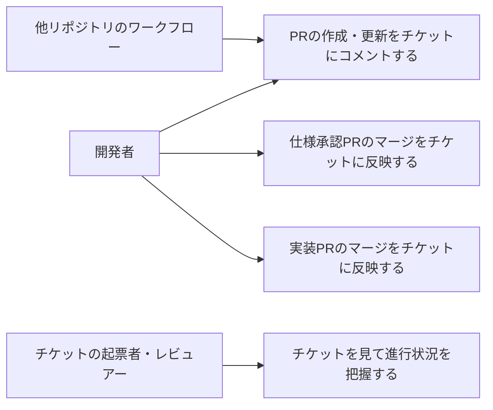
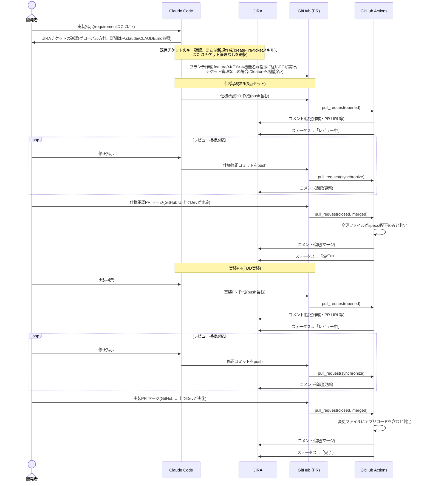

# JIRAチケット自動更新(GitHub Actions連携)

## サマリ

開発者がPRを作成・更新・マージするだけで、ブランチ名から特定したJIRAチケットへコメント追記とステータス遷移が自動で行われるようにする。JIRAチケットを見るだけでPRの進行状況が分かる状態にし、人手での状況転記をなくすことが目的。GitHub Actionsで実装し、他リポジトリからも再利用できる形にする。

主要なビジネスルール:

- JIRA更新処理を**必須ステータスチェックにしない**。JIRA側の障害・権限不足・チケットキー不一致で、本来のマージ可否判断がブロックされてはならない([ビジネスルール・制約](#ビジネスルール制約) [1])
- ステータス遷移は遷移先を決め打ちで呼ばず、対象チケットで現在有効な遷移一覧に名前が一致するものがある場合だけ実行する。無ければコメント追記のみ行う([ビジネスルール・制約](#ビジネスルール制約) [2])

スコープ外の要点: ステータス以外のフィールド(担当者・優先度等)の更新、PR経由以外のgitイベント、1ブランチに複数チケットキー、コメントへのCI実行結果の記載。詳細は[スコープ外](#スコープ外)。

全体像は[ユースケース図](#ユースケース図)、チケット起票からクローズまでの流れは[処理シーケンス(参考)](#処理シーケンス参考)を参照。

## 概要

PRの作成・更新・マージといったgitイベントに連動して、対応するJIRAチケットへ自動でコメント追記・ステータス遷移を行う。これまで人手で行っていたJIRAチケットへの状況転記の負荷をなくすことが目的。

このリポジトリのどの`apps/<app-name>/`にも属さない、リポジトリ横断のCI/tooling機能である([doc/adr/0002](../../doc/adr/0002-jira-automation-via-github-actions.md)参照)。

## ユーザーストーリー

- 開発者としては、PRを作成・更新・マージするだけでJIRAチケットに進捗が反映されてほしい。手動でJIRAを開いてコメントやステータスを更新する手間をなくしたい
- チケットの起票者・レビュアーとしては、JIRAチケットを見るだけでPRの進行状況(レビュー中か、マージ済みか)を把握したい

## ユースケース図

図の正となる文章は[ユーザーストーリー](#ユーザーストーリー)と[機能要件](#機能要件)。

## 前提: チケットキーとブランチの紐付け

- [1] ブランチ名に`<JIRAキー>-`をプレフィックスとして含める(例: `feature/NMBM-123-add-login`)。CI側は正規表現でブランチ名からキーを抽出する
- [2] 対象JIRAプロジェクトは問わない(ブランチ名からキーとして抽出できれば、どのプロジェクトのキーでも対象とする)
- [3] ブランチ名にJIRAキーを含めるためには、作業開始時点でキーが確定している必要がある。この確認(既存チケットの有無確認、なければ新規作成/チケット管理なしの選択)はstudy固有の要件ではなく、このPCでの作業全般に適用されるグローバル方針であり、`~/.claude/CLAUDE.md`の「開発フロー開始時のJIRAチケット確認」および`~/.claude/skills/requirement/SKILL.md`・`~/.claude/skills/fix/SKILL.md`(と、それらを上書きするstudy固有の同名ファイル)で扱う。本specでは対象外とする

## 機能要件

### PR作成・更新時の自動更新

- [1] 対象ブランチ名からJIRAチケットキーを抽出できた場合、そのチケットにコメントを追記すること
- [2] コメントには、イベント種別(作成/更新)・PRタイトルとURL・変更内容概要・変更ファイル一覧または件数を含めること
- [3] 対象チケットの現在のステータスから「レビュー中」への遷移が可能な場合、ステータスを「レビュー中」に遷移すること
- [4] ブランチ名からJIRAチケットキーを抽出できない場合、コメント追記・ステータス遷移のいずれも行わず正常終了すること

### PRマージ時の自動更新(仕様承認PR)

- [1] マージされたPRの変更ファイルが、すべて仕様関連ディレクトリ(`specs/`配下、または`apps/*/specs/`配下)のみである場合、そのマージを「仕様承認PRのマージ」とみなすこと
- [2] 対象チケットにマージイベントのコメント(PRタイトル・URL・変更内容概要)を追記すること
- [3] 対象チケットの現在のステータスから「進行中」への遷移が可能な場合、ステータスを「進行中」に遷移すること

### PRマージ時の自動更新(実装PR)

- [1] マージされたPRの変更ファイルに仕様関連ディレクトリ以外の変更(アプリケーションコード等)が1件でも含まれる場合、そのマージを「実装PRのマージ」とみなすこと
- [2] 対象チケットにマージイベントのコメント(PRタイトル・URL・変更内容概要)を追記すること
- [3] 対象チケットの現在のステータスから「完了」への遷移が可能な場合、ステータスを「完了」に遷移すること

### 他リポジトリからの利用

- [1] 本機能の中核処理(キー抽出・遷移解決・コメント生成・JIRA API呼び出し)は、他リポジトリのワークフローからも呼び出せる共通処理として公開すること
- [2] 「仕様承認PRのマージ/実装PRのマージ」の判定に使う対象パスの条件(このリポジトリでは`specs/`配下・`apps/*/specs/`配下)は、呼び出し元ごとに異なるディレクトリ構成を持ちうるため、呼び出し元から指定できるようにすること。このリポジトリ自身の判定条件・挙動は変更しない
- 詳細な設計・作業内容は、この機能を最初に他リポジトリ(pj-risk-check)から利用する形で導入したタスクのspec(`pj-risk-check`リポジトリの`.claude/docs/jira-automation/spec/`)を参照

## ビジネスルール・制約

- [1] JIRA更新処理は、GitHub Actionsの必須ステータスチェック(マージのブロッカー)にしないこと。JIRA側の障害・権限不足・チケットキー不一致などで、本来のマージ可否判断(将来テスト/lint等のCIパイプラインが整備された場合はその合否判定を含む)がブロックされてはならない([doc/adr/0002](../../doc/adr/0002-jira-automation-via-github-actions.md)の決定に基づく)
- [2] ステータス遷移は、遷移先ステータス名を決め打ちで呼び出すのではなく、対象チケットの現在有効な遷移一覧を取得したうえで、名前が一致する遷移がある場合のみ実行すること。一致する遷移が存在しない場合はステータス遷移をスキップし、コメント追記のみ行うこと(理由: JIRAのワークフローはプロジェクトごとに異なる可能性があり、かつ対象プロジェクトを限定しないため。また人間が既に別ステータスへ動かしていた場合に自動化が失敗扱いにならないようにするため)
- [3] 1つのPR・1つのブランチにつき、抽出されるJIRAチケットキーは1件のみを対象とする(複数チケットキーを含むブランチ名は想定しない)

## 非機能要件・依存関係

- GitHub Actions用にJIRA APIトークンをリポジトリ(または組織)シークレットとして発行する。対話セッションで使うAtlassian MCPの認可とは別の資格情報とする
- 本番JIRAプロジェクトでいきなり有効化せず、投稿内容を絞ったドライラン(特定チケットのみ等)で検証してから本適用する
- `.claude/skills/pr/SKILL.md`のブランチ命名規約(`feature/<機能名>` → `feature/<JIRAキー>-<機能名>`)を本機能とあわせて更新する
- `.claude/skills/requirement/SKILL.md`のStep0、`.claude/skills/fix/SKILL.md`のStep1に、上記のJIRAチケット確認フローを追記する(既存の「新規spec作成vs既存spec更新」の判断より前に確認する)

## スコープ外

- JIRAのステータス以外のフィールド(担当者・優先度等)の自動更新
- PR経由以外のgitイベント(mainへの直接pushなど)の自動反映
- 複数のJIRAチケットキーを1つのブランチ・PRに跨って扱うこと
- コメントにCI(テスト/lint)の実行結果を含めること。このリポジトリには現時点でテスト/lintを実行するGitHub Actionsワークフローが存在しないため(`apps/notes-api/application/lambda/`はテストフレームワーク未導入)、対象となるCIジョブがない。CIパイプラインが整備された後、別途要件として追加検討する

## 処理シーケンス(参考)

チケット起票からクローズまでの一連の流れ。GitHub Actionsがどこで介在するかを示す(技術的な実装詳細はdesign.mdで扱う)。

